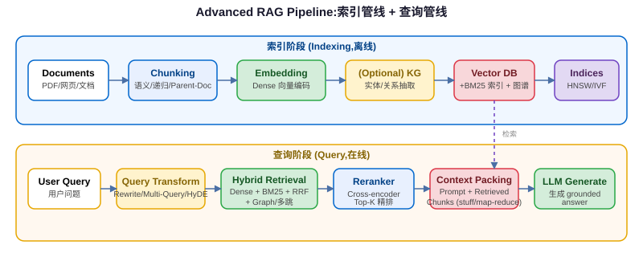

## 一句话结论

基础 RAG（切块→嵌入→向量检索→塞进 prompt）只是起点。高质量 RAG 需要在分块策略、检索方法（混合检索 + Rerank）、查询变换（HyDE/多查询/Step-back）、Graph RAG 多个维度同时优化；评估要用 RAGAS 等工具度量检索质量和生成忠实度。

<h3>基础 RAG Pipeline 回顾</h3>

RAG（Retrieval-Augmented Generation）通过「检索相关知识 + 生成回答」让 LLM 回答有事实依据，减少幻觉。基础 pipeline 分为两个阶段：

01

Chunk（分块）

将文档切分为固定大小的文本块（如 512 tokens）

02

Embed（嵌入）

用 embedding 模型将每个 chunk 转为向量

03

Store（存储）

向量存入向量数据库（FAISS/Milvus/Pinecone/PGVector）

04

Query Embed

用户查询也用同一模型转为向量

05

Retrieve（检索）

向量相似度搜索（cosine），取 Top-K 最相关 chunk

06

Generate（生成）

将检索到的 chunk 塞进 prompt，让 LLM 基于上下文回答

<h3>分块策略（Chunking Strategies）</h3>

分块是 RAG 质量的第一步——分块不好，后面再怎么优化检索都救不回来。

<table>
<tr><th>策略</th><th>方法</th><th>优点</th><th>缺点</th></tr>
<tr><td>固定大小分块</td><td>按 token 数切分（如 512 tokens），加 overlap（50-100 tokens）</td><td>简单、实现快</td><td>可能切断语义边界（句子/段落中间断开）</td></tr>
<tr><td>语义分块</td><td>计算相邻句子 embedding 相似度，相似度骤降处作为边界</td><td>保持语义完整</td><td>计算成本高，需要调参阈值</td></tr>
<tr><td>递归分块</td><td>按分隔符层级递归切：段落 → 句子 → 词/token</td><td>平衡语义和大小</td><td>规则较多，需要自定义分隔符</td></tr>
<tr><td>Parent-Document</td><td>检索小 chunk（精确匹配），返回时给 LLM 更大的父 chunk</td><td>兼顾精度和上下文完整</td><td>需要存储两层结构</td></tr>
<tr><td>Sentence-Window</td><td>检索命中中心句，返回时扩展为前后 N 句窗口</td><td>简单有效，保持局部上下文</td><td>窗口大小需要调</td></tr>
<tr><td>结构化分块</td><td>按 Markdown/HTML 结构切：标题、章节、代码块、列表</td><td>保留文档结构信息</td><td>依赖文档格式解析</td></tr>
</table>

实践建议：先从递归分块 + 适当 overlap 起步；遇到检索精度问题再尝试 Parent-Document 或语义分块；代码/API 文档一定要用结构化分块保留代码块完整性。

<h3>检索方法：从纯向量到混合检索 + Rerank</h3>

纯向量检索（cosine similarity）对语义相似好，但对精确关键词（ID、错误码、专有名词）表现差。

<table>
<tr><th>方法</th><th>原理</th><th>优势</th></tr>
<tr><td>Dense Retrieval（稠密/向量检索）</td><td>Embedding 模型将文本映射为向量，cosine 相似度排序；支持多向量（ColBERT 晚交互：query 和 doc 各分 token 向量，细粒度匹配）</td><td>语义匹配强，同义/近义识别好</td></tr>
<tr><td>Sparse Retrieval（稀疏/关键词检索）</td><td>BM25（TF-IDF 改进）：词频-逆文档频率，精确 term 匹配</td><td>精确 ID/错误码/专有名词强，无需训练</td></tr>
<tr><td>Hybrid Retrieval（混合检索）</td><td>Dense + Sparse 两路召回，RRF（Reciprocal Rank Fusion）融合：<code>score = Σ 1/(k + rank_i)</code>，k 通常取 60</td><td>互补优势，对单一编码器失败鲁棒</td></tr>
<tr><td>Reranking（重排序）</td><td>先 Bi-encoder 召回 N 个候选（如 N=100），再用 Cross-encoder 对 query+doc 对逐对打分精确排序，取 Top-K（如 K=5）给 LLM</td><td>精度远超 Bi-encoder，是 RAG 效果提升最显著的单点优化</td></tr>
</table>

RRF 公式直觉

k=60 是经验值。rank 越小（排名越靠前），贡献越大：rank=1 时贡献 1/61≈0.016，rank=60 时贡献 1/120≈0.008。如果一个文档在两路召回都排第一，RRF 分数最高。RRF 的好处是<strong>不需要归一化分数</strong>，直接用排名融合，简单鲁棒。

Bi-encoder vs Cross-encoder

Bi-encoder（embedding 模型）：query 和 doc 分别编码为独立向量，速度快但精度受限，适合大规模召回；Cross-encoder（reranker）：query 和 doc 拼接一起输入模型，做交叉注意力，精度极高但每次只能算一对，慢，适合小批量精排。典型 Reranker：bge-reranker、Cohere Rerank。

<h3>查询变换（Query Transformations）</h3>

用户原始查询往往不完美：歧义、太抽象、太复杂。查询变换在检索前改写查询，提升召回质量。

<table>
<tr><th>技术</th><th>做法</th><th>核心思想</th></tr>
<tr><td>Query Rewriting</td><td>LLM 将模糊/复杂查询改写为更精确的检索查询</td><td>消除歧义，补充关键词</td></tr>
<tr><td>Multi-Query Retrieval</td><td>生成 3-5 个不同角度的改写查询，每个都检索，结果去重融合</td><td>从多个视角覆盖相关文档</td></tr>
<tr><td>HyDE（Hypothetical Document Embedding）</td><td>先让 LLM 生成一个「假设答案」，用这个假设答案的 embedding 去检索（而非原 query embedding）</td><td>答案的 embedding 比问题 embedding 更接近真实文档（因为文档是答案的分布）</td></tr>
<tr><td>Step-back Prompting</td><td>生成一个更抽象的「退一步」问题（如问「某公式参数含义」退到「相关物理原理是什么」），同时检索原查询和 step-back 查询</td><td>抽象问题能召回高层概念/原理文档，补充具体问题的上下文</td></tr>
<tr><td>Sub-question Decomposition</td><td>把复杂问题分解为子问题（Self-Ask 风格），每个子问题分别检索</td><td>多跳问题拆成单跳，每跳精确检索</td></tr>
</table>

HyDE 直觉：用户问「量子隧穿的实际应用」，query embedding 和讲应用的文档可能不够近；但让 LLM 先写一段「量子隧穿应用包括扫描隧道显微镜...」，这段假设答案和真实文档的语义空间更接近，检索效果更好。

<h3>Graph RAG（微软 2024）</h3>

向量检索擅长局部语义相似，但对「全局主题是什么」「实体间有什么关系」这类全局性问题无能为力。Graph RAG 通过构建知识图谱解决这个问题。

<table>
<tr><th>阶段</th><th>做法</th></tr>
<tr><td>1. 图谱构建</td><td>LLM 从文档中抽取实体（nodes）和关系（edges），构建知识图谱</td></tr>
<tr><td>2. 社区检测</td><td>用 Leiden 算法在图谱上检测社区（紧密连接的实体簇）</td></tr>
<tr><td>3. 社区摘要</td><td>对每个社区生成层次化摘要（低层细节、中层主题、高层概览）</td></tr>
<tr><td>4. Local Query</td><td>局部查询：搜索相关实体 → 构建子图 → 用相关社区摘要生成答案</td></tr>
<tr><td>5. Global Query</td><td>全局查询：map-reduce 遍历所有社区摘要，汇总回答全局性问题（如「这份报告的主要主题是什么」）</td></tr>
</table>

Graph RAG 的价值：向量 RAG 回答「X 是什么」很好，但回答「整体在讲什么」「A 和 B 有什么关系」很差——因为这些关系跨越多个 chunk，向量相似度无法捕捉。Graph RAG 用实体-关系图显式建模这些连接。代价是构建成本高（需要多次 LLM 调用抽实体和生成摘要）。

<h3>多跳检索与 IR-CoT</h3>

复杂问题需要多轮检索：先检索一部分，根据结果决定下一步查什么，交替检索和推理。

01

Retrieve（检索）

根据当前问题/推理状态检索相关文档

02

Reason（推理）

阅读检索到的内容，推理已获得什么信息、还缺什么

03

Generate Next Query

如果信息不足，生成下一个检索查询

04

Loop

重复 1-3 直到获取足够信息回答问题

这本质上就是 ReAct 范式在 RAG 中的应用：Interleaving Retrieval with Chain-of-Thought Reasoning（IR-CoT）。

<h3>RAG 评估指标体系</h3>

RAG 评估分两个维度：检索质量和生成质量。不要只看最终回答对不对——要分别诊断问题出在检索还是生成。

<table>
<tr><th>维度</th><th>指标</th><th>含义</th></tr>
<tr><td rowspan="3">检索质量</td><td>Recall@K</td><td>Top-K 结果中召回了多少相关文档（最重要！漏召回是 RAG 最大杀手）</td></tr>
<tr><td>MRR（Mean Reciprocal Rank）</td><td>第一个相关文档排名的倒数平均（关注排名第一的结果）</td></tr>
<tr><td>nDCG</td><td>考虑相关性等级的排序质量（比 Recall 更细粒度）</td></tr>
<tr><td rowspan="4">生成质量</td><td>Faithfulness/Groundedness</td><td>回答是否完全基于检索到的上下文（不编造上下文没有的信息）</td></tr>
<tr><td>Answer Relevance</td><td>回答是否解决了用户问题（不答非所问）</td></tr>
<tr><td>Context Recall</td><td>回答需要的信息是否都在检索到的上下文中</td></tr>
<tr><td>Context Precision</td><td>检索到的上下文中有多少是真正有用的（noise 比例）</td></tr>
</table>

评估工具
<ul><li><strong>RAGAS：</strong>开源 RAG 评估框架，用 LLM 做评判，支持 faithfulness、relevance 等指标</li><li><strong>TruLens：</strong>可观测性 + 评估，追踪每次调用的三元组（query → context → answer）</li><li><strong>LangSmith Evaluation：</strong>LangChain 官方评估平台，支持数据集评估和在线监控</li></ul>

<h3>RAG 常见陷阱与反模式</h3>
<table>
<tr><th>反模式</th><th>问题</th><th>正确做法</th></tr>
<tr><td>盲目增大 Top-K</td><td>召回越多噪音越多，LLM 被无关信息干扰（lost in the middle）</td><td>先用 Rerank 精排，K 控制在 3-8；需要更多上下文时用 Parent-Document</td></tr>
<tr><td>固定分块大小</td><td>不同文档类型适合不同分块策略</td><td>代码按函数/类切，问答按 QA 对切，长文档按语义切，表格单独处理</td></tr>
<tr><td>只做一次检索</td><td>复杂问题第一次检索往往不够</td><td>用 IR-CoT / Self-Ask 多跳检索，检索-推理交替进行</td></tr>
<tr><td>忽略 Embedding 模型领域适配</td><td>通用 embedding 在垂直领域（医疗/法律/代码）效果差</td><td>用领域微调的 embedding 模型；或者用 bge-m3 这类多语言通用强模型</td></tr>
<tr><td>把所有数据塞进一个向量库</td><td>不同来源/类型的数据混在一起，检索时跨域噪音大</td><td>按领域/文档类型分 collection，检索时路由到正确的 collection</td></tr>
<tr><td>不做冗余去重</td><td>Multi-Query/Hybrid 检索返回大量重复内容</td><td>检索后做去重（按内容相似度或文档 ID），再 Rerank</td></tr>
</table>

<h3>Embedding 模型选择指南</h3>

Embedding 模型质量直接决定检索上限，选对模型比优化分块策略收益更大。

<table>
<tr><th>场景</th><th>推荐模型</th><th>维度</th><th>说明</th></tr>
<tr><td>英文通用</td><td>text-embedding-3-large (OpenAI)</td><td>3072（可降维）</td><td>质量最高，API 调用方便，成本可接受</td></tr>
<tr><td>中文通用</td><td>bge-m3 (BAAI)</td><td>1024</td><td>多语言、多功能（稠密+稀疏+ColBERT），开源可本地部署</td></tr>
<tr><td>本地部署/开源</td><td>bge-large-zh-v1.5, gte-Qwen2</td><td>1024-1536</td><td>平衡质量和速度，支持中文</td></tr>
<tr><td>代码检索</td><td>voyage-code-2, bge-large-code</td><td>1024-1536</td><td>针对代码训练，理解变量/函数/语法结构</td></tr>
<tr><td>长文档</td><td>需要支持长上下文的 embedding</td><td>看模型</td><td>注意 embedding 模型的最大输入长度（通常 512-8192 tokens）</td></tr>
</table>

实践经验：MTEB 排行榜可以参考但不要迷信——在你的真实数据上做 Recall@K 评测才是最可靠的选择标准。bge-m3 因为同时支持稠密、稀疏（BM25 风格）和 ColBERT 晚交互三种模式，是开源部署的首选。

<h3>上下文压缩与窗口管理</h3>

即使检索到相关文档，直接全部塞进 prompt 也会有问题：上下文太长会稀释关键信息、增加成本、触发 lost-in-the-middle（LLM 对中间内容注意力弱）。需要做上下文压缩：

<table>
<tr><th>技术</th><th>做法</th></tr>
<tr><td>LLM 压缩器</td><td>用 LLM 阅读每个检索到的 chunk，提取和 query 相关的句子，丢弃无关内容</td></tr>
<tr><td>CRAG (Corrective RAG)</td><td>检索后评估文档相关性：相关→用；不相关→触发 web search 补充；模糊→纠错后使用</td></tr>
<tr><td>Self-RAG</td><td>模型自己判断是否需要检索、检索的文档是否相关、生成内容是否有依据，全程自我批判</td></tr>
<tr><td>自适应检索</td><td>简单问题不检索（直接用参数知识），需要事实的问题才检索，减少不必要的检索</td></tr>
</table>

Q: Parent-Document 和普通 chunking 的区别？

普通 chunking 的困境：chunk 太小（如 256 tokens）检索精确但 LLM 缺乏上下文容易答错；chunk 太大（如 2000 tokens）上下文丰富但检索时噪音多，embedding 稀释语义，精确匹配率低。

<strong>Parent-Document retrieval 解决这个矛盾：</strong>

<ol><li>索引时：文档切为小 chunk（child，用于精确检索），同时保留大 chunk（parent，包含完整上下文）</li><li>检索时：用小 chunk 做向量搜索，找到最匹配的 child chunk</li><li>返回时：不返回 child，而是返回 child 对应的 parent chunk 给 LLM</li></ol>

类比：查字典时你通过精确的词条（child）找到页码，但阅读时看整个词条解释的段落（parent），而不是只看单个字。

Parent-Document 用小 chunk 检索保证精度，用大 parent chunk 返回保证上下文完整，解决了分块大小在精度和上下文之间的矛盾。

Q: 为什么 Hybrid Retrieval + Rerank 比纯向量好？

<strong>Hybrid（Dense + Sparse）互补：</strong>

<ul><li>Dense retrieval（向量）擅长<strong>语义匹配</strong>：「怎么提高代码性能」能匹配到「性能优化指南」</li><li>Sparse retrieval（BM25）擅长<strong>精确匹配</strong>：错误码「ERR_CONN_RESET」、用户 ID、专有名词，向量检索经常漏掉</li><li>RRF 融合不需要调权重，鲁棒性强</li></ul>

<strong>Rerank 进一步提升精度：</strong>

<ul><li>Bi-encoder（embedding）是双塔独立编码，query 和 doc 没有交叉注意力，丢失了细粒度交互信号</li><li>Cross-encoder（reranker）把 query 和 doc 拼在一起做全注意力，能捕捉深层语义关系，精度显著更高</li><li>召回 N=100 再精排到 K=5，兼顾速度和精度</li></ul>

工程经验：纯向量 → Hybrid 通常提升 10-20% 效果；Hybrid + Rerank 再提升 15-30%。这是 RAG 效果优化的「性价比之王」组合。

Dense 补语义、Sparse 补精确关键词（互补）+ Rerank 用 cross-encoder 精排（精度提升最大），三者组合是工业界 RAG 标准做法。

Q: GraphRAG 解决什么问题？

GraphRAG 主要解决两类向量 RAG 解决不好的问题：

<strong>1. 全局性/总结性问题：</strong>「这份文档集的主要主题是什么？」「A 和 B 之间有什么关系？」这类问题需要聚合多个 chunk 的信息，而向量检索每次只返回局部最相似的 K 个 chunk，无法做全局聚合。GraphRAG 通过社区摘要 + map-reduce 回答。

<strong>2. 实体间关系/多跳问题：</strong>「X 公司的 CEO 的母校是哪里？」这类跨实体的多跳问题，向量检索可能把 X 公司和 CEO 放在一个 chunk 里，但 CEO 和母校的关系在另一个 chunk 里，需要顺着实体关系链走。知识图谱显式建模实体-关系，支持沿着边遍历。

<strong>向量 RAG 仍然更好的场景：</strong>局部事实查询（「某 API 参数是什么」）、语义匹配、不需要跨文档聚合的问题。GraphRAG 构建成本高（多次 LLM 调用抽实体建图），不要盲目使用。

GraphRAG 解决全局总结和跨实体关系查询问题，这些是向量 RAG 的盲区；但构建成本高，局部事实查询仍用向量 RAG。

Q: HyDE 为什么有效？

HyDE（Hypothetical Document Embedding）有效的核心原因：<strong>embedding 空间中，答案和真实文档的距离比问题和真实文档的距离更近</strong>。

直觉解释：

<ul><li>Query 是「问题空间」的表达，通常短、抽象、用问句形式</li><li>Document（真实答案）是「答案空间」的表达，长、具体、用陈述形式</li><li>Query embedding 和 document embedding 在空间中分布不一致——这叫「embedding space misalignment」</li><li>HyDE 让 LLM 先写一个「假设答案」（即使包含事实错误），这个假设答案在 embedding 空间里和真实文档在同一个区域（都是答案的分布），因此用它检索能找到更相关的真实文档</li></ul>

关键洞察：<strong>假设答案不需要事实正确</strong>，它只需要在语义风格/词汇分布上接近真实文档，就能拉准检索方向。错误的事实会被真实检索到的文档纠正。

Query 和 Document 在 embedding 空间分布不对齐；HyDE 用零样本生成的假设答案作为「探针」进入答案空间检索，假设答案即使事实错了也没关系，风格相近就能拉准方向。

Q: 怎么评估 RAG 系统质量？

评估 RAG 要分<strong>检索层</strong>和<strong>生成层</strong>分别评估，不要只看端到端答案对不对：

<strong>离线评估流程：</strong>

<ol><li>构建评测集：准备 (query, expected_answer, relevant_docs) 三元组（50-200 条）</li><li>检索层指标：Recall@K（最重要！）、MRR、nDCG。如果 Recall 低，优化分块/embedding/混合检索</li><li>生成层指标（用 LLM-as-Judge 或人评）：Faithfulness（不编造）、Relevance（答对应问）、Context Precision（无噪音）</li><li>端到端：答案准确率</li></ol>

<strong>工具选择：</strong>RAGAS 是最常用的开源框架，用 GPT-4 做裁判自动评分；TruLens 和 LangSmith 适合生产环境持续监控。

<strong>在线评估：</strong>记录用户反馈（点赞/点踩）、追踪「检索到但没用上的上下文」比例、监控幻觉率。

分两层评估：检索看 Recall@K（漏召回是最大杀手），生成看 Faithfulness（幻觉率）和 Relevance（答非所问率）；工具用 RAGAS 离线评测，在线用 TruLens/LangSmith 监控。

## 关联模块

- `01-agent-concepts.md`：Agent 基础概念
- `02-agent-components.md`：Agent 记忆与工具组件
- `05-agent-paradigms-deep.md`：高级 Agent 范式（IR-CoT 结合 ReAct）
- `07-function-calling-api.md`：Function Calling 机制
