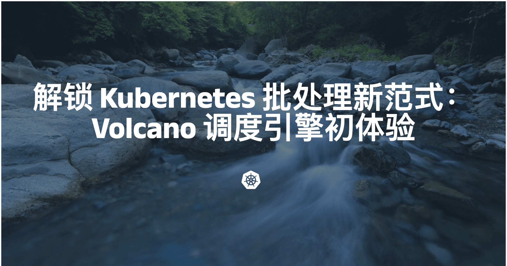
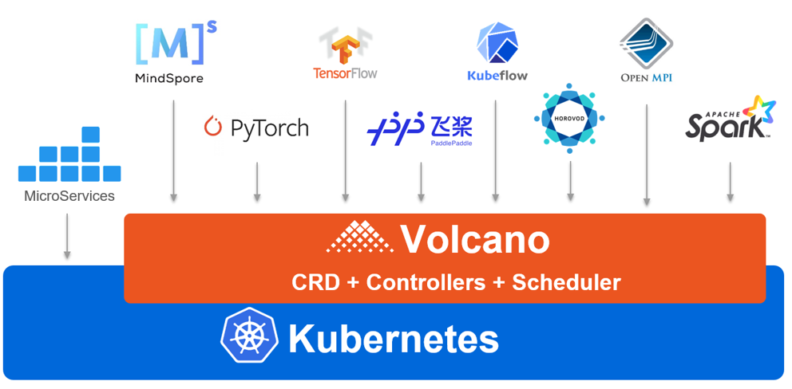
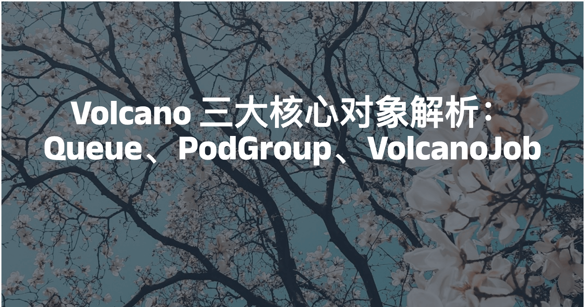
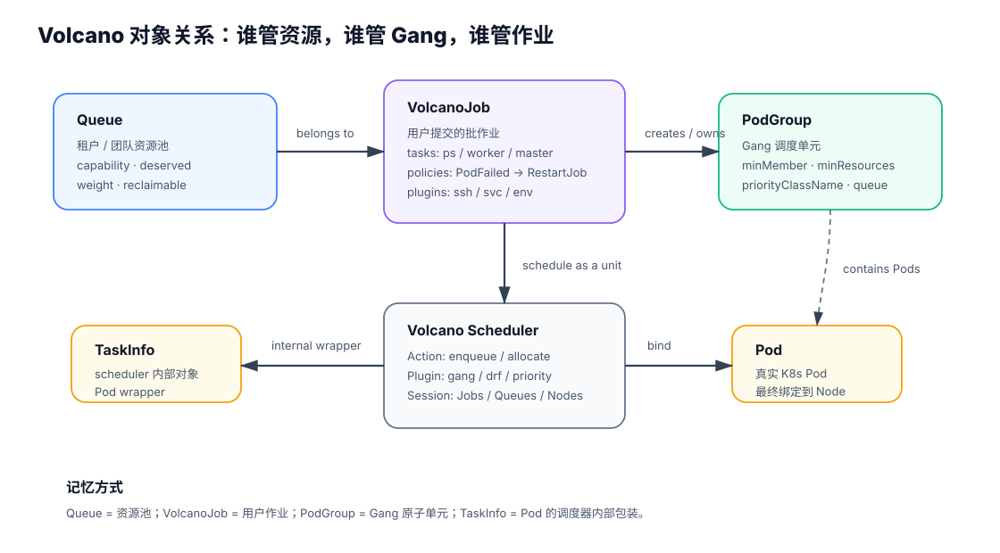
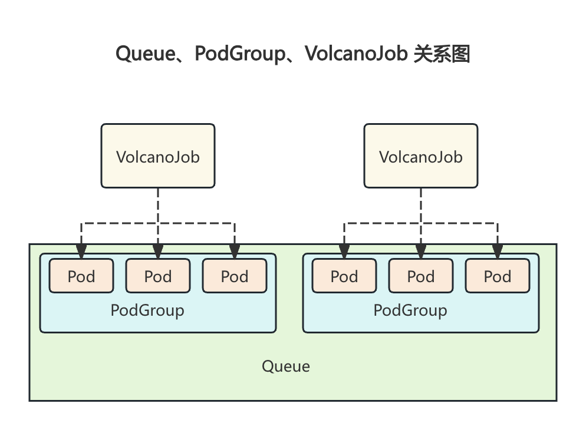
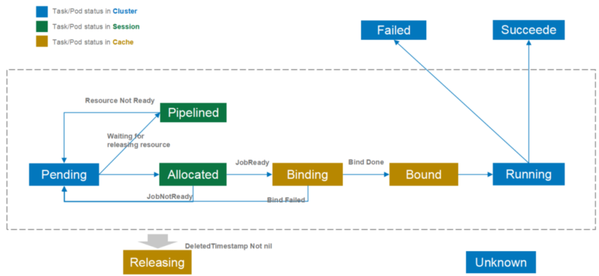
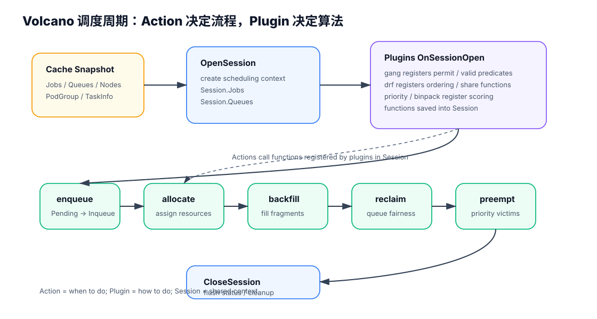

## 一句话结论

Volcano 的核心是 Queue、PodGroup、VolcanoJob：Queue 管多租户资源，PodGroup 管 Gang 原子调度，VolcanoJob 管多角色批作业和生命周期策略。

<h3>Volcano 定位与架构</h3>

Volcano 是 Kubernetes 批处理调度的新范式：为 AI/ML、HPC 等高性能工作负载补齐默认调度器缺失的 Gang、队列与公平性能力。

Volcano 是 CNCF 孵化的 Kubernetes 批处理调度系统，面向 AI/ML、HPC、Spark、Flink、Ray 等高性能工作负载。它通过 CRD 扩展 K8s 对象，再由 scheduler、controller manager、admission 协同完成批调度。

Volcano 架构图：在 Kubernetes 之上增加 batch scheduler、controller、admission 和 Job / Queue / PodGroup 等 CRD。

Volcano 调度链路：通过 CRD 扩展 K8s 资源对象，再由 scheduler / controller / admission 协同完成批调度。

<h3>安装与最小验证</h3>

面试不需要背命令，但要知道 Volcano 部署后至少有 scheduler、controller、admission 组件，以及 Queue / PodGroup / Job CRD。

<pre><code class="language-bash">helm repo add volcano-sh https://volcano-sh.github.io/helm-charts
helm repo update
helm upgrade --install volcano volcano-sh/volcano \
  --version 1.12.0 \
  -n volcano-system \
  --create-namespace

kubectl get all -n volcano-system
kubectl get crd | grep volcano</code></pre>

使用 Volcano 特性的 Job 要指定 <code>schedulerName: volcano</code>。如果改成 <code>default-scheduler</code>，就无法使用 Volcano 的 Gang、Queue、Fair-share、Preemption 等能力。

<h3>三大核心对象关系</h3>

Volcano 三大核心对象：Queue（资源池）、PodGroup（Gang 调度单元）、VolcanoJob（批作业抽象）。

Volcano 对象模型：Queue 管资源池，VolcanoJob 管用户作业，PodGroup 管 Gang 调度，TaskInfo 是 Pod 的调度内部包装。

Queue 是资源池，PodGroup 是 Gang 调度单元，VolcanoJob 是批作业抽象。

<table>
<tr><th>对象</th><th>一句话</th><th>关键字段</th><th>面试重点</th></tr>
<tr><td>Queue</td><td>多租户资源队列</td><td><code>weight</code>、<code>capability</code>、<code>deserved</code>、<code>reclaimable</code></td><td>资源隔离、弹性借用、reclaim</td></tr>
<tr><td>PodGroup</td><td>一组强关联 Pod 的 Gang 单元</td><td><code>minMember</code>、<code>minResources</code>、<code>priorityClassName</code>、<code>queue</code></td><td>All-or-Nothing，避免 partial allocation</td></tr>
<tr><td>VolcanoJob</td><td>批作业抽象，包含多个 task</td><td><code>schedulerName</code>、<code>minAvailable</code>、<code>tasks</code>、<code>policies</code>、<code>plugins</code>、<code>queue</code></td><td>多角色训练任务、生命周期策略</td></tr>
</table>

<h3>Queue：多租户资源管理</h3>
<table>
<tr><th>字段</th><th>作用</th><th>面试解释</th></tr>
<tr><td><code>weight</code></td><td>按比例分配资源</td><td>适合资源软约束，空闲时可以动态共享</td></tr>
<tr><td><code>deserved</code></td><td>队列期望应得资源</td><td>表达 fair-share / deserved resource</td></tr>
<tr><td><code>capability</code></td><td>队列可用资源硬上限</td><td>防止某队列超用整个集群</td></tr>
<tr><td><code>reclaimable</code></td><td>资源是否可被回收</td><td>空闲借用和高优队列回收的基础</td></tr>
</table>

<h3>PodGroup：Gang Scheduling 的落地对象</h3>
<table>
<tr><th>字段</th><th>作用</th><th>设错的后果</th></tr>
<tr><td><code>minMember</code></td><td>至少多少个 Pod 同时满足才允许启动</td><td>太低会 partial allocation，太高会长期 Pending</td></tr>
<tr><td><code>minResources</code></td><td>整体最小资源需求</td><td>可以提前判断集群是否可能满足</td></tr>
<tr><td><code>priorityClassName</code></td><td>PodGroup 优先级</td><td>影响抢占和排队顺序</td></tr>
<tr><td><code>queue</code></td><td>归属资源队列</td><td>影响配额和公平性</td></tr>
</table>

<h3>VolcanoJob：批作业与生命周期策略</h3>

VolcanoJob 状态包括 pending、running、restarting、completing、completed、failed、terminating 等。

<table>
<tr><th>字段</th><th>作用</th><th>面试关注点</th></tr>
<tr><td><code>schedulerName</code></td><td>指定调度器</td><td>保持 <code>volcano</code> 才能使用高级策略</td></tr>
<tr><td><code>minAvailable</code></td><td>Job 正常运行所需最少 Pod 数</td><td>类似 Gang 的最低可运行条件</td></tr>
<tr><td><code>tasks</code></td><td>定义多角色 Pod 模板</td><td>PS / Worker / Master / Launcher 等角色</td></tr>
<tr><td><code>policies</code></td><td>生命周期策略</td><td>PodFailed、PodPending、TaskCompleted 等事件触发动作</td></tr>
<tr><td><code>plugins</code></td><td>任务级插件</td><td>如 ssh、svc、env，为分布式任务提供互信和服务发现</td></tr>
<tr><td><code>maxRetry</code></td><td>最大重试次数</td><td>故障恢复和失败终止的边界</td></tr>
</table>

<h3>源码视角：Action、Plugin、Session</h3>

Volcano 调度周期：OpenSession 建上下文，Plugin 注册算法函数，Action 顺序执行并调用这些函数，CloseSession 清理状态。

Volcano 调度器内部不是简单套 kube-scheduler 的扩展点，而是有自己的 <strong>Action + Plugin + Session</strong> 框架。理解这层，面试回答会明显更深入。

<table>
<tr><th>概念</th><th>作用</th><th>怎么理解</th></tr>
<tr><td>Action</td><td>调度周期里要执行的动作</td><td>例如 enqueue、allocate、backfill、preempt、reclaim、shuffle</td></tr>
<tr><td>Plugin</td><td>给 Action 提供算法函数</td><td>例如 gang、drf、proportion、priority、binpack</td></tr>
<tr><td>Session</td><td>一次调度周期的上下文</td><td>保存 Jobs、Queues、Nodes 以及插件注册的排序/过滤/抢占函数</td></tr>
</table>

关键机制：<code>OpenSession</code> 时插件把函数注册到 Session；随后 actions 按配置顺序执行，并调用 Session 里的算法函数；最后 <code>CloseSession</code> 清理和提交状态。

<h3>Volcano Actions：一轮调度做哪些动作</h3>
<table>
<tr><th>Action</th><th>做什么</th><th>面试抓手</th></tr>
<tr><td><code>enqueue</code></td><td>把 Pending 的 PodGroup / Job 判断为可入队，更新为 Inqueue</td><td>解决“作业能不能进入队列”</td></tr>
<tr><td><code>allocate</code></td><td>给 Inqueue 任务分配节点资源，选择最合适的 Node</td><td>核心资源分配动作，类似 Filter + Score + Bind 的组合</td></tr>
<tr><td><code>backfill</code></td><td>利用碎片资源调度适合插空的任务</td><td>提高利用率，但不能破坏主要调度目标</td></tr>
<tr><td><code>reclaim</code></td><td>从超额使用队列回收资源</td><td>队列间公平性和资源借用回收</td></tr>
<tr><td><code>preempt</code></td><td>同队列或跨队列中按优先级抢占低优任务</td><td>高优任务保障，注意抢占代价</td></tr>
<tr><td><code>shuffle</code></td><td>打散或重排任务，缓解局部不优</td><td>较少面试深挖，知道存在即可</td></tr>
</table>
<pre><code class="language-text">runOnce
  → OpenSession(cache, plugins, config)
  → action.Execute(session)  // enqueue / allocate / backfill ...
  → plugins registered functions are called through session
  → CloseSession(session)</code></pre>

<h3>源码对象不要混：VolcanoJob、JobInfo、TaskInfo</h3>
<table>
<tr><th>对象</th><th>在哪一层</th><th>真实含义</th></tr>
<tr><td>VolcanoJob</td><td>CRD / controller 层</td><td>用户提交的批作业对象，包含 tasks、policies、plugins 等</td></tr>
<tr><td>PodGroup</td><td>CRD / scheduler 层</td><td>Gang 调度单元，表达一组 Pod 的 all-or-nothing 语义</td></tr>
<tr><td>JobInfo</td><td>scheduler cache / Session 层</td><td>调度器内部的 Job wrapper，本质更接近 PodGroup 的调度视角</td></tr>
<tr><td>TaskInfo</td><td>scheduler cache / Session 层</td><td>Pod 的 wrapper，一个 TaskInfo 基本对应一个 Pod</td></tr>
<tr><td>QueueInfo</td><td>scheduler cache / Session 层</td><td>Queue 的调度视图，保存 allocated、deserved、capability 等状态</td></tr>
</table>

面试易错点：源码里的 JobInfo 不等于 CRD 里的 VolcanoJob；TaskInfo 也不是 VolcanoJob.spec.tasks，而是 Pod 的调度包装。

<h3>Volcano 高频追问</h3>

Q: Queue、PodGroup、VolcanoJob 三者是什么关系？

一句话

Queue 是租户资源视角，PodGroup 是调度原子性视角，VolcanoJob 是用户提交的批作业视角。

运行链路

VolcanoJob 提交后会关联一个 Queue，并自动创建 PodGroup。Queue 决定这个 Job 属于哪个资源池；PodGroup 决定这组 Pod 是否满足 minMember / minResources，可以 all-or-nothing 启动；VolcanoJob 自己定义 tasks、policies、plugins、maxRetry 等批任务语义。

面试易错点

不要把 VolcanoJob 等同于 PodGroup。VolcanoJob 是用户作业；PodGroup 是调度器用于 Gang 的原子单元；Queue 是资源治理对象。

记忆：Queue = 资源池；PodGroup = Gang 原子单元；VolcanoJob = 批作业结构。

Q: Volcano 为什么能避免 partial allocation？

默认 K8s 问题

默认 kube-scheduler 逐 Pod 调度，可能只启动部分 worker，剩余 worker Pending。对 DDP / MPI / NCCL 这类强同步任务来说，部分 worker 启动没有意义，GPU 会空转，多个 Job 还可能互相占住部分资源形成死锁。

Volcano 做法

Volcano 用 PodGroup 的 <code>minMember</code> 和 <code>minResources</code> 表达 all-or-nothing 语义。资源不满足时整组等待；资源满足时整体进入运行。

代价

Gang 会提高正确性，但可能增加等待时间。大任务需要凑齐一组资源，小碎片不能随便启动它的一部分。

面试口径：Volcano 把“单 Pod 能不能跑”提升成“整个 Job 能不能一起跑”，避免部分 worker 白占 GPU。

Q: Volcano 的局限是什么？

已经解决

Volcano 解决了默认 K8s 在批任务里的核心缺口：Gang、Queue、多角色 Job、队列公平和部分抢占。

没有天然解决

它不天然解决运行时间预测、干扰感知共置、checkpoint-aware preemption、复杂异构 GPU 拓扑和超大规模全局优化。

什么时候要自研

当你需要 QAD 这类连续保障度、预测调度、共置干扰模型、代价感知抢占或千卡以上全局优化时，通常要自研 scheduler plugin 或独立调度层。

Q: Volcano 的 Action 和 Plugin 是什么关系？

Action

Action 是调度流程中的动作，例如 enqueue、allocate、backfill、reclaim、preempt。它决定“这一轮调度要做哪些步骤”。

Plugin

Plugin 是算法提供者，例如 gang、drf、priority、binpack。它把排序、过滤、抢占、可回收判断等函数注册到 Session。

Session

每轮调度先 OpenSession，插件在 OnSessionOpen 里注册函数；Action 执行时调用 Session 里的函数；最后 CloseSession 清理状态。

一句话：Action 决定“什么时候做”，Plugin 决定“怎么做”，Session 是二者之间的上下文。

Q: enqueue 和 allocate 有什么区别？

enqueue

解决“这个 Job / PodGroup 能不能进入队列成为 Inqueue”。它更偏作业准入和队列状态更新。

allocate

解决“已经 Inqueue 的任务具体分配到哪些节点”。它会结合 predicate、node order、task order、queue order 等插件函数做资源分配。

面试口径：enqueue 管入队，allocate 管分配。

Q: reclaim 和 preempt 有什么区别？

preempt

从任务优先级出发，高优任务抢占低优任务，重点是“谁更重要”。

reclaim

从队列公平性出发，从超额使用或可回收资源的队列里拿回资源，重点是“哪个队列超额了”。

面试口径：preempt 看任务优先级，reclaim 看队列资源公平。

