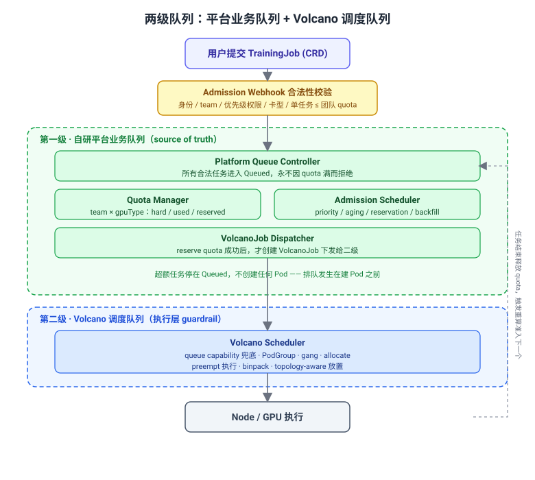
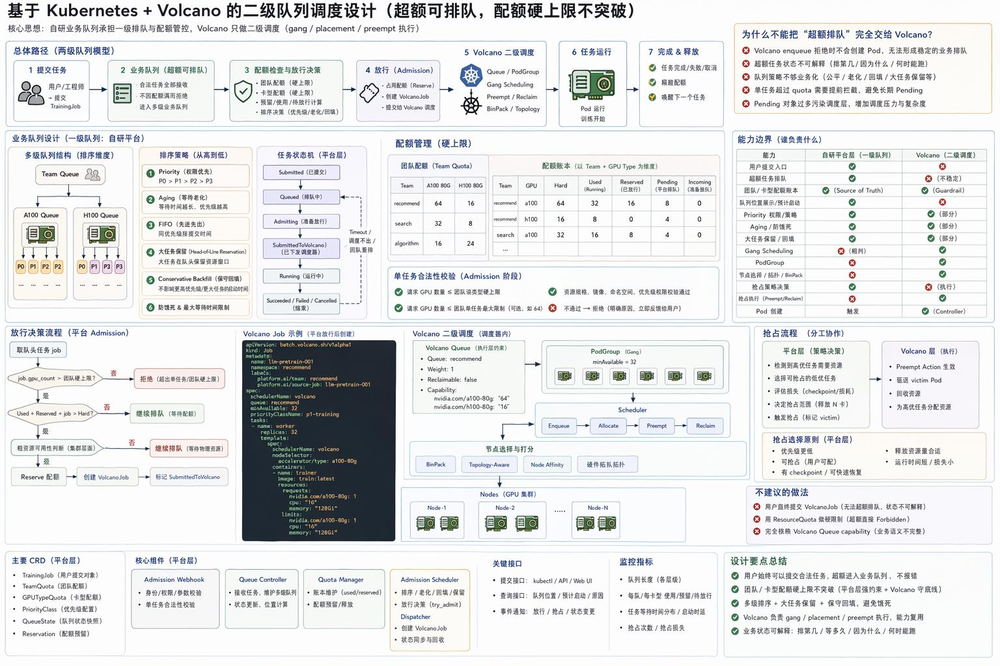

## 一句话结论

原生 Kubernetes 的 ResourceQuota 是“超额即拒绝”语义，满足不了“用户照常提交、超额任务排队、有资源自动顶上”的诉求。生产做法是**两级队列**：自己实现一级业务队列（TrainingJob + 配额账本 + 准入策略），只把拿到 quota token 的任务下发给 Volcano；Volcano 作为二级调度器只负责 gang、PodGroup、放置和抢占执行。配额账本和任务状态存在 CRD 的 `spec` / `status`，由 etcd 持久化，不另起数据库。

## 复习定位

| 维度 | 内容 |
|---|---|
| 所属模块 | GPU 集群管理 |
| 章节类型 | 系统设计类 |
| 解决问题 | 异构多团队 GPU 集群上，如何让用户超额提交不报错、硬配额不突破、大任务不饿死。 |
| 面试抓手 | 先点出 ResourceQuota 是拒绝语义；再给两级队列；强调 Volcano 只做二级调度。 |

<h3>面试场景题（面试官口吻）</h3>

这类题面试官不会直接说“设计一个 CRD”，而是给业务场景让你识别原生能力缺口：

题面

“我们有一个几千张卡的 GPU 训练集群，混合了 A100 80G、H100、V100 多种型号。资源按团队分配额度，而且是<strong>按卡型分别给</strong>：比如推荐团队分到 64 张 A100、16 张 H100。这个团队几十号算法工程师白天会密集提交训练任务，有人跑单卡调试，有人提 8 卡实验，还有人要 32 卡做大模型预训练。高峰期他们提交的任务加起来需要的 A100 远超 64 张。

我的诉求是：<strong>配额是硬上限不能突破</strong>（不然挤占别的团队），但又<strong>不能让工程师提交时直接报错</strong>——应该能正常提交，超额的自动排队，集群里有任务跑完释放卡，排队的自动顶上。同时 32 卡大任务不能被一堆小任务一直插队饿死，重要任务还得能优先。你用 Kubernetes 怎么设计？原生的 ResourceQuota、scheduler 能直接满足吗？哪里不够、你怎么补？”

<table>
<tr><th>这道题在考你</th><th>想确认你懂</th></tr>
<tr><td>识别原生能力边界</td><td>ResourceQuota 是“拒绝”语义，不是“排队”语义</td></tr>
<tr><td>排队的位置</td><td>排队要发生在<strong>建 Pod 之前</strong>，不是让 Pod 涌进 scheduler</td></tr>
<tr><td>异构配额</td><td>额度按 <code>(team, gpuType)</code> 分别算，不能合并成总卡数</td></tr>
<tr><td>两级队列</td><td>业务准入（配额/优先级/防饿死）vs 调度放置（gang/拓扑）分开</td></tr>
<tr><td>状态怎么存</td><td>CRD + etcd，不另起数据库；账本靠 reconcile 重算</td></tr>
<tr><td>落地参照</td><td>知道 Volcano / Kueue 是这套结构，但 Volcano 只承担二级</td></tr>
</table>

答题节奏：先点矛盾 → 给两级队列思路 → 等追问再展开 CRD / 状态 / 并发 → 收一句“Volcano/Kueue 就是这个模式”。别等面试官喂名词，要自己引出来。

<h3>为什么原生机制和单靠 Volcano 都不够</h3>
<table>
<tr><th>机制</th><th>能不能满足</th><th>原因</th></tr>
<tr><td>ResourceQuota</td><td>不满足</td><td>超 quota 直接 <code>Forbidden</code> 拒绝创建，不保留等待队列，违背“超额也能提交”</td></tr>
<tr><td>PriorityClass</td><td>不满足</td><td>只表达优先级，不表达团队/卡型运行上限</td></tr>
<tr><td>默认 scheduler</td><td>不满足</td><td>只消费已创建 Pod，不管理任务级准入队列</td></tr>
<tr><td>单靠 Volcano</td><td>不建议完全依赖</td><td>它的 Queue 偏 scheduler 内部队列：能让 PodGroup Pending，但不承载“你排第几、是 A100 还是 H100 不足、预计何时启动”等业务语义</td></tr>
<tr><td>两级：自研业务队列 + Volcano</td><td>满足</td><td>一级管业务准入与配额，二级管 gang 与放置</td></tr>
</table>

Volcano 文档明确：当 <code>enqueue</code> 判断某 PodGroup 不允许进入队列时，<code>vc-controller</code> 不会创建 pending pods，<code>reclaim/preempt</code> 也不执行。这会影响“超额任务排着、重要任务可触发抢占/回收”的业务语义，所以业务排队不能完全交给 Volcano。

<h3>推荐架构：两级队列</h3>

核心原则：<strong>用 Volcano 做二级调度器，不让它承担完整业务排队。</strong>自己实现一级 TrainingJob Queue，所有超额任务先进自研队列，只有拿到团队/卡型 quota token 后才创建 VolcanoJob。

两级队列：一级自研业务队列负责准入与配额（source of truth），二级 Volcano 负责 gang 调度与放置。超额任务停在 Queued，不创建 Pod。

全景图：总体路径、业务队列设计、配额账本、放行决策流程、VolcanoJob 示例、二级调度、抢占分工与能力边界一图总览。

<table>
<tr><th>层级</th><th>组件</th><th>职责</th></tr>
<tr><td rowspan="4">一级 自研平台</td><td>Admission Webhook</td><td>校验身份、team、优先级权限、卡型；拦截“单任务请求 &gt; 团队 quota”这种永远无法满足的任务</td></tr>
<tr><td>Platform Queue Controller</td><td>接收所有合法 TrainingJob，永不因当前 quota 满而拒绝，进入 Queued</td></tr>
<tr><td>Quota Manager</td><td>维护 <code>(team, gpuType)</code> 的 hard / used / reserved 账本，是业务配额的 source of truth</td></tr>
<tr><td>Admission Scheduler + Dispatcher</td><td>按 priority / aging / 大任务 reservation / backfill 排序，reserve quota 后才创建 VolcanoJob</td></tr>
<tr><td rowspan="2">二级 Volcano</td><td>Volcano Queue capability</td><td>按卡型配 capability，作为执行层 guardrail，即使平台 bug 多放也不会无限超发</td></tr>
<tr><td>Volcano Scheduler</td><td>只接收已 admission 的任务，做 PodGroup、gang、allocate、preempt、binpack、topology-aware 放置</td></tr>
</table>
<pre><code class="language-text">用户提交 TrainingJob
  ↓ Admission Webhook：合法才放行（单任务超团队 quota 直接拒）
平台接收，进入 Queued（不因 quota 满而拒绝）
  ↓ 多级排序：team → gpuType → priority → FIFO/aging/backfill
Quota Manager 判断：used + reserved + incoming <= hard
  ↓ 满足
reserve quota → 创建 VolcanoJob
  ↓
Volcano：PodGroup gang scheduling → 节点选择 → Pod 运行
  ↓
任务结束释放 quota → 平台继续 admit 下一个</code></pre>

<h3>异构配额：账本是二维表，不是一个数</h3>

A100 和 V100 不能 1:1 抵扣，所以配额账本必须按 <code>(team, gpuType)</code> 分格维护，准入判断也要先看任务要哪种卡，再查那一格：

<pre><code class="language-text">recommend / a100-80g : hard=64  used=?  reserved=?
recommend / h100      : hard=16  used=?  reserved=?
search    / a100-80g : hard=32  ...
准入判断：该格 used + reserved + 任务要的同型号卡数 <= 该格 hard</code></pre>

这正好对应 Kueue 的 <code>ResourceFlavor</code>（按卡型区分资源）和 Volcano Queue 的多维 capability。业务队列本身也按这个维度分层：

<pre><code class="language-text">TeamQueue
  └── GPUTypeQueue
        └── PriorityQueue
              └── FIFO / Aging / Backfill

recommend
  ├── a100  ├── P0 ├── P1 ├── P2 └── P3
  └── h100  ├── P0 ├── P1 ├── P2 └── P3</code></pre>

<h3>具体走例：团队 20 张 A100，已用 15，连续提交</h3>

用一个小数字把准入逻辑走通（生产是 64，这里用 20 便于看）。team-a 配额 20，已跑 15（Job-A=8, Job-B=7），用户连续提交 Job-C(4)、Job-D(6)、Job-E(2)：

<pre><code class="language-text">第 1 轮 reconcile（提交后）：
  running = Σ(Running/Admitted) = 8 + 7 = 15   # 重新数，不是存的
  pending = [C(4), D(6), E(2)]                  # 按入队顺序
  C：15 + 4 = 19 <= 20  ✅ Admitted，running→19
  D：19 + 6 = 25 >  20  ❌ break（不跳过去看更小的 E，防止大任务被饿死）
  结果：只有 C 被准入并建 Pod；D、E 停在 Queued，一个 Pod 都不建

第 2 轮 reconcile（Job-A 跑完释放 8 张，触发重算）：
  running = 7 + 4 = 11                           # B + C
  D：11 + 6 = 17 <= 20  ✅ Admitted，running→17
  E：17 + 2 = 19 <= 20  ✅ Admitted，running→19
  结果：D、E 都被准入并建 Pod</code></pre>

配额在“建 Pod 之前”这道准入关卡卡住，靠“排队 + 每次全量重算 + 资源释放再准入”，永远不会真超过上限，超额任务也不会报错。队头放不下就 break，保证 FIFO，避免大任务被插队饿死。

<h3>状态存哪里：不用数据库，存在 CRD 的 spec / status</h3>

很多人第一反应是“再起一个 MySQL / Redis 存队列和配额”，但在 K8s 里更标准的做法是<strong>不引入外部数据库</strong>，把状态拆成两类，全部交给 etcd：

<table>
<tr><th>状态类型</th><th>存在哪</th><th>谁写</th><th>例子</th></tr>
<tr><td>用户期望（desired）</td><td>CRD 的 <code>spec</code></td><td>用户 / 提交端</td><td>要几张卡、哪种卡型、哪个队列、优先级</td></tr>
<tr><td>系统观测（observed）</td><td>CRD 的 <code>status</code></td><td>控制器</td><td>TrainingJob 当前 phase、配额账本已用量、等待列表</td></tr>
</table>

etcd 是 K8s 的强一致 KV 存储，CRD 读写都走 API Server，自带 watch、乐观锁（resourceVersion）、RBAC 和审计。<strong>另搭数据库反而要自己解决一致性、备份、和 etcd 状态对不齐的问题</strong>，所以默认不这么做。

<pre><code class="language-yaml"># TrainingJob：任务期望 + 状态机
apiVersion: scheduling.example.com/v1
kind: TrainingJob
metadata:
  name: llm-pretrain-001
spec:
  team: recommend
  gpuType: a100-80g
  gpuCount: 32
  priority: p1
  minAvailable: 32          # Gang：32 个 Pod 要么一起跑
status:
  phase: Queued             # Submitted->Queued->Admitting->SubmittedToVolcano->Running->Succeeded/Failed/Cancelled
  reason: "waiting for a100 quota"</code></pre>
<pre><code class="language-yaml"># 配额账本：按 (team, gpuType) 分格，存在账本 CRD 的 status
status:
  quotas:
    - team: recommend
      gpuType: a100-80g
      hard: 64
      used: 60              # 在跑的同型号卡总数
      reserved: 4           # 已 reserve、待 Volcano 拉起
    - team: recommend
      gpuType: h100
      hard: 16
      used: 8
      reserved: 0</code></pre>

<h3>配额账本怎么算出来：reconcile 而不是手工加减</h3>

关键认知：<code>used</code> 这个数字<strong>不要靠“准入时 +N、结束时 -N”手工累加</strong>，因为控制器会重启、会漏事件，累加值会和真实情况飘移。正确做法是每次 reconcile 都<strong>从真相源全量重算</strong>：

<pre><code class="language-text">reconcile(team, gpuType):
  1. List 该 team 该卡型下 phase∈{Admitting,SubmittedToVolcano,Running} 的 TrainingJob
  2. used = Σ(它们的 gpuCount)             # 重新算，不依赖旧值
  3. for job in pending(按 priority/aging/FIFO 排序):
       if used + reserved + job.gpuCount <= hard and rough_cluster_fit(job):
           reserve_quota(job); create_volcano_job(job)
           job.phase = SubmittedToVolcano
       else:
           break                            # 队头算不动就停，保证顺序、防饿死
  4. 写回 quota.status 和各 job.status</code></pre>

控制器重启、丢了内存队列后，下次 reconcile 也能从 etcd 里的 TrainingJob 列表把账本完整重建，<strong>状态是“可重算的”而不是“攒出来的”</strong>——这就是 K8s 控制器 level-triggered（看最终状态）而非 edge-triggered（依赖每个事件）的思想。

<h3>并发与一致性：多副本控制器怎么不互相打架</h3>
<table>
<tr><th>问题</th><th>处理方式</th></tr>
<tr><td>两个任务同时准入导致超额</td><td>同一个 <code>(team,gpuType)</code> 串行 reconcile（workqueue 按 key 去重，同 key 不并发），不会两个 goroutine 同改一个账本</td></tr>
<tr><td>写 status 时对象已被改过</td><td>API Server 用 <code>resourceVersion</code> 乐观锁，update 冲突返回 409，控制器 requeue 重算再写</td></tr>
<tr><td>控制器跑多副本</td><td>用 Lease 做 leader election，同一时刻只有一个 leader 真正 reconcile</td></tr>
<tr><td>reserve 后 Volcano 长时间拉不起来</td><td><code>SubmittedToVolcano</code> 设超时，超时 Requeue 退回 Queued 并释放 reserved，避免名额被占死</td></tr>
</table>

一致性靠 etcd 乐观锁 + 单 key 串行 reconcile + 全量重算，而不是分布式锁或事务数据库。Volcano 不应成为唯一的排队状态来源。

<h3>宕机恢复：控制器无状态，靠 reconcile 重建</h3>

控制器内存里的队列只是缓存。崩溃 / 升级 / 重调度后：

<ol>
<li>新实例启动，通过 informer 从 API Server <strong>List + Watch</strong> 拉全量 TrainingJob 和账本 CRD。</li>
<li>对每个 <code>(team,gpuType)</code> 触发 reconcile，<strong>重新算 used 和准入结果</strong>。</li>
<li>已经在跑的 Pod 不受影响（真相在 etcd 和节点上），队列顺序从 TrainingJob 的创建时间 / 优先级字段恢复。</li>
</ol>

所以“状态怎么保存”的答案是：<strong>任务和配额状态保存在 etcd 里的 CRD 对象上，控制器自己不持久化任何东西，靠 reconcile 随时重建</strong>。只有 etcd 不该放的东西才进外部数据库——<strong>跨集群全局配额、长期计费/用量审计、历史任务归档</strong>写 Postgres/ClickHouse，但准入决策的实时账本仍留在 etcd。

<h3>大任务防饿死与抢占：策略在平台层，执行在 Volcano</h3>
<table>
<tr><th>能力</th><th>放哪</th><th>为什么</th></tr>
<tr><td>head-of-line reservation</td><td>平台层</td><td>32 卡大任务等久了要占住名额，不让小任务无限插队</td></tr>
<tr><td>conservative backfill</td><td>平台层</td><td>只在不影响大任务预计启动时，才放声明短时长的小任务回填空隙</td></tr>
<tr><td>aging / 用户级公平</td><td>平台层</td><td>Volcano 不知道业务意图（等了几小时、debug 任务多久结束）</td></tr>
<tr><td>选 victim（抢谁）</td><td>平台层</td><td>挑低优先级、可抢占、有 checkpoint、释放卡数合适、损失最小的任务</td></tr>
<tr><td>gang 调度</td><td>Volcano</td><td>一旦下发，保证 32 个 Pod 要么一起跑</td></tr>
<tr><td>PodGroup/Pod 抢占执行</td><td>Volcano</td><td>preempt action 执行同 queue 内实际驱逐与重调度</td></tr>
</table>

分工：业务抢占策略（抢不抢、抢谁）在平台层；Pod 级抢占执行在 Volcano。

<h3>三个不建议的做法</h3>
<table>
<tr><th>不建议</th><th>问题</th></tr>
<tr><td>让用户直接提交 VolcanoJob</td><td>平台无法稳定控排队顺序、业务状态不可解释、Pending 对象太多污染调度层、权限和防绕过难做、大任务防饿死难做</td></tr>
<tr><td>用 ResourceQuota 做硬限制</td><td>超额提交直接 Forbidden，不符合“正常提交、超额排队”的诉求</td></tr>
<tr><td>完全相信 Volcano Queue capability</td><td>它只能当底线 guardrail，不能当唯一账本——pending 统计、队列位置、用户级公平、单任务合法性、业务优先级、审计计费都还得平台层做</td></tr>
</table>

<h3>面试回答模板</h3>

30 秒版

原生 ResourceQuota 是超额即拒绝，满足不了“照常提交、超额排队”。我会做两级队列：自研一级业务队列接收所有 TrainingJob，永不因 quota 满而拒绝，维护 <code>(team, gpuType)</code> 的硬配额账本，按优先级/aging/防饿死排序，只有 <code>used + reserved + incoming <= hard</code> 时才 reserve 配额并创建 VolcanoJob；Volcano 作为二级只做 gang、PodGroup、放置和抢占执行。状态全存 CRD 的 spec/status 由 etcd 持久化，账本靠 reconcile 全量重算，不另起数据库。

2 分钟版

先点矛盾：ResourceQuota 拒绝语义、scheduler 只认 Pod 不认用户额度、单靠 Volcano 的队列偏 scheduler 内部不承载业务语义。再给两级架构：一级平台层负责提交入口、超额排队、异构配额账本（按卡型分格）、优先级与防饿死、抢占决策，是配额的 source of truth；二级 Volcano 负责 gang、PodGroup、节点选择、binpack、拓扑和抢占执行，Queue capability 作为兜底 guardrail。然后讲状态：desired 放 spec、observed 放 status，etcd 持久化，配额 used 每次 reconcile 全量重算而非手工加减，控制器无状态、重启靠 List+Watch 重建；并发靠 resourceVersion 乐观锁 + 单 key 串行 + leader election；reserve 后 Volcano 拉不起来设超时 Requeue。最后收一句：这套就是 Kueue（ResourceFlavor + Workload 准入）和 Volcano（PodGroup + gang）在工业界的分层，只是把业务排队收回平台层自己控。

## 关联模块

- `Volcano`：PodGroup、Gang、Queue、Priority、Preempt、Reclaim 等二级调度能力细节。
- `Kueue`：LocalQueue / ClusterQueue / ResourceFlavor / Workload 准入排队，是“准入队列”的官方实现参照。
- `多租户管理`：配额、隔离、公平性与资源治理的总论。
- `GPU 拓扑与通信`：二级调度里 topology-aware 放置和 NCCL 通信背景。
- `故障处理与弹性`：抢占 victim 选择依赖的 checkpoint 策略。
