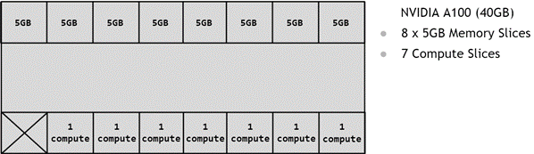
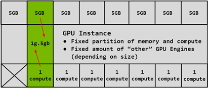

## MIG 到底切了什么

MIG 把一张支持该能力的 GPU 划分为若干 GPU Instance（GI），每个 GI 再包含可运行 CUDA workload 的 Compute Instance（CI）。profile 名称中的两部分分别表达计算切片和显存规格，例如 `1g.10gb`；具体 profile、数量和名称取决于 GPU 型号。

<div class="figure">

<p class="caption">NVIDIA 官方 MIG 图：A100 40GB 被抽象为 8 个 5GB 显存切片和 7 个计算切片。来源：<a href="https://docs.nvidia.com/datacenter/tesla/mig-user-guide/latest/concepts.html">NVIDIA MIG User Guide · Partitioning</a>。</p>
</div>

<div class="figure">

<p class="caption">一个 <code>1g.5gb</code> GPU Instance 将 1 个计算切片与 1 个 5GB 显存切片组合成固定规格。新型号的 profile 名称和显存容量会变化，面试时应讲清“固定计算份额 + 固定显存份额”，不要死背 A100 数字。来源：<a href="https://docs.nvidia.com/datacenter/tesla/mig-user-guide/latest/concepts.html">NVIDIA MIG User Guide · GPU Instances</a>。</p>
</div>

```flow
物理 GPU
  -> 开启 MIG mode
  -> 按 profile 创建 GPU Instance
  -> 为 GPU Instance 创建 Compute Instance
  -> NVIDIA driver 枚举 MIG device UUID
  -> Device Plugin 上报 MIG 扩展资源
  -> Pod 申请一个 MIG profile
```

MIG 的价值是性能和故障隔离更稳定，但资源形状固定。一个 `1g` workload 空闲时，旁边的 `3g` workload 不能自动借走它的硬件切片。

## 裸机怎么用

下面以单张 GPU 为例。命令必须在没有业务进程占用该 GPU 时执行；profile 仅作为示例，要先查询本机实际支持项。

```bash
# 1. 确认 GPU 与 MIG 状态
nvidia-smi -L
nvidia-smi -i 0 --query-gpu=name,mig.mode.current,mig.mode.pending --format=csv

# 2. 启用 MIG mode
sudo nvidia-smi -i 0 -mig 1

# 3. 查询可用 GPU Instance profile 与 placement
nvidia-smi mig -lgip
nvidia-smi mig -lgipp

# 4. 示例：创建两个 3g.20gb GI，并同时创建对应 CI
sudo nvidia-smi mig -cgi 3g.20gb,3g.20gb -C

# 5. 验证实例与 UUID
nvidia-smi mig -lgi
nvidia-smi mig -lci
nvidia-smi -L
```

仅执行 `-mig 1` 不够：没有创建 GI/CI 时，CUDA workload 还没有可使用的 MIG device。创建后的 MIG device 可以通过 `MIG-<UUID>` 选择，例如容器运行时可把该 UUID 放进 `NVIDIA_VISIBLE_DEVICES`。

## Kubernetes + GPU Operator 怎么用

### 1. 选择 MIG strategy

GPU Operator / NVIDIA Device Plugin 常见两种策略：

<table>
<thead><tr><th>策略</th><th>资源表达</th><th>适用场景</th></tr></thead>
<tbody>
<tr><td><code>single</code></td><td>节点上的 MIG 设备采用一致几何，使用方式更统一</td><td>同一节点全部做同规格推理池</td></tr>
<tr><td><code>mixed</code></td><td>不同 profile 以独立资源名上报，例如 <code>nvidia.com/mig-1g.10gb</code></td><td>同节点需要多种规格</td></tr>
</tbody>
</table>

安装时启用 MIG Manager 的示意命令：

```bash
helm repo add nvidia https://helm.ngc.nvidia.com/nvidia
helm repo update

helm install --wait gpu-operator nvidia/gpu-operator \
  -n gpu-operator --create-namespace \
  --set mig.strategy=mixed
```

实际部署时应锁定经过验证的 GPU Operator 版本，不要在生产集群直接跟随 latest。

### 2. 给节点应用 MIG geometry

MIG Manager 监听节点的 `nvidia.com/mig.config` label。变更前先清空业务 workload：

```bash
NODE=gpu-node-1

kubectl cordon "$NODE"
kubectl drain "$NODE" --ignore-daemonsets --delete-emptydir-data

# profile 名称以该节点的 MIG Manager ConfigMap 为准
kubectl label node "$NODE" \
  nvidia.com/mig.config=all-1g.10gb --overwrite

kubectl get node "$NODE" \
  -L nvidia.com/mig.config,nvidia.com/mig.config.state
```

只有状态进入 `success`，并且 Device Plugin 重新上报资源后，节点才重新开放：

```bash
kubectl describe node "$NODE" | grep -E 'nvidia.com/(gpu|mig-)'
kubectl uncordon "$NODE"
```

### 3. Pod 申请 MIG 实例

mixed strategy 下，Pod 申请具体 profile；资源名必须以 `kubectl describe node` 的实际结果为准。

```yaml
apiVersion: v1
kind: Pod
metadata:
  name: mig-demo
spec:
  restartPolicy: Never
  containers:
    - name: cuda
      image: nvcr.io/nvidia/cuda:12.8.0-base-ubuntu22.04
      command: ["bash", "-lc", "nvidia-smi && sleep 3600"]
      resources:
        limits:
          nvidia.com/mig-1g.10gb: 1
```

验证：

```bash
kubectl apply -f mig-demo.yaml
kubectl get pod mig-demo -o wide
kubectl exec mig-demo -- nvidia-smi -L
kubectl exec mig-demo -- nvidia-smi
```

容器应该只看到被分配的 MIG device 及其显存规格，而不是整张物理卡。

## 重配与回收

裸机删除顺序通常是先删 CI，再删 GI，最后按需关闭 MIG mode：

```bash
sudo nvidia-smi mig -dci
sudo nvidia-smi mig -dgi
sudo nvidia-smi -i 0 -mig 0
```

GPU Operator 环境优先让 MIG Manager 管理，不要一边手工执行 `nvidia-smi mig`，一边让 controller 按 label 重建几何。需要恢复整卡时，先 drain 节点，再应用 `all-disabled` 等实际配置中存在的 profile。

## 生产风险

| 风险 | 原因 | 处理方式 |
|---|---|---|
| MIG 重配导致任务中断 | MIG Manager 会停止 GPU clients，部分环境还需要重启 | cordon/drain，维护窗口重配 |
| profile 碎片 | 剩余 slice 组合无法满足新 profile | 按业务规格建资源池，不频繁在线改 geometry |
| 申请资源名错误 | 不同 GPU/strategy 暴露的资源名不同 | 以 Node Allocatable 为准，不硬编码猜测 |
| 只看 GPU-Util 误判 | MIG 需要实例级监控和归因 | 使用支持 MIG 的 DCGM 指标和业务吞吐 |
| 把 MIG 当弹性共享 | MIG 实例之间不会自动借资源 | 需要弹性时考虑 MPS/HAMi，或在维护窗口重配 |

<div class="qa" onclick="this.classList.toggle('open')">
<div class="qa-q">Q: 为什么强 SLA 推理优先考虑 MIG？</div>
<div class="qa-a"><p>因为 MIG 的资源边界来自硬件实例，性能和故障隔离比 MPS/Time-Slicing 更可预测。代价是规格固定、资源不能自动借用，并且重配 geometry 会影响节点上的 GPU workload。</p></div>
</div>

## 资料来源

- [NVIDIA MIG Getting Started](https://docs.nvidia.com/datacenter/tesla/mig-user-guide/getting-started-with-mig.html)
- [NVIDIA GPU Operator with MIG](https://docs.nvidia.com/datacenter/cloud-native/gpu-operator/latest/gpu-operator-mig.html)
