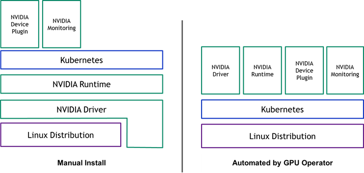

## 一句话结论

新 GPU 节点接入不是“装一个 Device Plugin”就结束，而是一条逐层打通的资源链路：**PCIe 硬件 → Host Driver → 容器运行时与 NVIDIA Container Toolkit/CDI → Device Plugin → kubelet Extended Resource → 调度与 Allocate → 容器内 CUDA → 监控与健康检查**。

生产上优先让 **NVIDIA GPU Operator** 管理这套软件栈；如果集群采用预装驱动的不可变镜像，也可以手工管理 Driver、Toolkit 和 Device Plugin，但同一节点池必须坚持一种版本和责任边界。只有全链路验证通过，才能移除接入隔离 taint，让业务任务进入节点。

## 先把四个“Runtime”概念分开

<table>
<thead><tr><th>名词</th><th>典型实现</th><th>在 GPU 接入中的职责</th></tr></thead>
<tbody>
<tr><td>CRI 容器运行时</td><td><code>containerd</code>、CRI-O</td><td>接收 kubelet 创建 Pod/Container 的请求，管理镜像、sandbox 和容器生命周期</td></tr>
<tr><td>低层 OCI Runtime</td><td><code>runc</code>、<code>crun</code></td><td>按照 OCI spec 真正创建 Linux namespace、cgroup 和进程</td></tr>
<tr><td>NVIDIA Container Toolkit / Runtime</td><td><code>nvidia-ctk</code>、<code>nvidia-container-runtime</code>、CDI hook/spec</td><td>把 GPU device node、驱动库和必要环境注入容器；它不负责 Kubernetes 调度</td></tr>
<tr><td>Kubernetes RuntimeClass</td><td><code>runtimeClassName: nvidia</code></td><td>让 Pod 选择 containerd/CRI-O 中某个 runtime handler；它只是 Kubernetes 选择入口，不是另一套容器引擎</td></tr>
</tbody>
</table>

GPU Operator **v25.10.0 及以后默认启用 CDI（Container Device Interface）**，用于标准 GPU workload 的设备注入。通过 Device Plugin 正常申请 `nvidia.com/gpu` 的 Pod 通常不需要显式写 `runtimeClassName`；旧版或手工 legacy runtime 路径如果没有把 NVIDIA runtime 设为默认，则需要配置并选择 `RuntimeClass`。不要把不同版本的教程拼成一份配置。

## 一张图看懂“系统识别 GPU”

```flow
主机 PCIe 枚举 GPU | lspci 能看到 NVIDIA 设备
NVIDIA Kernel Driver 绑定设备 | nvidia-smi、/dev/nvidia* 正常
Container Toolkit 配置 containerd/CDI | GPU 能被正确注入容器
Device Plugin 向 kubelet 注册 | /var/lib/kubelet/device-plugins/ 下建立 gRPC socket
kubelet 上报健康设备 | Node Capacity/Allocatable 出现 nvidia.com/gpu
kube-scheduler 选择节点 | Pod limits 请求整数 GPU
Device Plugin Allocate | 返回 device、mount、env 或 CDI device
容器运行 CUDA canary | vectorAdd/Test PASSED
DCGM/告警接管 | 持续观测 Xid、ECC、温度、功耗与利用率
```

这里最重要的边界是：

- **Driver** 让宿主机内核和 CUDA 用户态能够访问 GPU。
- **Container Toolkit/CDI** 让容器能获得设备节点和匹配的宿主机驱动库。
- **Device Plugin** 让 Kubernetes 看见、分配和健康管理 GPU。
- **GPU Operator** 自动部署和维护前面这些组件，本身不是 CUDA 数据面。
- **NFD/GFD** 负责硬件与 GPU 属性标签，帮助 Operator 和 scheduler 识别节点类型。
- **DCGM Exporter** 负责指标，不参与设备分配。

<div class="figure">

<p class="caption">NVIDIA 官方 GPU Operator 概念图：左侧需要分别维护 Driver、Runtime、Device Plugin 和监控，右侧由 Operator 统一部署和收敛。该图用于理解责任边界；生产版本与组件兼容性仍以当前 <a href="https://docs.nvidia.com/datacenter/cloud-native/gpu-operator/latest/platform-support.html">GPU Operator Platform Support</a> 为准。图片来源：<a href="https://developer.nvidia.com/blog/nvidia-gpu-operator-simplifying-gpu-management-in-kubernetes/">NVIDIA Technical Blog</a>。</p>
</div>

## 接入前检查：先隔离，再部署

### 1. 节点基础面

新节点首先要完成普通 Kubernetes worker 的基线：

- 固件、BIOS、BMC、GPU 型号和 PCIe 拓扑符合机器验收单。
- OS、kernel、containerd、kubelet 版本符合当前集群支持矩阵。
- hostname、DNS、NTP、镜像仓库、软件源和控制面网络可达。
- kubelet 的 cgroup driver 与 containerd 配置一致。
- 如果需要 RDMA/GPUDirect，再单独核对 NIC、OFED、IOMMU、NUMA 和拓扑；不要把“GPU 能跑”当成“多机训练网络已就绪”。

```bash
NODE=gpu-node-01

kubectl get node "$NODE" -o wide
kubectl describe node "$NODE"

# 先阻止普通业务进入，canary Pod 会单独容忍这个 taint
kubectl taint node "$NODE" gpu-bootstrap=true:NoSchedule --overwrite
```

如果节点还没有加入集群，应先走平台既有的 kubeadm、Cluster API 或云厂商节点池流程。不要把包含 token、CA hash 的一次性 `kubeadm join` 命令写死到公共 Runbook。

### 2. 宿主机硬件与驱动基线

```bash
lspci -nn | grep -i nvidia
uname -r
lsmod | grep '^nvidia'
nvidia-smi -L
nvidia-smi --query-gpu=index,uuid,name,pci.bus_id,driver_version,memory.total \
  --format=csv
nvidia-smi topo -m
```

验收标准：

- `lspci` 数量和机型 BOM 一致。
- `nvidia-smi -L` 列出的 UUID 数量一致且没有掉卡。
- Driver 版本属于平台锁定的 GPU Operator/Container Toolkit/CUDA 兼容矩阵。
- 拓扑与预期 PCIe/NVLink/NVSwitch 连接一致。
- Secure Boot、kernel module 签名、nouveau 冲突、Xid/ECC 错误已经处理。

若 `lspci` 都看不到 GPU，应先检查硬件、虚拟机 passthrough 或 BIOS；此时安装 Device Plugin 没有意义。

## 路径 A：已有 GPU Operator，推荐生产使用

### 1. 先判断 Operator 是否已经是集群能力

```bash
helm list -A | grep gpu-operator
kubectl get clusterpolicy
kubectl get pods -n gpu-operator
```

GPU Operator 是集群级控制器，不需要为每个新节点再 `helm install` 一次。默认情况下，NFD 发现 NVIDIA PCI vendor ID 后会产生：

```text
feature.node.kubernetes.io/pci-10de.present=true
```

Operator 根据这个标签把 driver、toolkit、device-plugin、GFD、DCGM 和 validator 等 operand 部署到 GPU worker。应等待真实 NFD 探测结果，不要为了“让 Pod 跑起来”手工伪造硬件标签。

```bash
kubectl get node "$NODE" \
  -o jsonpath='{.metadata.labels.feature\.node\.kubernetes\.io/pci-10de\.present}{"\n"}'

kubectl get pods -n gpu-operator -o wide \
  --field-selector spec.nodeName="$NODE"

kubectl get events -n gpu-operator --sort-by='.lastTimestamp'
```

如果 GPU 节点有业务 taint，需要确认 Operator 管理的 DaemonSet 具有对应 toleration，否则控制器识别到了节点，节点侧 operand 仍然落不下来。

### 2. 明确 Driver 与 Toolkit 由谁管理

<table>
<thead><tr><th>节点镜像现状</th><th>Operator 配置原则</th><th>注意事项</th></tr></thead>
<tbody>
<tr><td>Driver、Toolkit 都未预装</td><td>Operator 默认管理 Driver、Toolkit 和 Device Plugin</td><td>GPU worker 的 OS/kernel 需要符合 Driver Container 支持矩阵</td></tr>
<tr><td>已预装 Driver</td><td>集群安装时使用 <code>driver.enabled=false</code></td><td>驱动版本由镜像/节点运维体系负责升级</td></tr>
<tr><td>已预装 Driver + Toolkit</td><td>使用 <code>driver.enabled=false</code>、<code>toolkit.enabled=false</code></td><td>必须提前验证 containerd/CDI 或 NVIDIA runtime 配置</td></tr>
</tbody>
</table>

这些 Helm value 通常影响整个 ClusterPolicy，不是“临时只给一台节点改一下”的开关。混合 OS、混合 Driver 版本或不同责任边界应通过节点池、Driver CRD/nodeSelector 等受控方案管理，不能让同一节点同时被主机包管理器和 Driver Container 争抢内核模块。

如果集群还没有 Operator，安装时必须先从官方 Platform Support/Component Matrix 锁定版本，再写入 GitOps values：

```bash
GPU_OPERATOR_VERSION=<经过平台验证并锁定的版本>

helm repo add nvidia https://helm.ngc.nvidia.com/nvidia
helm repo update
helm upgrade --install gpu-operator nvidia/gpu-operator \
  --namespace gpu-operator \
  --create-namespace \
  --version "$GPU_OPERATOR_VERSION" \
  --wait
```

生产环境还需要把 registry mirror、imagePullSecret、proxy、toleration、priorityClass、驱动类型和版本写入 values 文件，而不是长期依赖命令行 `--set`。

### 3. 验证 Operator 状态

```bash
kubectl get clusterpolicy cluster-policy \
  -o jsonpath='{.status.state}{"\n"}'

kubectl get pods -n gpu-operator -o wide \
  --field-selector spec.nodeName="$NODE"

kubectl logs -n gpu-operator \
  -l app=nvidia-operator-validator \
  --all-containers --tail=100
```

目标节点至少要看到对应的 Driver（若由 Operator 管理）、Container Toolkit、Device Plugin、GFD、DCGM Exporter 和 Validator 状态正常。Validator 中 CUDA/Device Plugin 校验失败时不能直接移除接入 taint。

## 路径 B：手工管理 Driver、Runtime 和 Device Plugin

这条路径适合不可变 GPU 节点镜像、离线环境或平台已经有成熟的 OS 配置管理体系。它的优点是版本可控，缺点是升级、回滚和节点漂移都要自己负责。

### 1. 安装并锁定 Host Driver

优先使用发行版/企业镜像的软件包管理方式，不建议在自动化节点上长期混用 `.run` installer。安装后至少验证：

```bash
nvidia-smi
nvidia-smi -L
ls -l /dev/nvidia* /dev/nvidia-caps/* 2>/dev/null
```

`nvidia-smi` 顶部显示的 “CUDA Version” 是 **该 Driver 可支持的最高 CUDA API 版本信息**，不等于节点已经安装了同版本 CUDA Toolkit。

### 2. 安装 NVIDIA Container Toolkit 并配置 containerd

```bash
containerd --version
nvidia-ctk --version

sudo nvidia-ctk runtime configure --runtime=containerd
sudo systemctl restart containerd
sudo systemctl is-active containerd
```

`nvidia-ctk` 会为 containerd 写入 NVIDIA runtime/drop-in 配置。修改后必须重启 containerd，并确认 kubelet 没有因为 CRI socket 或配置格式错误进入 `NotReady`。

legacy 模式下有两种选择：

1. 使用 `--set-as-default` 把 `nvidia` handler 设为默认低层 runtime。
2. 保留普通 `runc` 为默认，为 GPU Pod 配置 `RuntimeClass`：

```yaml
apiVersion: node.k8s.io/v1
kind: RuntimeClass
metadata:
  name: nvidia
handler: nvidia
```

当前 CDI 路径应按所锁定的 Container Toolkit、containerd 和 Device Plugin 版本统一配置。标准 Device Plugin workload 的 CDI 注入通常对业务 YAML 透明，不应为了照抄旧教程同时开启多套 hook。

### 3. 部署 NVIDIA Device Plugin

Device Plugin 一般以 DaemonSet 运行在 GPU 节点。生产上使用 Helm/GitOps 锁定 chart 和镜像版本，并配置 GPU nodeSelector、toleration、MIG strategy 与共享策略；官方 static DaemonSet 更适合快速实验。

```bash
helm repo add nvdp https://nvidia.github.io/k8s-device-plugin
helm repo update

DEVICE_PLUGIN_VERSION=<经过验证并锁定的版本>
helm upgrade --install nvidia-device-plugin nvdp/nvidia-device-plugin \
  --namespace nvidia-device-plugin \
  --create-namespace \
  --version "$DEVICE_PLUGIN_VERSION"
```

Device Plugin 启动后会在 `/var/lib/kubelet/device-plugins/` 下通过 gRPC 向 kubelet 注册资源名和健康设备。kubelet 再把设备数量写入 Node Status；scheduler 只根据 `Capacity/Allocatable` 做放置，不会直接执行 `nvidia-smi`。

```bash
kubectl get pods -n nvidia-device-plugin -o wide \
  --field-selector spec.nodeName="$NODE"

kubectl logs -n nvidia-device-plugin \
  -l app.kubernetes.io/name=nvidia-device-plugin \
  --tail=200

kubectl get node "$NODE" \
  -o jsonpath='{.status.capacity.nvidia\.com/gpu}{" / "}{.status.allocatable.nvidia\.com/gpu}{"\n"}'
```

## 全链路验收：不要只看 `nvidia-smi`

### 第 1 关：Node 正常加入集群

```bash
kubectl get node "$NODE"
kubectl get node "$NODE" \
  -o jsonpath='{.status.conditions[?(@.type=="Ready")].status}{"\n"}'
```

目标：`Ready=True`，CNI、containerd、kubelet 正常。

### 第 2 关：Kubernetes 已发布 GPU 资源

```bash
kubectl get node "$NODE" \
  -o jsonpath='{.status.capacity.nvidia\.com/gpu}{" / "}{.status.allocatable.nvidia\.com/gpu}{"\n"}'

kubectl describe node "$NODE" | grep -A8 -E 'Capacity:|Allocatable:'
```

整卡模式下，空闲节点的 Capacity/Allocatable 数量应与健康物理 GPU 数量一致。若使用 MIG、Time-Slicing、MPS 或 HAMi，资源名和数量要按对应策略解释，不能继续用整卡数量验收。

### 第 3 关：运行绑定到新节点的 CUDA canary

```yaml
apiVersion: v1
kind: Pod
metadata:
  name: gpu-node-canary
spec:
  restartPolicy: Never
  nodeSelector:
    kubernetes.io/hostname: gpu-node-01
  tolerations:
    - key: gpu-bootstrap
      operator: Equal
      value: "true"
      effect: NoSchedule
  containers:
    - name: vectoradd
      image: nvcr.io/nvidia/k8s/cuda-sample:vectoradd-cuda12.5.0
      resources:
        limits:
          nvidia.com/gpu: 1
```

应把 `nodeSelector`、镜像 tag 和 runtimeClass（如果走 legacy 非默认 NVIDIA runtime）替换为集群实际值。

```bash
kubectl apply -f gpu-node-canary.yaml
kubectl get pod gpu-node-canary -o wide
kubectl describe pod gpu-node-canary
kubectl logs gpu-node-canary
```

验收标准：

- Pod 明确调度到目标新节点。
- Events 没有 `FailedScheduling`、`FailedCreatePodSandBox` 或 Device Plugin Allocate 错误。
- 日志输出 `Test PASSED`。
- Pod 运行期间，`kubectl describe node` 的 `Allocated resources` 能看到 GPU request；`status.allocatable` 表示节点可分配容量上限，不会因为 Pod 占用而动态减一。

### 第 4 关：监控与稳定性

```bash
kubectl get pods -n gpu-operator -o wide \
  --field-selector spec.nodeName="$NODE" | grep -E 'dcgm|validator'

nvidia-smi -q -d ECC,POWER,TEMPERATURE
journalctl -k --since '-30 min' | grep -E 'NVRM|Xid'
```

还要确认 Prometheus 已抓到该节点的 DCGM 指标，至少覆盖 GPU 利用率、显存、温度、功耗、ECC/Xid 与 PCIe/NVLink 相关指标。一次 vectorAdd 成功只能证明基本功能，不能证明长时间训练或通信稳定。

### 第 5 关：解除隔离并清理 canary

```bash
kubectl delete pod gpu-node-canary
kubectl taint node "$NODE" gpu-bootstrap:NoSchedule-
kubectl get node "$NODE" --show-labels
```

只有前四关都通过才能移除 `gpu-bootstrap` taint。如果平台还使用 `workload=gpu:NoSchedule` 等永久 taint，应保留并让正式 GPU workload 显式 toleration。

## 接入共享方案前必须先过整卡基线

```flow
整卡 nvidia.com/gpu canary 通过
  -> 选择该节点池的唯一 GPU 管理方案
  -> MIG：启用 MIG mode，配置 GI/CI 和 mig.strategy
  -> Time-Slicing：加载 Device Plugin replicas 配置
  -> MPS：加载 MPS sharing 配置和隔离参数
  -> HAMi：切换到 HAMi scheduler/device-plugin/core 链路
  -> 再按新资源名和隔离语义跑一轮 canary
```

- **MIG**：验收 `nvidia.com/mig-*` profile、MIG Manager 状态和实例拓扑。
- **Time-Slicing**：验收 shared resource 数量，但不能把 `replicas` 当成固定算力份额。
- **MPS**：验收并发、显存/active thread 限制以及 MPS server 故障边界。
- **HAMi**：验收 Webhook、HAMi Scheduler、Device Plugin、HAMi-Core 和显存/算力配额。

同一张物理 GPU 不应同时被 NVIDIA 官方 Device Plugin 与 HAMi/其他 vGPU Device Plugin 重复注册。生产上应通过独立节点池、nodeSelector 和 DaemonSet 调度范围明确所有权。

## 分层故障定位

<table>
<thead><tr><th>现象</th><th>最可能故障层</th><th>首先检查</th></tr></thead>
<tbody>
<tr><td><code>lspci</code> 看不到卡</td><td>硬件/BIOS/虚拟化 passthrough</td><td>BMC、PCIe slot、VM 配置、固件</td></tr>
<tr><td><code>lspci</code> 有，<code>nvidia-smi</code> 失败</td><td>Host Driver</td><td>kernel module、Secure Boot、nouveau、版本、Xid</td></tr>
<tr><td>宿主机正常，GPU 容器创建失败</td><td>Toolkit/CDI/runtime</td><td>containerd config、CDI spec、runtime handler、kubelet/containerd 日志</td></tr>
<tr><td>容器路径正常，但 Node 没有 <code>nvidia.com/gpu</code></td><td>Device Plugin/kubelet</td><td>DaemonSet、plugin 日志、gRPC socket、设备健康状态</td></tr>
<tr><td>Allocatable 正常，Pod 一直 Pending</td><td>scheduler/策略</td><td>limits、taint/toleration、affinity、quota、已有占用</td></tr>
<tr><td>Pod 已运行，但 CUDA 报错</td><td>镜像/Driver 兼容或设备注入</td><td>Driver-CUDA 兼容、容器内库、可见 UUID、Allocate 结果</td></tr>
<tr><td>运行中 GPU 从 Allocatable 消失</td><td>设备健康/Xid</td><td>Device Plugin ListAndWatch、kernel log、DCGM/Xid 告警</td></tr>
</tbody>
</table>

## 生产变更与回滚原则

1. 新节点保持 bootstrap taint，失败不会影响业务。
2. Driver、Toolkit、Device Plugin、GPU Operator 版本写入 GitOps/镜像清单，不使用 `latest`。
3. 改 Driver 或 runtime 前先 `cordon`/`drain`，预留可能重启节点的窗口。
4. 保存 containerd、Toolkit、Operator values 和节点标签基线，确保可回退。
5. 先在单节点 canary 池验证，再扩到同型号节点池。
6. 除基本 CUDA canary 外，根据业务补充 NCCL、RDMA、MIG/共享和长稳测试。

<div class="qa" onclick="this.classList.toggle('open')">
<div class="qa-q">Q: 面试官问“一个新 GPU 节点来了，怎么让 Kubernetes 用起来”，应该怎么回答？</div>
<div class="qa-a"><p>我会先给节点加 bootstrap taint，完成普通 worker 的 OS、containerd、kubelet、CNI 和网络基线；然后从下往上打通 GPU 链路：确认 PCIe 枚举，安装并验证 NVIDIA Driver；配置 NVIDIA Container Toolkit，使 containerd 能通过 CDI 或 NVIDIA runtime 注入设备；部署 Device Plugin，让它通过 gRPC 向 kubelet 注册健康 GPU，最终在 Node Status 中出现 nvidia.com/gpu。生产上我优先用 GPU Operator统一管理 Driver、Toolkit、Device Plugin、GFD、DCGM 和 Validator。最后必须在目标节点跑一个真实申请 nvidia.com/gpu 的 CUDA canary，检查调度、Allocate、容器内 kernel 和 DCGM 指标，全部通过后才移除 taint。若还要上 MIG、MPS、Time-Slicing 或 HAMi，会在整卡基线通过后再切换，并重新按对应资源语义验收。</p></div>
</div>

<div class="qa" onclick="this.classList.toggle('open')">
<div class="qa-q">Q: 为什么宿主机 `nvidia-smi` 正常，Kubernetes 仍可能看不到 GPU？</div>
<div class="qa-a"><p><code>nvidia-smi</code> 只证明 Host Driver 能访问设备。Kubernetes 还依赖 Container Toolkit/CDI 打通容器设备注入，依赖 Device Plugin 向 kubelet 注册并持续上报健康设备。Runtime 配错时 Pod 可能创建失败；Device Plugin 未运行或设备被标记 unhealthy 时，Node Status 不会出现可用的 <code>nvidia.com/gpu</code>。</p></div>
</div>

## 资料来源

- [NVIDIA GPU Operator Overview](https://docs.nvidia.com/datacenter/cloud-native/gpu-operator/latest/)
- [NVIDIA GPU Operator Installation](https://docs.nvidia.com/datacenter/cloud-native/gpu-operator/latest/getting-started.html)
- [NVIDIA GPU Operator CDI/NRI Support](https://docs.nvidia.com/datacenter/cloud-native/gpu-operator/latest/cdi.html)
- [NVIDIA Container Toolkit Installation](https://docs.nvidia.com/datacenter/cloud-native/container-toolkit/latest/install-guide.html)
- [NVIDIA Kubernetes Device Plugin](https://github.com/NVIDIA/k8s-device-plugin)
- [Kubernetes Device Plugin Framework](https://kubernetes.io/docs/concepts/extend-kubernetes/compute-storage-net/device-plugins/)
- [Kubernetes Schedule GPUs](https://kubernetes.io/docs/tasks/manage-gpus/scheduling-gpus/)

## 关联模块

- `机制总览`：整卡、MIG、MPS、Time-Slicing、HAMi 的隔离边界。
- `MIG 实战`：节点基础栈就绪后的 MIG 配置与 profile 验收。
- `Time-Slicing 实战` / `MPS 实战`：Device Plugin 共享策略的配置分叉。
- `HAMi 开源方案`：替换默认 GPU 调度与 Device Plugin 链路后的接入方式。
- `Kubernetes / DRA`：从传统 Device Plugin 扩展资源模型到 DRA 的演进。
