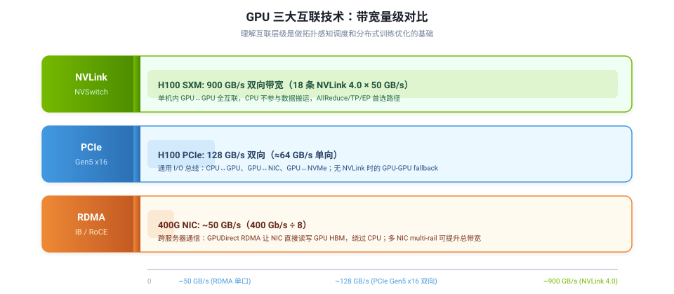
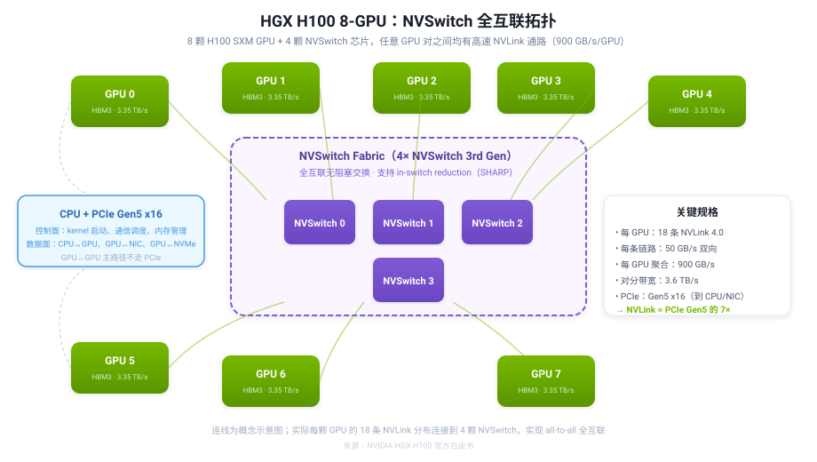
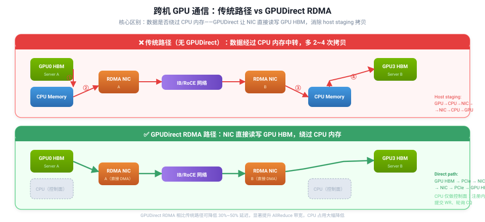

## 一句话结论

在 8 卡 H100/A100 训练服务器里，**单机内 GPU-GPU 通信优先走 NVLink/NVSwitch，跨机优先走 GPUDirect RDMA，PCIe 则承担 CPU、GPU、NIC、NVMe 之间的通用 I/O**。这三者不是孤立的硬件名词，而是回答一个 AI Infra 核心问题：**同样是「8 张 GPU」，放置位置、拓扑和通信路径不同，训练吞吐可能差数倍。**


<p style="font-size:0.85em;color:var(--text-secondary);margin:0 0 16px 0;">图 1：NVLink、PCIe、RDMA 三大互联技术带宽量级对比。NVLink 4.0 单卡聚合带宽 900 GB/s，约为 PCIe Gen5 x16 的 7 倍，约为单口 400G RDMA NIC 的 18 倍。</p>

## 三大互联技术定位

| 技术 | 主要用途 | 典型通信范围 | H100 典型带宽 | 训练中的角色 |
|---|---|---|---|---|
| **NVLink / NVSwitch** | GPU-GPU 高速互联 | 单机内（或 NVLink Switch 扩展域） | **900 GB/s** 双向/GPU | 单机内 AllReduce、张量并行、MoE All-to-All、Pipeline stage 通信 |
| **PCIe** | 通用 I/O 总线 | CPU↔GPU、GPU↔NIC、GPU↔NVMe、部分 GPU-GPU P2P | **128 GB/s** 双向（Gen5 x16） | Host→GPU 拷贝、GPU→NIC、无 NVLink 时的 GPU-GPU fallback |
| **RDMA / InfiniBand / RoCE** | 跨服务器远程直接内存访问 | 服务器之间 | **~50 GB/s**（单口 400G NIC） | 跨节点梯度同步、参数交换、分布式训练 collective |

简单类比：

- **NVLink**：GPU 之间的"高速内环路"——专用、超宽、超低延迟。
- **PCIe**：服务器内部的"通用高速公路"——什么设备都能走，但车道少。
- **RDMA**：服务器之间的"跨城专线"——距离远，但 NIC 可以直接读写对端 GPU 显存。

<div class="card card-d">
<h3>面试高频追问：为什么 NVLink 带宽比 PCIe 高这么多？</h3>
<p>NVLink 是 NVIDIA 专为 GPU-GPU 设计的<strong>专有协议</strong>，物理层使用更多差分对（H100 有 18 条 NVLink 4.0 链路），不需要兼容通用 PCIe 设备枚举、地址空间映射等 I/O 开销；同时 NVSwitch 芯片提供 in-network reduction（SHARP）硬件加速，AllReduce 类 collective 可以在交换机芯片内完成累加，不需要每张 GPU 都收到完整数据再本地相加。PCIe 是通用 I/O 总线，要服务 CPU、GPU、NIC、SSD 等多种设备，协议栈更重，链路数量也受限于插槽形态。</p>
</div>

## NVLink 与 NVSwitch：单机 GPU-GPU 的高速通道

### NVLink 演进

NVLink 自 2016 年 P100 推出以来已发展四代：

| 代数 | 代表 GPU | 每条链路带宽 | 链路数/GPU | 聚合带宽/GPU |
|---|---|---|---|---|
| NVLink 1.0 | P100 | 20 GB/s 双向 | 4 | 80 GB/s |
| NVLink 2.0 | V100 | 25 GB/s 双向 | 6 | 150 GB/s |
| NVLink 3.0 | A100 | 50 GB/s 双向 | 12 | 600 GB/s |
| NVLink 4.0 | H100/H200 | 50 GB/s 双向 | 18 | **900 GB/s** |
| NVLink 5.0 | B200/GB200 | ~100 GB/s 双向 | 18 | 1.8 TB/s |

A100 SXM 单 GPU 有 12 条 NVLink 3.0，聚合 600 GB/s；H100 SXM 增加到 18 条 NVLink 4.0，聚合 900 GB/s，是 PCIe Gen5 x16（~128 GB/s 双向）的 7 倍。

### NVSwitch：让所有 GPU 全互联

仅靠 NVLink 点对点连接（NVLink Bridge）只能支持两张 GPU 直连（如 PCIe 版本的 H100 双卡桥接）。要让 8 张 GPU 两两之间都有高带宽通路，需要 **NVSwitch** 交换芯片。

HGX H100 8-GPU 基板上集成了 **4 颗第三代 NVSwitch** 芯片，形成全互联无阻塞（non-blocking）交换矩阵：任意 GPU 对之间都能以 ~900 GB/s 的速度同时通信，不会争用带宽。


<p style="font-size:0.85em;color:var(--text-secondary);margin:0 0 16px 0;">图 2：HGX H100 8-GPU 基板拓扑概念图。8 颗 GPU 通过 4 颗 NVSwitch 芯片形成全互联，每颗 GPU 的 18 条 NVLink 分布连接到 4 颗 NVSwitch，实现 all-to-all 无阻塞通信。CPU 仅负责控制面（kernel 启动、通信调度），不参与 GPU-GPU 数据搬运。</p>

HGX A100 使用 **6 颗第二代 NVSwitch**（每颗 GPU 有 2 条 NVLink 连到每颗 NVSwitch），对分带宽（bisection bandwidth）2.4 TB/s；HGX H100 使用 4 颗第三代 NVSwitch（每颗 GPU 有 4~5 条 NVLink 连到 NVSwitch），对分带宽提升到 **3.6 TB/s**。

第三代 NVSwitch 的一个关键新特性是 **in-switch reduction**（SHARP 风格）：AllReduce 操作中的加法运算可以在 NVSwitch 芯片内的 ALU 上直接完成，减少数据在 GPU 间的往返，常见 collective（如 all-reduce）有效带宽相比 A100 提升约 3 倍。

## PCIe：通用 I/O 总线

PCIe（Peripheral Component Interconnect Express）是服务器内部连接 CPU、GPU、NIC、NVMe SSD 的通用总线。它不是 GPU-GPU 通信的最优路径，但在没有 NVLink 时是 fallback 选择，同时承担 CPU-GPU、GPU-NIC 等关键数据路径。

### PCIe 带宽计算

PCIe 带宽 = **代际速率 × lane 数 × 编码开销**。常见 GPU 使用 x16 链路：

| PCIe 版本 | 编码前每 lane 速率 | x16 单向有效带宽 | x16 双向合计 | 常见对应 GPU |
|---|---|---|---|---|
| PCIe Gen3 | 8 GT/s → ~1 GB/s/lane | ~16 GB/s | ~32 GB/s | V100 PCIe |
| PCIe Gen4 | 16 GT/s → ~2 GB/s/lane | ~32 GB/s | ~64 GB/s | A100 PCIe |
| PCIe Gen5 | 32 GT/s → ~4 GB/s/lane | ~64 GB/s | ~128 GB/s | H100 PCIe |
| PCIe Gen6 | 64 GT/s → ~8 GB/s/lane | ~128 GB/s | ~256 GB/s | B100/未来 GPU |

PCIe 是**树形拓扑**：设备通过 PCIe switch 连接到 CPU root complex。两张 GPU 是否能高效通信，取决于它们在 PCIe 树中的位置：

- **同 PCIe switch 下的 P2P**：路径最短，延迟和带宽相对最好。
- **跨 PCIe switch / 跨 root complex**：路径变长。
- **跨 CPU Socket**：需要经过 CPU 间互联（Intel UPI、AMD Infinity Fabric），延迟显著增加，抖动变大。
- **Host staging（最差情况）**：GPU→CPU pinned memory→GPU，多一次拷贝，占用 CPU 内存带宽。

<div class="callout warn">
<p><strong>注意</strong>：PCIe P2P（Peer-to-Peer）需要硬件和驱动支持。即使两张 GPU 物理上在同一 PCIe switch 下，也可能因为 ACS（Access Control Services）、IOMMU 配置或驱动限制无法直接 P2P，此时会静默退化为 host staging。排查时可用 <code>nvidia-smi topo -p2p</code> 确认 P2P 是否可达。</p>
</div>

## RDMA 与 GPUDirect：跨机通信主力

跨服务器时 NVLink 无法直接延伸，必须通过 NIC 和网络。高性能 AI 训练集群使用 **InfiniBand** 或 **RoCE（RDMA over Converged Ethernet）** 实现 RDMA（Remote Direct Memory Access）。

### RDMA 的核心优势

传统网络通信需要 CPU 参与数据搬运（socket buffer → kernel → NIC），RDMA 允许 NIC **绕过远端 CPU** 直接读写远端内存，大幅降低延迟和 CPU 开销。400G InfiniBand（NDR）单口线速约 50 GB/s（400 Gb/s ÷ 8），一台服务器通常配 4~8 张 ConnectX-7 NIC，通过 multi-rail 并行提供数百 GB/s 的跨机总带宽。

### GPUDirect RDMA：让 NIC 直接读写 GPU 显存

GPUDirect RDMA 是 RDMA 的关键增强：NIC 可以通过 PCIe 直接 DMA 读写 GPU HBM 显存，不需要先把数据拷贝到 CPU 内存再发送。


<p style="font-size:0.85em;color:var(--text-secondary);margin:0 0 16px 0;">图 3：传统跨机通信路径 vs GPUDirect RDMA 路径对比。传统路径在发送端和接收端都需要经过 CPU 内存中转（host staging），共 4 次额外拷贝；GPUDirect RDMA 让 NIC 直接读写 GPU HBM，消除 host staging，CPU 仅负责控制面操作。</p>

传统路径：`GPU0 HBM → CPU DRAM → NIC → 网络 → NIC → CPU DRAM → GPU3 HBM`（4 次拷贝，CPU 全程参与）。
GPUDirect RDMA 路径：`GPU0 HBM → PCIe → NIC → 网络 → NIC → PCIe → GPU3 HBM`（零 CPU 内存中转）。

这会带来：
- **延迟降低**：省去 2~4 次内存拷贝。
- **CPU 开销降低**：CPU 仅负责控制面（注册内存、提交 Work Request、轮询 Completion Queue），不参与数据搬运。
- **带宽提升**：避免 CPU 内存带宽成为瓶颈，PCIe 带宽利用率更高。
- **支持 GPU-Direct Storage（GDS）**：同样的思路让 NVMe 直接读写 GPU 显存。

## 一台 8 卡 H100/A100 服务器内，数据如何流转？

### 8 卡 SXM/HGX 形态（DGX/HGX 高端训练服务器）

这是大模型训练的主力机型。8 张 H100 SXM GPU 通过 NVSwitch 全互联：

1. **计算数据主要在 HBM 中**：模型参数、梯度、激活值、KV Cache 都在 GPU HBM 中（H100 SXM HBM 带宽 3.35 TB/s）。
2. **GPU-GPU 通信走 NVLink/NVSwitch**：GPU0 发梯度给 GPU3，数据从 GPU0 HBM → NVLink → NVSwitch → NVLink → GPU3 HBM，CPU 不拷贝数据。
3. **CPU 负责控制面**：启动 CUDA kernel、初始化 NCCL communicator、管理进程和内存注册，但不参与数据平面。
4. **PCIe 仍然存在但不是主通道**：负责 CPU-GPU 控制命令、Host 到 GPU 的初始数据加载、GPU 到 NIC 的跨机路径、GPU 到 NVMe 的存储 I/O。

### 8 卡 PCIe 形态（消费级/推理服务器）

PCIe 形态的 8 卡服务器没有 NVSwitch，GPU-GPU 通信依赖 PCIe 拓扑：
- **同 PCIe switch 下 P2P**：路径短，带宽相对可接受，但远低于 NVLink。
- **跨 CPU Socket**：经过 UPI/Infinity Fabric，延迟和抖动大幅增加。
- **Host staging**：如果 P2P 不可用，退化为 GPU→CPU→GPU，性能最差。

这就是为什么 8 卡 PCIe 服务器训练大模型性能通常不如 SXM/NVSwitch 服务器——通信密集型任务（张量并行、MoE 专家并行、大 batch AllReduce）会被互联瓶颈严重限制。

### 单机 AllReduce 的数据路径

以 8 卡数据并行训练为例，NCCL 根据拓扑自动选择 ring、tree、CollNet、NVLS 等算法。在 SXM/NVSwitch 机器上：
1. 每张 GPU 把梯度切成多个 chunk。
2. **reduce-scatter** 阶段：每个 chunk 沿 ring 或 tree 传播，在目标 GPU 上累加——走 NVLink/NVSwitch。
3. **all-gather** 阶段：累加后的结果再通过 NVLink/NVSwitch 分发给所有 GPU。
4. NVSwitch 的 in-switch reduction 可以在交换芯片内完成部分加法，减少 GPU 间数据往返。

## 跨机数据流转：分层通信

多机多卡训练采用**分层通信**策略：

```flow
单机内 GPU↔GPU | NVLink/NVSwitch（最高优先级，充分利用单机带宽）
本机 GPU↔NIC | PCIe（GPUDirect 直连，同 Socket 最优）
跨机 NIC↔NIC | InfiniBand/RoCE RDMA（多 NIC multi-rail 并行）
远端 NIC↔GPU | PCIe（GPUDirect 直连）
CPU 控制面 | 仅做内存注册、调度、进程管理，不搬运数据
```

两台 8 卡服务器做 AllReduce 的典型流程：
1. **每台机器内部先 reduce-scatter**：8 张 GPU 通过 NVLink/NVSwitch 做本机内归约，把高带宽用满。
2. **跨机交换**：每台服务器的 GPU 数据通过 GPUDirect RDMA 发到对端，多 NIC 并行。
3. **每台机器内部再 all-gather**：跨机同步完成后，通过 NVLink/NVSwitch 分发给本机所有 GPU。

这就是 NCCL 做 topology-aware 通信优化的核心思想：**先用单机内最快的 NVLink/NVSwitch 做本地聚合，减少必须跨机传输的数据量。**

## NUMA 与 GPU-NIC 亲和性：容易被忽视的性能杀手

即使都配了 H100 + 400G RDMA，性能也可能差很多——关键在于 GPU 到 NIC 的 PCIe 路径。

### 理想情况：GPU 和 NIC 同 Socket / 同 PCIe switch

```flow
GPU → PCIe switch → NIC（同 Socket 下，路径短、延迟低、无跨 UPI）
```

### 糟糕情况：GPU 和 NIC 跨 Socket

```flow
GPU → PCIe switch → CPU Socket 0 → UPI/Infinity Fabric → CPU Socket 1 → PCIe root → NIC
```

跨 Socket 带来的问题：
- 延迟增加 1~2 μs 甚至更多。
- 有效带宽降低 30%~50%。
- 抖动变大（UPI 链路被其他流量竞争）。
- CPU socket 间互联带宽被占用，影响其他任务。

调度多机训练任务时，不仅要保证 8 张 GPU 属于同一 NVSwitch 域，还要确保 **每张 GPU 到其对应 NIC 的 PCIe 路径是同 Socket 的**。`nvidia-smi topo -m` 输出中的 `CPU Affinity` 和 `NUMA Affinity` 列可以直接看到 GPU 与哪些 CPU 核亲和。

## 通信路径优先级总结

### 单机内 GPU-GPU（带宽从高到低）

<div class="table-scroll">
<table>
<tr><th>优先级</th><th>路径</th><th>典型带宽</th><th>说明</th></tr>
<tr><td>1</td><td>NVLink / NVSwitch</td><td>900 GB/s</td><td>单机内最优 GPU-GPU 路径，全互联无阻塞</td></tr>
<tr><td>2</td><td>PCIe P2P（同 switch）</td><td>~50~100 GB/s</td><td>无 NVLink 时的较优 fallback</td></tr>
<tr><td>3</td><td>PCIe P2P（跨 root / 跨 Socket）</td><td>~20~50 GB/s</td><td>路径长，延迟和抖动增加</td></tr>
<tr><td>4</td><td>GPU → CPU pinned memory → GPU（host staging）</td><td>&lt;20 GB/s</td><td>最差，占用 CPU 内存带宽，应尽量避免</td></tr>
</table>
</div>

### 跨机 GPU-GPU

<div class="table-scroll">
<table>
<tr><th>优先级</th><th>路径</th><th>说明</th></tr>
<tr><td>1</td><td>GPU HBM → PCIe → NIC → RDMA 网络 → NIC → PCIe → GPU HBM</td><td>GPUDirect RDMA，理想路径，零 host staging</td></tr>
<tr><td>2</td><td>GPU → CPU 内存 → NIC → 网络 → NIC → CPU 内存 → GPU</td><td>Host staging，多 4 次拷贝，性能差 30%~50%</td></tr>
</table>
</div>

<div class="callout note">
<p><strong>大小消息的敏感性差异</strong>：以上排序是大消息（tensor/gradient 传输）场景的常见优先级。小消息（如控制信号、barrier）对延迟更敏感，可能 NVLink P2P 比 NVSwitch 多跳延迟更低；实际最优路径还取决于 NCCL 算法选择、通信 overlap、网络拥塞状态等。</p>
</div>

## 调度策略启示

### 单机 8 卡任务

最优：**同一台 HGX/DGX 8 卡机器** + 同一 NVSwitch fabric + GPU-NIC 拓扑均衡。

不建议把一个强通信任务拆成「4 卡机器 A + 4 卡机器 B」——这会把本来可以走 NVLink 的通信变成 RDMA 跨机通信，带宽从 900 GB/s 降到 ~50 GB/s，性能可能差 10 倍以上。

### 4 卡任务

优先级：
1. 同一 NVSwitch 域内的 4 张 GPU（最优）。
2. 同一 PCIe switch / 同一 Socket 下的 4 张 GPU。
3. 同机但跨 Socket 的 4 张 GPU。
4. 跨机器 2+2 或 1+3（最差）。

### 多机 8×N 卡任务

调度器需要同时考虑：
- 每台机器内部是否是完整的 8 卡 NVSwitch 拓扑。
- 每张 GPU 到 NIC 的距离（NUMA 亲和性）。
- NIC 数量和 rail 分布（multi-rail 平衡）。
- 多台机器是否在同一 leaf switch / 同一网络 pod。
- RDMA 网络是否有拥塞（ECN/PFC 配置）。
- NCCL topology file 或自动探测是否正确。

## 常见排查命令

<div class="table-scroll">
<table>
<tr><th>目标</th><th>命令 / 工具</th><th>看什么</th></tr>
<tr><td>查看 GPU-GPU / GPU-NIC 拓扑</td><td><code>nvidia-smi topo -m</code></td><td>GPU 间是否 NVLink 互联（NV#），GPU 到 NIC 是 PIX/PXB/PHB/NODE/SYS 哪种路径，CPU/NUMA Affinity</td></tr>
<tr><td>查看 P2P 可达性</td><td><code>nvidia-smi topo -p2p r</code> / <code>nvidia-smi topo -p2p w</code></td><td>GPU 对之间是否支持 P2P 读写</td></tr>
<tr><td>查看 NCCL 选择的路径和算法</td><td><code>NCCL_DEBUG=INFO NCCL_DEBUG_SUBSYS=INIT,GRAPH</code></td><td>ring/tree/NVLS/IB 路径是否符合预期，是否 fallback 到 TCP</td></tr>
<tr><td>查看 NVLink 状态和速率</td><td><code>nvidia-smi nvlink -s</code></td><td>每条 NVLink 的速率、是否 active、有无错误</td></tr>
<tr><td>查看 IB/RDMA 设备</td><td><code>ibstat</code>、<code>ibv_devinfo</code></td><td>端口速率、链路状态、HCA 能力、Firmware 版本</td></tr>
<tr><td>查看 PCIe 拓扑</td><td><code>lspci -tv</code></td><td>GPU、NIC、PCIe switch、root complex 层级关系</td></tr>
<tr><td>查看 NUMA 拓扑</td><td><code>numactl --hardware</code>、<code>lstopo</code></td><td>CPU、内存、PCIe 设备的 NUMA 亲和性</td></tr>
<tr><td>查看 Fabric Manager 状态</td><td><code>systemctl status nvidia-fabricmanager</code></td><td>NVSwitch 是否正常初始化、有无 SXid 错误</td></tr>
</table>
</div>

排查时不要只看「有没有 8 张 GPU」，要同时确认：
- GPU-GPU 是否真的走 NVLink/NVSwitch（`NV12`/`NV18` 而非 `SYS`）。
- GPU-NIC 是否同 Socket（`PIX`/`PXB` 优于 `NODE`/`SYS`）。
- RDMA 是否启用 GPUDirect（NCCL 日志中不应出现 `Trees are not used` 或 TCP fallback）。
- 是否存在某个慢 rank、慢 NIC 或拥塞路径拖累整体（看 NCCL 日志中各 rank 的 ALG/CHANNEL 信息）。

### nvidia-smi topo -m 输出示例解读

典型的 HGX H100 8-GPU 输出：

```
        GPU0    GPU1    GPU2    GPU3    GPU4    GPU5    GPU6    GPU7
GPU0     X      NV18    NV18    NV18    NV18    NV18    NV18    NV18
GPU1    NV18     X      NV18    NV18    NV18    NV18    NV18    NV18
GPU2    NV18    NV18     X      NV18    NV18    NV18    NV18    NV18
...（全矩阵 NV18，即每对 GPU 间 18 条 NVLink）
```

Legend 中关键缩写：
- **NV#**：通过 # 条 NVLink 连接（最好）。
- **PIX**：经过单个 PCIe bridge（PCIe 内最好）。
- **PXB**：经过多个 PCIe bridge。
- **PHB**：经过 PCIe Host Bridge（CPU root complex）。
- **NODE**：跨 PCIe Host Bridge，同一 NUMA 节点内。
- **SYS**：跨 NUMA 节点（经过 UPI/Infinity Fabric，最慢）。

## 一句话面试版回答

NVLink/NVSwitch 是 8 卡 H100/A100 服务器内 GPU-GPU 通信的主路径，H100 SXM 单卡聚合带宽 900 GB/s（18 条 NVLink 4.0 × 50 GB/s），约为 PCIe Gen5 x16（128 GB/s）的 7 倍；PCIe 是 CPU、GPU、NIC、NVMe 间的通用 I/O 总线，带宽低但通用性强；RDMA（InfiniBand/RoCE）是跨服务器通信机制，单口 400G NIC 约 50 GB/s 线速，配合 GPUDirect RDMA 让 NIC 直接读写 GPU HBM、绕过 CPU 内存中转，比传统 host staging 路径延迟低 30%~50%。单机内训练通信应优先走 NVLink/NVSwitch（NCCL 会做 topology-aware 分层 reduce），跨机时使用 GPUDirect RDMA 并保证 GPU-NIC 同 Socket 亲和，避免跨 UPI/Infinity Fabric 导致的带宽下降和抖动。

## 参考资料

1. [NVIDIA H100 Tensor Core GPU 架构白皮书](https://www.nvidia.com/en-us/technologies/hopper-architecture/)
2. [NVIDIA HGX H100 官方介绍博客](https://developer.nvidia.com/blog/introducing-nvidia-hgx-h100-an-accelerated-server-platform-for-ai-and-high-performance-computing/)
3. [NVIDIA Fabric Manager User Guide](https://docs.nvidia.com/datacenter/tesla/fabric-manager-user-guide/)
4. [PCI-SIG PCIe 5.0 规范](https://pcisig.com/)
5. [NVIDIA Quantum-2 InfiniBand 平台](https://www.nvidia.com/en-us/networking/quantum2/)
6. [NVIDIA GPUDirect 技术](https://developer.nvidia.com/gpudirect)
7. [NVIDIA H100 PCIe Product Brief](https://www.nvidia.com/content/dam/en-zz/Solutions/gtcs22/data-center/h100/PB-11133-001_v01.pdf)