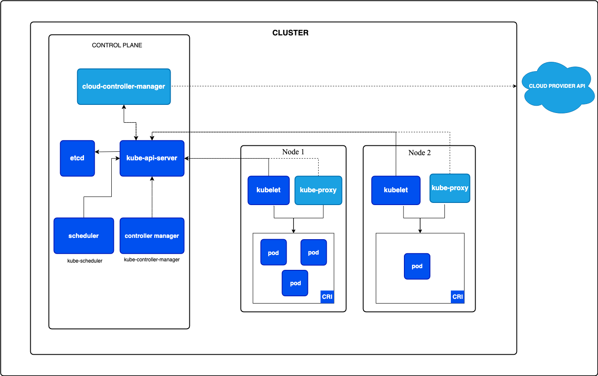

<h3>Kubernetes 架构图</h3>

Kubernetes 官方文档组件图：控制面通过 API Server 协调集群状态，节点侧由 kubelet、kube-proxy 和容器运行时执行工作负载。

同一架构的另一视角：CLUSTER 内 Control Plane（cloud-controller-manager / kube-api-server / etcd / scheduler / controller-manager）与多个 Node（kubelet + kube-proxy + CRI 内的 Pod）的归属关系，cloud-controller-manager 单独对接 Cloud Provider API。

<h3>一个 Pod 从提交到运行的完整链路</h3>
<table>
<tr><th>阶段</th><th>核心组件</th><th>发生什么</th><th>面试关键词</th></tr>
<tr><td>提交请求</td><td>kubectl / client-go → API Server</td><td>用户提交 Pod、Deployment、Job 等资源对象</td><td>REST API、OpenAPI、版本转换</td></tr>
<tr><td>认证鉴权</td><td>API Server</td><td>检查调用者是谁、有没有权限、是否满足准入策略</td><td>Authentication、Authorization、Admission</td></tr>
<tr><td>持久化</td><td>API Server → etcd</td><td>合法对象被写入 etcd，成为集群期望状态</td><td>声明式 API、resourceVersion、watch</td></tr>
<tr><td>控制器处理</td><td>Controller Manager</td><td>Deployment 创建 ReplicaSet，ReplicaSet 创建 Pod</td><td>Reconcile、OwnerReference、Finalizer</td></tr>
<tr><td>调度决策</td><td>kube-scheduler</td><td>监听未绑定 Pod，经过 Filter / Score / Reserve / Bind 选择节点</td><td>Scheduling Framework、requests、亲和性、污点容忍</td></tr>
<tr><td>节点执行</td><td>kubelet</td><td>目标节点 kubelet watch 到 Pod，准备 volume、网络、容器</td><td>Pod Worker、PLEG、CNI、CSI、CRI</td></tr>
<tr><td>运行容器</td><td>containerd / CRI-O</td><td>按 kubelet 的 CRI 请求拉镜像、创建 sandbox 并管理容器进程</td><td>Pause 容器、Pod IP、容器状态</td></tr>
</table>

<h3>回答结构：Pod 是怎么跑起来的？</h3>

<strong>API Server 是协作中心，etcd 是状态存储，kubelet 是节点执行者。</strong>控制面负责把“要运行什么、放到哪里”写成资源状态，目标节点负责把状态变成真正运行的 Pod。

01

提交期望状态

<code>kubectl</code> → API Server → etcd

02

创建 Pod 对象

Deployment → ReplicaSet → Pod

03

绑定目标节点

Filter / Score → Binding

04

节点落地执行

kubelet → CSI / CNI / CRI

<strong>① 入口｜API Server</strong>完成认证、鉴权、准入、校验和默认值填充；合法对象由 API Server 持久化到 etcd。

<strong>② 控制｜Controller</strong>通过 watch 获取变化并持续 reconcile：Deployment Controller 维护 ReplicaSet，ReplicaSet Controller 维护 Pod。

<strong>③ 调度｜Scheduler</strong>监听尚未绑定节点的 Pod，经 Filter、Score、Reserve、Permit、Bind 选出 Node，并把绑定结果写回 API Server。

<strong>④ 执行｜kubelet</strong>监听分配到本节点的 Pod，准备 CSI volume、创建 sandbox、配置 CNI 网络，再通过 CRI 启动容器并回写状态。

抓住三条边界：<strong>etcd 只保存状态</strong>；<strong>scheduler 只写回绑定结果，不直接通知 kubelet</strong>；<strong>kubelet 编排节点执行，CRI / CNI / CSI 分别负责容器、网络和存储</strong>。

<h3>控制面与数据面组件速记</h3>
<table>
<tr><th>组件</th><th>职责</th><th>常见追问</th></tr>
<tr><td>API Server</td><td>所有资源操作入口，负责认证、鉴权、准入、聚合 API、watch</td><td>为什么它是唯一直接访问 etcd 的组件？</td></tr>
<tr><td>etcd</td><td>保存经 API Server 持久化的集群对象，包括 spec、status 和元数据</td><td>备份恢复、watch、resourceVersion、压缩与碎片整理</td></tr>
<tr><td>Scheduler</td><td>为未绑定 Pod 选择节点</td><td>Filter / Score / Reserve / Permit / Bind 的区别</td></tr>
<tr><td>Controller Manager</td><td>运行 Deployment、ReplicaSet、Node、Job 等控制循环</td><td>什么是 reconcile？如何处理最终一致性？</td></tr>
<tr><td>kubelet</td><td>节点代理，负责 Pod 生命周期和状态上报</td><td>kubelet 如何调用 CRI / CNI / CSI？</td></tr>
<tr><td>kube-proxy / eBPF datapath</td><td>实现 Service 转发或服务负载均衡</td><td>iptables、IPVS、eBPF 的差异</td></tr>
<tr><td>Container Runtime</td><td>真正创建和管理容器</td><td>CRI、containerd、pause 容器、镜像拉取</td></tr>
</table>

<h3>控制面与数据面组件高频追问</h3>
<table>
<tr><th>组件</th><th>面试官问法</th><th>回答抓手</th></tr>
<tr><td>API Server</td><td>为什么它是唯一直接访问 etcd 的组件？</td><td>统一认证鉴权、准入、版本转换、乐观并发和 watch 分发；其他组件通过 API Server 解耦。</td></tr>
<tr><td>etcd</td><td>resourceVersion 和 watch 有什么关系？</td><td><code>resourceVersion</code> 是客户端必须视为不透明值的对象版本标识，也可作为 watch 起点；版本过旧时可能收到 410 Gone，需要重新 List 建立当前视图。</td></tr>
<tr><td>Scheduler</td><td>Filter / Score / Reserve / Permit / Bind 怎么区分？</td><td>Filter 判断能不能放，Score 判断放哪里更好；Reserve 通知有状态插件维护临时账本，Permit 等待或拒绝，Bind 把选点结果写回 API Server。</td></tr>
<tr><td>Controller Manager</td><td>什么是 reconcile？</td><td>比较期望状态和实际状态，持续创建、更新、删除对象，让系统最终一致。</td></tr>
<tr><td>kubelet</td><td>kubelet 如何调用 CRI / CNI / CSI？</td><td>CRI 管容器运行时，CNI 配 Pod 网络，CSI / volume manager 挂载存储；kubelet 编排本节点执行。</td></tr>
<tr><td>containerd</td><td>containerd、runc、shim、pause 容器分别是什么？</td><td>containerd 是高层 runtime，runc 创建 OCI 容器，shim 托管容器进程，pause 持有 Pod 共享 namespace。</td></tr>
</table>

<h3>Container Runtime / containerd 面试速查</h3>

containerd 相关问题通常不是问“会不会用 Docker”，而是问清 <strong>kubelet → CRI → containerd → shim → runc</strong> 这条节点侧执行链路，以及 Pod sandbox / pause 容器为什么存在。

<table>
<tr><th>问题</th><th>核心回答</th><th>排障关键词</th></tr>
<tr><td>CRI 是什么？</td><td>Kubernetes 定义的容器运行时接口，kubelet 通过 CRI gRPC 调用运行时。</td><td><code>crictl</code>、runtime endpoint</td></tr>
<tr><td>containerd 和 runc 区别？</td><td>containerd 管镜像、快照、容器生命周期；runc 是 OCI low-level runtime，真正创建 Linux 容器。</td><td>OCI bundle、snapshotter</td></tr>
<tr><td>pause 容器是什么？</td><td>Pod sandbox 的基础容器，先启动并持有 Pod 的 network / IPC 等共享 namespace。</td><td>Pod IP、sandbox</td></tr>
<tr><td>containerd-shim 做什么？</td><td>托管容器进程，转发 stdio / exit status，让 containerd 重启后容器仍可继续运行。</td><td>shim 进程、僵尸进程</td></tr>
<tr><td>镜像怎么拉？</td><td>kubelet 通过 CRI 调 PullImage，containerd 解析 manifest、拉 layer、校验 digest、写入 content store。</td><td>ImagePullBackOff、registry、Secret</td></tr>
<tr><td>CNI 谁调用？</td><td>kubelet 创建 Pod sandbox 时通过 CRI 触发 runtime 侧配置网络；containerd CRI plugin 会调用 CNI 插件。</td><td>ContainerCreating、CNI config</td></tr>
<tr><td>Docker 镜像还能跑吗？</td><td>能。移除 dockershim 不等于不能跑 Docker 构建的镜像；镜像遵循 OCI/Docker image spec。</td><td>dockershim removed、OCI</td></tr>
</table>

<h3>架构与 Pod 主链路高频问答</h3>

Q: API Server 为什么通常是唯一直接访问 etcd 的组件？

因为 API Server 是 Kubernetes 的统一状态入口。它集中处理认证、鉴权、准入、默认值、版本转换、对象校验、乐观并发和 watch 分发。如果 controller、scheduler、kubelet 都直接读写 etcd，权限、版本兼容、并发控制和审计都会失控。

面试口径：etcd 是状态存储，不是组件协作总线；组件协作通过 API Server 和 watch 完成。

Q: Controller Manager 的 reconcile 到底是什么意思？

reconcile 是控制器把实际状态拉回期望状态的循环。以 Deployment 为例，用户声明 replicas=3，Deployment Controller 确保 ReplicaSet 存在，ReplicaSet Controller 确保有 3 个 Pod。Pod 被删、节点故障、状态变化时，controller 会再次对比 spec 和 status，并执行修正动作。

面试口径：reconcile = watch 变化 + 对比期望/实际 + 幂等修正，目标是最终一致，不是同步阻塞执行。

Q: kubelet 如何调用 CRI / CNI / CSI？

kubelet watch 到绑定到本节点的 Pod 后，进入 SyncPod。它先通过 volume manager / CSI 准备卷，再通过 CRI 调用 containerd 创建 Pod sandbox。创建 sandbox 时 runtime 侧会调用 CNI 配置网络，随后 kubelet 继续通过 CRI 拉镜像、创建并启动业务容器。

<pre><code class="language-text">kubelet
  → CSI / volume manager 准备 volume
  → CRI RunPodSandbox
  → containerd CRI plugin 调 CNI 配网络
  → CRI PullImage / CreateContainer / StartContainer
  → containerd-shim / runc 创建容器进程</code></pre>

面试口径：kubelet 是节点编排者；CRI 管容器，CNI 管网络，CSI 管存储。

Q: containerd、runc、containerd-shim 分别负责什么？

<code>containerd</code> 是高层容器运行时，负责镜像拉取、content store、snapshot、容器生命周期和 CRI 服务。<code>runc</code> 是 OCI low-level runtime，负责根据 OCI spec 真正创建 Linux 容器。<code>containerd-shim</code> 位于 containerd 和容器进程之间，托管容器进程、收集退出状态和 stdio，让 containerd daemon 重启时容器不必一起退出。

面试口径：containerd 管生命周期和镜像，runc 负责创建容器，shim 负责把容器进程和 containerd 解耦。

Q: pause 容器 / Pod sandbox 是什么？为什么需要它？

Pod 不是单个容器，而是一组共享网络等 namespace 的容器。pause 容器是 Pod sandbox 的基础容器，它先启动，持有 Pod 的 network namespace、Pod IP 和部分共享 namespace。业务容器启动时加入这个 sandbox。这样业务容器重启时，Pod 的网络身份可以保持稳定。

面试口径：pause 容器是 Pod 的 namespace 锚点；它让 Pod 里的多个容器共享同一个网络身份。

Q: ImagePullBackOff 和 ErrImagePull 怎么排查？

先看 Pod Events 里的具体错误：镜像名/tag 是否存在、registry 是否可达、imagePullSecret 是否正确、节点 DNS/代理是否正常、证书是否可信。再到节点侧用 <code>crictl pull</code> 或查看 containerd 日志确认 runtime 能否拉取。

<pre><code class="language-bash">kubectl describe pod &lt;pod&gt;
kubectl get secret -n &lt;ns&gt;
crictl pull &lt;image&gt;
journalctl -u containerd</code></pre>

面试口径：ImagePullBackOff 是 kubelet 拉镜像失败后的退避状态；根因通常在镜像名、权限、网络、证书或 registry。

Q: ContainerCreating 卡住通常看哪里？

ContainerCreating 表示已经调度到节点，但节点侧执行还没完成。排查顺序是：Pod Events → kubelet 日志 → containerd 日志 → CNI 日志 / 配置 → CSI mount → 镜像拉取。常见原因包括 CNI 分配 IP 失败、CSI 挂载超时、sandbox 创建失败、镜像拉取慢、节点磁盘压力。

面试口径：Pod 完成调度后 phase 仍可能是 Pending，而 <code>kubectl</code> 的 STATUS 显示 ContainerCreating；此时重点看 kubelet、runtime、CNI、CSI 和镜像路径。

Q: Kubernetes 移除 dockershim 后，Docker 镜像还能跑吗？

能。dockershim 移除的是 kubelet 直接对接 Docker Engine 的内置适配层，不是移除 Docker 镜像格式。只要镜像符合 OCI / Docker image spec，containerd 和 CRI-O 都可以拉取和运行。变化在节点运行时链路：kubelet 通过 CRI 直接对接 containerd，而不是 kubelet → dockershim → Docker Engine。

面试口径：dockershim removed 不等于 Docker image 不能用；镜像格式兼容，运行时链路变了。

Q: 为什么说 Kubernetes 是声明式系统？

<strong>回答思路：</strong>先说概念和作用，再按链路或排查维度展开，最后给一句面试总结。

1. 概念

声明式系统的核心是用户提交“期望状态”，例如 Deployment 期望 3 个副本，而不是一步步命令系统创建哪几个容器。

2. 作用

声明式 API 让系统可以容错和自愈：Pod 被删、节点故障、实际副本数不匹配时，controller 会重新 reconcile。

3. 实现方式

API Server 保存 spec，controller 通过 Informer watch 对象变化，比较期望状态和实际状态，再创建、更新或删除相关对象。

4. 面试边界

etcd 保存状态，API Server 提供读写入口，controller 负责逼近期望状态；不要把 Kubernetes 理解成一次性脚本执行器。

面试口径：Kubernetes 的声明式体现在“用户写 spec，controller 持续 reconcile，最终让实际状态逼近期望状态”。

Q: API Server、Controller、Scheduler、kubelet 都在 watch 什么？

<strong>回答思路：</strong>先说概念和作用，再按链路或排查维度展开，最后给一句面试总结。

1. API Server 的位置

API Server 不只是被 watch 的对象入口，也是认证、鉴权、准入、版本转换和 watch 分发中心，其他组件基本都围绕它协作。

2. Controller watch 什么

Controller watch 自己关心的资源，例如 Deployment、ReplicaSet、Pod、Node，并根据 spec/status 差异执行 reconcile。

3. Scheduler watch 什么

Scheduler 主要 watch 未绑定节点的 Pod，以及 Node、PVC、ResourceClaim 等会影响调度结果的对象。

4. kubelet watch 什么

kubelet watch 绑定到本节点的 Pod，然后在节点侧准备 volume、网络和容器，并持续回写 Pod/Node 状态。

面试口径：watch 机制让组件通过 API Server 解耦协作，Controller 管期望状态，Scheduler 管放置决策，kubelet 管节点执行。

