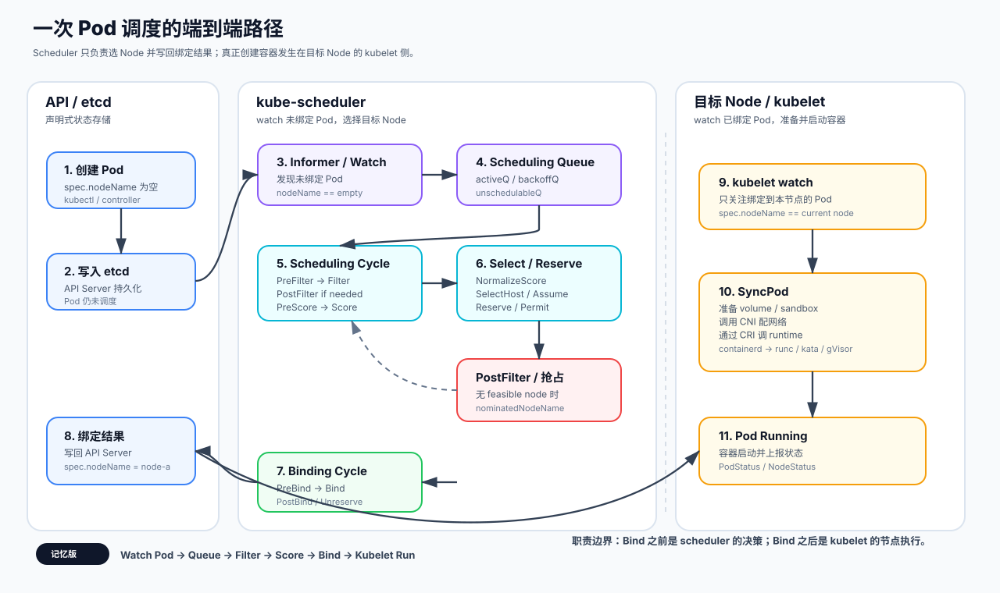

<h3>一次 Pod 调度的端到端路径</h3>

<strong>Pod 创建、scheduler 决策、API Server 持久化、kubelet 执行</strong> 是异步衔接的四段职责。Scheduler 只完成选点与绑定，不负责创建容器。

从 Pod 创建到 kubelet 启动容器：scheduler 负责选 Node 并写回绑定结果，kubelet 负责在目标 Node 上真正创建 Pod。

<pre><code class="language-text">用户/控制器创建 Pod
  ↓
API Server 写入 etcd（Pod.spec.nodeName 为空）
  ↓
Scheduler 监听到未调度 Pod
  ↓
调度队列 Scheduling Queue
  ↓
PreFilter
  ↓
Filter：筛选可用 Node
  ↓
PostFilter：必要时抢占
  ↓
Score：给 Node 打分
  ↓
NormalizeScore / Reserve
  ↓
Permit：可选等待/拒绝
  ↓
PreBind
  ↓
Bind：写入 Pod.spec.nodeName
  ↓
API Server 持久化绑定结果
  ↓
目标 Node 上的 kubelet 监听到该 Pod
  ↓
kubelet 拉镜像、创建容器、启动 Pod</code></pre>

<h3>1. Pod 创建与待调度状态</h3>

用户或控制器创建 Pod，例如 <code>kubectl apply -f pod.yaml</code>。如果 Pod 没有指定 <code>spec.nodeName</code>，它就是一个待调度 Pod。

<pre><code class="language-yaml">spec:
  nodeName: ""</code></pre>

API Server 会把 Pod 对象写入 etcd。此时调度还没有发生，集群里只是多了一个“期望被运行、但还没选 Node”的对象。

<h3>2. Scheduler 发现 Pod 并进入队列</h3>

<code>kube-scheduler</code> 通过 informer / watch 机制监听 API Server，重点关注 <code>Pod.spec.nodeName</code> 为空的 Pod。它们会进入 scheduler 内部的调度队列。

<table>
<tr><th>队列</th><th>作用</th><th>核心含义</th></tr>
<tr><td><code>activeQ</code></td><td>当前可以尝试调度的 Pod</td><td>现在试试</td></tr>
<tr><td><code>backoffQ</code></td><td>之前失败，等待退避时间结束的 Pod</td><td>过会儿再试</td></tr>
<tr><td><code>unschedulableQ</code></td><td>当前没有可行节点，等待集群状态变化的 Pod</td><td>等条件变了再试</td></tr>
</table>

调度器会不断从 <code>activeQ</code> 中取出一个 Pod，开始一次 <strong>Scheduling Cycle</strong>。

<h3>补充：Pod 不一定立刻进入 ActiveQ</h3>

新版 Kubernetes 里，Pod 进入正常调度队列前还可能被 <strong>SchedulingGates</strong> 或 <strong>PreEnqueue</strong> 拦住。这个点经常用来区分“只会背 Filter/Score”和“理解现代 scheduler”的候选人。

<table>
<tr><th>机制</th><th>发生位置</th><th>解决什么问题</th><th>面试口径</th></tr>
<tr><td><code>spec.schedulingGates</code></td><td>Pod 入队前</td><td>外部控制器还没准备好前，不让 Pod 进入调度队列</td><td>有 gate 的 Pod 不会进入正常调度循环，避免无效 Filter/Score</td></tr>
<tr><td><code>PreEnqueue</code></td><td>Queue 前的扩展点</td><td>插件可以在入队前判断 Pod 是否值得进入 ActiveQ</td><td>它比 PreFilter 更早，目标是减少无效入队</td></tr>
<tr><td>QueueingHint</td><td>调度失败后重新入队</td><td>判断某个集群事件是否真的可能让 Pod 变得可调度</td><td>它解决 UnschedulableQ 的惊群唤醒问题</td></tr>
</table>

收束句：不是所有 Pod 都马上进 ActiveQ；入队前有 gates，失败后有 QueueingHint，目的都是减少无效调度周期。

<h3>3. Scheduling Cycle：选择 Node</h3>

一次调度主要分成两个大阶段：<strong>Scheduling Cycle 负责选择 Node，Binding Cycle 负责把结果写回 API Server。</strong>Scheduling Cycle 的目标是为当前 Pod 找到一个最合适的 Node。

<table>
<tr><th>阶段</th><th>做什么</th><th>面试抓手</th></tr>
<tr><td>PreFilter</td><td>提前计算后续过滤会用的信息，例如资源请求、PVC、亲和性、拓扑约束、端口需求</td><td>能算一次的，不要在每个 Node 上重复算</td></tr>
<tr><td>Filter</td><td>遍历候选 Node，判断每个 Node 能不能运行这个 Pod</td><td>回答“能不能放”</td></tr>
<tr><td>PostFilter</td><td>Filter 没有可行节点时执行，典型动作是抢占</td><td>失败后的补救，不是常规打分</td></tr>
<tr><td>PreScore / Score</td><td>给可行节点打分，选出最优 Node</td><td>回答“放哪里最好”</td></tr>
<tr><td>NormalizeScore</td><td>把插件分数归一化到统一范围</td><td>不同插件分数才能加权汇总</td></tr>
<tr><td>Reserve</td><td>在调度器内部先预留资源</td><td>防止并发调度重复占用同一资源</td></tr>
<tr><td>Permit</td><td>可选地允许、拒绝或等待</td><td>Gang Scheduling 常用</td></tr>
</table>

<h3>4. Filter：筛选可用 Node</h3>

Filter 会得到一批可行节点，例如 <code>feasibleNodes = [node-a, node-c, node-f]</code>。如果为空，就说明当前 Pod 暂时无法调度。

<table>
<tr><th>过滤条件</th><th>例子</th><th>失败后常见现象</th></tr>
<tr><td>资源是否足够</td><td>Node 剩余 CPU / Memory / GPU 是否满足 Pod requests</td><td><code>Insufficient cpu</code>、<code>Insufficient memory</code>、<code>Insufficient nvidia.com/gpu</code></td></tr>
<tr><td>NodeSelector / NodeAffinity</td><td>Pod 要求 <code>disk=ssd</code> 或必须是 A100 节点</td><td>节点很多但标签不匹配</td></tr>
<tr><td>Taints / Tolerations</td><td>Node 有 <code>dedicated=gpu:NoSchedule</code>，Pod 没有 toleration</td><td>被 <code>TaintToleration</code> 插件过滤</td></tr>
<tr><td>PodAffinity / AntiAffinity</td><td>必须靠近某类 Pod，或不能和同服务副本同节点</td><td>拓扑域或已有 Pod 分布不满足</td></tr>
<tr><td>Volume 约束</td><td>PV 是否能挂载到该 Node，volume zone 是否匹配</td><td>PVC / VolumeBinding 相关 FailedScheduling</td></tr>
<tr><td>HostPort 冲突</td><td>Pod 使用 <code>hostPort: 8080</code></td><td>目标 Node 已有 Pod 占用相同端口</td></tr>
</table>

<h3>5. PostFilter：调度失败后的抢占</h3>

如果 Filter 阶段没有任何 Node 可用，会进入 PostFilter。最典型的动作是 <strong>Preemption</strong>：当前高优先级 Pod 调度不上时，尝试驱逐某些低优先级 Pod 腾出资源。

<pre><code class="language-text">找到一些候选 Node
  ↓
模拟删除低优先级 Pod
  ↓
判断当前 Pod 是否可以放上去
  ↓
选出最合适的抢占目标
  ↓
设置 nominatedNodeName</code></pre>

注意：抢占不是立刻完成绑定，而是先让低优先级 Pod 进入删除流程；目标资源真正释放后，Pod 才有机会重新调度成功。

<h3>6. Score：给可行节点打分</h3>

如果 Filter 后存在多个可行 Node，调度器会进入 Score 阶段。每个打分插件会给 Node 一个分数，通常归一化到 <code>0 ~ 100</code>，最终加权求和。

<pre><code class="language-text">finalScore(node) =
  pluginA_score * weightA +
  pluginB_score * weightB +
  pluginC_score * weightC</code></pre>
<table>
<tr><th>打分维度</th><th>作用</th></tr>
<tr><td>资源分布策略</td><td><code>LeastAllocated</code> 倾向空闲节点，<code>MostAllocated</code> 倾向装箱，<code>RequestedToCapacityRatio</code> 支持自定义利用率曲线</td></tr>
<tr><td>镜像本地性</td><td>Node 上已有镜像时得分更高，减少镜像拉取时间</td></tr>
<tr><td>亲和性偏好</td><td><code>preferredDuringSchedulingIgnoredDuringExecution</code> 这类软约束影响打分，不决定能不能调度</td></tr>
<tr><td>拓扑分布</td><td>尽量让副本分散到不同 Node / Zone / Region，减少单点风险</td></tr>
</table>

如果多个 Node 同分，调度器会做一定的随机化或稳定选择，避免热点集中。

<h3>7. Reserve、Permit、PreBind 与 Bind</h3>
<table>
<tr><th>阶段</th><th>作用</th><th>失败处理</th></tr>
<tr><td>Reserve</td><td>选出目标 Node 后，在 scheduler 内部先为这个 Pod 预留资源</td><td>后续失败时执行 <code>Unreserve</code> 释放预留状态</td></tr>
<tr><td>Permit</td><td>可选阶段，可以允许绑定、拒绝绑定或等待一段时间</td><td>等待超时或拒绝时触发回滚</td></tr>
<tr><td>PreBind</td><td>绑定前处理，例如 volume binding、外部插件最终校验、自定义资源准备</td><td>失败则不会进入 Bind</td></tr>
<tr><td>Bind</td><td>向 API Server 发起绑定请求，把 Pod 更新为 <code>spec.nodeName = selected-node</code></td><td>失败后进入调度失败处理</td></tr>
<tr><td>PostBind</td><td>绑定成功后的通知型动作，例如记录事件、异步上报</td><td>通常不影响 Pod 已经绑定的事实</td></tr>
</table>

关键点：<strong>Reserve / Assume 解决 scheduler 本地并发一致性，Bind 解决 API Server 中的持久化状态。</strong>

多个 Reserve 插件按配置顺序执行；某个 Reserve 失败后，后续 Reserve 不再执行，已经执行过的插件按反向顺序调用 <code>Unreserve</code>。<code>Unreserve</code> 必须幂等且不能返回错误，因为 Permit 拒绝/超时、PreBind 失败、Bind 失败都可能触发回滚。Permit 返回 Wait 时，Pod 进入 waiting Pods 集合，binding cycle 等待批准；超时会转为拒绝并触发 Unreserve，这使它适合表达 Gang 成员“先占位、凑齐后一起放行”的语义。

<h3>8. kubelet 发现并启动 Pod</h3>

API Server 接收到绑定请求后，会更新 Pod 对象并写入 etcd。此时 Pod 对象变成：

<pre><code class="language-yaml">spec:
  nodeName: node-a</code></pre>

目标 Node 上的 kubelet 会监听 <code>spec.nodeName == 当前节点名</code> 的 Pod。发现新 Pod 后，它进入 <code>SyncPod</code> 流程：

<pre><code class="language-text">获取 PodSpec
  ↓
创建 Pod sandbox
  ↓
调用 CNI 配置网络
  ↓
挂载 volume
  ↓
拉取镜像
  ↓
通过 CRI 调用 container runtime
  ↓
创建容器
  ↓
启动容器
  ↓
上报 Pod 状态</code></pre>

如果使用 containerd，路径大致是 <code>kubelet → CRI → containerd → runc / kata / gVisor</code>。

<h3>职责边界：Scheduler 不负责起容器</h3>
<table>
<tr><th>组件</th><th>职责</th></tr>
<tr><td>kube-scheduler</td><td>决定 Pod 放到哪个 Node</td></tr>
<tr><td>API Server</td><td>保存 Pod 对象和绑定结果</td></tr>
<tr><td>etcd</td><td>持久化集群状态</td></tr>
<tr><td>kubelet</td><td>在目标 Node 上真正创建和运行 Pod</td></tr>
<tr><td>container runtime</td><td>创建容器进程</td></tr>
<tr><td>CNI</td><td>配置 Pod 网络</td></tr>
<tr><td>CSI / volume plugin</td><td>挂载存储</td></tr>
</table>

Scheduler 只负责“选机器”，不负责“起容器”；容器真正启动是在 kubelet 侧完成的。

<h3>源码口径的简化路径</h3>
<pre><code class="language-text">ScheduleOne
  ↓
NextPod
  ↓
SchedulingCycle
  ↓
PreFilter
  ↓
Filter
  ↓
PostFilter if needed
  ↓
Score
  ↓
SelectHost
  ↓
Reserve
  ↓
Permit
  ↓
BindingCycle
  ↓
PreBind
  ↓
Bind
  ↓
PostBind</code></pre>

最核心的是：<strong>Filter 判断能不能放，Score 判断放哪里最好，Bind 把结果写回 API Server。</strong>

记忆版：Watch Pod → Queue → Filter → Score → Bind → Kubelet Run。

<h3>调度队列总览图</h3>

这张图要抓住一个核心：<strong>队列系统决定“下一个被尝试调度的是谁”，Filter/Score 才决定“它放到哪里”。</strong>因此队列策略会直接影响等待时间、公平性、吞吐和重试风暴。

<svg viewBox="0 0 1120 610" role="img" aria-label="kube-scheduler scheduling queue flow">
<defs>
<marker id="queueArrow" markerWidth="10" markerHeight="10" refX="8" refY="3" orient="auto" markerUnits="strokeWidth">
<path d="M0,0 L0,6 L9,3 z" fill="currentColor"></path>
</marker>
</defs>
<text x="34" y="42" class="k8s-title">kube-scheduler 队列流转</text>
<text x="34" y="64" class="k8s-subtitle">activeQ / backoffQ / unschedulablePods / move request</text>

<rect x="40" y="105" width="180" height="86" class="sched-node sched-api"></rect>
<text x="64" y="137" class="sched-label">New / Updated Pod</text>
<text x="64" y="159" class="sched-desc">未绑定 Pod 进入调度器</text>
<text x="64" y="177" class="sched-desc">带 priority / affinity / PVC</text>

<rect x="310" y="90" width="230" height="112" class="sched-node sched-queue"></rect>
<text x="335" y="125" class="sched-label">ActiveQ</text>
<text x="335" y="150" class="sched-desc">当前可以立即尝试调度</text>
<text x="335" y="169" class="sched-desc">内部按 QueueSort 排序</text>
<text x="335" y="188" class="sched-desc">priority、timestamp、plugin 共同影响顺序</text>

<rect x="645" y="90" width="210" height="112" class="sched-node sched-cache"></rect>
<text x="670" y="125" class="sched-label">Scheduling Cycle</text>
<text x="670" y="150" class="sched-desc">PreFilter / Filter / Score</text>
<text x="670" y="169" class="sched-desc">用 snapshot 判断目标节点</text>
<text x="670" y="188" class="sched-desc">成功后进入 assume / bind</text>

<rect x="930" y="105" width="150" height="86" class="sched-node sched-bind"></rect>
<text x="956" y="137" class="sched-label">Bind</text>
<text x="956" y="159" class="sched-desc">写 API Server</text>
<text x="956" y="177" class="sched-desc">Pod 获得 nodeName</text>

<rect x="310" y="295" width="230" height="112" class="sched-node sched-note"></rect>
<text x="335" y="330" class="sched-label">BackoffQ</text>
<text x="335" y="355" class="sched-desc">已被唤醒，但退避尚未结束</text>
<text x="335" y="374" class="sched-desc">避免 CPU tight loop</text>
<text x="335" y="393" class="sched-desc">到期后回到 ActiveQ</text>

<rect x="645" y="295" width="250" height="112" class="sched-node sched-queue"></rect>
<text x="670" y="330" class="sched-label">UnschedulableQ</text>
<text x="670" y="355" class="sched-desc">当前没有任何可行节点</text>
<text x="670" y="374" class="sched-desc">等待事件提示重新入队</text>
<text x="670" y="393" class="sched-desc">不是按时间轮询为主</text>

<rect x="645" y="485" width="250" height="78" class="sched-node sched-api"></rect>
<text x="670" y="518" class="sched-label">Move request</text>
<text x="670" y="542" class="sched-desc">相关事件决定进入 ActiveQ 或 BackoffQ</text>

<path d="M220 148 C255 148 275 146 310 146" class="sched-arrow"></path>
<path d="M540 146 C585 146 600 146 645 146" class="sched-arrow"></path>
<path d="M855 146 C890 146 900 148 930 148" class="sched-arrow"></path>
<path d="M760 202 C760 235 720 250 700 295" class="sched-arrow sched-dashed"></path>
<path d="M425 295 C425 250 425 238 425 202" class="sched-arrow sched-dashed"></path>
<path d="M770 407 C770 448 770 465 770 485" class="sched-arrow sched-dashed"></path>
<path d="M645 525 C540 525 425 470 425 407" class="sched-arrow sched-dashed"></path>
<path d="M700 485 C600 445 560 245 500 202" class="sched-arrow sched-dashed"></path>

<rect x="40" y="485" width="500" height="78" class="sched-node sched-cache"></rect>
<text x="64" y="518" class="sched-label">队列职责</text>
<text x="64" y="542" class="sched-desc">ActiveQ 控制机会分配；BackoffQ 控制失败重试节奏；UnschedulableQ 控制事件驱动唤醒；Move request 控制无效重试比例。</text>
</svg>

<h3>一个 Pod 在调度队列里的流转过程</h3>

下面用最直观的文本流程图展示 Pod 从创建到绑定（或失败重试）的完整路径：

<pre class="pod-flow">
新 Pod 创建
    ↓
进入 ActiveQ
    ↓
调度器从 ActiveQ 取出 Pod
    ↓
尝试调度（Filter → Score → Assume）
    ↓
    ├── 成功 ──→ 进入绑定流程（Bind → PostBind）
    │
    └── 失败 ──→ 放入 UnschedulablePods ：记录失败插件，等待相关状态变化
             ↓ Node/Pod/PVC/ResourceClaim 等事件触发 QueueingHint / Move request
             ↓ 
                 ├── 退避已结束 ──→ ActiveQ
                 └── 仍在退避 ───→ BackoffQ → 到期后进入 ActiveQ
             
</pre>

这是最常见路径。若 Pod 正在一次调度尝试中时已经发生了可能使它恢复的 move request，失败处理可以直接把它放入 BackoffQ，避免错过该事件；退避到期后再进入 ActiveQ。

核心记忆：ActiveQ 是"现在试试"，BackoffQ 是"过会儿再试"，UnschedulableQ 是"等条件变了再试"。调度器的吞吐和延迟很大程度上取决于这三个队列之间的流转策略。

<h3>三个队列分别解决什么问题</h3>

调度器用三个队列管理不同状态的 Pod，而不是把所有 Pod 放在一个队列里轮询。理解这三个队列的<strong>进入条件、退出条件、排序策略和设计意图</strong>，是面试中区分“会用 K8s”和“理解调度器”的关键。

<table>
<thead>
<tr><th>维度</th><th class="q-active">ActiveQ</th><th class="q-backoff">BackoffQ</th><th class="q-unsched">UnschedulableQ</th></tr>
</thead>
<tbody>
<tr><td class="q-dim">核心区别</td><td>现在试试</td><td>过会儿再试</td><td>等条件变了再试</td></tr>
<tr><td class="q-dim">进入条件</td><td>新 Pod 通过 PreEnqueue、BackoffQ 到期，或 Move request 时退避已结束</td><td>不可调度 Pod 被相关事件唤醒，但当前退避期限尚未结束</td><td>PreEnqueue 拒绝，或一次调度失败后等待可能改变结论的事件</td></tr>
<tr><td class="q-dim">退出条件</td><td>被调度器取出尝试调度</td><td>退避时间到期后移回 ActiveQ</td><td>集群事件（Node/Pod/PVC 变化）触发 Move request</td></tr>
<tr><td class="q-dim">排序策略</td><td>QueueSort 插件：默认按 priority 降序 + 入队时间</td><td>按退避到期时间排序（FIFO）</td><td>不排序，等待事件驱动唤醒</td></tr>
<tr><td class="q-dim">核心问题</td><td>谁先获得调度机会？队头阻塞、饥饿、公平性</td><td>失败后多久重试？退避过短浪费 CPU，过长增加延迟</td><td>什么时候唤醒？事件提示不精准会导致无效重试风暴</td></tr>
<tr><td class="q-dim">AI 场景</td><td>小推理任务、交互式 Notebook 能否插队</td><td>GPU 大作业资源不够时避免频繁扫描节点</td><td>等待 GPU 释放、RDMA 节点加入、PVC 绑定、gang 资源凑齐</td></tr>
<tr><td class="q-dim">机制影响</td><td>Filter/Score 只能处理已出队的 Pod；队列排序决定谁先获得机会</td><td>把失败重试从忙等变成有节奏的再尝试</td><td>保存暂不满足条件的 Pod；只让相关事件触发唤醒</td></tr>
</tbody>
</table>

ActiveQ 管“谁先上”，BackoffQ 管“别太急”，UnschedulableQ 管“等时机”。三个队列的流转策略直接影响调度器的吞吐、延迟和公平性。

<h3>Move request：为什么事件提示很关键</h3>

Move request 可以理解为“某个集群事件可能让一批不可调度 Pod 重新有机会”。调度器结合上次失败插件、事件类型和 QueueingHint 判断是否唤醒；命中后，如果该 Pod 的退避已经结束就进入 ActiveQ，否则先进入 BackoffQ。除此之外，UnschedulablePods 中停留过久的 Pod 还会被周期性 flush，避免因漏事件而永久沉睡。

<table>
<tr><th>事件</th><th>可能唤醒哪些 Pod</th><th>为什么</th><th>无效唤醒风险</th></tr>
<tr><td>Node 新增或 Node label 变化</td><td>nodeSelector、nodeAffinity、拓扑约束失败的 Pod</td><td>节点集合或标签变了，Filter 结果可能改变</td><td>如果所有 Pod 都唤醒，会造成全量重试</td></tr>
<tr><td>Pod 删除或完成</td><td>资源不足、端口冲突、反亲和失败的 Pod</td><td>CPU/GPU/内存/端口/拓扑位置被释放</td><td>只释放 CPU 却唤醒 GPU 不足的 Pod，收益很低</td></tr>
<tr><td>PVC 绑定完成</td><td>之前因 volume binding 失败的 Pod</td><td>存储条件满足后才可能通过 Filter</td><td>和存储无关的 Pod 不应被大量唤醒</td></tr>
<tr><td>ResourceSlice / ResourceClaim 变化</td><td>DRA 设备匹配失败的 Pod</td><td>设备库存、属性或 claim 状态变化</td><td>设备事件过粗会导致大量 GPU Pod 重试</td></tr>
<tr><td>PodGroup / quota 变化</td><td>Gang、队列配额、批任务准入失败的 Pod</td><td>组资源或配额条件变化</td><td>准入条件未变化时重试只会消耗调度周期</td></tr>
</table>

队列性能优化不是“多重试几次”，而是“在正确事件发生后，只唤醒可能变得可调度的 Pod”。

