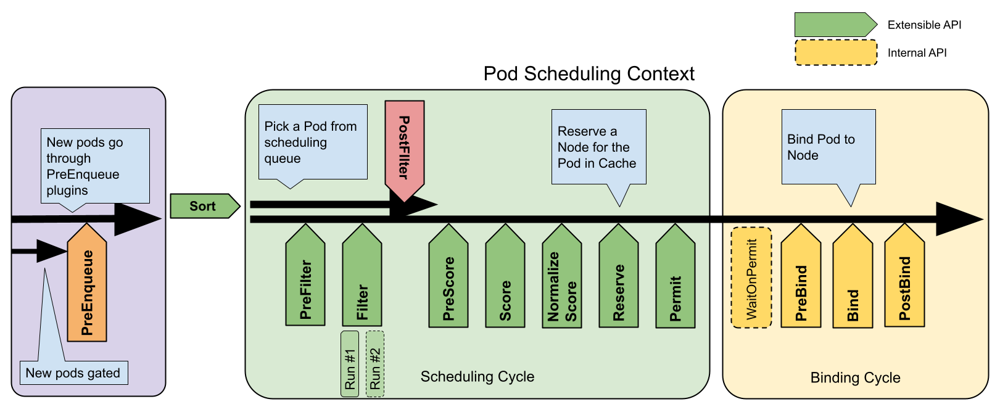

## 调度框架全景图

下面这张是 `kubernetes/enhancements/keps/sig-scheduling/624-scheduling-framework` 设计文档里给出的官方流程图。**先记图，再背扩展点**。

<div class="figure">

<p class="caption">PreEnqueue → Scheduling Cycle（PreFilter / Filter / PreScore / Score / NormalizeScore / Reserve / Permit）→ Binding Cycle（WaitOnPermit / PreBind / Bind / PostBind）。Scheduling Cycle 串行，Binding Cycle 可与下一个 Pod 的 Scheduling Cycle 并发。</p>
</div>

## PreFilter vs Filter：为什么必须拆开

<div class="card card-m">
<h3>核心差异表</h3>
<table>
<tr><th>维度</th><th>PreFilter</th><th>Filter</th></tr>
<tr><td>阶段目标</td><td><strong>数据预处理 + 全局状态检查</strong></td><td><strong>节点级过滤</strong>，逐节点检查条件</td></tr>
<tr><td>数据流</td><td>写入共享数据到 <code>CycleState</code></td><td>从 <code>CycleState</code> 读取数据并过滤节点</td></tr>
<tr><td>执行顺序</td><td>所有 PreFilter 插件 <strong>顺序执行（串行）</strong></td><td>Filter 插件 <strong>并行</strong>执行，多协程跨节点（默认 16 协程）</td></tr>
<tr><td>终止能力</td><td>可以提前终止整个调度周期（如 Pod 不合法、PodGroup 不齐）</td><td>仅排除当前节点，不影响其它节点判断</td></tr>
<tr><td>调用次数</td><td>每个调度周期调用一次</td><td>每个候选节点调用一次（节点数 × 插件数）</td></tr>
<tr><td>典型工作</td><td>解析 Pod annotation、查 PodGroup 状态、构建拓扑索引、计算资源需求</td><td>检查节点资源、Taint、Affinity、Volume、自定义约束</td></tr>
</table>
<div class="qa-summary">设计哲学：<strong>能在 PreFilter 算一次的事，绝不在 Filter 里对每个节点重复算</strong>。这是 Filter 阶段并行化的前提。</div>
</div>

<div class="card card-d">
<h3>为什么要这样切：一个具体例子</h3>
<p>假设你写一个「<strong>Pod 必须放在和它的 PodGroup 其他成员同 zone 的节点上</strong>」插件：</p>
<ul>
<li>查 PodGroup 当前已绑定到哪些 zone：<strong>这是一次集群级查询，所有节点都用同一个结果</strong>。如果放在 Filter 里，N 个节点会查 N 次，性能爆炸。</li>
<li>正确做法：<code>PreFilter</code> 里查一次写入 <code>CycleState["targetZones"] = [...]</code>；<code>Filter</code> 里只做 <code>node.zone in targetZones</code> 这种 O(1) 判断。</li>
</ul>
<p>这同时解释了为什么 Filter 能并行：每个 goroutine 只读 <code>CycleState</code>（已经写完的不可变数据）+ 当前 NodeInfo，没有写竞争。</p>
</div>

## PreScore vs Score：同样的设计套路

<div class="card card-s">
<h3>核心差异表</h3>
<table>
<tr><th>维度</th><th>PreScore</th><th>Score</th></tr>
<tr><td>阶段目标</td><td>全局数据准备，避免重复计算</td><td>节点级打分，按策略生成优先级</td></tr>
<tr><td>数据粒度</td><td>集群级 / 候选节点列表级</td><td>单节点级</td></tr>
<tr><td>执行频率</td><td>每个调度周期一次</td><td>每个候选节点一次</td></tr>
<tr><td>输出影响</td><td>不直接参与最终决策，只准备中间数据</td><td>直接影响节点排名（0–100）</td></tr>
</table>
<p>典型例子：<code>PodTopologySpread</code> 在 PreScore 里统计每个拓扑域当前已有多少 Pod；Score 里只做「这个节点所在域是不是欠的最多」的查表打分。</p>
</div>

## NormalizeScore：被忽略的第三段

`Score` 出来的原始分可能不在 `[0, MaxNodeScore]` 区间内。`NormalizeScore` 是**同一个插件的最后机会**对自己所有节点的分数做一次归一化（线性缩放、对数压缩等），保证不同插件的分数能加权合并。

| 阶段 | 单位 | 跨节点视野 |
|---|---|---|
| PreScore | 一次 | 全局 |
| Score | 节点 | 单节点 |
| NormalizeScore | 一次 | **本插件的所有节点分数列表** |

## Plugin 与 Hook 的多对多结构

K8s scheduler 框架的优雅之处：**一个插件可以挂多个 Hook，一个 Hook 可以挂多个插件，一个 Hook 内可以注册多种策略**。下面三段代码是 `kube-scheduler` 源码里的真实写法。

### 1. 一个插件挂多个 Hook（NodeAffinity）

```go
// pkg/scheduler/framework/plugins/nodeaffinity/node_affinity.go
var _ framework.PreFilterPlugin    = &NodeAffinity{}
var _ framework.FilterPlugin       = &NodeAffinity{}
var _ framework.PreScorePlugin     = &NodeAffinity{}
var _ framework.ScorePlugin        = &NodeAffinity{}
var _ framework.EnqueueExtensions  = &NodeAffinity{}
```

<div class="card card-w">
<h3>这五行 <code>var _ = ...</code> 是什么写法</h3>
<p>这是 Go 里一个常见的<strong>编译期接口实现校验</strong>技巧：</p>
<ul>
<li><code>var _ framework.FilterPlugin = &NodeAffinity{}</code> 这一行不引入任何运行时变量（<code>_</code> 是空标识符），但会强制编译器检查 <code>*NodeAffinity</code> 是否实现了 <code>framework.FilterPlugin</code> 接口的所有方法。</li>
<li>少写一个方法 → <strong>编译失败</strong>，不会等到运行时才报错。</li>
<li>面试可以答："这是一种零运行时开销的接口契约校验，K8s、etcd、Docker 等大型 Go 项目都在用。"</li>
</ul>
</div>

### 2. 一个 Hook 挂多个插件（ScorePlugin）

```go
// 这些都在不同的 plugin 目录里，全部实现了 ScorePlugin
var _ framework.ScorePlugin = &NodeAffinity{}        // nodeaffinity
var _ framework.ScorePlugin = &Fit{}                 // noderesources（默认 LeastAllocated）
var _ framework.ScorePlugin = &BalancedAllocation{}  // noderesources（CPU/Mem 均衡）
var _ framework.ScorePlugin = &TaintToleration{}     // tainttoleration
var _ framework.ScorePlugin = &PodTopologySpread{}   // podtopologyspread
```

调度器最终给某个节点的总分 = `Σ (插件分 × 插件权重)`。权重在 `KubeSchedulerConfiguration` 里配置，**不重新编译就能改**。

### 3. 一个插件在一个 Hook 里挂多种策略（NodeResourcesFit）

```go
// pkg/scheduler/framework/plugins/noderesources/resource_allocation.go
var nodeResourceStrategyTypeMap = map[config.ScoringStrategyType]scorer{
    config.LeastAllocated: func(args *config.NodeResourcesFitArgs) *resourceAllocationScorer {
        return &resourceAllocationScorer{
            Name:      string(config.LeastAllocated),
            scorer:    leastResourceScorer(args.ScoringStrategy.Resources),
            resources: args.ScoringStrategy.Resources,
        }
    },
    config.MostAllocated: func(args *config.NodeResourcesFitArgs) *resourceAllocationScorer {
        return &resourceAllocationScorer{
            Name:      string(config.MostAllocated),
            scorer:    mostResourceScorer(args.ScoringStrategy.Resources),
            resources: args.ScoringStrategy.Resources,
        }
    },
    config.RequestedToCapacityRatio: func(args *config.NodeResourcesFitArgs) *resourceAllocationScorer {
        return &resourceAllocationScorer{
            Name:      string(config.RequestedToCapacityRatio),
            scorer:    requestedToCapacityRatioScorer(args.ScoringStrategy.Resources, args.ScoringStrategy.RequestedToCapacityRatio.Shape),
            resources: args.ScoringStrategy.Resources,
        }
    },
}
```

<div class="qa-summary">三种策略对应三种调优目标：<strong>LeastAllocated 撒胡椒面、MostAllocated bin packing、RequestedToCapacityRatio 自定义曲线</strong>。具体公式见「设计理念与经典插件案例」一节的 NodeResources 部分。</div>

## kube-scheduler 源码目录地图

读源码时不要从 `main.go` 入手。**先读 `framework/interface.go` 弄清接口定义，再看 `runtime/framework.go` 怎么把插件串起来，最后再追 `schedule_one.go` 主循环**。

```
kubernetes/pkg/scheduler/
├── apis/                       # KubeSchedulerConfiguration 结构、参数校验
├── framework/                  # 调度框架核心
│   ├── interface.go            # 所有扩展点接口定义（必读起点）
│   ├── cycle_state.go          # CycleState 线程安全状态读写
│   ├── types.go                # NodeInfo、PodInfo、QueuedPodInfo
│   ├── events.go               # 调度事件记录
│   ├── extender.go             # 外部 Extender 的 HTTP 通信
│   ├── listers.go              # 本地 Node/Pod cache 查询
│   ├── parallelize/            # 并行 Filter 工具（默认 16 协程）
│   ├── preemption/             # 抢占公共逻辑（PostFilter 复用）
│   ├── plugins/                # 内置插件（nodeaffinity、noderesources、…）
│   ├── runtime/                # 插件注册、配置加载、依赖解析
│   └── autoscaler_contract/    # 与 Cluster Autoscaler 交互的协议
├── backend/                    # SchedulingQueue、Scheduler Cache 实现
├── profile/                    # 多 Profile 支持（一台 scheduler 跑多套配置）
├── schedule_one.go             # 单 Pod 调度主循环（schedulingCycle / bindingCycle）
└── scheduler.go                # Scheduler 结构体、Run() 入口
```

核心数据载体：

```go
// pkg/scheduler/scheduler.go
type Scheduler struct {
    Cache             internalcache.Cache         // 实时 Node / Pod 状态，pod 中心设计
    SchedulingQueue   internalqueue.SchedulingQueue // 待调度 Pod 队列
    // ...
}

// pkg/scheduler/schedule_one.go 主流程
// Scheduler.schedulingCycle()
//   ├── Scheduler.schedulePod()
//   │   ├── findNodesThatFitPod()
//   │   │   ├── Framework.RunPreFilterPlugins()
//   │   │   └── findNodesThatPassFilters()
//   │   │       └── Framework.RunFilterPluginsWithNominatedPods()
//   │   └── prioritizeNodes()
//   │       ├── Framework.RunPreScorePlugins()
//   │       └── Framework.RunScorePlugins()
//   ├── Framework.RunReservePluginsReserve()
//   └── Framework.RunPermitPlugins()
// Scheduler.bindingCycle()
//   ├── Framework.WaitOnPermit()
//   ├── Framework.RunPreBind()
//   └── Scheduler.bind() → Framework.RunBindPlugins() → Framework.RunPostBindPlugins()
```
