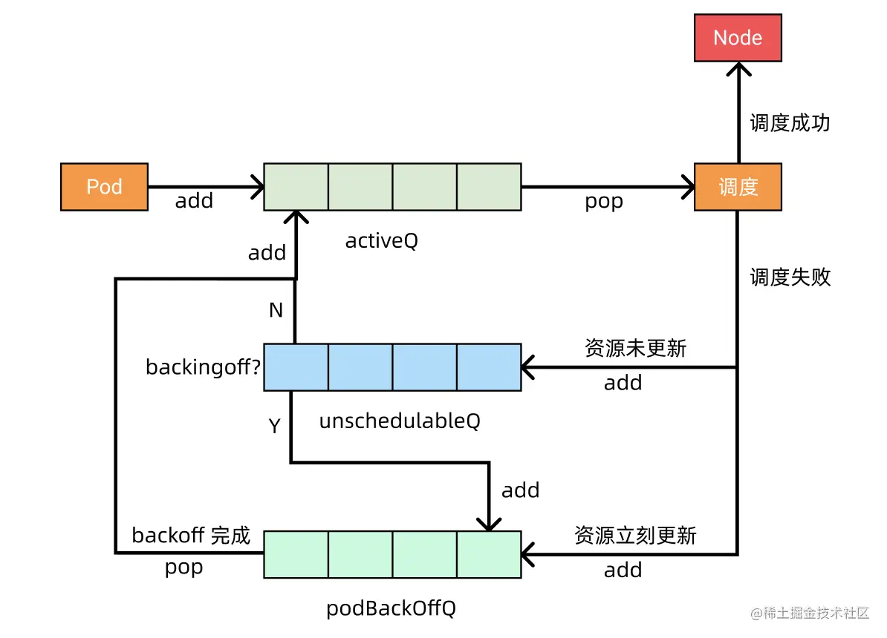
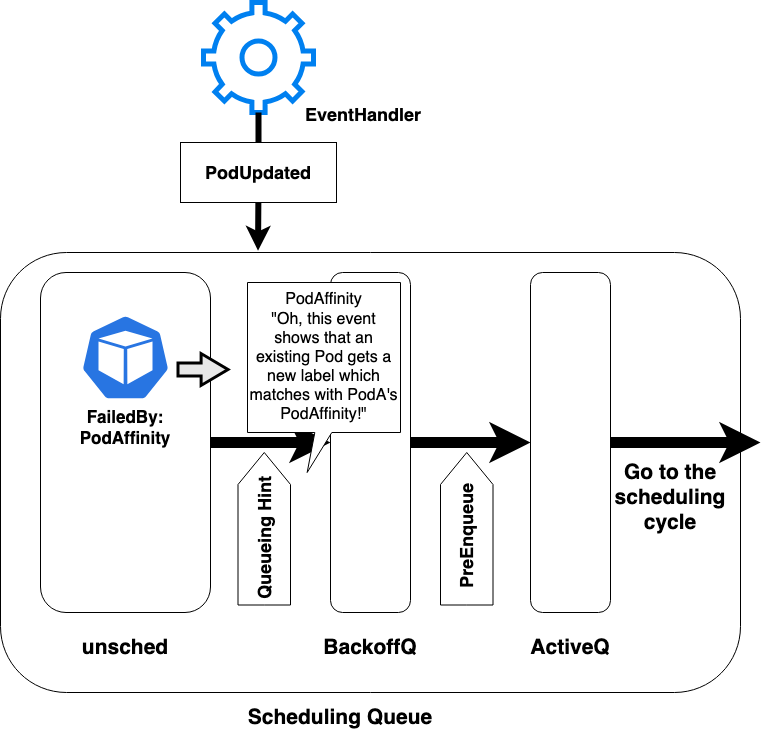

## 三个队列再回顾

ActiveQ（堆，按优先级排序）/ BackoffQ（堆，按 backoff 到期时间排序）/ UnschedulableQ（map，按调度失败原因记录）。

<h3>三队列职责</h3>
<table>
<tr><th>队列</th><th>数据结构</th><th>语义</th><th>出队条件</th></tr>
<tr><td>ActiveQ</td><td>堆（priority + timestamp）</td><td>等待立即调度的 Pod</td><td>scheduler 主循环 <code>Pop()</code></td></tr>
<tr><td>BackoffQ</td><td>堆（backoff 到期时间）</td><td>调度刚失败、还在退避中的 Pod</td><td>backoff 时间到 → 自动迁移到 ActiveQ</td></tr>
<tr><td>UnschedulableQ</td><td>map[uid]Pod</td><td>调度失败、需要事件唤醒的 Pod</td><td>QueueingHint 命中、定时刷盘（默认 5 分钟）</td></tr>
</table>

三个队列的关键是 UnschedulableQ：不被自动唤醒，必须靠"集群事件 + QueueingHint"主动捞回去。

## QueueingHint：从惊群到精确唤醒

<h3>没有 QueueingHint 时的"惊群"问题</h3>

K8s 1.28 之前的逻辑很粗糙：只要集群中发生了某种类型的事件（比如新 Node 加入、Pod 删除），scheduler 会把 UnschedulableQ 中**所有相关 Plugin 的 Pod** 一股脑搬回 ActiveQ。

<ul>
<li><strong>误唤醒：</strong>新加入一台 GPU=A100 的节点，原本因为「内存不足」失败的 Pod 也会被唤醒。</li>
<li><strong>反复扫描：</strong>这些 Pod 出队后会重新跑 PreFilter/Filter，绝大多数仍然失败、再回到 UnschedulableQ，浪费 CPU 和锁。</li>
<li><strong>调度延迟放大：</strong>5000 节点 + 10000 Pending Pod 的集群，惊群一次可能让 scheduler 卡 1-2 秒。</li>
</ul>

<h3>QueueingHint 的设计</h3>

QueueingHint 让每个 Plugin 通过实现 <code>EnqueueExtensions</code> 接口告诉 scheduler：

<ol>
<li><strong>我关心哪些事件类型：</strong>例如 NodeAffinity 关心 Node 增删和 Node Label 更新；NodeResourcesFit 关心 Node 增删和 Node 资源量更新；TaintToleration 关心 Node Taint 变化。</li>
<li><strong>事件发生时，能不能让这个 Pod 重新有机会：</strong>返回 <code>QueueingHint</code> 的三种值：</li>
</ol>
<table>
<tr><th>返回值</th><th>含义</th><th>scheduler 行为</th></tr>
<tr><td><code>Queue</code></td><td>这个事件可能让 Pod 重新可调度</td><td>把 Pod 从 UnschedulableQ 移到 BackoffQ（或 ActiveQ）</td></tr>
<tr><td><code>QueueSkip</code></td><td>这个事件和 Pod 失败原因无关</td><td>Pod 留在 UnschedulableQ</td></tr>
<tr><td><code>QueueAfterBackoff</code></td><td>移动，但要走 backoff（已废弃，1.32 后等价于 Queue）</td><td>同 Queue</td></tr>
</table>

事件 → Plugin.QueueingHintFn(pod, event) → 返回 Queue / QueueSkip → scheduler 决定是否搬移 Pod。

<h3>EnqueueExtensions 接口示例</h3>
<pre><code>// NodeAffinity 插件实现 EnqueueExtensions
func (pl *NodeAffinity) EventsToRegister(_ context.Context) ([]framework.ClusterEventWithHint, error) {
    return []framework.ClusterEventWithHint{
        {
            Event: framework.ClusterEvent{
                Resource: framework.Node,
                ActionType: framework.Add | framework.UpdateNodeLabel,
            },
            QueueingHintFn: pl.isSchedulableAfterNodeChange,
        },
    }, nil
}

// QueueingHint 函数：判断这次 Node 变化是否可能让 Pod 变可调度
func (pl *NodeAffinity) isSchedulableAfterNodeChange(
    logger klog.Logger,
    pod *v1.Pod,
    oldObj, newObj interface{},
) (framework.QueueingHint, error) {
    _, newNode, err := schedutil.As[*v1.Node](oldObj, newObj)
    if err != nil {
        return framework.Queue, err
    }
    // 只有当新节点的 label 满足 Pod 的 NodeAffinity 时才唤醒
    affinity, _ := nodeaffinity.NewLazyErrorNodeSelector(pod.Spec.Affinity.NodeAffinity)
    if affinity.Match(newNode) {
        return framework.Queue, nil
    }
    return framework.QueueSkip, nil
}</code></pre>

面试要点：QueueingHint 把"是否唤醒"的判断**下沉到具体 Plugin**，因为只有 Plugin 自己知道"我之前为什么失败、这次事件能不能让我成功"。

## Move Request：UnschedulableQ → ActiveQ 的触发链路

<h3>Move Request 来源</h3>

<strong>Move Request</strong>（也叫 cluster event）是 scheduler 内部抽象，统一表达"集群中发生了某种可能影响 Pending Pod 的变化"。下面是触发 Move Request 的全部来源：

<table>
<tr><th>事件来源</th><th>触发场景</th><th>Resource</th><th>ActionType</th></tr>
<tr><td>Node 增删</td><td>新节点加入 / 节点下线</td><td>Node</td><td>Add / Delete</td></tr>
<tr><td>Node 状态变化</td><td>Allocatable 变化、Taint 增删、Label 变更、Condition 变化</td><td>Node</td><td>UpdateNodeAllocatable / UpdateNodeTaint / UpdateNodeLabel / UpdateNodeCondition</td></tr>
<tr><td>Pod 删除</td><td>已运行 Pod 被删除（释放资源）</td><td>Pod</td><td>Delete</td></tr>
<tr><td>Pod 更新</td><td>Pod label 变化（影响 Pod Affinity）</td><td>Pod</td><td>UpdatePodLabel</td></tr>
<tr><td>PVC / StorageClass 增删</td><td>VolumeBinding 插件关心</td><td>PersistentVolumeClaim / StorageClass</td><td>Add / Update</td></tr>
<tr><td>CSINode / CSIDriver 变化</td><td>VolumeZone、NodeVolumeLimits 关心</td><td>CSINode / CSIDriver</td><td>Add / Update</td></tr>
<tr><td>Scheduler 自身周期事件</td><td>UnschedulableQ flush（默认 5 分钟）</td><td>—</td><td>定时器触发，无差别移动所有 Pod</td></tr>
</table>

<h3>Move Request 的处理流程</h3>
<ol>
<li><strong>事件接收：</strong>EventHandler 监听 informer，收到对象变化。</li>
<li><strong>构造 ClusterEvent：</strong>把 informer event 翻译成 <code>{Resource, ActionType}</code> 二元组。</li>
<li><strong>遍历 UnschedulableQ：</strong>对每个 Pending Pod，找到所有曾经失败的 Plugin。</li>
<li><strong>调用 QueueingHintFn：</strong>对每个 Plugin 调用其注册的 hint 函数，传入 oldObj / newObj。</li>
<li><strong>决策：</strong>只要有一个 Plugin 返回 <code>Queue</code>，就把 Pod 搬到 BackoffQ；全部返回 <code>QueueSkip</code> 则留在 UnschedulableQ。</li>
</ol>

关键 trick：Plugin 返回 <code>QueueSkip</code> 不代表 Pod 永远不再被尝试 —— 5 分钟的 flush 定时器仍然会兜底，避免 hint 函数有 bug 时 Pod 永远卡死。

Q: 1.28 之前 K8s 用什么机制把 Pod 从 UnschedulableQ 唤醒？为什么要换成 QueueingHint？

<strong>1.28 之前：</strong>每个 Plugin 通过 <code>EventsToRegister()</code> 注册关心的 ClusterEvent 类型，scheduler 一旦收到匹配类型的事件，就把 UnschedulableQ 里所有"失败 Plugin 包含这个 Plugin"的 Pod 一次性全搬走。

<strong>问题：</strong>事件粒度太粗。例如 NodeAffinity 注册了 <code>Node.UpdateLabel</code>，但任何一次 Node 标签变化都会唤醒所有因 NodeAffinity 失败的 Pod，而绝大多数 Pod 关心的标签和这次变化的标签根本不是同一个。

<strong>1.28 引入 QueueingHint：</strong>在原来的"事件类型匹配"基础上，加一层 Plugin 级别的精确判断函数，只有 Plugin 自己确认"这次事件可能让我成功"才搬移。

<strong>1.32 GA：</strong>默认开启，所有内置 Plugin 都已实现 hint 函数。

Q: 一个 Pod 因为 NodeResourcesFit + NodeAffinity 同时失败进了 UnschedulableQ。新加入了一个 Node，但 label 不满足这个 Pod 的 NodeAffinity。这个 Pod 会被唤醒吗？

<strong>会被唤醒。</strong>新 Node 加入触发 <code>Node.Add</code> 事件，scheduler 会对这个 Pod 涉及的所有失败 Plugin 调用 hint：

<ul>
<li><strong>NodeResourcesFit.hint:</strong> 新节点资源充足 → 返回 <code>Queue</code>。</li>
<li><strong>NodeAffinity.hint:</strong> 新节点 label 不匹配 → 返回 <code>QueueSkip</code>。</li>
</ul>

<strong>只要有一个 Plugin 返回 Queue，就搬移。</strong>原因是 scheduler 没法证明"NodeResourcesFit 满足但 NodeAffinity 不满足 = 一定调度不了"，必须重新跑一遍 Filter 才知道。这是设计上的"宁可错放，不可漏放"。

