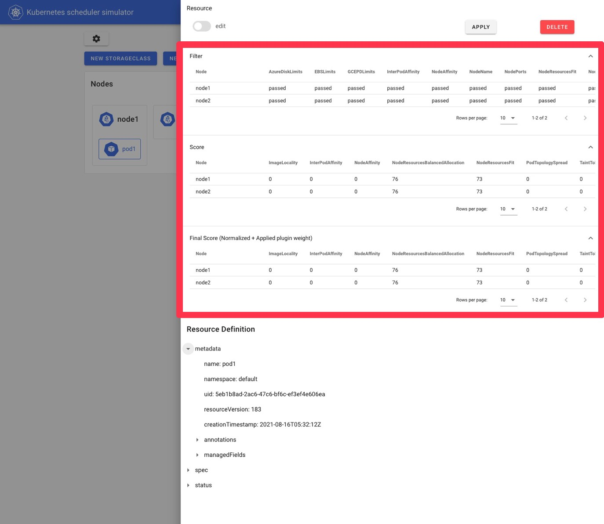
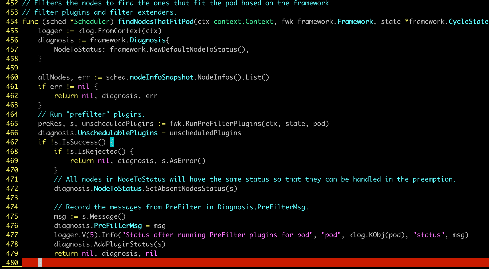

## 工具一：kube-scheduler-simulator

<h3>是什么、为什么需要</h3>

<strong>kube-scheduler-simulator</strong>（sig-scheduling 官方维护，<a href="https://github.com/kubernetes-sigs/kube-scheduler-simulator">github.com/kubernetes-sigs/kube-scheduler-simulator</a>）是一个本地 scheduler + Web UI，能在不动生产集群的前提下：

<ol>
<li><strong>导入快照：</strong>把生产集群的 Node / Pod / PVC / PriorityClass 等对象一键导入。</li>
<li><strong>重放调度：</strong>用同一份 KubeSchedulerConfiguration 跑一遍调度，看每个 Pod 在哪些 Plugin 失败、得分如何。</li>
<li><strong>Mock Plugin：</strong>支持注入 mock 插件，可以预设某个 Plugin 在某个节点上的返回值，用来构造极端场景。</li>
<li><strong>新插件验证：</strong>开发自定义 Plugin 时，先在 simulator 上跑通，再部署到 staging。</li>
</ol>

simulator 的 Web UI 可以可视化查看每个 Pod 在每个节点上各 Plugin 的得分和 Filter 通过情况。

<h3>典型使用流程</h3>
<pre><code># 1. 启动 simulator（容器化或 docker compose）
docker compose up -d

# 2. 从生产集群导出快照
kubectl get nodes,pods,pvc,sc,priorityclass -A -o yaml > snapshot.yaml

# 3. 通过 simulator UI 或 API 导入
curl -X POST http://localhost:1212/api/v1/import \
     -H "Content-Type: application/yaml" \
     --data-binary @snapshot.yaml

# 4. 创建一个测试 Pod，观察调度结果
# UI 会展示：哪些节点被 Filter 过滤，每个节点 Score 是多少
</code></pre>

面试可以加分的点：你做过什么调度问题排查 → "我用 kube-scheduler-simulator 把生产快照拉下来，本地复现了 Pending"。

## 工具二：Diagnosis / FitError 数据结构

<h3>findNodesThatFitPod 返回的诊断数据</h3>

当一个 Pod 调度失败，<code>findNodesThatFitPod()</code> 会返回 <code>framework.Diagnosis</code>，描述"为什么没找到合适节点"。这是 <code>kubectl describe pod</code> 里 FailedScheduling 事件背后的数据源。

scheduler 源码 <code>pkg/scheduler/schedule_one.go</code> 中 findNodesThatFitPod 返回 Diagnosis 的关键路径。

<h3>Diagnosis / FitError 字段拆解</h3>
<table>
<tr><th>字段</th><th>类型</th><th>含义</th></tr>
<tr><td><code>NodeToStatus</code></td><td><code>map[string]*Status</code></td><td>每个节点最终的失败状态（Unschedulable / UnschedulableAndUnresolvable / Error）和拦下它的 Plugin 名</td></tr>
<tr><td><code>UnschedulablePlugins</code></td><td><code>sets.Set[string]</code></td><td>本次调度中哪些 Plugin 至少在某个节点上返回了 Unschedulable —— 用于 QueueingHint 决定哪些 Plugin 关心后续事件</td></tr>
<tr><td><code>PendingPlugins</code></td><td><code>sets.Set[string]</code></td><td>返回 Pending 状态的 Plugin（暂时无法判断、等待外部信号）</td></tr>
<tr><td><code>PreFilterMsg</code></td><td><code>string</code></td><td>PreFilter 阶段直接拒绝时的消息（terminates the entire cycle）</td></tr>
<tr><td><code>PostFilterMsg</code></td><td><code>string</code></td><td>PostFilter（抢占）阶段的诊断消息</td></tr>
</table>

<h3>看一个真实的 FailedScheduling 事件</h3>
<pre><code>$ kubectl describe pod my-gpu-pod
Events:
  Type     Reason            Age   From               Message
  ----     ------            ----  ----               -------
  Warning  FailedScheduling  10s   default-scheduler  0/100 nodes are available:
    3 node(s) had untolerated taint {node.kubernetes.io/not-ready: },
    5 node(s) didn't match Pod's node affinity/selector,
    90 Insufficient nvidia.com/gpu,
    2 node(s) didn't match pod anti-affinity rules.
  preemption: 0/100 nodes are available:
    3 Preemption is not helpful for scheduling,
    97 No preemption victims found for incoming pod.</code></pre>

这条消息直接来自 <code>NodeToStatus</code> 的聚合 + <code>PostFilterMsg</code>。每一行就是一个 Plugin 在多少个节点上返回 Unschedulable。

面试拆解技巧：看到 FailedScheduling 先**按 Plugin 分类**：资源类（NodeResourcesFit）/ 节点选择类（NodeAffinity / NodeSelector）/ 隔离类（TaintToleration）/ 拓扑类（PodAffinity / PodTopologySpread）/ 设备类（VolumeBinding）。每类对应一组排查动作。

## 工具三：Prometheus Metrics 与 SLO

<h3>scheduler 核心 metrics 全景</h3>
<table>
<tr><th>Metric</th><th>类型</th><th>含义</th><th>SLO 参考阈值</th></tr>
<tr><td><code>scheduler_pending_pods</code></td><td>Gauge（按 queue 分类）</td><td>当前在 ActiveQ / BackoffQ / UnschedulableQ 的 Pod 数</td><td>UnschedulableQ &lt; 100；持续增长说明有"集体 Pending"</td></tr>
<tr><td><code>scheduler_scheduling_duration_seconds</code></td><td>Histogram（按结果分类）</td><td>单个 Pod 调度周期耗时（含 Filter+Score+Bind）</td><td>P99 &lt; 100ms；P99 &gt; 1s 通常是 plugin 性能问题</td></tr>
<tr><td><code>scheduler_schedule_attempts_total</code></td><td>Counter（result=scheduled/unschedulable/error）</td><td>调度尝试次数</td><td>unschedulable / total &lt; 1%</td></tr>
<tr><td><code>scheduler_preemption_attempts_total</code></td><td>Counter</td><td>抢占尝试次数</td><td>持续增长说明高优 Pod 资源不足</td></tr>
<tr><td><code>scheduler_pod_scheduling_attempts</code></td><td>Histogram</td><td>一个 Pod 从入队到最终调度成功经历了多少次尝试</td><td>P99 &lt; 5；说明 backoff/重试不健康</td></tr>
<tr><td><code>scheduler_plugin_execution_duration_seconds</code></td><td>Histogram（按 plugin / extension_point 分类）</td><td>每个 Plugin 在每个扩展点的耗时</td><td>单个 Plugin P99 &lt; 10ms</td></tr>
<tr><td><code>scheduler_queue_incoming_pods_total</code></td><td>Counter（按 event 分类）</td><td>各种事件触发了多少次 Pod 入队</td><td>用来定位"哪个事件源在制造惊群"</td></tr>
<tr><td><code>scheduler_unschedulable_pods</code></td><td>Gauge（按 plugin 分类）</td><td>当前因哪个 Plugin 失败而 Pending 的 Pod 数</td><td>定位"是不是某个 Plugin 配置错"</td></tr>
<tr><td><code>scheduler_pod_scheduling_duration_seconds</code></td><td>Histogram</td><td>Pod 创建 → 成功调度的端到端时间（含队列等待）</td><td>P99 &lt; 30s（一般业务）；GPU 大任务可能需要数分钟</td></tr>
</table>

<h3>核心 PromQL 查询示例</h3>
<pre><code># 1. 调度成功率（5 分钟窗口）
sum(rate(scheduler_schedule_attempts_total{result="scheduled"}[5m]))
/ sum(rate(scheduler_schedule_attempts_total[5m]))

# 2. P99 调度延迟
histogram_quantile(0.99,
  sum(rate(scheduler_scheduling_duration_seconds_bucket[5m])) by (le))

# 3. 找出"卡得最久"的 Plugin
topk(5,
  histogram_quantile(0.99,
    sum(rate(scheduler_plugin_execution_duration_seconds_bucket[5m])) by (le, plugin)))

# 4. UnschedulableQ 增长趋势
sum(scheduler_pending_pods{queue="unschedulable"})

# 5. 哪个 Plugin 拦下了最多 Pod
topk(5, sum(scheduler_unschedulable_pods) by (plugin))</code></pre>

## 三件套联动：一次 Pod Pending 排查路径

<h3>排查 SOP</h3>
<ol>
<li><strong>第一步：单 Pod 现场。</strong> <code>kubectl describe pod &lt;name&gt;</code> 看 FailedScheduling 事件，按 Plugin 分类拆解。</li>
<li><strong>第二步：确认共性。</strong> 看 <code>scheduler_unschedulable_pods{plugin=...}</code>，判断是单个 Pod 配置问题还是多个 Pod 同时被某 Plugin 拦下。</li>
<li><strong>第三步：本地复现。</strong> 如果是共性问题，用 simulator 拉快照本地重放，验证假设。</li>
<li><strong>第四步：长期趋势。</strong> 看 <code>scheduler_scheduling_duration_seconds</code> P99 + <code>scheduler_plugin_execution_duration_seconds</code>，确认是不是新部署的 Plugin 引入的性能回退。</li>
<li><strong>第五步：修正反馈。</strong> 修配置 / 加节点 / 调 Plugin 顺序，再用 simulator 验证一次。</li>
</ol>

面试加分项：能给出具体的 metric 名和阈值，比"我会看监控"具体得多。

Q: scheduler_pending_pods 持续增长，应该怎么排查？

<strong>1. 先按 queue label 拆：</strong>

<ul>
<li><code>queue="active"</code> 增长 → scheduler 处理速度跟不上入队速度，看调度延迟和 plugin 性能。</li>
<li><code>queue="backoff"</code> 增长 → 大量 Pod 调度失败正在 backoff，看 schedule_attempts_total{result="unschedulable"}。</li>
<li><code>queue="unschedulable"</code> 增长 → 集群资源真的不够，或 QueueingHint 没正确唤醒，看 unschedulable_pods 按 plugin 分布。</li>
</ul>

<strong>2. 配合 plugin 维度：</strong> <code>topk(5, sum(scheduler_unschedulable_pods) by (plugin))</code> 直接定位"哪个 Plugin 在拦人"。

<strong>3. 看入队源：</strong> <code>scheduler_queue_incoming_pods_total</code> 看是不是某个事件源（NodeAdded / PodDeleted）在制造惊群。

Q: P99 调度延迟从 50ms 突然涨到 800ms，怎么定位？

<strong>第一招：按扩展点拆。</strong> <code>scheduler_plugin_execution_duration_seconds</code> 带 <code>extension_point</code> label，分别看 Filter / Score / PreFilter 的 P99，看延迟卡在哪个阶段。

<strong>第二招：按 plugin 拆。</strong> 同一个 metric 带 <code>plugin</code> label，topk 找出最慢的 Plugin。常见嫌疑：自定义插件没有缓存、PodAffinity 在大集群上 O(n²) 扫描、外部 Extender HTTP 调用超时。

<strong>第三招：和事件相关性。</strong> 看延迟跳升时间点和发布、节点变更、流量峰值是否对应。

