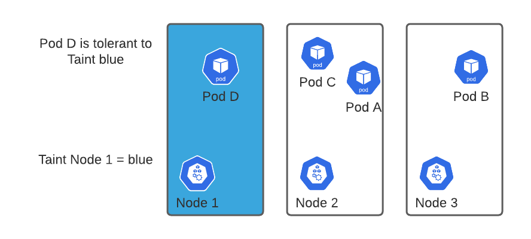
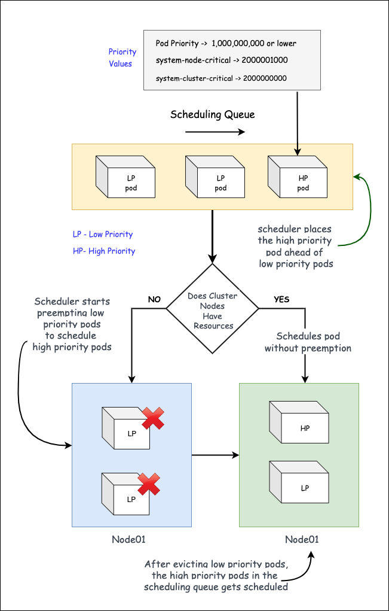

## 一句话结论

kube-scheduler 的设计理念是**可扩展性 + 效率优先 + 声明式 API + 公平性 + HA + 用户可配置性**六维平衡；NodeAffinity / TaintToleration / NodeResourcesFit 这些经典插件都是这套设计哲学的具体落地；Extender 是上一代的扩展方式，主要用 HTTP 通信。

## 复习定位

| 维度 | 内容 |
|---|---|
| 所属模块 | Kubernetes 核心 / Scheduler 内部机制 |
| 章节类型 | 设计类 + 系统类 |
| 解决问题 | 面试被问"K8s scheduler 设计的核心理念是什么"能答出六维矩阵；理解经典插件如何把设计哲学落地；知道 Extender 和 Plugin 的边界 |
| 面试抓手 | **任何一个 Plugin 都可以放到「六维矩阵」里去解释它存在的理由**。 |

## K8s 整体架构定位

scheduler 是控制面组件之一。它通过 API Server 获取未调度 Pod 和 Node 状态，决策结果通过 Bind API 写回 API Server。

## 设计理念六维矩阵

<h3>六维设计目标</h3>
<table>
<tr><th>维度</th><th>含义</th><th>对应机制</th><th>典型权衡</th></tr>
<tr><td>可扩展性</td><td>支持业务定制调度逻辑，而不是改 scheduler 源码</td><td>Scheduling Framework Plugin、Extender、Multiple Scheduler、DRA</td><td>性能（in-tree）vs 灵活性（out-of-tree HTTP）</td></tr>
<tr><td>效率优先</td><td>大集群下保证调度延迟可控</td><td>percentageOfNodesToScore、Filter 并行、Snapshot、Cache</td><td>调度质量 vs 调度速度</td></tr>
<tr><td>声明式 API</td><td>用户描述"想要什么"，不是"怎么做"</td><td>Pod.spec.affinity / tolerations / topologySpreadConstraints</td><td>表达力 vs 复杂度</td></tr>
<tr><td>公平性</td><td>避免大作业饿死小作业、避免单租户耗尽资源</td><td>QueueSort、PriorityClass、Preemption、ResourceQuota、Kueue</td><td>公平 vs 吞吐</td></tr>
<tr><td>高可用（HA）</td><td>scheduler 自身故障不影响新 Pod 调度</td><td>Leader Election、多副本、--leader-elect-resource-name</td><td>故障切换时间 vs 一致性</td></tr>
<tr><td>用户可配置性</td><td>不同业务用不同调度策略</td><td>KubeSchedulerConfiguration、多 Profile、pluginConfig</td><td>配置灵活 vs 运维复杂度</td></tr>
</table>

面试用法：被问"K8s scheduler 的设计哲学是什么"先报六维，再用具体 Plugin 举例。

## 经典插件一：NodeAffinity（Required vs Preferred）

<h3>Node Affinity / Anti-Affinity 与 Pod Affinity / Anti-Affinity</h3>

这里有三组概念容易混：<strong>Node Affinity、Node Anti-Affinity、Pod Affinity / Pod Anti-Affinity</strong>。一句话区分：

<strong>Node Affinity / Anti-Affinity：Pod 和节点之间的关系。Pod Affinity / Anti-Affinity：Pod 和 Pod 之间的关系。</strong>

<h3>Node Affinity：Pod 对节点有偏好</h3>

Node Affinity 解决的是：<strong>这个 Pod 应该去什么样的机器上？</strong>它是比 nodeSelector 更强大的节点选择机制，支持软约束（preferred）和硬约束（required），以及基于节点标签的复杂表达式。

<table>
<tr><th>类型</th><th>行为</th><th>典型场景</th></tr>
<tr><td>requiredDuringSchedulingIgnoredDuringExecution</td><td>硬约束，Pod 必须调度到满足条件的节点，否则 Pending</td><td>必须是 A100 节点、必须在北京机房</td></tr>
<tr><td>preferredDuringSchedulingIgnoredDuringExecution</td><td>软约束，优先调度到满足条件的节点，但不强制</td><td>最好在 SSD 节点、最好在北京机房（但上海也可以）</td></tr>
</table>

IgnoredDuringExecution 的含义

调度时会检查这个规则；Pod 已经运行后，如果节点标签变化了，Kubernetes 默认不会因为这个规则再把 Pod 驱逐掉。这是设计选择：避免运行时驱逐造成服务中断。如果需要运行时驱逐，用 Taint 的 NoExecute 效果。

Node Anti-Affinity

Kubernetes 里严格说没有一个和 <code>nodeAffinity</code> 同级的字段叫 <code>nodeAntiAffinity</code>，但可以通过 <code>nodeAffinity</code> 里的 <code>NotIn</code>、<code>DoesNotExist</code> 等表达"不要去某些节点"。例如：不要调度到 V100 节点、不要调度到 spot 节点。

<h3>NodeAffinity 在两个扩展点上的不同行为</h3>

NodeAffinity 同时挂在 <strong>Filter</strong>（处理 Required）和 <strong>Score</strong>（处理 Preferred）两个扩展点上。这是"硬约束 vs 软偏好"在调度框架里的标准落地方式。

<table>
<tr><th>类型</th><th>字段</th><th>挂在哪个扩展点</th><th>不满足时的行为</th></tr>
<tr><td>Required</td><td><code>requiredDuringSchedulingIgnoredDuringExecution</code></td><td>PreFilter + Filter</td><td>节点直接被过滤掉，Pod Pending</td></tr>
<tr><td>Preferred</td><td><code>preferredDuringSchedulingIgnoredDuringExecution</code></td><td>PreScore + Score</td><td>节点得分降低，但仍可能被选中</td></tr>
</table>

<h3>Required 在 Filter 阶段的判断逻辑</h3>
<pre><code>// 简化版，pkg/scheduler/framework/plugins/nodeaffinity/node_affinity.go
func (pl *NodeAffinity) Filter(ctx context.Context, state *framework.CycleState,
    pod *v1.Pod, nodeInfo *framework.NodeInfo) *framework.Status {

    node := nodeInfo.Node()
    affinity := pod.Spec.Affinity

    // 没有 Required 约束 → 直接通过
    if affinity == nil || affinity.NodeAffinity == nil ||
       affinity.NodeAffinity.RequiredDuringSchedulingIgnoredDuringExecution == nil {
        return nil
    }

    // 把 Required 转成 NodeSelector，对 Node 求值
    selector, err := nodeaffinity.NewNodeSelector(
        affinity.NodeAffinity.RequiredDuringSchedulingIgnoredDuringExecution)
    if err != nil {
        return framework.NewStatus(framework.Error, err.Error())
    }
    if !selector.Match(node) {
        return framework.NewStatus(framework.UnschedulableAndUnresolvable,
            "node(s) didn't match Pod's node affinity/selector")
    }
    return nil
}</code></pre>

<h3>Preferred 在 Score 阶段的打分公式</h3>

Preferred 项每条带 <code>weight</code>（1-100）。一个节点的 NodeAffinity 得分等于它**满足的 preferredTerm 的 weight 之和**，再归一化到 0-100。

$$\text{NodeAffinityScore}(n) = \sum_{t \in \text{preferred terms}} w_t \cdot \mathbb{1}[\text{node } n \text{ matches term } t]$$

归一化（在 NormalizeScore 阶段）：

$$\text{Score}_{norm}(n) = \frac{\text{NodeAffinityScore}(n)}{\max_n \text{NodeAffinityScore}(n)} \cdot \text{MaxNodeScore}$$

其中 <code>MaxNodeScore = 100</code>。

<h3>Pod Affinity / Anti-Affinity：Pod 之间的关系</h3>

Pod Affinity 解决的是：<strong>这个 Pod 希望和哪些已有 Pod 放近一点？</strong>判断对象不是节点标签，而是<strong>已有 Pod 的标签</strong>。Pod Anti-Affinity 则相反：不希望和某些 Pod 放得太近。

<table>
<tr><th>类型</th><th>判断对象</th><th>典型场景</th></tr>
<tr><td>Pod Affinity</td><td>已有 Pod 的标签</td><td>训练任务靠近数据缓存 Pod（降低延迟）；Worker 靠近 Parameter Server</td></tr>
<tr><td>Pod Anti-Affinity</td><td>已有 Pod 的标签</td><td>同服务副本不要在同一节点（高可用）；两个大 GPU 任务不要在同一台机器（避免资源竞争）</td></tr>
</table>

topologyKey 是什么？

Pod Affinity / Anti-Affinity 中 <code>topologyKey</code> 表示"靠近"或"远离"是按什么范围来定义的：<code>kubernetes.io/hostname</code> 表示同一节点，<code>topology.kubernetes.io/zone</code> 表示同一可用区，<code>rack</code> 表示同一机架。

性能影响

Pod Affinity/Anti-Affinity 需要在调度时扫描大量 Pod，大规模集群中可能显著增加调度延迟。建议限制 <code>topologyKey</code> 的粒度，避免在超大集群中使用跨节点的 Pod Anti-Affinity。

<h3>Node Affinity 和 Pod Affinity 的区别（面试核心）</h3>
<table>
<tr><th>类型</th><th>判断对象</th><th>例子</th></tr>
<tr><td>Node Affinity</td><td>节点的标签</td><td>我要去 A100 节点</td></tr>
<tr><td>Node Anti-Affinity</td><td>节点的标签</td><td>我不要去 spot 节点</td></tr>
<tr><td>Pod Affinity</td><td>已有 Pod 的标签</td><td>我要靠近 redis Pod</td></tr>
<tr><td>Pod Anti-Affinity</td><td>已有 Pod 的标签</td><td>我不要和同服务副本在同一节点</td></tr>
</table>

一句话：<strong>Node Affinity 看节点标签，Pod Affinity 看已有 Pod 标签。</strong>硬约束（required）主要在 Filter 阶段起作用，不满足就直接过滤掉节点；软偏好（preferred）主要在 Score 阶段起作用，满足偏好的节点得分更高。

## 经典插件二：TaintToleration（三种 Effect 的语义差异）

Taint 打在节点上、Toleration 写在 Pod 上。Pod 必须容忍节点的所有 Taint 才能调度。

<h3>三种 Effect 的语义、扩展点和触发对象</h3>
<table>
<tr><th>Effect</th><th>语义</th><th>挂在哪个扩展点</th><th>对正在运行的 Pod 的影响</th><th>典型场景</th></tr>
<tr><td><code>NoSchedule</code></td><td>新 Pod 不容忍则不能调度到此节点</td><td>Filter</td><td>不影响（已运行的 Pod 留在节点上）</td><td>GPU 节点专用、节点池隔离</td></tr>
<tr><td><code>PreferNoSchedule</code></td><td>新 Pod 不容忍则尽量不调度，但不强制</td><td>Score（不是 Filter）</td><td>不影响</td><td>软隔离，例如"成本高的 spot 节点尽量后用"</td></tr>
<tr><td><code>NoExecute</code></td><td>新 Pod 不容忍则不能调度；运行中的 Pod 不容忍则被驱逐</td><td>Filter + 由 controller-manager 中的 TaintEvictionController 执行驱逐</td><td>**会驱逐**（可通过 <code>tolerationSeconds</code> 延迟）</td><td>节点不健康、维护前抢占清场</td></tr>
</table>

关键区分：NoSchedule 在 Filter，PreferNoSchedule 在 Score —— 所以 PreferNoSchedule 不会让节点出现在 FailedScheduling 事件里。NoExecute 是唯一一个**事后驱逐**的 effect。

<h3>容忍判断逻辑</h3>

Toleration 通过 <code>operator</code> 决定匹配方式：

<ul>
<li><code>Equal</code>（默认）：要求 key、value、effect 都相等。</li>
<li><code>Exists</code>：只要 key 存在即可（value 字段必须为空），常用于"容忍所有 NoSchedule"。</li>
</ul>

<strong>"通配容忍"模式：</strong>

<pre><code># 容忍任意 NoSchedule taint
- operator: Exists
  effect: NoSchedule

# 容忍所有 effect 的所有 taint（很危险，仅 system pod 使用）
- operator: Exists</code></pre>

## 经典插件三：NodeResourcesFit（Filter + 三种打分策略）

<h3>Filter 阶段：装得下吗</h3>

NodeResourcesFit 在 Filter 阶段判断节点可用资源是否能装下 Pod 的 requests。逻辑很直接：对每个资源类型（CPU、Memory、扩展资源），检查 <code>node.Allocatable - sum(running pods.requests) ≥ pod.requests</code>。

<h3>Score 阶段：三种打分策略</h3>

NodeResourcesFit 在 Score 阶段支持三种策略，通过 <code>scoringStrategy.type</code> 配置。下面给出每种策略的打分公式。

<h4>1. LeastAllocated（默认）：剩余资源越多分越高</h4>

$$\text{Score}_{Least}(n) = \frac{\sum_i (\text{Allocatable}_i - \text{Requested}_i) \cdot w_i / \text{Allocatable}_i}{\sum_i w_i} \cdot \text{MaxNodeScore}$$

其中：

<ul>
<li>$i$ 遍历每种资源（CPU、Memory、扩展资源等）</li>
<li>$w_i$ 是该资源的权重（在 <code>resources</code> 中配置）</li>
<li>$\text{MaxNodeScore} = 100$</li>
</ul>

<strong>语义：</strong>把负载分散到资源最空闲的节点，适合通用场景。

<h4>2. MostAllocated：剩余资源越少分越高（装箱）</h4>

$$\text{Score}_{Most}(n) = \frac{\sum_i \text{Requested}_i \cdot w_i / \text{Allocatable}_i}{\sum_i w_i} \cdot \text{MaxNodeScore}$$

<strong>语义：</strong>把 Pod 集中到已经"快装满"的节点，腾出空节点用于大任务。适合 GPU 训练等需要整机资源的场景，避免碎片化。

<h4>3. RequestedToCapacityRatio：曲线打分</h4>

支持自定义"利用率 → 分数"的折线映射：

$$\text{Score}_{RTC}(n) = \frac{\sum_i \text{piecewise}(\text{Requested}_i / \text{Allocatable}_i) \cdot w_i}{\sum_i w_i}$$

其中 <code>piecewise</code> 由用户配置的 <code>shape: [{utilization, score}, ...]</code> 折线决定。例如：

<pre><code>scoringStrategy:
  type: RequestedToCapacityRatio
  resources:
    - name: nvidia.com/gpu
      weight: 5
  requestedToCapacityRatio:
    shape:
      - utilization: 0
        score: 0
      - utilization: 100
        score: 10</code></pre>

<strong>语义：</strong>表达"装到 80% 最优、再装会降速"这类非线性偏好。常用于"同时考虑装箱和性能拐点"的场景。

<h3>三种策略的选型</h3>
<table>
<tr><th>策略</th><th>典型场景</th><th>风险</th></tr>
<tr><td>LeastAllocated</td><td>通用业务、CPU/Memory 资源均匀打散</td><td>大 GPU 任务可能找不到整机资源</td></tr>
<tr><td>MostAllocated</td><td>GPU 训练集群、希望先装满旧节点再用新节点</td><td>单节点故障影响多个 Pod</td></tr>
<tr><td>RequestedToCapacityRatio</td><td>有明确性能拐点的场景，例如 GPU 利用率 ≥ 80% 后性能下降</td><td>配置复杂，需要持续 tune shape 曲线</td></tr>
</table>

## Scheduler Extender（HTTP 扩展）

<h3>Extender 是什么、和 Plugin 的关系</h3>

<strong>Extender</strong> 是 K8s 早期的扩展机制，核心是一个独立 HTTP 服务，scheduler 在 Filter / Prioritize / Bind 等阶段通过 HTTP 调用它。

<table>
<tr><th>维度</th><th>Extender</th><th>Scheduling Framework Plugin</th></tr>
<tr><td>部署形态</td><td>独立 HTTP 服务</td><td>编译进 scheduler 二进制</td></tr>
<tr><td>调用开销</td><td>HTTP 网络调用（ms 级）</td><td>函数调用（μs 级）</td></tr>
<tr><td>访问 scheduler cache</td><td>不能</td><td>可以</td></tr>
<tr><td>支持的扩展点</td><td>Filter、Prioritize、Preempt、Bind</td><td>全部 12 个扩展点</td></tr>
<tr><td>语言</td><td>任意（HTTP 服务）</td><td>仅 Go</td></tr>
<tr><td>定位</td><td>历史兼容、跨语言简单扩展</td><td>新功能首选</td></tr>
</table>

<h3>Extender 的 HTTP 通信路径</h3>
<pre><code>scheduler 主流程（schedulingCycle）
   |
   |--- Filter 阶段（in-tree filters 跑完）
   |      |
   |      v
   |   POST {extenderURL}/filter
   |      Body: {Pod, Nodes, NodeNameToInfo}
   |      Response: {Nodes, FailedNodes, Error}
   |
   |--- Score 阶段（in-tree scores 跑完）
   |      |
   |      v
   |   POST {extenderURL}/prioritize
   |      Body: {Pod, Nodes}
   |      Response: [{Host, Score}, ...]
   |
   |--- Bind 阶段（如果 extender 配置了 bindVerb）
   |      |
   |      v
   |   POST {extenderURL}/bind
   |      Body: {PodName, PodNamespace, PodUID, Node}
   |      Response: {Error}</code></pre>

<h3>KubeSchedulerConfiguration 中配置 Extender</h3>
<pre><code>apiVersion: kubescheduler.config.k8s.io/v1
kind: KubeSchedulerConfiguration
extenders:
  - urlPrefix: "http://gpu-extender.kube-system.svc:8080"
    filterVerb: "filter"
    prioritizeVerb: "prioritize"
    weight: 5
    enableHTTPS: false
    nodeCacheCapable: true     # extender 自己缓存 NodeInfo，scheduler 只传 NodeName
    managedResources:           # 只对包含这些资源的 Pod 调用 extender
      - name: "example.com/foo"
        ignoredByScheduler: true
    httpTimeout: 1s             # 超时强制返回，避免阻塞 schedulingCycle
    ignorable: false            # extender 故障时是否允许调度继续</code></pre>

面试要点：Extender 现在主要见于历史遗留系统。新需求一律推荐 Framework Plugin。如果一定要用 Extender，关键参数是 <code>httpTimeout</code> 和 <code>ignorable</code>，否则 Extender 故障会拖死整个 scheduler。

## 抢占（Preemption）的设计哲学

高优 Pod 调度失败 → PostFilter 触发抢占 → 找出最小代价的 victim 集合 → 标记 nominatedNodeName → 等待 victim 优雅退出 → 重新调度。

<h3>抢占体现的设计哲学</h3>
<ul>
<li><strong>声明式：</strong>用户通过 <code>PriorityClass</code> 表达"重要程度"，不需要写抢占代码。</li>
<li><strong>公平性：</strong>抢占只能"高优抢低优"，避免同优先级互抢；PDB 限制驱逐范围。</li>
<li><strong>异步退出：</strong>设置 <code>nominatedNodeName</code> 后等待 victim graceful shutdown，而不是立刻杀掉，保证服务连续性。</li>
<li><strong>可扩展性：</strong>抢占决策在 <code>PostFilter</code> 扩展点，自定义 Plugin 可以替换默认抢占逻辑（例如考虑 GPU checkpoint 新鲜度）。</li>
</ul>

## 面试回答

**30 秒版：**

K8s scheduler 设计哲学是六维平衡：可扩展性（Plugin/Extender/DRA）、效率优先（percentageOfNodesToScore、Filter 并行）、声明式（affinity/tolerations）、公平性（PriorityClass/Preemption）、HA（Leader Election）、用户可配置（多 Profile）。NodeAffinity 把 Required/Preferred 分别落到 Filter/Score；TaintToleration 三种 Effect 中只有 NoExecute 会驱逐运行中的 Pod；NodeResourcesFit 提供 LeastAllocated/MostAllocated/RequestedToCapacityRatio 三种打分公式。Extender 是上一代 HTTP 扩展，新功能一律走 Framework Plugin。

**2 分钟版：**

我会先讲六维设计矩阵，再用三个经典插件落地：NodeAffinity 的 Required 在 PreFilter+Filter，Preferred 在 PreScore+Score，打分公式是按 weight 求和后归一化。TaintToleration 三 effect：NoSchedule 在 Filter 阻新 Pod；PreferNoSchedule 在 Score 降权重；NoExecute 在 Filter 阻新 Pod 之外，由 controller-manager 的 TaintEvictionController 驱逐运行中 Pod，可通过 tolerationSeconds 延迟。NodeResourcesFit 的 Score 阶段三种策略，公式形式都是各资源利用率的加权平均，差异在"剩余越多分越高"还是"已用越多分越高"还是"按曲线打分"，分别对应通用、装箱、性能拐点场景。Extender 通过 HTTP 通信，Filter/Prioritize/Bind 三个 verb，毫秒级延迟，新功能一律推荐 Framework Plugin，Extender 配置必须设 httpTimeout 和 ignorable 否则会拖死调度。

## 关联模块

- `Scheduler 内部机制 · 调度路径与队列`（09a）：六维矩阵中"效率优先"的具体落地。
- `Cache、扩展点与抢占`（09b）：抢占的扩展点位置（PostFilter）。
- `自定义 Plugin 实战`（09d）：Plugin 接口与 Extender 的对比。
- `扩展点设计差异`（09e）：PreFilter/Filter/PreScore/Score 的设计哲学。
