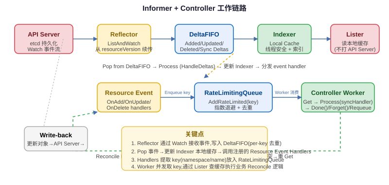

<h3>Informer 完整链路图</h3>

Informer 数据流：API Server → Reflector（ListAndWatch）→ DeltaFIFO（事件队列）→ Indexer/LocalStore（本地缓存）→ ResourceEventHandler → WorkQueue → Controller worker 池 → syncHandler。

## Reflector：ListAndWatch 数据源

<h3>Reflector 职责</h3>

Reflector 是 Informer 和 API Server 之间的数据同步器，核心逻辑是 <strong>List + Watch</strong> 循环：

<ol>
<li><strong>首次 List（全量同步）：</strong>启动时先调用 List API 获取该资源类型的全量对象列表（支持分页），得到最新的 resourceVersion，将所有对象替换到 DeltaFIFO 中（Sync 类型 delta）。</li>
<li><strong>持续 Watch（增量监听）：</strong>从 List 返回的 resourceVersion 开始调用 Watch API，接收 ADD/UPDATE/DELETE 事件，每个事件作为一个 Delta 推入 DeltaFIFO。</li>
<li><strong>断线重连：</strong>Watch 连接断开（网络错误、服务端超时）后，用最后一次收到的 resourceVersion 重新 Watch。如果 resourceVersion 太旧已被 etcd compact（"too old resource version"），则重新执行 List 全量同步。</li>
<li><strong>定期 Resync：</strong>按 <code>resyncPeriod</code> 周期将 Indexer 中的所有对象重新放入 DeltaFIFO（Sync delta），触发 ResourceEventHandler 的 OnUpdate 回调，让 Controller 有机会重新 reconcile 即使没有发生实际变化。</li>
</ol>
<pre><code class="language-go">// Reflector 主循环（简化）
func (r *Reflector) ListAndWatch(stopCh &lt;-chan struct{}) error {
    // 1. List：全量同步
    list, err := r.listerWatcher.List(options)
    if err != nil { return err }
    listMeta, _ := meta.ListAccessor(list)
    resourceVersion = listMeta.GetResourceVersion()
    r.replace(takeItems(list), resourceVersion) // Sync delta 入队

    // 2. Watch：持续增量
    for {
        w, err := r.listerWatcher.Watch(options)
        if err != nil { return err }
        r.watchHandler(w, &resourceVersion, resyncerrc, stopCh)
        // 3. 重连逻辑：如果是 "too old resource version" 错误，重新 List
    }
}
</code></pre>

<h3>List 和 Watch 的版本语义</h3>
<ul>
<li><code>resourceVersion=""</code>：从 etcd 最新版本读（quorum read），用于首次 List。</li>
<li><code>resourceVersion="0"</code>：从 API Server 缓存读（任意版本，可能稍有延迟），性能更好但不保证最新。</li>
<li><code>resourceVersion="&lt;specific&gt;"</code>：从指定版本开始 watch，断线重连用这个。</li>
<li>Watch 响应中每个事件都带有对象的 resourceVersion，Reflector 持续更新 lastSyncResourceVersion。</li>
</ul>

## DeltaFIFO：事件队列

<h3>DeltaFIFO 结构</h3>

DeltaFIFO 是一个生产-消费队列，存储的不是对象本身，而是 <strong>Delta</strong>（对象 + 变更类型）：

<pre><code>type Delta struct {
    Type   DeltaType  // Added / Updated / Deleted / Sync
    Object interface{}
}

// DeltaFIFO 的 key 是对象的 namespace/name
// 每个 key 对应一个 []Delta（按时间有序）
type DeltaFIFO struct {
    items map[string][]Deltas  // key → delta 列表
    queue []string             // FIFO 队列的 key 顺序
    // ... lock, cond, knownObjects (Indexer)
}
</code></pre>
<table>
<tr><th>DeltaType</th><th>触发时机</th></tr>
<tr><td>Added</td><td>首次 List 到新对象、Watch 到新创建的对象</td></tr>
<tr><td>Updated</td><td>Watch 到对象更新事件</td></tr>
<tr><td>Deleted</td><td>Watch 到对象删除事件</td></tr>
<tr><td>Sync</td><td>首次 List 的全量替换、周期性 Resync</td></tr>
</table>

<h3>DeltaFIFO 的关键设计</h3>
<ol>
<li><strong>Per-key 去重（dedup）：</strong>队列里每个 key 只出现一次。如果队列中已有 key "ns/pod-a"，再次收到该 key 的事件时，不是追加到队列尾部，而是把新的 Delta append 到该 key 的 Deltas 列表尾部。消费者 Pop 时一次性拿到该 key 的所有未处理 Delta。</li>
<li><strong>删除事件的 tombstone 处理：</strong>对象被删除后，本地缓存（Indexer）已删除该对象，但 DeltaFIFO 需要保留最后一个已知状态（DeletedFinalStateUnknown），因为 Controller 需要知道哪个对象被删了。如果 Watch 到 DELETE 事件时对象还在队列中（可能有 Added/Updated 未处理），会用最后一个状态作为 tombstone，保证 Controller 能拿到删除前的对象信息。</li>
<li><strong>Replace（全量替换）：</strong>List 完成或 relist 时调用 Replace，传入全量新列表。FIFO 会对比已有 items：新列表中没有的 key 会产生 Deleted Delta，新列表中有但旧的没有的产生 Added/Updated Delta。这保证了即使 Watch 丢事件（如重连窗口），全量 Replace 也能修复状态。</li>
<li><strong>Resync：</strong>定期将 Indexer 中所有对象重新以 Sync Delta 入队，让 Controller 有机会重新校验。Resync 不访问 API Server。</li>
</ol>

<h3>DeltaFIFO Pop 流程</h3>
<pre><code>// 消费者调用 Pop() 取出最早的 key 的 Deltas
func (f *DeltaFIFO) Pop(process PopProcessFunc) (interface{}, error) {
    f.lock.Lock()
    defer f.lock.Unlock()
    for len(f.queue) == 0 { f.cond.Wait() }
    
    id := f.queue[0]
    f.queue = f.queue[1:]
    item := f.items[id]
    delete(f.items, id)
    
    // 关键：process 函数处理 Deltas
    // 通常是 HandleDeltas → 更新 Indexer + 触发 ResourceEventHandler
    err := process(item)
    return item, err
}
</code></pre>

Pop 出来的 Deltas 由 <code>HandleDeltas</code> 处理：先更新 Indexer（本地缓存），再调用注册的 ResourceEventHandler（OnAdd/OnUpdate/OnDelete），后者通常将对象的 key 推入 WorkQueue。

## Indexer / LocalStore：线程安全本地缓存

<h3>Indexer 设计</h3>

Indexer 是 Informer 的线程安全本地缓存，避免 Controller 每次查询都访问 API Server（会打爆 API Server 和 etcd）：

<ul>
<li><strong>Thread-safe：</strong>使用读写锁保护，支持多 goroutine 并发 Get/List，写操作（来自 DeltaFIFO 消费者）单线程更新。</li>
<li><strong>索引（Index）：</strong>支持多种索引函数加速查询，默认有 namespace 索引，用户可注册自定义索引（如按 label selector、nodeName 等）。</li>
<li><strong>API 风格：</strong><code>Get(key)</code>、<code>List()</code>、<code>ListByIndex(indexName, indexValue)</code>、<code>GetByKey(key)</code>。</li>
<li><strong>和 API Server 的一致性：</strong>本地缓存最终一致（eventual consistency），Watch 事件有极短延迟。需要强一致读时仍需 GET API Server（但大多数 Controller 场景不需要）。</li>
</ul>
<pre><code class="language-go">// 典型的 Indexer 用法（在 Reconcile 中）
func (c *Controller) syncHandler(key string) error {
    // 从本地缓存获取，不访问 API Server
    obj, exists, err := c.indexer.GetByKey(key)
    if err != nil { return err }
    if !exists {
        // 对象已删除：清理外部资源
        return c.cleanupExternalResources(key)
    }
    pod := obj.(*corev1.Pod)
    // ... reconcile 逻辑
}
</code></pre>

<h3>索引机制详解</h3>
<pre><code>// Indexer 内部结构
type Indexer interface {
    Store // Add/Update/Delete/Get/List/ListKeys
    Index(indexName string, obj interface{}) ([]interface{}, error)
    IndexKeys(indexName, indexValue string) ([]string, error)
}

// 默认 Indices：namespace 索引
// 用户可以注册自定义索引
indexer.AddIndexers(Indexers{
    "nodeName": func(obj interface{}) ([]string, error) {
        pod := obj.(*corev1.Pod)
        return []string{pod.Spec.NodeName}, nil
    },
})
// 查询：快速找到某个 node 上的所有 Pod
podsOnNode, _ := indexer.ByIndex("nodeName", "node-1")
</code></pre>

自定义索引在高性能 Controller 中非常重要——例如 scheduler cache 按 nodeName 索引快速查询节点上的 Pod，避免 List 全量扫描。

## WorkQueue：Controller 工作队列

<h3>RateLimitingQueue 核心接口</h3>

WorkQueue 是 Controller 并发控制和重试的核心组件：

<pre><code class="language-go">type RateLimitingInterface interface {
    DelayingInterface
    AddRateLimited(item interface{})  // 按速率限制添加（退避重试）
    Forget(item interface{})          // 清除该 item 的重试计数（处理成功后调用）
    NumRequeues(item interface{}) int // 查询该 item 重试了多少次
}

type DelayingInterface interface {
    Interface
    AddAfter(item interface{}, duration time.Duration) // 延迟添加
}

type Interface interface {
    Add(item interface{})
    Get() (item interface{}, shutdown bool)
    Done(item interface{})   // 处理完成后必须调用！
    Len() int
    ShutDown()
    ShuttingDown() bool
}
</code></pre>
<table>
<tr><th>方法</th><th>用途</th><th>必须配对</th></tr>
<tr><td>Add(item)</td><td>添加待处理 key，已在队列中则去重</td><td>-</td></tr>
<tr><td>Get()</td><td>取出一个 key 处理，阻塞直到有数据</td><td>处理完必须调用 Done()</td></tr>
<tr><td>Done(item)</td><td>标记该 key 处理完毕，释放队列内部跟踪</td><td>和 Get() 配对，忘记调用会导致内存泄漏</td></tr>
<tr><td>AddRateLimited(item)</td><td>错误重试时调用，按速率限制策略延迟入队</td><td>处理成功后 Forget(item)</td></tr>
<tr><td>Forget(item)</td><td>清除重试计数（处理成功后调用，不代表从队列移除）</td><td>-</td></tr>
<tr><td>AddAfter(item, d)</td><td>等待 d 时间后入队（如等待对象创建完成）</td><td>-</td></tr>
</table>

<h3>三种 RateLimiter</h3>
<table>
<tr><th>RateLimiter</th><th>算法</th><th>适用场景</th></tr>
<tr><td>BucketRateLimiter</td><td>令牌桶（qps + burst），全局限速</td><td>限制对 API Server 的写 QPS，防止打爆 API</td></tr>
<tr><td>ItemExponentialFailureRateLimiter</td><td>指数退避：baseDelay * 2^&lt;failures&gt;，上限 maxDelay</td><td>失败重试的默认选择，每次失败延迟翻倍</td></tr>
<tr><td>ItemFastSlowRateLimiter</td><td>前 N 次快重试（shortDelay），超过后慢重试（longDelay）</td><td>快速失败场景（如 admission webhook 暂时不可用）</td></tr>
</table>

DefaultControllerRateLimiter() 是组合：<code>MaxOfRateLimiter(ItemExponentialFailureRateLimiter{5ms→1000s}, BucketRateLimiter{10qps, 100burst})</code>，即指数退避 + 全局令牌桶限速，取两者中更慢的。

<pre><code class="language-go">// 指数退避计算示例（ItemExponentialFailureRateLimiter）
// baseDelay=10ms, maxDelay=1000s
// failures=0 → 10ms
// failures=1 → 20ms
// failures=2 → 40ms
// failures=5 → 320ms
// failures=10 → 10.24s
// failures≥~17 → capped at 1000s
</code></pre>

## Controller 模式与 Reconcile 循环

<h3>标准 Controller 工作循环</h3>
<pre><code class="language-go">func (c *Controller) Run(workers int, stopCh &lt;-chan struct{}) {
    // 1. 等待本地缓存同步完成（Informer HasSynced）
    if !cache.WaitForCacheSync(stopCh, c.podSynced) {
        return
    }
    // 2. 启动 N 个 worker goroutine
    for i := 0; i &lt; workers; i++ {
        go wait.Until(c.runWorker, time.Second, stopCh)
    }
    &lt;-stopCh
}

func (c *Controller) runWorker() {
    for c.processNextWorkItem() {}
}

func (c *Controller) processNextWorkItem() bool {
    // Get 阻塞取一个 key
    key, quit := c.workqueue.Get()
    if quit { return false }
    
    // Done 必须在 Get 之后调用（defer 最安全）
    defer c.workqueue.Done(key)
    
    // 执行 reconcile
    err := c.syncHandler(key.(string))
    c.handleErr(err, key)
    return true
}

func (c *Controller) handleErr(err error, key interface{}) {
    if err == nil {
        // 处理成功：清除重试计数
        c.workqueue.Forget(key)
        return
    }
    // 处理失败：退避重试（不 Forget，计数累积）
    // 超过最大重试次数后 Forget，避免无限重试
    if c.workqueue.NumRequeues(key) &lt; c.maxRetries {
        c.workqueue.AddRateLimited(key)
        return
    }
    c.workqueue.Forget(key)
    utilruntime.HandleError(err)
}
</code></pre>

<h3>syncHandler（Reconcile 逻辑）</h3>

syncHandler 是 Controller 的核心业务逻辑，伪代码结构：

<pre><code>func (c *Controller) syncHandler(key string) error {
    // 1. 从本地缓存获取对象
    namespace, name, err := cache.SplitMetaNamespaceKey(key)
    if err != nil { return err } // key 格式错误，直接 Forget
    
    obj, exists, err := c.indexer.GetByKey(key)
    if err != nil { return err } // 缓存错误，retry
    
    if !exists {
        // 2. 对象已删除：清理关联的外部资源
        // 注意：用 key 而不是 obj（obj 已不存在）
        return c.handleDeletion(namespace, name)
    }
    
    // 3. 对象存在：比较期望状态 vs 实际状态
    current := obj.(*appsv1.Deployment)
    
    // 3a. 乐观并发冲突是常见错误：
    // 如果返回 StatusError with 409 Conflict，应重新 Get 再试
    // client-go retry.RetryOnConflict 可封装此逻辑
    
    // 3b. 执行 reconcile 动作（创建/更新/删除子资源）
    if err := c.reconcileDeployment(current); err != nil {
        return err // 返回 error → AddRateLimited 重试
    }
    
    // 4. 更新 status（注意：不要每次都更新 status）
    // 比较 status 是否变化，只在真正变化时 Update
    return c.updateStatusIfNeeded(current)
}
</code></pre>

<h3>HA Controller 与 Leader Election</h3>

当 Controller Manager 以多副本部署时（HA），同一时刻只能有一个副本在执行 reconcile，否则会重复处理事件和写冲突。client-go 提供 <strong>Leader Election</strong> 机制：

<ul>
<li>基于 Lease 对象（旧版用 ConfigMap/Endpoints）实现分布式锁。</li>
<li>Leader 定期续租（Renew），如果 Leader 故障超时，其他副本竞选新 Leader。</li>
<li>只有 Leader 运行 worker 池；非 Leader 等待成为 Leader。</li>
<li><code>NewLeaderElector</code> + <code>OnStartedLeading</code> 回调启动 Controller。</li>
</ul>
<pre><code class="language-go">leaderelection.RunOrDie(ctx, leaderelection.LeaderElectionConfig{
    Lock:          rl, // Lease lock
    LeaseDuration: 15 * time.Second,
    RenewDeadline: 10 * time.Second,
    RetryPeriod:   2 * time.Second,
    Callbacks: leaderelection.LeaderCallbacks{
        OnStartedLeading: c.Run, // 成为 Leader 时启动 Controller
        OnStoppedLeading: func() { /* Leader 丢失 */ },
    },
})
</code></pre>

<h3>关键 Metrics</h3>
<table>
<tr><th>Metric</th><th>含义</th><th>告警阈值参考</th></tr>
<tr><td>workqueue_depth</td><td>队列中待处理 key 数量</td><td>持续增长说明处理不过来</td></tr>
<tr><td>workqueue_adds_total</td><td>入队速率</td><td>和系统变更频率对齐</td></tr>
<tr><td>workqueue_retries_total</td><td>重试速率</td><td>持续高说明有失败</td></tr>
<tr><td>workqueue_queue_duration_seconds</td><td>key 在队列中等待时间</td><td>反映处理延迟</td></tr>
<tr><td>workqueue_processing_duration_seconds</td><td>处理耗时</td><td>P99 过高说明 syncHandler 慢</td></tr>
<tr><td>reconcile_errors_total</td><td>reconcile 错误次数</td><td>错误率突增需排查</td></tr>
</table>

## 常见误区

<h3>Informer / WorkQueue 编程陷阱</h3>
<ol>
<li><strong>忘记调用 Done()：</strong>Get() 之后必须 Done()，最好 defer。不调用 Done 会导致队列内部 tracking 不释放、processing map 一直占用，最终内存泄漏和队列卡住。</li>
<li><strong>不过滤 status-only 更新：</strong>API Server 中 status 更新也会触发 Updated 事件。如果 Controller 只关心 spec 变化，应比较 generation/resourceVersion 或 spec hash 再处理，否则会做无效 reconcile。</li>
<li><strong>每次更新都写回 API Server：</strong>即使没有实际变化也 Update 会产生写放大和冲突。应该先比较期望状态和实际状态（Generation/ResourceVersion/spec 对比），只有真正需要变更时才写。</li>
<li><strong>在 ResourceEventHandler 中做重操作：</strong>EventHandler 运行在 DeltaFIFO 的单线程消费 goroutine 上，阻塞它会阻塞整个 Informer 的缓存同步。EventHandler 应该只做 key 提取和入队，真正业务逻辑放到 worker 中。</li>
<li><strong>处理 Deleted 直接用 obj：</strong>Delete 回调中 obj 可能是 DeletedFinalStateUnknown（tombstone），需要类型断言处理。更安全的做法是在 syncHandler 中通过 GetByKey 判断 exists=false。</li>
<li><strong>不处理乐观并发冲突：</strong>UPDATE 时遇到 409 Conflict 不能简单返回错误重试（会退避），应该 re-read 当前最新对象后重新应用变更（使用 retry.RetryOnConflict）。</li>
<li><strong>worker 数设置不当：</strong>worker 太少导致队列积压；太多导致 API Server 压力过大。应根据 reconcile 耗时和目标 QPS 设置，配合 rate limiter 控制写 QPS。</li>
</ol>

<h3>为什么 Informer 需要本地缓存？（直接 GET API Server 不行吗？）</h3>

假设集群有 10 万 Pod，如果每个 Controller 每次 reconcile 都 GET API Server：

<ul>
<li>API Server 和 etcd 会被打爆：假设 10 个 Controller × 1000 QPS = 10000 QPS 到 API Server，etcd 线性一致读压力巨大。</li>
<li>高延迟：每次请求经过网络 → API Server → etcd quorum read，P99 延迟高且不稳定。</li>
<li>Watch 无法替代 GET：Watch 给的是事件流，不做缓存的话断线重连时要重新处理所有历史事件，复杂度高。</li>
</ul>

<strong>本地缓存的本质是"以内存换 API Server 压力"，让所有 Controller 的读请求都命中本地内存，只有写请求走 API Server。</strong>内存成本（一个 Pod 对象约几 KB，10 万 Pod 约几百 MB）远小于 API Server 扩容成本。

## 高频问答

Q: Informer 为什么需要本地缓存？

三个核心原因：

1. 降低 API Server/etcd 压力

每个 Controller 不缓存的话，所有 Get/List 请求都打到 API Server，进一步打到 etcd 线性一致读。大规模集群下这会成为性能瓶颈。本地缓存把读请求拦截在内存中，API Server 只处理写请求和首次 List/Watch。

2. 低延迟查询

本地缓存是内存操作，微秒级响应；走 API Server 是网络请求 + etcd 读，毫秒级且有抖动。Controller reconcile 过程中经常需要查询关联对象（如查询 Pod 所属的 Node、Service 对应的 Endpoints），缓存让这些查询不阻塞 reconcile。

3. Watch 事件的可靠处理和断线重连

Reflector 通过 ListAndWatch 维护缓存，Watch 断线用 resourceVersion 续传，过期则全量 List 替换。缓存是增量事件处理的基础——没有缓存，每次断线都需要从 API Server 重新拉取全量数据并重新计算状态。

面试口径：本地缓存 = 降低 API Server 压力 + 低延迟读 + Watch 可靠同步的基础设施，用内存成本换取控制面稳定性。

Q: DeltaFIFO 怎么处理删除事件？

删除事件的处理需要解决一个关键问题：对象被删除时，Controller 需要知道是哪个对象被删了，但此时 Indexer（本地缓存）可能已经移除了该对象。DeltaFIFO 通过以下机制处理：

1. 正常 DELETE Watch 事件

Watch 收到 DELETE 事件时，事件中包含被删除对象的最后状态（LastKnownState）。Reflector 将其作为 {Type: Deleted, Object: lastKnownState} 的 Delta 推入 FIFO。Controller 处理时能拿到完整对象信息。

2. DeletedFinalStateUnknown（tombstone）

当 Watch 连接中断重连或全量 Replace 时，可能出现"Indexer 中有对象但新列表中没有"的情况——这意味着对象在 Watch 断线期间被删除了。此时 FIFO 不知道对象的最后状态，会构造一个 DeletedFinalStateUnknown{Key: key} 作为 tombstone 入队。ResourceEventHandler 的 OnDelete 回调需要类型断言处理这种情况。

3. 队列中的去重和合并

如果 FIFO 中某个 key 已有待处理的 Added/Updated Delta，再收到 Deleted 时，会把 Deleted Delta append 到该 key 的 Deltas 列表。Pop 时 Controller 按顺序处理所有 Delta，最后看到 Deleted 就正确执行清理逻辑。即使前面有 Added 未处理，最终的 Deleted 也会确保清理。

面试口径：DeltaFIFO 用 Delta 列表保留事件顺序，删除时带 lastKnownState 或 DeletedFinalStateUnknown tombstone，确保 Controller 即使在 Watch 断线/重连场景下也能感知删除并正确清理。

Q: RateLimitingQueue 怎么实现退避重试？

退避重试通过 AddRateLimited + Forget + RateLimiter 协作实现：

1. 失败时调用 AddRateLimited

syncHandler 返回 error 时，调用 workqueue.AddRateLimited(key)。队列内部查询 RateLimiter 计算该 key 的退避延迟（如指数退避：10ms→20ms→40ms→...），然后调用 AddAfter(key, delay) 在 delay 时间后将 key 重新入队。同时内部维护失败次数计数器（failures count）。

2. 重试时 Get 取出处理

延迟到期后 key 入队，worker goroutine 的 Get() 取出该 key，再次执行 syncHandler。

3. 成功时调用 Forget

syncHandler 返回 nil 时，必须调用 workqueue.Forget(key) 清除该 key 的失败计数。如果不调用 Forget，下次失败时会从已有计数继续退避（延迟会非常长）。

4. Done 必须调用

不管成功失败，Get 之后都必须 Done(key)，标记该 key 本轮处理结束，队列才能跟踪 in-progress 状态。

5. 最大重试保护

生产代码通常检查 NumRequeues(key) 是否超过阈值（如 15 次），超过后 Forget 并打日志告警，避免永久失败的 key 无限重试占满队列。

面试口径：失败 → AddRateLimited（RateLimiter 计算延迟，AddAfter 延迟入队）→ 重试 Get → 成功则 Forget（清零计数器），所有路径必须 Done；默认 RateLimiter 是指数退避 + 令牌桶限速。

Q: Controller 怎么保证不丢事件？

Informer + WorkQueue 机制通过多层设计保证事件不丢：

1. Watch 断点续传

Reflector 用最后收到的 resourceVersion 重连 Watch，只要该 revision 还在 etcd watch history 中（通常 5 分钟窗口），就能从中断点继续接收事件，不丢增量。

2. 全量 List 修复（relist）

如果 resourceVersion 太旧已被 compact，Reflector 会重新全量 List，通过 Replace 对比 Indexer 和新列表，发现缺失/多余的对象并产生相应 Delta（Deleted/Added），修复 Watch 断线期间的状态漂移。这是最终一致性的安全网。

3. DeltaFIFO per-key 去重

FIFO 中每个 key 只在队列中出现一次，多个事件合并为 Deltas 列表。Pop 时按顺序处理所有 Delta，不会因为事件密集而丢失——只是可能合并处理。

4. WorkQueue 的 at-least-once 语义

key 从 Get 到 Done 之间，如果 worker panic 或进程崩溃，key 仍在 processing 中（因为没 Done）。重启后 WaitForCacheSync 完成后，这些对象会通过 Resync 或新的事件重新入队。Controller 本身应该实现幂等 reconcile——同一 key 处理多次结果相同。

5. 失败重试

处理失败的 key 会通过 AddRateLimited 重新入队重试，不会因为临时错误（如 API Server 超时、网络抖动）永久丢失。最终一致（eventual consistency）+ 幂等 Reconcile 是关键保证。

面试口径：Watch resourceVersion 续传 + 过期全量 relist + FIFO 去重 + WorkQueue at-least-once + 幂等 Reconcile + 失败重试，多层机制共同保证事件最终被处理。

