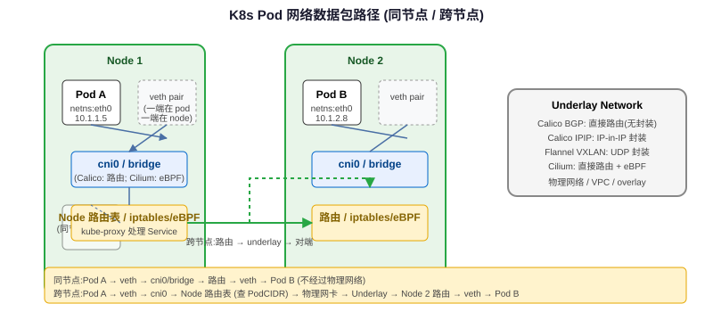

<h3>Pod 网络数据路径图</h3>

同节点 Pod 通信：veth → bridge/host route → veth；跨节点 Pod 通信：veth → node route → underlay/overlay → 对端 node → veth。

## CNI 接口规范

<h3>CNI（Container Network Interface）是什么</h3>

CNI 是 CNCF 维护的容器网络标准化接口，定义了容器运行时如何调用网络插件为容器配置网络。核心设计极简：插件是可执行文件，通过 stdin/stdout 传递 JSON 配置和结果，不引入守护进程依赖（数据面可以有 daemon，接口本身只需要二进制）。

<table>
<tr><th>命令</th><th>触发时机</th><th>说明</th></tr>
<tr><td>ADD</td><td>容器创建时（Pod sandbox 创建后）</td><td>为容器分配网络：创建 veth pair、分配 IP、配置路由、设置 DNS</td></tr>
<tr><td>DEL</td><td>容器删除时</td><td>释放 IP、拆除 veth、清理路由和 iptables 规则</td></tr>
<tr><td>CHECK</td><td>（可选）网络检查</td><td>校验容器网络是否正确配置</td></tr>
<tr><td>VERSION</td><td>插件能力查询</td><td>返回支持的 CNI spec 版本</td></tr>
</table>
<pre><code class="language-bash"># CNI 插件调用示例（ADD 操作）
# 容器运行时通过环境变量和 stdin 传参：
CNI_COMMAND=ADD
CNI_CONTAINERID=&lt;container-id&gt;
CNI_NETNS=/var/run/netns/&lt;netns-path&gt;
CNI_IFNAME=eth0
CNI_PATH=/opt/cni/bin

# stdin 传入网络配置 JSON
cat &lt;&lt;'EOF' | CNI_COMMAND=ADD CNI_CONTAINERID=abc123 \
  CNI_NETNS=/var/run/netns/cni-abc123 CNI_IFNAME=eth0 \
  CNI_PATH=/opt/cni/bin /opt/cni/bin/bridge
{
  "cniVersion": "0.4.0",
  "name": "mynet",
  "type": "bridge",
  "bridge": "cni0",
  "ipam": {
    "type": "host-local",
    "subnet": "10.244.0.0/16"
  }
}
EOF
</code></pre>

<h3>CNI 调用链路</h3>
<pre><code>kubelet SyncPod
  → CRI: RunPodSandbox
    → containerd/CRI-O 创建 network namespace（netns）
    → 调用 CNI 插件（按 /etc/cni/net.d/ 配置顺序执行）
      → 插件 1 (e.g., bridge/calico/cilium):
          - 从 IPAM 分配 Pod IP
          - 创建 veth pair：一端在 host netns，一端在 pod netns
          - 在 pod netns 内配置 eth0 IP、路由（default via host veth）
          - 在 host netns 配置 veth 对端、bridge/路由、iptables
          - 返回分配的 IP 和 CIDR
      → 插件 2 (e.g., portmap):
          - 配置 host port iptables 规则
    → sandbox 就绪，kubelet 继续创建业务容器
</code></pre>

关键点：CNI 插件在 Pod sandbox 创建后、业务容器启动前调用；pause 容器持有 netns，Pod 内所有容器共享这个 netns（同一个 Pod IP）。

## Pod IP 分配与跨节点通信

<h3>Pod IP 从哪来：IPAM</h3>

IPAM（IP Address Management）是 CNI 的子插件，负责 IP 地址分配和释放：

<ul>
<li><strong>host-local：</strong>每个节点从配置的 subnet 中分配 IP，本地文件存储分配记录（/var/lib/cni/networks/），节点间 subnet 不重叠，不依赖中心化存储。</li>
<li><strong>dhcp：</strong>从外部 DHCP 服务器获取 IP（较少用）。</li>
<li><strong>Calico IPAM：</strong>使用 etcd 或 CRD 存储 IP 分配，支持更灵活的 IP pool、block 分配（按 block 聚合路由）。</li>
<li><strong>Cilium IPAM：</strong>支持多种模式（cluster-wide、hostscope、CRD-based），可对接云厂商 ENI 做 IP 直通。</li>
</ul>
<pre><code class="language-yaml"># CNI 配置中指定 IPAM
{
  "name": "k8s-pod-network",
  "cniVersion": "0.4.0",
  "plugins": [
    {
      "type": "calico",  # 主 CNI
      "ipam": {"type": "calico-ipam"}
    },
    {"type": "portmap"},  # 附加插件：端口映射
    {"type": "bandwidth"} # 附加插件：带宽限制
  ]
}
</code></pre>

<h3>Pod 数据包路径详解</h3>

同节点 Pod A → Pod B

<pre><code>Pod A (netns) eth0: 10.244.1.5/24
  → veth pair 一端（pod 内：eth0）
  → veth pair 另一端（host 上：vethxxx@if3）
  → node 路由表查 10.244.1.0/24 → cni0 bridge 直连
  → cni0 bridge 转发
  → veth pair 另一端（host 上：vethyyy@if5）
  → Pod B (netns) eth0: 10.244.1.6/24
</code></pre>

跨节点 Pod A (Node-1: 10.244.1.5) → Pod B (Node-2: 10.244.2.8)

<pre><code>Pod A eth0: 10.244.1.5
  → veth pair → host (Node-1)
  → Node-1 路由表查 10.244.2.0/24：
     - Flannel VXLAN: 走 flannel.1 VTEP 设备，封装 UDP 发 Node-2
     - Calico BGP: 直接路由到 Node-2 IP（underlay）
     - Calico IPIP: 封装 IPIP 隧道发 Node-2
  → underlay 网络（物理网络/云 VPC）
  → Node-2 收到包
     - VXLAN: flannel.1/cali. 解封装
     - BGP/IPIP: 路由表直查
  → veth pair → Pod B eth0: 10.244.2.8
</code></pre>

所有 Pod 之间无论是否同节点，都通过 Pod 网络直接可达（flat network），不需要 NAT。出站访问外部网络时，节点做 SNAT（MASQUERADE）。

## 主流 CNI 实现对比

<h3>Calico / Cilium / Flannel 对比</h3>
<table>
<tr><th>维度</th><th>Calico</th><th>Cilium</th><th>Flannel</th></tr>
<tr><td>数据面</td><td>Linux routing + iptables/eBPF（可选）</td><td>eBPF（socket/TC/XDP 多层）</td><td>VXLAN/host-gw 二层/三层转发</td></tr>
<tr><td>跨节点模式</td><td>BGP（推荐）/ IPIP / VXLAN</td><td>native routing / tunnel (geneve/vxlan)</td><td>VXLAN / host-gw</td></tr>
<tr><td>NetworkPolicy</td><td>支持（Felix 编程 iptables/eBPF）</td><td>支持（基于身份的 eBPF 策略，更高效）</td><td>不支持</td></tr>
<tr><td>kube-proxy 替代</td><td>可选（eBPF dataplane）</td><td>完全替代（kube-proxy-replacement）</td><td>不替代</td></tr>
<tr><td>性能</td><td>BGP 模式好（接近原生路由），iptables 模式有规则爆炸问题</td><td>最佳（eBPF 避免内核态-用户态切换和 iptables 遍历）</td><td>VXLAN 有封装开销，host-gw 好但需要二层直连</td></tr>
<tr><td>可观测性</td><td>基本 flow log</td><td>Hubble：L3-L7 流量可见性、Hubble UI</td><td>无</td></tr>
<tr><td>复杂度</td><td>中（BIRD BGP + Felix）</td><td>较高（eBPF + 内核版本要求 ≥4.9+）</td><td>低（最简单）</td></tr>
<tr><td>CRD 扩展</td><td>FelixConfiguration、BGPPeer、IPPool 等</td><td>CNP/CCNP（安全策略）、CEP（端点）等</td><td>无</td></tr>
<tr><td>适用场景</td><td>生产通用选择、NetworkPolicy 必需、多云</td><td>高性能、可观测性、AI 训练大规模集群</td><td>快速搭建开发环境、简单 overlay</td></tr>
</table>

<h3>Calico 架构详解</h3>

Calico 组件：

<ul>
<li><strong>Felix：</strong>每个节点上的 Agent，负责编程路由表、iptables/eBPF 规则、响应 Endpoint 变化。</li>
<li><strong>BIRD：</strong>BGP 客户端（开源路由守护进程），在节点间分发路由，让各节点知道如何到达其他节点上的 Pod IP。BGP 模式下不需要 overlay，Pod IP 直接作为路由条目在节点间传播。</li>
<li><strong>confd：</strong>监控 etcd/CRD 变化，生成 BIRD 配置。</li>
<li><strong>CNI plugin：</strong>Calico CNI 二进制文件，被 kubelet 调用。</li>
<li><strong>Typha：</strong>（大规模集群可选）作为中间层减少每个 Felix 对 API Server 的 Watch 压力。</li>
</ul>

<strong>BGP 模式 vs IPIP 模式：</strong>

<ul>
<li>BGP：节点间通过 BGP 协议交换 Pod 路由，底层网络需要允许多跳 IP 转发（云环境可能不支持，如 AWS VPC 不认 Pod IP 路由）。性能最佳，无封装开销。</li>
<li>IPIP（overlay）：在 IP 包外再封装一层 IP 头（outer src/dst = 节点 IP，inner = Pod IP），通过 underlay 网络到达对端后解封装。适用于底层网络不支持 BGP 路由的环境，有少量封装开销。</li>
<li>VXLAN：基于 UDP 的 overlay，类似 Flannel VXLAN 模式。</li>
</ul>

<h3>Cilium：eBPF 革命性数据面</h3>

Cilium 将网络数据面下沉到内核 eBPF 程序，在多个 hook 点执行：

<table>
<tr><th>eBPF Hook</th><th>功能</th></tr>
<tr><td>XDP (eXpress Data Path)</td><td>网卡驱动层最早的包处理点，可在分配 skb 前 DROP/REDIRECT，DDoS 防护最佳</td></tr>
<tr><td>TC (Traffic Control) ingress/egress</td><td>套接字缓冲区层处理，做转发、DNAT、load balancing</td></tr>
<tr><td>Socket</td><td>socket lookup 时直接 redirect（同节点 Pod 间通信不走网络栈）</td></tr>
<tr><td>cgroup skb</td><td>容器 cgroup 级别的网络策略</td></tr>
</table>

kube-proxy replacement 核心优势：

<ul>
<li><strong>无 iptables 规则爆炸：</strong>Service 后端存在 BPF map（hash table，O(1) 查找），不管多少 Service/Pod 都保持常数级查找，而 iptables 规则数随 Service×Endpoint 线性增长（O(N)）。</li>
<li><strong>身份标识而非 IP 标识：</strong>Cilium 为每个 Pod 分配安全身份（security identity），NetworkPolicy 基于身份而非 IP 五元组，规则数量不随 Pod IP 变化而爆炸。</li>
<li><strong>Hubble 可观测性：</strong>eBPF 直接在数据路径采集流量元数据，提供 L7 协议解析（HTTP/gRPC/DNS），无需 sidecar 即可获取流量拓扑和策略诊断。</li>
<li><strong>Direct Server Return (DSR)：</strong>Service NodePort/LoadBalancer 流量回包时直接从后端 Pod 返回客户端，不需要经过 kube-proxy 节点做 SNAT，减少网络跳数。</li>
</ul>

## kube-proxy 模式详解

<h3>kube-proxy 三种模式</h3>

kube-proxy 负责实现 Service 的虚拟 IP（ClusterIP）负载均衡。它监听 API Server 中 Service 和 Endpoint/EndpointSlice 的变化，编程节点的网络规则：

<table>
<tr><th>模式</th><th>实现方式</th><th>时间复杂度</th><th>调度算法</th><th>问题</th></tr>
<tr><td>userspace</td><td>kube-proxy 自身开 TPROXY 监听，每个 ClusterIP 开一个端口，用户态转发</td><td>O(1) 但有用户态-内核态切换</td><td>rr</td><td>性能差（两次内核态→用户态→内核态），已废弃</td></tr>
<tr><td>iptables</td><td>写入 iptables DNAT 规则，随机匹配后端</td><td>O(N) 遍历规则链</td><td>随机（非加权）</td><td>规则爆炸：大集群（万级 Service）规则数百万级，iptables 规则更新加锁，延迟高</td></tr>
<tr><td>IPVS</td><td>内核 L4 LB（IP Virtual Server），hash table 查找</td><td>O(1) hash 查找</td><td>rr/wrr/lc/sh/dh/sed/nq 等多种</td><td>需要 ipvsadm/ip_vs 内核模块，iptables 仍需做 SNAT/NodePort/策略</td></tr>
<tr><td>eBPF (Cilium)</td><td>BPF map 查表 + socket redirect/TC hook</td><td>O(1) map lookup</td><td>支持多种，可扩展</td><td>需要 Cilium 部署，内核版本要求</td></tr>
</table>

<h3>iptables 模式的关键问题</h3>
<ol>
<li><strong>规则爆炸：</strong>每个 Service 对应多条 iptables 规则（KUBE-SERVICES → KUBE-SVC-XXX → KUBE-SEP-XXX），M 个 Service、N 个 Endpoint 时规则数是 O(M×N)。万级 Service 时 iptables-restore 耗时可达数秒，规则更新期间会丢包。</li>
<li><strong>随机而非加权轮询：</strong>iptables 随机匹配规则，当后端权重不同时无法做加权 LB。</li>
<li><strong>无重试：</strong>DNAT 选错后端后，如果后端 Pod 已死亡（连接还在 conntrack 表中），不会自动重试其他后端，请求失败（尤其长连接/滚动更新场景）。</li>
<li><strong>无法优雅终止：</strong>Pod Terminating 后 kube-proxy 会更新 iptables 移除该后端，但已有连接的 conntrack 条目不会立即删除，可能导致连接被转发到已终止的 Pod（需设置 endpointSlide 优雅终止 + conntrack 清理）。</li>
</ol>

<h3>iptables DNAT 规则结构（简化）</h3>
<pre><code class="language-text"># Service ClusterIP: 10.96.0.1:443 -> 后端: 192.168.1.10:6443, 192.168.1.11:6443
# KUBE-SERVICES 链拦截目标为 ClusterIP 的流量
-A KUBE-SERVICES -d 10.96.0.1/32 -p tcp --dport 443 \
  -j KUBE-SVC-ABCDEF123456

# KUBE-SVC-XXX 链：随机选择后端（statistic mode random probability 0.5）
-A KUBE-SVC-ABCDEF123456 -m statistic --mode random --probability 0.5 \
  -j KUBE-SEP-AAAAAA
-A KUBE-SVC-ABCDEF123456 -j KUBE-SEP-BBBBBB

# KUBE-SEP-XXX 链：DNAT 到具体 Pod IP
-A KUBE-SEP-AAAAAA -p tcp -j DNAT --to-destination 192.168.1.10:6443
-A KUBE-SEP-BBBBBB -p tcp -j DNAT --to-destination 192.168.1.11:6443

# NodePort/ExternalTraffic 还要做 SNAT（MASQUERADE）让回包能回到源节点
</code></pre>

IPVS 模式下，kube-proxy 创建 IPVS virtual server（一个 ClusterIP:Port），每个后端是 real server，查找通过 hash table 而非 iptables 链遍历，但 SNAT/NodePort/LoadBalancer 相关规则仍然需要 iptables 辅助。

## Service 类型与 EndpointSlices

<h3>Service 类型</h3>
<table>
<tr><th>类型</th><th>说明</th><th>暴露范围</th></tr>
<tr><td>ClusterIP</td><td>虚拟 IP，仅集群内可达（默认类型）</td><td>集群内</td></tr>
<tr><td>NodePort</td><td>在所有节点上开放一个端口（30000-32767），通过 &lt;NodeIP&gt;:&lt;NodePort&gt; 访问</td><td>节点 IP 可达即可</td></tr>
<tr><td>LoadBalancer</td><td>通过云厂商 LB 分配外部 VIP，自动配置 NodePort/ClusterIP</td><td>外部公网/VIP</td></tr>
<tr><td>ExternalName</td><td>CNAME 到外部 DNS 名称，无 ClusterIP，不做代理（DNS 级别映射）</td><td>DNS 解析</td></tr>
<tr><td>Headless Service</td><td>clusterIP: None，不分配虚拟 IP，DNS 返回后端 Pod IP 列表（A 记录）</td><td>直接 Pod IP</td></tr>
</table>
<pre><code class="language-yaml"># Headless Service 示例（StatefulSet 常用）
apiVersion: v1
kind: Service
metadata:
  name: mysql
spec:
  clusterIP: None  # Headless
  selector:
    app: mysql
  ports:
  - port: 3306
# nslookup mysql → 返回所有 Pod IP 列表，客户端直连 Pod

# ExternalName Service
apiVersion: v1
kind: Service
metadata:
  name: ext-db
spec:
  type: ExternalName
  externalName: db.example.com
# nslookup ext-db → CNAME db.example.com，kube-proxy 不处理
</code></pre>

<h3>Endpoints vs EndpointSlices</h3>

<strong>扩展性问题：</strong>Endpoints 资源中一个 Service 的所有后端 IP 都在一个对象里。当 Service 有数千后端（大型 ingress/AI inference 服务）时，单个 Endpoints 对象可能超过 1MB，触发 etcd 大 value 问题；每次一个后端变化都要更新整个对象，Watch 事件量大，API Server 压力大。

<strong>EndpointSlices 解决方案：</strong>将后端分片（shard）到多个对象，每个 Slice 最多 100 个 endpoint（默认）：

<ul>
<li>EndpointSlice 对象大小可控（<100KB），避免 etcd 大 value。</li>
<li>后端变化只影响一个 Slice，增量更新，Watch 事件更小更高效。</li>
<li>支持 dual-stack（IPv4 + IPv6），每个 address family 独立 Slice。</li>
<li>支持拓扑感知路由（topology-aware hints），将流量路由到同 zone 后端。</li>
</ul>
<pre><code class="language-yaml"># EndpointSlice 示例
apiVersion: discovery.k8s.io/v1
kind: EndpointSlice
metadata:
  name: my-svc-abc123
  labels:
    kubernetes.io/service-name: my-svc
addressType: IPv4
ports:
- name: http
  port: 80
  protocol: TCP
endpoints:
- addresses: ["10.244.1.5", "10.244.1.6"]  # 最多 100 个
  conditions:
    ready: true
  zone: us-east-1a
  nodeName: node-1
</code></pre>

## 高频问答

Q: Pod 之间怎么通信？

K8s 网络模型要求所有 Pod 之间（无论是否同节点）可以直接通过 IP 通信，不需要 NAT。分两种情况：

同节点通信

Pod A 的 eth0 通过 veth pair 连到 node 上的网络设备（cni0 bridge 或直接路由），node 路由表知道同节点 Pod 的 MAC 地址，直接通过二层转发到达 Pod B 的 veth pair，再进入 Pod B 的 netns。整个过程不经过 overlay 封装。

跨节点通信

取决于 CNI 模式：1）BGP/native routing（Calico BGP、Cilium native）：节点路由表有其他节点 Pod CIDR 的路由，Pod IP 包直接通过 underlay 网络路由到目标节点，性能最好；2）Overlay（Flannel VXLAN、Calico IPIP/VXLAN、Cilium tunnel）：Pod 包被封装在 UDP/IP 包里（外层 src/dst 为节点 IP），通过 underlay 到达目标节点后解封装再转给 Pod，有封装开销但不要求底层网络支持 Pod 路由。

面试口径：同节点走 veth + bridge/路由；跨节点靠 CNI 配置的 BGP 直路由或 overlay 隧道，核心要求是 flat network + no NAT between Pods。

Q: iptables mode 的 kube-proxy 有什么问题？

iptables 模式在小集群（几百节点、几千 Pod）中工作良好，但大规模下有明显瓶颈：

1. 规则爆炸

每个 Service 对应 KUBE-SVC-XXX 链 + 每个后端 KUBE-SEP-XXX 链，总规则数约为 O(Service × Endpoint)。万级 Service 时规则数可达百万级，iptables-restore 需要遍历所有规则做原子替换，耗时可达秒级，更新期间丢包；新增/删除规则时 kernel nf_mutex 锁竞争导致网络延迟抖动。

2. 随机选择，无加权

iptables random 模式是等概率随机，不支持加权负载均衡。

3. 无重试/无健康检查联动

DNAT 只做一次目的地址转换，如果后端 Pod 已挂但 conntrack 条目未更新，请求会发到已死 Pod 直接失败，不会自动重试其他后端。滚动更新时已有连接可能被转发到 Terminating Pod。

4. 可观测性差

iptables 规则是静态的，很难查看当前连接和流量分布。

面试口径：大集群 iptables 模式的核心问题是规则线性遍历（O(N)）导致延迟上升、更新期间丢包、无加权无重试；解决方案是 IPVS（O(1) hash）或 Cilium eBPF（O(1) map + 更丰富 LB 策略）。

Q: Calico 和 Cilium 的区别？

两者都是生产级 CNI，但设计哲学不同：

1. 数据面技术

Calico 以 Linux 路由 + iptables 为默认数据面（Felix 编程路由表和 iptables 规则），也支持 eBPF 作为可选增强；Cilium 从第一天就基于 eBPF，在 socket/TC/XDP 多层 hook 点处理包，完全绕开 iptables。

2. kube-proxy 替代

Calico 可以开启 eBPF 模式替代 kube-proxy，但非默认；Cilium 默认推荐完全替代 kube-proxy（kube-proxy-replacement=strict），Service LB 全部在 BPF 中完成。

3. NetworkPolicy 实现

Calico 基于 IP 五元组的 iptables 规则，随 Pod 数量增长规则线性增长；Cilium 基于安全身份（security identity，标签 hash），BPF map 按 identity 匹配，不受 Pod IP 变化和数量影响。

4. 可观测性

Calico 提供基本 flow log；Cilium 自带 Hubble 提供 L3-L7 流量可视化、策略审计、服务依赖拓扑，功能更强大。

5. 内核要求与运维复杂度

Calico 兼容更老的内核（≥3.10），运维成熟度高；Cilium 要求较新内核（≥4.9+，推荐 5.10+），技术栈更新但性能和功能优势明显，特别适合大规模 AI/高性能场景。

面试口径：Calico 成熟稳定、BGP/iPTables 主流方案；Cilium 基于 eBPF 性能更好、无 iptables 爆炸、Hubble 可观测、身份级安全，是大规模高性能集群和 AI 训练场景的趋势选择。

Q: EndpointSlices 解决什么问题？

EndpointSlices 解决 Endpoints 资源的<strong>可扩展性</strong>问题：

Endpoints 的瓶颈

一个 Service 的所有后端 Pod IP 都存在一个 Endpoints 对象里。大型 Service（如 ingress-nginx、AI 推理服务数千副本）的 Endpoints 对象可能超过 1MB（接近 etcd 推荐 value 大小上限）；任何一个后端 Pod 的 IP 变化都需要重新 PUT 整个 Endpoints 对象，Watch 事件全量推送，API Server 和 client-go Informer 压力巨大。

EndpointSlices 的分片设计

将后端分片到多个 EndpointSlice 对象，每个 Slice 最多包含 100 个 endpoint。后端变化只影响一个小 Slice，增量更新，Watch 事件小；对象大小均匀可控，避免 etcd 大 value。

额外能力

支持 dual-stack（IPv4/IPv6 独立 Slice）；支持拓扑感知路由（topology keys/hints），kube-proxy 可以优先将流量转发到同 zone 的后端，降低跨 AZ 流量费用和延迟；为未来扩展（如 endpoint 状态细分、新的地址类型）预留空间。

面试口径：EndpointSlices 通过分片（shard）解决 Endpoints 单对象过大、更新粒度粗、watch 压力大的扩展性问题，默认每 Slice 100 endpoint，还附带 dual-stack 和拓扑感知能力。

Q: ExternalName Service 怎么工作？

ExternalName Service 是一种特殊的 Service，它没有 ClusterIP，也不做任何代理或负载均衡：

<ul>
<li>当你创建 <code>type: ExternalName</code>、<code>externalName: db.example.com</code> 的 Service 后，集群内 DNS 查询 <code>&lt;svc&gt;.&lt;ns&gt;.svc.cluster.local</code> 会返回 CNAME 记录指向 <code>db.example.com</code>。</li>
<li>kube-proxy 完全不处理这种 Service（没有 ClusterIP 就没有 DNAT 规则）。</li>
<li>Pod 访问该 Service 时，DNS 解析到外部域名，Pod 直接连外部服务的 IP，流量不经过 kube-proxy。</li>
<li>典型用途：迁移期间临时指向外部数据库、将集群外服务以 Service 域名形式暴露给集群内应用（保持配置不变）。</li>
<li>注意：ExternalName 不能使用 TLS 证书验证（因为域名是内部的，证书是外部的），也不会做健康检查或负载均衡。</li>
</ul>

面试口径：ExternalName = DNS CNAME 别名，不分配 ClusterIP，不经过 kube-proxy，流量直接到外部服务，仅在 DNS 层面做映射。

