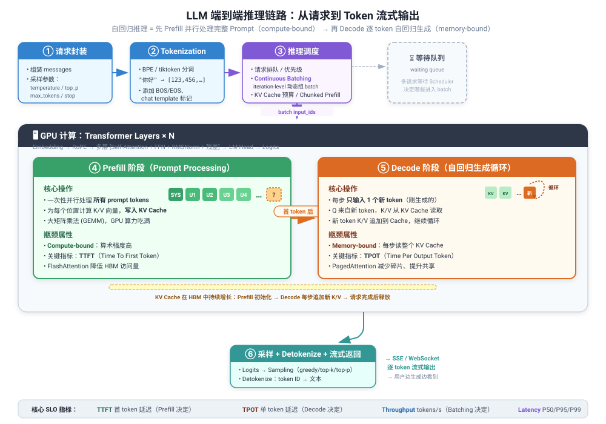
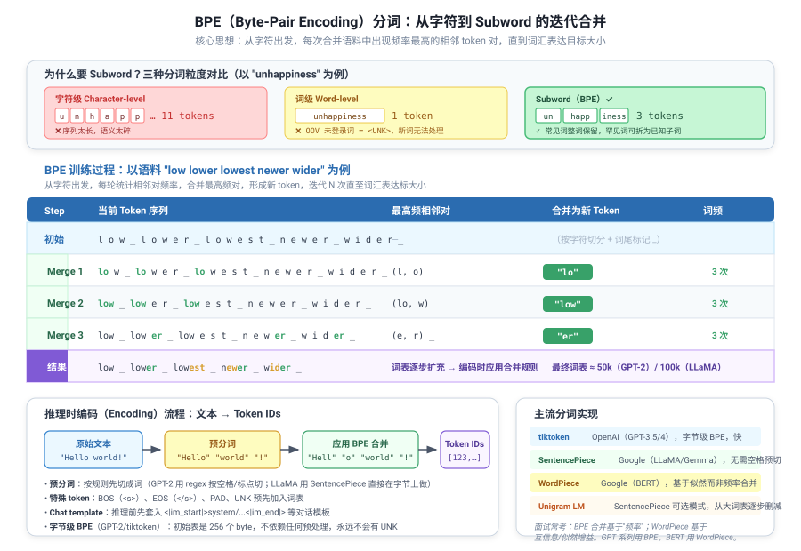
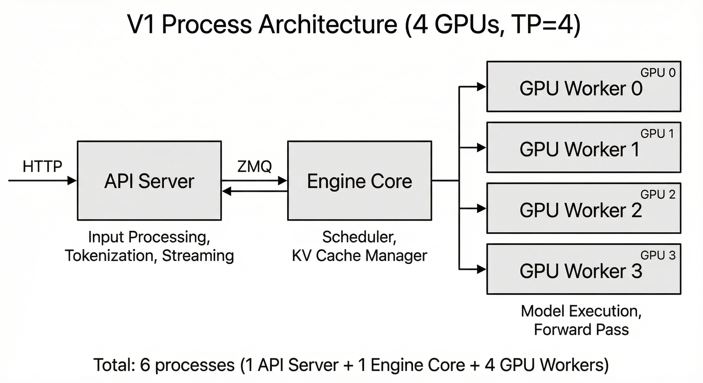
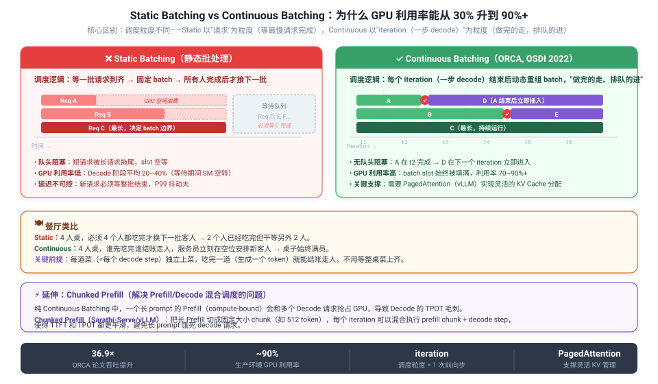

<h3>完整推理链路概览</h3>
<p>一个 prompt 从输入到输出，大体会经历 <strong>6 个阶段</strong>。核心本质是：模型先并行"读懂"整段输入，建立上下文状态和 KV cache，然后再进入自回归生成循环，每次只预测下一个 token。</p>


<p style="font-size:0.85em;color:var(--text-secondary);margin:0 0 20px 0;">示意图：6 阶段推理端到端链路（Prefill/Decode 两阶段、KV Cache 增长、SLO 指标标注）</p>

```flow
① 请求封装 | system/user/assistant 消息组装 + generation params（temperature/top_p/max_tokens）
② Tokenization | BPE/tiktoken 分词 → token IDs + BOS/EOS/chat template
③ 推理调度 | 排队、优先级、Continuous Batching、KV Cache 预算、Chunked Prefill
④ Prefill | 并行处理完整 prompt，建立初始 KV Cache → compute-bound → TTFT
⑤ Decode | 逐 token 自回归循环，持续追加 KV Cache → memory-bound → TPOT
⑥ 采样返回 | greedy/top-k/top-p 采样 → detokenize → SSE/WebSocket 流式输出
```

<div class="card card-m">
<h3>核心定位：为什么推理是"两阶段"而不是"一阶段"？</h3>
<div class="table-scroll">
<table>
<tr><th>维度</th><th>Prefill</th><th>Decode</th></tr>
<tr><td><strong>输入规模</strong></td><td>N 个 prompt tokens 一次性并行</td><td>每步只有 <strong>1 个</strong>新 token</td></tr>
<tr><td><strong>计算特性</strong></td><td>大矩阵乘法 (GEMM)，GPU SM 利用率高</td><td>小矩阵乘 + 大 KV Cache 读取</td></tr>
<tr><td><strong>瓶颈类型</strong></td><td><strong>Compute-bound</strong>（吃算力）</td><td><strong>Memory-bound</strong>（吃显存带宽）</td></tr>
<tr><td><strong>关键指标</strong></td><td>TTFT（首 token 延迟）</td><td>TPOT（单 token 生成延迟）</td></tr>
<tr><td><strong>算术强度</strong></td><td>高（O(N) 计算 / O(N) 数据）</td><td>低（O(1) 计算 / O(N) 数据读取）</td></tr>
<tr><td><strong>优化重点</strong></td><td>FlashAttention、Tensor Core 利用</td><td>PagedAttention、Continuous Batching、量化</td></tr>
</table>
</div>
</div>

<h3>阶段①：请求封装</h3>
<p>用户输入的自然语言首先到达 API Server（vLLM 中是 API Server 进程）。服务层会：</p>
<ul>
<li>按 <strong>chat template</strong> 组织 system、user、assistant 多轮消息</li>
<li>校验并传递生成参数：temperature、top_p、top_k、max_tokens、stop、presence_penalty 等</li>
<li>鉴权、限流、路由到 Engine Core</li>
</ul>

<h3>阶段②：Tokenization（分词）—— 模型看到的不是文字，而是 token IDs</h3>
<p>模型不直接处理字符串。Tokenizer 把文本切分为一个个 token（子词单元），再映射为整数 ID。现代 LLM 几乎都使用 <strong>BPE（Byte-Pair Encoding）</strong> 系列算法，在"字符太碎"和"词表太大"之间取得平衡。</p>

<div class="card card-s">
<h4>为什么需要 Subword 分词？三种粒度对比</h4>
<div class="table-scroll">
<table>
<tr><th>粒度</th><th>示例 "unhappiness"</th><th>Token 数</th><th>问题</th></tr>
<tr><td>字符级</td><td>u / n / h / a / p / p / i / n / e / s / s</td><td>11</td><td>序列太长、语义碎裂，上下文窗口利用率低</td></tr>
<tr><td>词级</td><td>unhappiness（整词）</td><td>1</td><td>OOV 未登录词 = &lt;UNK&gt;，新词、专业术语无法处理</td></tr>
<tr><td><strong>Subword（BPE）</strong></td><td><strong>un / happ / iness</strong></td><td><strong>3</strong></td><td>常见词整词保留，罕见词可拆为已知子词，永不 OOV</td></tr>
</table>
</div>
</div>


<p style="font-size:0.85em;color:var(--text-secondary);margin:0 0 16px 0;">示意图：BPE 分词从字符到 subword 的迭代合并过程、编码流程及主流分词实现对比</p>

<div class="card card-d">
<h4>BPE 核心思想</h4>
<p>从基础单元（256 个 byte 或字符）出发，<strong>迭代合并语料中出现频率最高的相邻 token 对</strong>，形成新 token，直到词表达目标大小（GPT-2 ≈ 50k，LLaMA ≈ 100k）。这是一个数据驱动的"压缩"过程：频繁出现的模式（如 "ing"、"low"、"er"）被合并为单个 token，罕见组合保留为小片段。</p>
<p><strong>推理时编码流程</strong>：文本 → 预分词（regex 按空格/标点切）→ 按学习到的合并规则贪心应用 → 查词表得到 token IDs → 添加特殊 token（BOS/EOS/PAD）。</p>
</div>

<div class="qa" onclick="this.classList.toggle('open')">
<div class="qa-q">Q: BPE 和 WordPiece、SentencePiece 有什么区别？tiktoken 是什么？</div>
<div class="qa-a"><p><strong>BPE</strong>（GPT 系列/LLaMA 用）：合并规则基于"相邻对频率"，选最高频对合并。</p>
<p><strong>WordPiece</strong>（BERT 用）：合并标准不是频率而是"互信息增益"（合并后似然提升最大），实际效果类似，但前缀用 <code>##</code> 标记。</p>
<p><strong>SentencePiece</strong>（Google，LLaMA/Gemma 用）：不依赖空格预分词，直接在 raw byte 序列上做 BPE 或 Unigram LM，对中日韩等无空格语言更友好。</p>
<p><strong>tiktoken</strong>（OpenAI）：一个高速 BPE 实现，用字节级初始词表（256 个 byte），永远不会出现 UNK，GPT-3.5/4 都用它。</p>
<p><strong>面试要点</strong>：BPE 合并基于"频率"，WordPiece 基于"似然增益"；字节级 BPE 不存在 OOV 问题；不同模型的 tokenizer 不互通（同一个词在 GPT 和 LLaMA 中的切分可能完全不同）。</p></div>
</div>

<div class="qa" onclick="this.classList.toggle('open')">
<div class="qa-q">Q: Tokenization 属于 Transformer 前向推理的一部分吗？</div>
<div class="qa-a"><p>严格来说不属于——模型只接收 input_ids。但在现代推理服务中，tokenizer 往往和 serving 引擎绑定在一起（vLLM 的 API Server 进程内置 tokenizer），工程上看起来像是推理引擎在处理原始字符串。vLLM 同时支持 text prompt 和 pre-tokenized prompt 两种输入模式。</p></div>
</div>

<h3>阶段③：推理调度层（Scheduler）—— Continuous Batching 是吞吐核心</h3>
<p>请求到达后不会立刻进入 GPU，而是先进入 Engine Core 的 Scheduler。调度器负责：请求排队与优先级、动态组 batch、KV Cache 分配与回收、抢占与恢复。从系统视角看，vLLM V1 至少有 1 个 API Server（HTTP + tokenization）、1 个 Engine Core（scheduler + KV cache 管理）、N 个 GPU Worker（前向计算）。</p>


<p style="font-size:0.85em;color:var(--text-secondary);margin:0 0 20px 0;">来源：vLLM 官方文档 Architecture Overview（docs.vllm.ai）</p>

<div class="card card-s">
<h4>Continuous Batching（连续批处理）—— GPU 利用率从 30% 升到 90%+ 的关键</h4>
<p><strong>Static Batching（静态批处理）</strong>：等一批请求到齐后一起推理，必须等该批中<strong>所有请求都生成完毕</strong>才能接入下一批。问题是"队头阻塞"——短请求被长请求拖尾，它们的 slot 在等待期间 GPU 空转，Decode 阶段利用率通常只有 20~40%。</p>
<p><strong>Continuous Batching（ORCA 论文 OSDI 2022，vLLM/TensorRT-LLM 标配）</strong>：调度粒度从"请求"变为<strong>iteration（一次前向步/一个 decode step）</strong>。每个 iteration 结束后，scheduler 立即做三件事：</p>
<ol>
<li>哪些请求刚结束（生成 EOS 或达到 max_tokens）→ <strong>立即释放</strong>其 KV Cache，从 batch 移除</li>
<li>队列中是否有新请求等待 → <strong>立即插入</strong>到下一个 iteration 的空 slot（不用等其他人）</li>
<li>KV Cache 剩余显存是否足够接纳新请求（由 PagedAttention 的 block 分配器判断）</li>
</ol>
<p><strong>本质</strong>：iteration-level 的"有出有进"，把 batch 变成一个<strong>动态流动集合</strong>而非一次性冻结集合。GPU 不需要在请求边界等待，Decode 阶段 GPU 利用率从 10~30% 提升到 70~90%+（ORCA 论文报告最高 36.9× 吞吐提升）。</p>
</div>


<p style="font-size:0.85em;color:var(--text-secondary);margin:0 0 16px 0;">示意图：Static Batching 等最慢请求完成才换批 vs Continuous Batching 每个 iteration 动态换入换出；Chunked Prefill 扩展</p>

<div class="card card-w">
<h4>延伸：Chunked Prefill 解决 Prefill/Decode 混合调度问题</h4>
<p>纯 Continuous Batching 下，一个长 prompt 的 Prefill（compute-bound，一次算几千 token）如果和多个 Decode 请求一起跑，会长时间占用 GPU，导致 Decode 请求的 TPOT 剧烈毛刺。</p>
<p><strong>Chunked Prefill（Sarathi-Serve / vLLM）</strong>：把长 Prefill 切成固定大小 chunk（如 512 token），每个 iteration 可以混合执行 prefill chunk + decode step，使 TTFT 和 TPOT 都更平滑，避免长 prompt "饿死" decode 请求。</p>
</div>

<div class="table-scroll">
<table>
<tr><th>对比维度</th><th>Static Batching</th><th>Continuous Batching</th></tr>
<tr><td>batch 确定时机</td><td>请求进入时一次性确定</td><td>每个 iteration 后重新调整</td></tr>
<tr><td>新请求插入</td><td>必须等当前 batch 全部完成</td><td>下一个 iteration 即可插入</td></tr>
<tr><td>GPU 利用率</td><td>低（等待 + 尾部效应，20-40%）</td><td>高（持续填充 batch，70-90%+）</td></tr>
<tr><td>预emption/抢占</td><td>无</td><td>支持（KV Cache 换出/重计算）</td></tr>
<tr><td>实现复杂度</td><td>简单</td><td>需要精细的 KV Cache 管理（PagedAttention）</td></tr>
</table>
</div>
<p class="qa-summary">记忆要点：Static Batching 是"全班同学交卷才换下一批"；Continuous Batching 是"谁先交卷谁走，空位立刻安排新同学"，类似流水线工位而非批处理考试。</p>

<div class="qa" onclick="this.classList.toggle('open')">
<div class="qa-q">Q: Continuous Batching 需要什么底层支撑？为什么早期推理框架做不了？</div>
<div class="qa-a"><p>两个关键前提：</p>
<p><strong>1. 灵活的 KV Cache 内存管理</strong>：不同请求的 KV Cache 长度不同，且在运行中不断增长。传统框架为每个请求预分配 max_tokens 长度的连续显存，既浪费又无法在请求结束后快速分配给新请求。<strong>PagedAttention</strong>（vLLM 提出）借鉴 OS 虚拟内存分页，把 KV Cache 切成固定大小 block（如 16 token），用 block table 维护逻辑→物理映射，请求结束即释放 block，新请求可立即复用——这是 Continuous Batching 能落地的内存基础。</p>
<p><strong>2. Selective Batching（ORCA）</strong>：Transformer 中有些操作（如 attention）必须按各自序列长度处理，有些操作（如 FFN、logits）可以统一 batch 计算。需要框架区分这两类操作，对前者做"per-sequence"处理，对后者做"batched"处理。</p></div>
</div>

<h3>阶段④：Embedding 与位置编码</h3>
<p>Token IDs 进入模型后，首先经过 <strong>embedding lookup</strong>——每个 token 查一张巨大的 embedding 表（vocab_size × hidden_dim），得到高维向量表示。此时模型才真正进入连续空间的数值计算。</p>
<p>仅有 token 向量不够，模型还需知道"谁在前、谁在后"。现代大模型通常使用 <strong>RoPE（Rotary Position Embedding）</strong>，在 attention 计算中对 Q/K 施加旋转位置编码，让模型同时保留相对位置信息。</p>

<h3>阶段⑤：Transformer Block 内部计算</h3>
<p>一个典型的 decoder-only LLM，每一层做两件事：</p>
<ol>
<li><strong>Self-Attention</strong>：当前位置的 token 查看上下文中哪些 token 最相关。模型把隐藏状态投影成 Q、K、V 三组向量，通过 Q 和 K 的相似度算出注意力权重，再对 V 加权求和。<strong>Causal mask</strong> 确保当前位置只能看到自己和前面的 token，不能偷看未来——这决定了模型天然是自回归生成的。</li>
<li><strong>FFN / MLP</strong>：对每个 token 的表示单独做非线性变换，进一步提纯和增强特征，不跨位置交互。</li>
</ol>
<p>可以粗略理解：<strong>Attention 负责"从上下文搬运信息"，FFN 负责"对当前位置做进一步加工"</strong>。中间配合残差连接和 RMSNorm（或 LayerNorm）。</p>

<div class="qa" onclick="this.classList.toggle('open')">
<div class="qa-q">Q: Q、K、V 的直觉理解？</div>
<div class="qa-a"><p>Q = 我现在想找什么；K = 每个词身上的"索引标签"；V = 每个词真正携带的信息。类比图书馆检索：你的问题是 Q，书架上每本书的标签是 K，书里的内容是 V。先拿 Q 和所有 K 比较相关度，相关度高的那些 V 被更多取出来，加权合成当前步该关注的信息。Transformer 论文对 attention 的定义，本质上就是"一个 query 对一组 key-value 对做匹配，输出是 values 的加权和"。</p></div>
</div>

<h3>阶段⑥ Prefill / ⑦ Decode 两阶段计算</h3>

<div class="card card-m">
<h4>Prefill —— 读完 Prompt（compute-bound）</h4>
<p>Prefill 把整段 prompt 一次性跑完整个前向过程，为所有 token 计算各层隐藏状态，并生成后续 decode 要用到的 KV cache。这一步可以高度并行，因为整段输入已完整给定，GPU 能把很多矩阵操作一起做完。Prefill 更像"先整体读题"，吞吐通常更高，属于 <strong>compute-bound</strong> 阶段。Prefill 结束后输出第一个 token 的 logits，决定 <strong>TTFT</strong>。</p>
</div>

<div class="card card-m">
<h4>Decode —— 逐 token 生成（memory-bound）</h4>
<p>Prefill 完成后，模型取最后一个位置的隐藏状态，通过 LM Head 映射成整个词表上的 logits，再经 softmax 和采样策略（greedy/top-k/top-p/temperature）决定输出 token。</p>
<p>随后进入循环：把刚生成的 token 接到上下文后面 → 复用 KV cache → <strong>只为新 token 跑一遍前向</strong>（Q 来自新 token，K/V 从历史 cache 读取）→ 得到新的 logits → 再采样下一个 token → detokenize → 通过 SSE/WebSocket 流式返回给用户。这就是大模型回答总是一个 token 一个 token 流式吐出来的原因。</p>
<p>Decode 阶段每步只算 1 个新 token，但要读取全部历史 KV cache（长度随输出线性增长），属于强烈的 <strong>memory-bound</strong>，<strong>TPOT</strong> 主要由显存带宽决定。</p>
</div>

<h4>常见采样策略</h4>
<div class="table-scroll">
<table>
<tr><th>策略</th><th>方式</th><th>特点</th></tr>
<tr><td>Greedy</td><td>选概率最大的 token</td><td>确定性输出，缺乏多样性</td></tr>
<tr><td>Top-k</td><td>从概率最高的 k 个中采样</td><td>控制候选范围</td></tr>
<tr><td>Top-p（nucleus）</td><td>从累积概率达 p 的最小集合中采样</td><td>动态调整候选数</td></tr>
<tr><td>Temperature</td><td>调整 softmax 温度（logits/T）</td><td>高温更随机，低温更确定</td></tr>
</table>
</div>

<div class="qa" onclick="this.classList.toggle('open')">
<div class="qa-q">Q: 为什么"第一个字慢，后面快"（指感觉上首字等待久）？</div>
<div class="qa-a"><p>严格来说 Prefill 阶段<strong>绝对耗时</strong>比单个 decode step 长很多（要处理 N 个 prompt token），所以用户感知到"等一下才出第一个字"——这就是 TTFT。之后每个 token 的 TPOT 通常在 10-50ms 级别（取决于模型大小、batch size、量化、GPU 代际），用户感觉"后面流畅输出"。</p>
<p>但从 GPU 计算密度角度：Prefill 阶段 GPU 利用率高（compute-bound，大矩阵吃满 SM），单 token 摊销计算效率高；Decode 阶段 GPU 利用率低（memory-bound，每步小计算+大访存），需要 Continuous Batching 把多个请求的 decode step 打包在一起来吃满 GPU。</p></div>
</div>

<h3>推理引擎与模型本体的职责划分</h3>
<div class="table-scroll">
<table>
<tr><th>职责方</th><th>负责内容</th></tr>
<tr><td>推理引擎 / serving 系统</td><td>接 HTTP 请求、tokenization / 输入处理、调度 batching、管理 KV cache、协调 GPU worker、流式返回、采样与系统优化</td></tr>
<tr><td>LLM 模型本体</td><td>对 input_ids 做 embedding，经多层 Transformer block 的 self-attention 和 FFN，输出 logits（下一个 token 的分数分布）</td></tr>
</table>
</div>
<p><strong>推理引擎决定"怎么高效地跑"，模型决定"到底生成什么"。</strong>前者偏"编排与优化"，后者偏"语义计算与内容生成"。</p>
