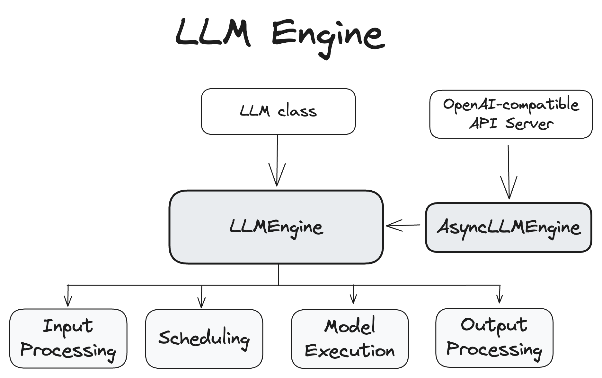

<div class="callout note">
<p>一个推理请求会依次经过接入、预处理、调度、模型执行、采样与流式返回；系统性能取决于请求在各阶段的排队、批处理与资源占用。</p>
</div>

## 请求状态机（Request Lifecycle）

一个请求在系统中的状态不是"在跑/没在跑"两种，而是一个明确的状态机：

```flow
WAITING | 在等待队列中，tokenizer 已完成，等待 scheduler 准入
ADMITTED | 准入通过，block table 建立，分配到 KV block
PREFILL_RUNNING | 整段 prompt 并行计算 attention，写入初始 KV Cache → TTFT
DECODE_RUNNING | 进入 decode 迭代，每步生成 1 个 token 自回归 → TPOT
STREAMING | token 逐 token 通过 SSE/WebSocket 流式返回给用户
FINISHED | 生成 EOS 或达到 max_tokens，释放 KV block 归还 free list
PREEMPTED | 显存不足时被抢占，KV 换出到 CPU 或丢弃（可重新排队回到 WAITING）
```

<div class="table-scroll">
<table>
<tr><th>状态</th><th>含义</th><th>关键动作</th></tr>
<tr><td>WAITING</td><td>在等待队列中</td><td>Tokenizer 已完成，等待 scheduler 准入</td></tr>
<tr><td>ADMITTED</td><td>准入通过，分配到 KV block</td><td>block table 建立，分配物理 block</td></tr>
<tr><td>PREFILL_RUNNING</td><td>正在执行 prefill</td><td>整段 prompt 并行计算，写入初始 KV</td></tr>
<tr><td>DECODE_RUNNING</td><td>进入 decode 迭代</td><td>每步生成 1 个 token，追加 KV</td></tr>
<tr><td>PREEMPTED</td><td>被抢占（显存不足）</td><td>KV 换出到 CPU 或直接丢弃（重算）</td></tr>
<tr><td>FINISHED</td><td>生成 EOS 或达到 max_tokens</td><td>释放 KV block，block 归还 free list</td></tr>
</table>
</div>

<div class="qa" onclick="this.classList.toggle('open')">
<div class="qa-q">Q: 为什么 KV 缓存只缓存 K 和 V，不缓存 Q？</div>
<div class="qa-a"><p>一个东西值不值得缓存，看它"后面还会不会被用到"。Q 只在当前这一步有用一次——当前 token 的 Query 只需要和历史 K/V 做注意力计算；而 K、V 会在后面每一步继续被反复用到——未来每个新 token 的 Query 都需要和所有历史 token 的 Key 做匹配。所以 KV cache 只缓存 K 和 V，不缓存 Q，不是因为 Q 不重要，而是因为 Q 不需要重复使用。</p></div>
</div>

## 端到端系统流程

<div class="table-scroll">
<table>
<tr><th>阶段</th><th>输入</th><th>主要动作</th><th>输出</th><th>关键指标</th></tr>
<tr><td>请求接入</td><td>用户 Prompt、生成参数</td><td>鉴权、限流、参数校验、路由</td><td>标准化请求对象</td><td>—</td></tr>
<tr><td>Tokenization</td><td>文本 Prompt</td><td>BPE/SentencePiece 切分 + chat template</td><td>token IDs 序列</td><td>—</td></tr>
<tr><td>调度排队</td><td>token 序列、优先级、SLO</td><td>准入控制、Continuous Batching 组 batch</td><td>当前 iteration 的执行计划</td><td>Queue wait time</td></tr>
<tr><td>Prefill</td><td>完整 Prompt tokens</td><td>并行计算 attention，写入初始 KV Cache</td><td>初始 KV Cache + 首 token logits</td><td><strong>TTFT</strong></td></tr>
<tr><td>Decode 迭代</td><td>历史 KV Cache + 新 token</td><td>每步 1 个 token 自回归生成，追加 K/V</td><td>新 token、更新后的 KV Cache</td><td><strong>TPOT</strong></td></tr>
<tr><td>采样与返回</td><td>logits、采样参数</td><td>temperature/top-p/top-k 采样、detokenize</td><td>流式文本（SSE/WebSocket）</td><td>—</td></tr>
<tr><td>完成回收</td><td>EOS / max_tokens</td><td>释放 KV block，从 running 集合移除</td><td>空出 slot 给下一个请求</td><td>—</td></tr>
</table>
</div>

## 调度器（Scheduler）核心职责

调度器决定"哪些请求先跑、哪些一起跑、显存不够时怎么办"。它同时面对计算资源（GPU SM）、显存资源（HBM for KV Cache）和 SLO 目标（TTFT/TPOT 的 P50/P99）的三方约束。

<div class="card card-s">
<h3>Scheduler 五大职责</h3>
<div class="table-scroll">
<table>
<tr><th>职责</th><th>说明</th><th>面试高频考点</th></tr>
<tr><td><strong>准入控制</strong><br>(Admission Control)</td><td>根据剩余 KV 显存、当前 batch 大小、请求优先级决定新请求能否进入 running 队列</td><td>不只是看 batch size，更重要的是<strong>KV Cache 剩余 block 数</strong>能否满足 prompt 长度 + 预期生成长度</td></tr>
<tr><td><strong>Batch 组织</strong><br>(Batch Composition)</td><td>每个 iteration 重新决定哪些请求进入本次前向（Continuous Batching）</td><td>注意混合 Prefill 和 Decode 的影响（Chunked Prefill 解决 Decode 饥饿）</td></tr>
<tr><td><strong>KV Cache 分配</strong><br>(Memory Allocation)</td><td>为新请求分配物理 block，追加时按需增配</td><td>PagedAttention 用 block table 做逻辑→物理映射，支持 copy-on-write 共享前缀</td></tr>
<tr><td><strong>抢占与恢复</strong><br>(Preemption)</td><td>显存不足时换出（swap to CPU）或丢弃（recompute）低优先级请求的 KV Cache</td><td>换出策略：选最长的？选最新的？SLA-aware 选 P99 违约风险最低的？</td></tr>
<tr><td><strong>完成回收</strong><br>(Reclamation)</td><td>请求结束后立即释放 KV block 归还 free list，scheduler 下一个 iteration 就能填入新请求</td><td>这是 Continuous Batching"有出有进"的关键——释放和新准入发生在同一次调度</td></tr>
</table>
</div>
</div>

### PagedAttention：调度器管理 KV Cache 的内存基础

传统 KV Cache 为每个请求<strong>预分配 max_tokens 长度的连续显存</strong>，但实际生成长度不可预知，造成严重内部碎片（短请求只用了 10% 的预分配）。PagedAttention（vLLM，OSDI 2023）借鉴 OS 虚拟内存分页思想：

<ul>
<li>把 KV Cache 切成<strong>固定大小 block</strong>（典型 16 tokens/block）</li>
<li>每个请求用一张 <strong>block table</strong> 记录逻辑序号到物理 block 的映射（类似页表）</li>
<li>按需分配，请求结束立即释放 block 到 free list，<strong>消除内部碎片</strong></li>
<li>支持 <strong>copy-on-write</strong>：共享前缀（如 system prompt）的多个请求可以物理共享 block，写时才复制（beam search、parallel sampling 场景大幅省显存）</li>
</ul>

<div class="qa" onclick="this.classList.toggle('open')">
<div class="qa-q">Q: PagedAttention 和 OS 虚拟内存分页有什么异同？</div>
<div class="qa-a"><p><strong>相同</strong>：都用固定大小 block/page + 映射表（block table / page table）实现逻辑连续→物理离散，消除碎片，支持按需分配和 copy-on-write。</p>
<p><strong>不同</strong>：1) OS 分页有 page fault（磁盘换入），PagedAttention 的 block 全部在 HBM 中（swap to CPU 是可选的抢占路径，不是常规路径）；2) KV block 大小通常是 16 tokens 粒度，比 OS 4KB 页粗得多；3) PagedAttention 主要解决的是<strong>内部碎片</strong>问题，而 OS 分页解决的是<strong>外部碎片</strong>和进程隔离问题。</p></div>
</div>

## 核心路径：请求如何流过 vLLM V1 架构

```flow
用户请求 | Prompt + 生成参数通过 HTTP/gRPC 到达
API Server | 鉴权、限流、参数校验、tokenizer 分词、应用 chat template
Engine Core (Scheduler) | 请求入 waiting queue → 准入判断 → 分配 KV block
Batch 组装 | 每个 iteration 重新选 running 集合（Continuous Batching）
GPU Worker | 执行前向计算（Prefill 或 Decode step），写入/读取 KV Cache
Sampler | logits → temperature/top-p/top-k → sampled token_id
Stream Response | detokenize → 通过 SSE/WebSocket 逐 token 返回用户
完成/继续 | EOS 或 max_tokens → 释放 KV block → scheduler 填新请求；否则新 token append → 下一 iteration
```


<p style="font-size:0.85em;color:var(--text-secondary);margin:0 0 16px 0;">来源：vLLM 官方文档（docs.vllm.ai）</p>

## 常见问题定位（运维/SRE 视角）

线上出问题时，从现象反向定位到出问题的阶段和原因：

<div class="table-scroll">
<table>
<tr><th>现象</th><th>可能问题位置</th><th>排查方向 & 指标</th></tr>
<tr><td><strong>首 token 很慢（TTFT 高）</strong></td><td>排队、Tokenization、Prefill</td><td>看 queue depth、prefill batch size、prompt 长度分布；是否有超长 prompt 占满 prefill；Chunked Prefill 是否开启</td></tr>
<tr><td><strong>输出过程中卡顿（TPOT 毛刺）</strong></td><td>Decode、采样、网络、Chunked Prefill 干扰</td><td>看 TPOT P50/P99、KV Cache 命中率、batch size 波动、是否 prefill 插入导致 decode 饥饿</td></tr>
<tr><td><strong>并发上不去</strong></td><td>KV Cache 显存、调度策略</td><td>看 KV Cache 使用率、block 碎片率、max_num_seqs、gpu_memory_utilization 设置</td></tr>
<tr><td><strong>GPU 利用率低</strong></td><td>Decode memory-bound 本质、batch 太小</td><td>看 MFU、HBM 带宽利用率、平均 running batch size；Continuous Batching 是否生效</td></tr>
<tr><td><strong>P99 抖动大</strong></td><td>长 prompt 阻塞、抢占、换出、GC</td><td>看 preemption 次数、swap 次数、Chunked Prefill 配置、优先级策略</td></tr>
<tr><td><strong>输出突然中断/重复</strong></td><td>采样参数、stop token、KV Cache 越界</td><td>检查 temperature=0 时的确定性、stop 序列配置、KV block 是否越界</td></tr>
</table>
</div>

<div class="card card-w">
<h3>面试高频追问</h3>
<ul>
<li><strong>"推理服务的 HPA 应该基于什么指标？"</strong>——不能只看 GPU 利用率（Decode 阶段 GPU 利用率天然低但可能已经饱和），应该结合 KV Cache 使用率、等待队列长度、TTFT P99 综合判断。</li>
<li><strong>"vLLM 和 TensorRT-LLM 在调度上有什么差异？"</strong>——vLLM 纯 Python scheduler，灵活易扩展；TRT-LLM 用 C++ runtime + in-flight batching，性能更强但黑盒程度高。两者都实现了 Continuous Batching + PagedAttention 类机制（TRT-LLM 叫 paged KV cache）。</li>
<li><strong>"Prefix Caching 怎么实现的？"</strong>——相同 system prompt 或常见前缀的请求通过 hash 前缀匹配，可以直接引用已存在的物理 block（reference count++），不需要重新 prefill，大幅降低多轮对话和 RAG 场景的 TTFT。</li>
</ul>
</div>
