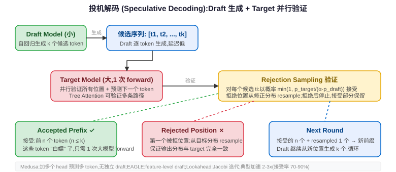

## 一句话结论

Speculative Decoding 利用 autoregressive decode 阶段的 memory-bound 特性，用小模型（或同等模型的轻量头）快速"猜"多个 future token，再用大模型一次 forward pass 并行验证，用略多于生成 1 个 token 的代价拿到 k 个被接受的 token，在不改变输出分布的前提下获得 2-3x 加速。
<div class="card card-m">
<h3>核心洞察：Autoregressive Decode 为什么慢</h3>
<p>LLM 推理分两阶段：prefill（处理输入 prompt，一次 forward 算完所有 token）和 decode（自回归逐个生成输出 token）。<strong>Decode 阶段是典型的 memory-bound 场景</strong>：</p>
<ul>
<li>每生成 1 个 token，都要做一次 forward pass，把<strong>整个模型的所有权重</strong>从 HBM 读到计算单元</li>
<li>但每个 step 实际上只生成 1 个 token——计算量是 batch×1×d_model 的 GEMV，相比"读完全部权重"的带宽代价，计算本身几乎免费</li>
<li>GPU 算力单元大量空闲，时间全花在"等权重从 HBM 搬过来"</li>
</ul>
<p>这就是投机解码的机会：既然读一次权重这么贵，能不能"顺便"多验证几个 token？如果验证 k+1 个 token 的代价只比生成 1 个略高，而其中平均有 k 个被接受，那就能获得接近 k 倍的加速。</p>
<div class="qa-summary">面试口径：decode 的瓶颈不是算，是"读权重"；一次 forward 读完全部权重，如果能在同一次 forward 里验证多个位置，边际成本很低。</div>
</div>

<div class="card card-d">
<h3>Naive Speculative Decoding 流程</h3>
<p>最基础的投机解码用一个<strong>小 draft model</strong>（同架构但层数更少/维度更小）和大 target model 配合：</p>
<ol>
<li><strong>Draft 阶段</strong>：用小模型自回归生成 k 个候选 token（$x_1, x_2, ..., x_k$）。这 k 步每步只需要读小模型权重，成本很低。</li>
<li><strong>Verify 阶段</strong>：把 prefix + k 个 draft token 拼在一起，作为长度为 k+1 的序列，喂给大模型做<strong>一次并行 forward pass</strong>，同时得到所有 k+1 个位置的输出分布。</li>
<li><strong>Accept/Reject</strong>：从第一个 draft token 开始逐个检查：如果大模型也"认同"这个 token，就接受；遇到第一个不被接受的位置，在该位置从一个修正后的分布里采样一个 token 作为真正输出，丢弃后面所有 draft token。</li>
<li><strong>循环</strong>：以新接受的 token 为新 prefix，回到第 1 步。</li>
</ol>



<p>关键：verify 阶段虽然输入长度是 k+1，但因为是一次并行 forward，主要代价仍然是"读一次大模型权重"（在 decode 的 memory-bound 区间里），和读一次生成 1 个 token 差不了多少。这就是"花一份钱拿多份货"。</p>
</div>

<div class="card card-s">
<h3>Rejection Sampling：严格保证输出分布不变</h3>
<p>投机解码不能牺牲输出质量——必须保证最终输出和直接用大模型生成的分布<strong>完全一致</strong>。这靠 rejection sampling 实现：</p>
<p>设 draft model 在位置 i 的分布为 $p_d(x_i | x_{&lt;i})$，target model 的分布为 $p_t(x_i | x_{&lt;i})$。对于 draft 给出的 token $x_i$：</p>
<ul>
<li><strong>接受概率</strong>：$a_i = \min\left(1, \dfrac{p_t(x_i | x_{&lt;i})}{\alpha \cdot p_d(x_i | x_{&lt;i})}\right)$，其中 α 是温度调节因子（通常 α=1）。如果 target 对这个 token 的概率比 draft 高，一定接受；如果 draft 给的概率过高，以概率 $p_t / (\alpha p_d)$ 接受。</li>
<li><strong>拒绝时的修正分布</strong>：如果拒绝，不能直接用 draft 的 token，而是从<strong>残差分布</strong>采样：$p'(x) = \dfrac{\max(0,\; p_t(x) - \alpha \cdot p_d(x))}{Z}$，其中 Z 是归一化常数。这个分布就是"target 想要但 draft 没覆盖到的部分"，确保整体分布等价于直接从 target 采样。</li>
</ul>

```python
def speculative_sample(p_target, p_draft, draft_token, alpha=1.0):
    accept_prob = min(1.0, p_target[draft_token] / (alpha * p_draft[draft_token]))
    if random.random() < accept_prob:
        return draft_token, True  # 接受
    else:
        # 从残差分布采样
        residual = np.maximum(0, p_target - alpha * p_draft)
        residual = residual / residual.sum()
        return sample_from(residual), False  # 拒绝，用修正分布
```

<div class="qa-summary">直觉：draft 猜得准（target 概率高）就接受；猜错了就从"target 想要但 draft 给低了"的部分补采一个 token。数学上可以严格证明这和直接从 target 采样同分布。</div>
</div>

<div class="card card-m">
<h3>Acceptance Rate 和加速比</h3>
<p>投机解码的加速比直接取决于<strong>接受率</strong>（acceptance rate）——平均每轮 verify 有多少个 draft token 被接受。设接受率为 β，draft 每步代价为 $c_d$，target 每步代价为 $c_t$，draft 长度为 k：</p>
<p>$$\text{Speedup} \approx \frac{1}{\dfrac{c_t}{c_t} \cdot \dfrac{1}{\mathbb{E}[\text{accepted tokens}]} + \dfrac{k \cdot c_d}{c_t} \cdot \dfrac{1}{\mathbb{E}[\text{accepted tokens}]}}$$</p>
<p>简单估算：如果 draft 模型足够小（$c_d \ll c_t$），加速比约等于平均接受 token 数：</p>
<table>
<tr><th>Draft 模型质量</th><th>典型接受率</th><th>典型加速比</th></tr>
<tr><td>同家族小模型（如 7B draft 猜 70B）</td><td>70%~90%</td><td>2~3x</td></tr>
<tr><td>跨家族 draft 模型</td><td>40%~60%</td><td>1.2~1.8x（可能不划算）</td></tr>
<tr><td>同模型自推测（Medusa/EAGLE）</td><td>60%~80%</td><td>2~3x</td></tr>
</table>
<p>Draft 长度 k 需要调优：k 太小浪费并行容量，k 太大则 draft 生成开销上升且后面 token 接受率递减。常用 k=3~5。</p>
</div>

<div class="card card-s">
<h3>变体一：Medusa——无额外 Draft 模型</h3>
<p>Medusa 不使用独立的 draft 模型，而是在 target model 的最后一层 hidden states 之上添加多个<strong>Medusa heads</strong>（简单的线性层）：</p>
<ul>
<li>每个 Medusa head 是一个 $d \times |V|$ 的线性层，预测未来第 i 个 token（head 0 就是原始 lm_head）</li>
<li>训练时冻结原始模型权重，只训练 Medusa heads，用标准 next-token prediction loss</li>
<li>推理时多个 head 同时输出候选 token，形成<strong>候选树</strong></li>
<li>用<strong>tree attention</strong>一次 forward 并行验证树上所有候选路径</li>
</ul>
<p>好处：不需要加载额外的 draft 模型，显存开销小，推理系统简单。坏处：Medusa heads 的表达能力有限，接受率通常略低于独立 draft 模型。</p>
</div>

<div class="card card-s">
<h3>变体二：EAGLE——特征级 Speculation</h3>
<p>EAGLE（Extrapolation Algorithm for Greater Language-model Efficiency）的关键改进是在<strong>特征级别</strong>（hidden states）而不是 token 级别做推测：</p>
<ul>
<li>Draft 阶段不只预测 token，还预测下一个位置的 hidden state（特征），然后在特征上做 decoding</li>
<li>因为特征包含比 token id 更丰富的上下文信息，draft 准确率显著提高，接受率更高</li>
<li>EAGLE-2 进一步引入<strong>置信度驱动的动态 draft 长度</strong>：当前面的 token 置信度高时多猜几个，置信度低时少猜，避免在低置信区间浪费 draft 计算</li>
<li>典型加速比 2~3x，且不需要完整的独立 draft 模型</li>
</ul>
<p>直觉：token 是离散的、信息瓶颈式的表示，而 hidden state 是连续的、高维的表示，在连续空间里做外推更容易猜准。</p>
</div>

<div class="card card-s">
<h3>变体三：Lookahead Decoding——无 Draft 模型的自推测</h3>
<p>Lookahead Decoding 完全不需要 draft 模型，利用<strong>Jacobi 迭代</strong>的思想从 target model 自身生成候选：</p>
<ul>
<li>把 autoregressive generation 看成求解一个不动点方程，Jacobi 迭代可以<strong>并行</strong>产生多个位置的 guess</li>
<li>从历史生成中收集 <strong>n-gram 匹配</strong>，构建候选 token 序列</li>
<li>和其他方法一样，用一次并行 forward pass 验证所有候选</li>
<li>本质是利用"好的猜测可以来自模型自身的 n-gram 规律"，不需要额外训练任何东西</li>
</ul>
<p>好处：零训练成本、即插即用。坏处：n-gram 候选质量有限，加速比通常不如有训练的方法。</p>
</div>

<div class="card card-d">
<h3>Tree Attention：所有变体的共同引擎</h3>
<p>Medusa、EAGLE、Lookahead 等方法都用<strong>树结构</strong>组织候选 token，而不是简单的线性链：</p>
<ul>
<li>每个位置可能有多个候选 token（分支），形成一棵候选树</li>
<li>构造<strong>tree attention mask</strong>：树上的每个节点只能 attend 到它的祖先路径上的节点，不能 attend 到兄弟分支</li>
<li>将整个 tree 打平成一个 batch，在一次 target model forward pass 中并行验证所有候选路径</li>
<li>接受最长的一条"所有 token 都被接受"的前缀路径</li>
</ul>
<p>Tree attention 比简单的"线性 k 个 draft token"能探索更多候选组合，显著提高找到长匹配前缀的概率，但 mask 构造和 kernel 实现更复杂。</p>

```text
线性 draft:  [prefix] → t1 → t2 → t3 → t4 → t5   （一条链）

Tree draft:  [prefix] → t1a ── t2a ── t3a
                      └─ t1b ── t2b
                      └─ t1c
              （多条分支，一次 forward 全部验证）
```
</div>

<div class="card card-w">
<h3>投机解码的适用条件和局限</h3>
<table>
<tr><th>条件</th><th>说明</th></tr>
<tr><td>✅ 必须是 memory-bound 场景</td><td>投机解码的收益来自"读一次权重顺便验证多个 token"。Prefill 阶段是 compute-bound（矩阵×矩阵），读权重的代价摊在大量计算上，投机解码几乎没收益。</td></tr>
<tr><td>✅ Draft overhead 必须足够小</td><td>如果 draft 模型本身计算/访存代价不低（比如 draft 模型也比较大），收益会被吃掉。</td></tr>
<tr><td>⚠️ Batch size 增大收益下降</td><td>大 batch 时多个请求共享一次权重读取，per-token 的权重读取成本降低（更接近 compute-bound），投机解码的边际收益递减。</td></tr>
<tr><td>⚠️ 显存开销增加</td><td>需要同时加载 draft 模型（或 Medusa heads），多占一部分显存。</td></tr>
<tr><td>⚠️ 系统复杂度高</td><td>需要实现 tree attention、rejection sampling、draft-target 调度，工程成本不低。</td></tr>
<tr><td>❌ 不适合大量输出很长的场景</td><td>实际上投机解码主要加速 decode，对长输出有帮助但不会改变总长度量级。</td></tr>
</table>
</div>

<div class="card card-d">
<h3>主流推理引擎的投机解码支持</h3>
<table>
<tr><th>引擎</th><th>支持的 Speculative 方法</th><th>配置方式</th></tr>
<tr><td>vLLM</td><td>Draft model（独立小模型）、Medusa、EAGLE/EAGLE-2、NGram（lookahead）</td><td><code>--speculative-model [draft_model_path]</code>，<code>--num-speculative-tokens k</code>，<code>--speculative-draft-tensor-parallel-size</code></td></tr>
<tr><td>TensorRT-LLM</td><td>Draft model、Medusa、EAGLE、ReDraft（tree-based）</td><td>通过 build 配置指定 draft engine 路径，运行时双引擎协作</td></tr>
<tr><td>SGLang</td><td>Draft model、EAGLE</td><td><code>--speculative-algorithm EAGLE</code>，<code>--speculative-eagle-topk</code> 控制树宽度</td></tr>
<tr><td>TGI (Text Generation Inference)</td><td>Draft model</td><td><code>--assistant-model-id</code> 参数</td></tr>
</table>
<p>实践建议：(1) 同模型家族 draft（如 7B 猜 70B）是最稳妥的配置，接受率高、不需要额外训练；(2) EAGLE-2 在大多数场景接受率和速度比普通 draft model 好，且不需要独立模型，显存开销小；(3) Medusa 需要额外训练 heads，但部署最简单（单模型加载）；(4) 在线服务中投机解码对小 batch（<16）收益最明显，大 batch 场景可以动态关闭。</p>
</div>

<div class="card card-r">
<h3>常见误区</h3>
<ul>
<li><strong>误区 1：投机解码是近似方法</strong>——错。通过 rejection sampling 严格保证输出分布和原模型完全一致，是<strong>精确</strong>加速方法，不是近似。</li>
<li><strong>误区 2：Draft 模型越准越好</strong>——不完全对。接受率是关键，但 draft 模型本身的计算/访存代价也要算进去。存在一个最优性价比点。</li>
<li><strong>误区 3：投机解码对所有阶段都有效</strong>——主要对 decode 有效，对 prefill 基本无收益；对大 batch 场景收益也有限。</li>
<li><strong>误区 4：Medusa 需要额外模型</strong>——Medusa 只是额外的线性层 heads，参数量极少，不需要加载第二个完整模型。</li>
</ul>
</div>

<div class="qa" onclick="this.classList.toggle('open')">
<div class="qa-q">Q: 投机解码为什么能加速（从 HBM 带宽角度）？</div>
<div class="qa-a"><p>Autoregressive decode 每步生成 1 个 token，但必须把整个模型的所有权重从 HBM 读一遍。Decode 阶段的算子是 GEMV（矩阵×向量），计算量相对于访存量很小，属于 memory-bound——GPU 算力大量空闲，时间花在等权重传输。投机解码在 verify 阶段，用同样"读一遍大模型权重"的代价，通过一次并行 forward 同时计算 k+1 个位置的输出分布，相当于"顺便"验证 k 个 draft token。因为这 k+1 个位置的计算量相对于"读完全部权重"的带宽代价仍然很小，所以 verify k+1 个 token 的时间只比生成 1 个 token 略多，但如果平均接受 β·k 个 token，就获得了相应的加速比。</p></div>
</div>

<div class="qa" onclick="this.classList.toggle('open')">
<div class="qa-q">Q: Medusa 和普通 draft model 方法的区别？</div>
<div class="qa-a"><p>核心区别：(1) Medusa 不需要独立的 draft 模型，只在 target model 最后一层上加几个线性层（Medusa heads）来预测未来多个 token，参数量极少，不额外加载模型；(2) 普通 draft model 是一个完整的小模型，需要独立加载到显存、独立做 autoregressive draft 生成，显存开销大但 draft 质量通常更高；(3) Medusa 用 tree attention 验证多分支候选，普通方法常常用线性 draft chain。代价是 Medusa heads 表达能力有限，接受率可能略低于好的独立 draft 模型。</p></div>
</div>

<div class="qa" onclick="this.classList.toggle('open')">
<div class="qa-q">Q: 拒绝采样（Rejection Sampling）怎么保证输出分布不变？</div>
<div class="qa-a"><p>数学保证：对于每个 draft token x_i，以 min(1, p_t(x_i)/(α·p_d(x_i))) 的概率接受；如果拒绝，则从残差分布 p'(x) ∝ max(0, p_t(x) - α·p_d(x)) 采样。可以证明，经过这个 accept/reject 机制后，被接受 token 的边缘分布恰好等于 target 分布 p_t。直觉上：当 draft 分布在某处概率过高（p_d > p_t），rejection 会以相应概率拒绝它；当 draft 分布在某处概率过低（p_d < p_t），被拒绝后残差分布正好补上这些缺失的概率质量，最终两者加起来精确还原 p_t。α=1 时是标准形式。</p></div>
</div>

<div class="qa" onclick="this.classList.toggle('open')">
<div class="qa-q">Q: 投机解码在 batch 推理时收益为什么下降？</div>
<div class="qa-a"><p>因为大 batch 时 decode 阶段不再是严格的 memory-bound：当 batch size 增大，一次 forward 处理多个请求，"读一遍权重"的带宽成本被摊到多个 token 的计算上，算子从 GEMV 逐渐变成 GEMM（矩阵×矩阵），算力利用率提高、arithmetic intensity 增加，逐渐进入 compute-bound 区间。此时 verify k+1 个 token 的边际成本上升（因为计算本身不再免费），而"读一遍权重"的相对收益变小。极端情况下 batch 足够大时投机解码几乎没收益甚至可能更慢。</p></div>
</div>

<div class="qa" onclick="this.classList.toggle('open')">
<div class="qa-q">Q: Speculative decoding 能用于 chunked prefill 吗？</div>
<div class="qa-a"><p>投机解码的原理本身不局限于 decode，但在 prefill（包括 chunked prefill）上收益很小：prefill 是 compute-bound 的（矩阵×矩阵运算，算力利用率高），"多读几个 token 一起算"的边际节省不大——因为本来就一次算了很多 token，权重读取成本早已被摊薄。投机解码的核心收益来自 decode 阶段"每步只算 1 个 token 却读完全部权重"的极度不平衡，prefill 不存在这个不平衡，所以基本不用。但 chunked prefill 把长 prompt 分成多块 prefill，可以和 decode 混跑，在系统层面可以协同调度，这是另一回事。</p></div>
</div>

## 关联模块

- `04-decode.md`：Decode 阶段的 memory-bound 特性是投机解码存在的根本前提。
- `06-performance-bottlenecks.md`：Roofline 分析、compute-bound vs memory-bound 的判断框架。
- `07-optimization-techniques.md`：投机解码是主流推理优化技术之一，与量化、batching、FlashAttention 等正交。
- `16-flashattention-explained.md`：同样是 IO-aware 优化，一个优化 attention kernel 的 HBM 读写，一个利用 decode 的带宽瓶颈做并行验证。
