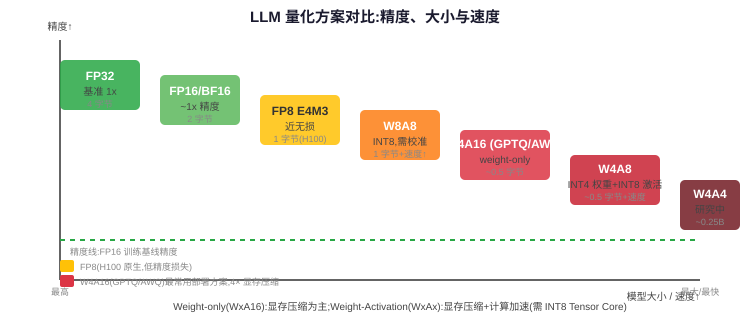

<div class="card card-m">
<h3>为什么要量化：显存和带宽的双重压力</h3>
<p>LLM 推理的显存消耗主要分三块：模型权重、KV cache、激活值。其中模型权重占据固定大头：</p>
<table>
<tr><th>模型规模</th><th>FP16 权重大小</th><th>INT8 权重</th><th>INT4 权重</th></tr>
<tr><td>7B</td><td>~14 GB</td><td>~7 GB</td><td>~3.5 GB</td></tr>
<tr><td>13B</td><td>~26 GB</td><td>~13 GB</td><td>~6.5 GB</td></tr>
<tr><td>70B</td><td>~140 GB</td><td>~70 GB</td><td>~35 GB</td></tr>
</table>
<p>量化带来两个直接好处：(1) <strong>同一 GPU 能放下更大模型</strong>（70B INT4 可在单张 A100-80G 上运行）；(2) <strong>decode 阶段从 HBM 读权重的带宽压力减小</strong>，每步 token 生成更快。间接好处是能支持更大 batch size、更多并发请求。</p>
</div>

<div class="card card-s">
<h3>量化基础：映射方式和粒度</h3>
<p>量化的基本操作是把浮点数 $x$ 映射到整数：$x_q = \text{round}(x / s) + z$，其中 $s$ 是 scale（缩放因子），$z$ 是 zero-point（零点，对称量化时 z=0）。反量化：$x \approx s \cdot (x_q - z)$。</p>

<h4>量化粒度（Granularity）</h4>
<table>
<tr><th>粒度</th><th>Scale 数量</th><th>精度</th><th>开销</th><th>使用场景</th></tr>
<tr><td>Per-tensor</td><td>整个矩阵 1 个 scale</td><td>最差</td><td>最小</td><td>早期方案，现在很少用</td></tr>
<tr><td>Per-channel（per-output-channel）</td><td>每行/每列 1 个 scale</td><td>较好</td><td>小</td><td>W8A8 常用，激活量化常用</td></tr>
<tr><td>Per-group（GPTQ）</td><td>每 group（如 128 个元素）1 个 scale</td><td>最好</td><td>略大</td><td>W4A16/GPTQ 常用，精度接近 FP16</td></tr>
</table>
<p>Per-token 动态量化是 KV cache 常用方式：每个 token 单独计算 scale，因为不同 token 的激活值范围差异很大。</p>

<h4>对称 vs 非对称量化</h4>
<ul>
<li><strong>对称量化（symmetric）</strong>：z=0，量化范围关于 0 对称，计算简单（不需要处理 zero-point），但浪费了整数范围中负数或正数一侧</li>
<li><strong>非对称量化（asymmetric/affine）</strong>：有 zero-point，能更充分利用整数范围，精度更好，但计算时多一步减法</li>
</ul>
<p>Weight 常用非对称（权重分布不均匀），Activation 常用对称 per-token（计算效率高）。</p>
</div>

<div class="card card-d">
<h3>核心分类：Weight-only vs Weight-Activation 量化</h3>
<p>这是面试最常考的区分，两者目标和效果完全不同：</p>

<div class="qa-section">
<div class="qa-section-title">Weight-only 量化（W4A16 / W8A16）</div>
<p>只把权重量化到 INT4/INT8，激活仍然用 FP16。计算时<strong>实时反量化</strong>权重再做矩阵乘：$Y = X \cdot \text{dequant}(W_q)$。</p>
<ul>
<li><strong>目的</strong>：减少权重的显存占用和 HBM 读取带宽，不直接加速计算（因为实际 matmul 仍在 FP16 下做）</li>
<li><strong>收益场景</strong>：decode 阶段（memory-bound，权重读取是瓶颈）——权重变小，从 HBM 读权重更快</li>
<li><strong>Prefill 阶段</strong>：prefill 是 compute-bound（GEMM），weight-only 量化反而因为要实时反量化可能略慢</li>
<li><strong>典型精度</strong>：W4A16 with group size 128 精度损失很小（perplexity 增加 0.1~0.5）</li>
</ul>
</div>

<div class="qa-section">
<div class="qa-section-title">Weight-Activation 量化（W8A8 / INT8 inference）</div>
<p>权重和激活都量化到 INT8，直接用 INT8 tensor core 做矩阵乘：$Y_q = X_q \cdot W_q$，再反量化输出。</p>
<ul>
<li><strong>目的</strong>：利用低精度 tensor core 获得<strong>真正的计算加速</strong>和显存带宽节省</li>
<li><strong>收益场景</strong>：prefill（compute-bound，INT8 GEMM 吞吐是 FP16 的 2 倍）和大 batch decode</li>
<li><strong>难点</strong>：激活存在 outlier（极端值），直接量化会导致严重精度损失，需要 SmoothQuant 等技术</li>
<li><strong>硬件要求</strong>：需要 INT8 tensor core 支持（A100/H100/RTX 系列均支持）</li>
</ul>
</div>

<div class="qa-summary">核心区别：W4A16/W8A16 省显存/带宽但不省算力，主要加速 decode；W8A8 用 INT8 算，既省带宽又省算力，prefill 也受益，但激活 outlier 是主要障碍。</div>
</div>

<div class="card card-m">
<h3>GPTQ：基于二阶信息的 Post-Training 量化</h3>
<p>GPTQ 是最经典的 W4A16 PTQ（Post-Training Quantization）方法，核心思想是<strong>逐列量化权重，用 Hessian 信息补偿误差</strong>：</p>
<ol>
<li><strong>观察</strong>：量化误差对不同权重的影响不同，与 Hessian 矩阵（二阶导数）有关——重要方向上的量化误差更影响输出</li>
<li><strong>逐列量化</strong>：按输出通道逐列量化权重矩阵，每次量化一列，然后把这列引入的误差<strong>补偿更新</strong>到所有尚未量化的列上</li>
<li><strong>误差补偿</strong>：利用 Hessian 逆矩阵的 Cholesky 分解，量化一权重量后，按最优方向调整剩余权重以抵消误差</li>
<li><strong>Group size</strong>：实际使用时每 128 个元素共享一个 scale 和 zero-point（per-group），在精度和开销间取得好的平衡</li>
</ol>
<p>典型效果：W4A16 group-size=128 在 7B~13B 模型上 perplexity 增加约 0.1~0.3，基本无感；70B 模型上增加约 0.3~0.5。需要校准数据集（约 128~1024 个样本），不需要重训。</p>

```python
# GPTQ 核心直觉（伪代码）
for each column W[:, i]:
    quantize W[:, i] to INT4  # 量化当前列
    error = W[:, i] - dequant(quantized_W[:, i])  # 量化误差
    # 把误差补偿到后续列
    W[:, i+1:] -= error @ Hessian_inv[i, i+1:] / Hessian_inv[i, i]
```
</div>

<div class="card card-m">
<h3>AWQ：Activation-Aware Weight Quantization</h3>
<p>AWQ 的出发点和 GPTQ 不同：它不依赖二阶信息，而是基于一个关键观察——<strong>不是所有权重都同等重要，对应大激活值的权重更重要</strong>。</p>
<ul>
<li><strong>核心观察</strong>：权重中只有很少一部分（~1%）对应着大激活值通道，保护好这部分权重就能保持大部分精度</li>
<li><strong>做法</strong>：不直接对所有权重量化，而是通过 per-channel scaling 因子 $s$ 对权重做"等价变换"：$Y = X \cdot W = (X \cdot \text{diag}(s)^{-1}) \cdot (\text{diag}(s) \cdot W)$，选择 $s$ 让"重要权重"（即对应大激活的权重）在量化时得到更大的有效范围、减少截断误差</li>
<li><strong>等价性</strong>：数学上这个变换完全等价于原计算，不改变输出值，只是改变了哪些权重被"保护"</li>
<li><strong>优势</strong>：不需要 Hessian 计算，速度比 GPTQ 快（校准时间短），W4A16 精度与 GPTQ 相当或略好，且支持更快的 W4A16 GEMV kernel</li>
</ul>

<div class="qa-summary">对比 GPTQ：GPTQ 逐列量化+误差补偿（基于优化视角），AWQ 找重要权重+scale 保护（基于激活重要性视角）。AWQ 工程上更简单更快，GPTQ 理论上更精细。</div>
</div>

<div class="card card-m">
<h3>SmoothQuant：让 W8A8 变得可行</h3>
<p>W8A8 的主要障碍是<strong>激活 outlier</strong>：某些通道的激活值比其他通道大几个数量级，直接 per-tensor INT8 量化会把其他通道的精度全吃掉。SmoothQuant 的洞察是：</p>

<p><strong>难点不在于权重难量化，而在于激活难量化。</strong> 而我们可以通过数学等价变换，把量化难度从激活"迁移"到权重上：</p>
<p>$$Y = X W = (X \cdot \text{diag}(s)^{-1}) \cdot (\text{diag}(s) \cdot W) = X' W'$$</p>

<ul>
<li>选择 $s$ 使得变换后的激活 $X' = X \cdot \text{diag}(s)^{-1}$ 各通道的幅度<strong>更平滑</strong>（没有极端 outlier）</li>
<li>等价地，权重变成 $W' = \text{diag}(s) \cdot W$，部分通道被放大——但权重本身分布比较均匀，稍微放大一些通道对量化精度影响很小</li>
<li>具体选择：$s_j = \max(|X_j|)^\alpha / \max(|W_j|)^{1-\alpha}$，其中 $\alpha \in [0, 1]$ 是迁移强度，通常取 0.5 做平衡</li>
</ul>

<p>效果：经过 SmoothQuant 后，激活变得"平滑"可量化，W8A8 在多数模型上精度损失很小，能获得真正的 INT8 加速。</p>


</div>

<div class="card card-s">
<h3>FP8：H100 时代的新选择</h3>
<p>FP8（8-bit floating point）是 NVIDIA H100（Hopper 架构）原生支持的格式，相比 INT8 有独特优势：</p>

<table>
<tr><th>格式</th><th>位宽分配</th><th>精度（mantissa）</th><th>动态范围（exponent）</th><th>用途</th></tr>
<tr><td>E4M3</td><td>1 sign + 4 exp + 3 mantissa</td><td>更高（~3 位十进制）</td><td>较小（~±240）</td><td>前向传播（weights/activations）</td></tr>
<tr><td>E5M2</td><td>1 sign + 5 exp + 2 mantissa</td><td>较低</td><td>更大（~±57344）</td><td>反向传播（gradients，需要大动态范围）</td></tr>
</table>

<p>FP8 的优势：</p>
<ul>
<li><strong>更高动态范围</strong>：不需要像 INT8 那样担心 outlier，更接近 FP16 的数值行为，精度损失更小</li>
<li><strong>不需要复杂校准</strong>：通常只需要 per-tensor 或 per-channel scaling，不需要 SmoothQuant 这类迁移技术</li>
<li><strong>训练和推理统一</strong>：FP8 可用于训练（混合精度）和推理，减少部署摩擦</li>
<li><strong>硬件加速</strong>：H100 FP8 tensor core 吞吐是 FP16 的 2 倍</li>
</ul>
<p>FP8 是目前大模型部署（尤其是 H100 集群）的趋势方案，但要求 Hopper 及以上架构，A100 及更早 GPU 不支持。</p>
</div>

<div class="card card-s">
<h3>KV Cache 量化</h3>
<p>KV cache 量化是独立于权重量化的另一块——长上下文下 KV cache 可以占掉 30%~50% 的显存，直接决定能并发多少请求。</p>
<ul>
<li><strong>为什么量化 KV cache</strong>：减少显存占用 → 支持更多并发请求、更长上下文</li>
<li><strong>常用精度</strong>：INT8（已成熟）、FP8（H100 上更方便）、INT4（精度挑战较大，仍在研究）</li>
<li><strong>量化粒度</strong>：<strong>per-token per-channel</strong> 最常用——每个 token、每个 head 的 key/value 单独计算 scale。因为 KV 的值范围随 token 位置和 head 变化很大，用太粗的粒度精度损失严重</li>
<li><strong>特殊挑战</strong>：KV cache 需要逐 token 增量更新，不能做离线校准（是动态生成的）；attention 计算对 KV 的精度敏感（尤其是 key 的点积精度影响 attention 分布）</li>
<li><strong>实践</strong>：INT8 KV cache 精度损失小（~0.5 perplexity），已被 vLLM、TensorRT-LLM、SGLang 等主流引擎支持</li>
</ul>
</div>

<div class="card card-d">
<h3>量化方案对比表</h3>
<table>
<tr><th>方案</th><th>权重精度</th><th>激活精度</th><th>相对大小</th><th>加速场景</th><th>精度损失</th><th>硬件要求</th></tr>
<tr><td>FP16（基线）</td><td>FP16</td><td>FP16</td><td>1x</td><td>基线</td><td>无</td><td>通用</td></tr>
<tr><td>W8A16</td><td>INT8</td><td>FP16</td><td>~0.5x</td><td>Decode（省带宽）</td><td>极小（~0.1 ppl）</td><td>通用</td></tr>
<tr><td>W4A16 (GPTQ/AWQ)</td><td>INT4</td><td>FP16</td><td>~0.25x</td><td>Decode（大幅省带宽）</td><td>小（~0.2~0.5 ppl）</td><td>需要 W4A16 kernel</td></tr>
<tr><td>W8A8 (SmoothQuant)</td><td>INT8</td><td>INT8</td><td>~0.5x</td><td>Prefill + Decode（真加速）</td><td>小（~0.1~0.3 ppl）</td><td>INT8 tensor core</td></tr>
<tr><td>FP8 E4M3</td><td>FP8</td><td>FP8</td><td>~0.5x</td><td>Prefill + Decode</td><td>极小</td><td>H100+</td></tr>
<tr><td>W4A8</td><td>INT4</td><td>INT8</td><td>~0.25x</td><td>两者兼顾</td><td>中等（~0.5~1 ppl）</td><td>TensorRT-LLM 支持</td></tr>
<tr><td>W4A4</td><td>INT4</td><td>INT4</td><td>~0.125x</td><td>研究阶段</td><td>较大</td><td>研究中</td></tr>
</table>
<p>工程选型建议：追求精度用 FP8（H100）或 W8A16；追求最大并发用 W4A16 GPTQ/AWQ；追求 prefill 吞吐用 W8A8 + SmoothQuant；A100 部署常用 W4A16（decode 为主）或 W8A8（prefill heavy 场景）。</p>
</div>

<div class="card card-w">
<h3>量化在 Serving 系统中的实际考量</h3>
<ul>
<li><strong>权重量化不直接减少 KV cache</strong>——这是两个独立的量化维度，要分别处理</li>
<li><strong>量化模型的加载速度</strong>：小权重加载更快，冷启动时间缩短</li>
<li><strong>vLLM 支持</strong>：GPTQ、AWQ、SqueezeLLM、FP8（通过 Marlin/ExLlama kernels），KV cache INT8/FP8</li>
<li><strong>TensorRT-LLM 支持</strong>：FP8、INT4 weight-only、INT8 weight-only、W8A8、INT4 KV cache、W4A8 AWQ/GPTQ，kernel 优化更成熟</li>
<li><strong>混合量化</strong>：部分层保持 FP16（如首尾层、lm_head），其余层量化，精度损失更小</li>
<li><strong>量化感知训练（QAT）</strong>：比 PTQ 精度更好，但需要训练资源；大多数推理场景 PTQ 已足够</li>
</ul>
</div>

<div class="qa" onclick="this.classList.toggle('open')">
<div class="qa-q">Q: GPTQ 和 AWQ 的原理区别？</div>
<div class="qa-a"><p>两者都是 W4A16 PTQ 方法，但思路完全不同：GPTQ 从优化视角出发，逐列量化权重，利用 Hessian 矩阵（二阶信息）计算最优的误差补偿方向，把量化一引入的误差更新到未量化的权重上，类似于 OBS（Optimal Brain Surgeon）剪枝的思想；AWQ 从激活重要性视角出发，观察到只有对应大激活值通道的少量权重是关键的，通过等价的 per-channel scaling 变换让重要权重在量化时占据更大的动态范围（被"保护"），不做误差补偿。GPTQ 理论更精细但需要计算 Hessian，校准慢；AWQ 不依赖二阶信息，校准快，kernel 支持更友好，实际部署中两者精度相当。</p></div>
</div>

<div class="qa" onclick="this.classList.toggle('open')">
<div class="qa-q">Q: W4A16 和 W8A8 哪个更快？</div>
<div class="qa-a"><p>答案取决于场景：(1) Decode 阶段（memory-bound）：W4A16 更快。因为 decode 的瓶颈是从 HBM 读权重，W4 权重只有 W8 的一半大小，带宽需求减半；而且 W4A16 的 GEMV kernel 经过专门优化（如 Marlin、ExLlama），实际 decode 吞吐比 W8A8 更高。(2) Prefill 阶段（compute-bound）：W8A8 更快。Prefill 是矩阵×矩阵运算，瓶颈在算力，W8A8 用 INT8 tensor core 做实际低精度计算，理论吞吐是 FP16 的 2 倍；W4A16 需要先把 INT4 权重反量化到 FP16 再算，prefill 不加速甚至略慢。(3) 大 batch decode：当 batch 足够大时 decode 也进入 compute-bound 区域，此时 W8A8 可能反超。实践中 W4A16 是"单/小 batch、长生成"场景的最佳选择，W8A8 适合"大 batch、prefill heavy"场景。</p></div>
</div>

<div class="qa" onclick="this.classList.toggle('open')">
<div class="qa-q">Q: 为什么 SmoothQuant 要做 scale 迁移？</div>
<div class="qa-a"><p>因为 W8A8 量化的难点不在权重，而在激活：LLM 的激活存在严重的 outlier 现象——某些通道的激活值比其他通道大 100~1000 倍，直接 per-tensor 量化时这些 outlier 会把量化 scale 撑得极大，导致其他正常通道的精度全部丢失。SmoothQuant 发现，通过数学等价变换 Y = XW = (X·diag(s)⁻¹)(diag(s)·W)，可以选择合适的 per-channel scale s，把激活 outlier 通道"压下来"（除以大的 s_j），等价于把对应的权重通道"放大"（乘以 s_j）。关键是权重本身分布比较均匀，放大一些通道对权重量化精度影响很小，但激活变得平滑、容易量化了。本质是"把量化难度从激活迁移到权重上"，因为权重更容易承受这种变化。α=0.5 通常效果最好。</p></div>
</div>

<div class="qa" onclick="this.classList.toggle('open')">
<div class="qa-q">Q: FP8 和 INT8 有什么区别？</div>
<div class="qa-a"><p>(1) 表示方式：INT8 是整数（定点），FP8 是浮点数，有 exponent 和 mantissa 位，动态范围更大。E4M3 范围约 ±240，E5M2 约 ±57344；INT8 对称量化范围约 ±127。(2) 精度特性：FP8 是相对精度（浮点数的精度随幅度自适应，小值精度高、大值精度低），更符合神经网络值的分布特性；INT8 是绝对精度，对 outlier 更敏感。(3) 硬件支持：INT8 被所有现代 GPU 支持（A100/RTX30/40 系列等）；FP8 只有 Hopper（H100）及更新架构原生支持，H100 的 FP8 tensor core 吞吐是 FP16 的 2 倍。(4) 部署难度：FP8 由于动态范围大，outlier 问题小，不需要 SmoothQuant 这类复杂校准，per-tensor 或 per-channel scaling 通常就够了，部署更简单；INT8 需要处理激活 outlier，通常要 SmoothQuant。(5) 训练支持：FP8 天然支持训练（E4M3 前向、E5M2 反向），INT8 训练难度大。</p></div>
</div>

<div class="qa" onclick="this.classList.toggle('open')">
<div class="qa-q">Q: KV cache 用 per-token 还是 per-channel 量化好？</div>
<div class="qa-a"><p>KV cache 量化通常用 <strong>per-token per-channel</strong>（即对每个 token、每个 head/channel 单独计算 scale），而不是全局 per-tensor 或仅 per-channel。原因：(1) KV 是增量生成的，不同 token 的值范围差异很大（比如开头 token 和后面 token 的 norm 差别大），per-token 能适应这种变化；(2) 不同 attention head 的 KV 分布差异也很大，per-channel/per-head 可以保护各 head 的精度。代价是 scale 的存储开销（每个 token 每个 head 存一个 scale），但这个开销相比 KV 本身很小。实践中 INT8 per-token per-channel KV cache 量化的精度损失极小（perplexity 增加 < 0.5），而显存减半，是主流推理引擎的默认选项。</p></div>
</div>

<div class="qa" onclick="this.classList.toggle('open')">
<div class="qa-q">Q: 量化会影响 prefill 还是 decode 更多？</div>
<div class="qa-a"><p>分情况：(1) Weight-only 量化（W4A16/W8A16）主要加速 decode，对 prefill 帮助很小甚至略慢。因为 decode 是 memory-bound，权重从 HBM 读取是瓶颈，权重变小直接加速；prefill 是 compute-bound，瓶颈在 GEMM 计算，W4A16 还需要实时反量化可能引入 overhead。(2) Weight-activation 量化（W8A8/FP8）对 prefill 和 decode 都加速，prefill 加速更明显。因为 W8A8 用 INT8/FP8 tensor core 实际做低精度矩阵乘，理论吞吐是 FP16 的 2 倍，对 compute-bound 的 prefill 直接翻倍；decode 阶段也受益于带宽减半。(3) KV cache 量化主要影响长上下文和高并发场景，对 prefill 和 decode 的影响相似（减少 KV 显存占用和读写带宽）。面试回答时要分清楚权重量化的类型，不能笼统说"量化加速推理"。</p></div>
</div>
