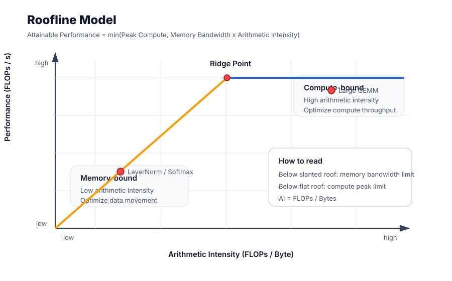
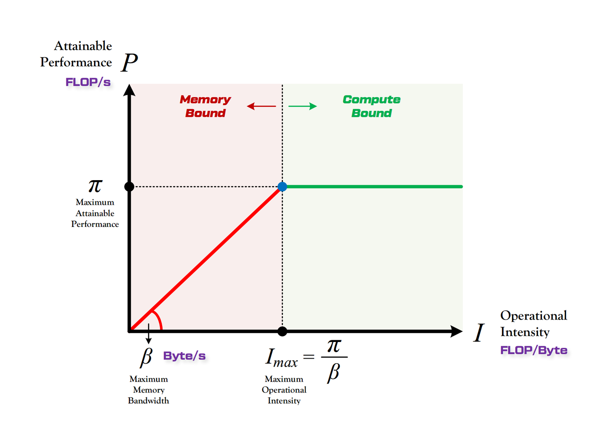
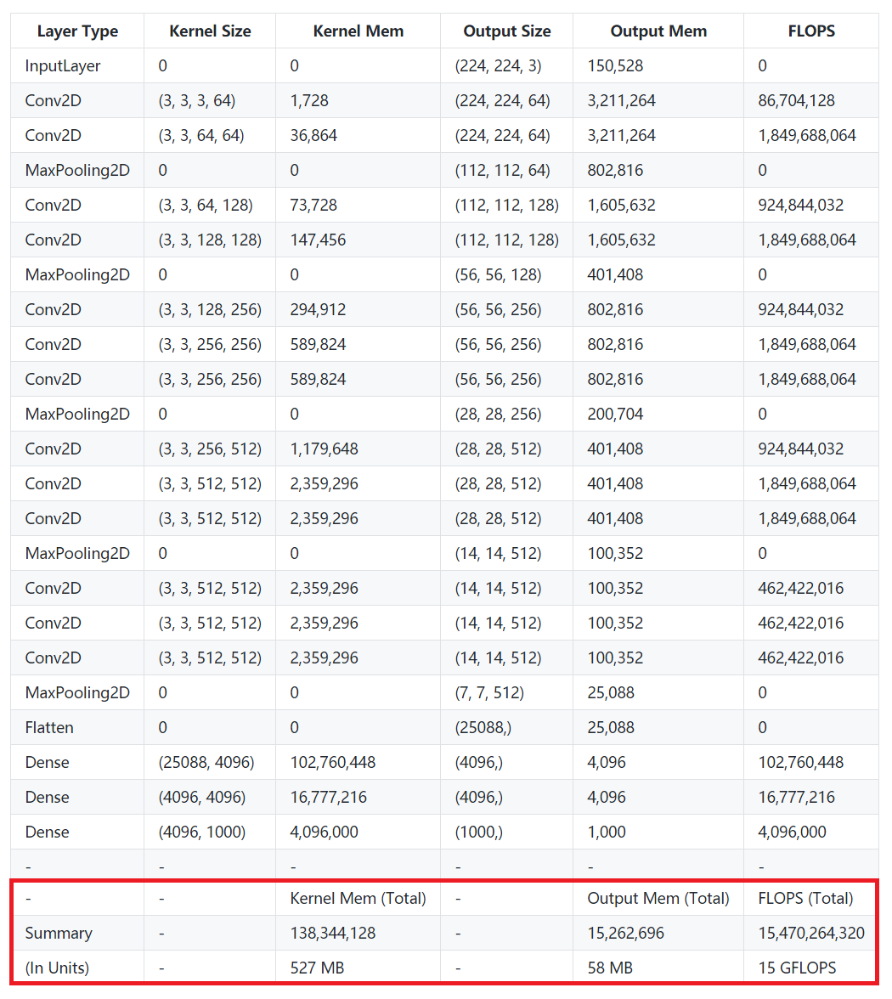
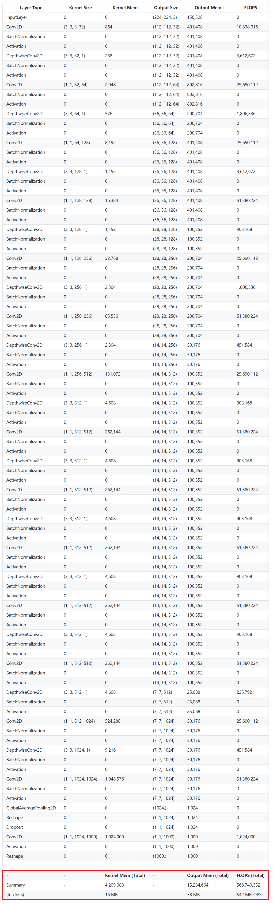
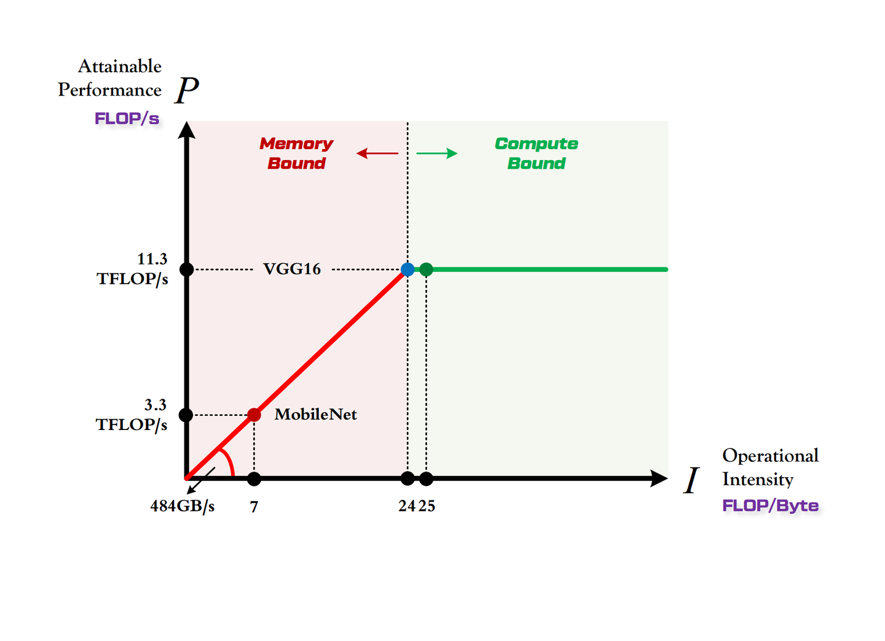

## 一句话结论

Roofline Model 是性能预测的理论基线：用**算力 π**、**带宽 β** 和模型的**计算强度 I** 三个量，给出模型在某硬件平台上的**理论性能上限** $P = \min(\pi, \beta \cdot I)$。

## 复习定位

| 维度 | 内容 |
|---|---|
| 所属模块 | 性能预测与建模 |
| 章节类型 | 机制类（含公式） |
| 解决问题 | 在没有跑实验的前提下，先估出"模型在某张卡上能跑多快"的上界，作为容量规划、调度选机器、瓶颈定位的第一性参考。 |
| 面试抓手 | 算力、带宽、计算强度三个量；Compute-Bound vs Memory-Bound 判定；VGG16 vs MobileNet 在 1080Ti 上的对比。 |
| 出处 | 整理自 [知乎：Roofline Model 介绍](https://zhuanlan.zhihu.com/p/34204282)。 |

## 阅读路径

1. 先记住一句话结论：**Roofline 给的是性能上界，不是实际表现**。
2. 看两组指标：平台侧（π、β、I_max）和模型侧（计算量、访存量、I）。
3. 用 VGG16 / MobileNet 在 1080Ti 上的对比，把"为什么小模型在大卡上跑不出加速比"这个反直觉结论建起来。
4. 最后看常见误区，避免把 Roofline 当成实际性能。

<h3>① 计算平台的两个指标：算力 π 与带宽 β</h3>
<table>
<tr><th>指标</th><th>含义</th><th>单位</th><th>面试一句话</th></tr>
<tr><td>算力 π</td><td>计算平台每秒能做的浮点运算数（性能上限）</td><td><code>FLOP/s</code></td><td>"屋顶的高度"</td></tr>
<tr><td>带宽 β</td><td>计算平台每秒能完成的内存交换量（带宽上限）</td><td><code>Byte/s</code></td><td>"房檐的斜率"</td></tr>
<tr><td>计算强度上限 Imax</td><td>π / β，单位内存交换最多能撑多少次计算</td><td><code>FLOPs/Byte</code></td><td>"屋顶和房檐的交点"</td></tr>
</table>

$$I_{max} = \frac{\pi}{\beta}$$

<strong>注意</strong>：这里"内存"是广义的——CPU 平台上是主存，GPU 平台上是显存（HBM）。π / β 都是峰值，不是平均。

<h3>② 模型的两个指标：计算量与访存量</h3>
<table>
<tr><th>指标</th><th>含义</th><th>单位</th><th>对应复杂度</th></tr>
<tr><td>计算量 FLOPs</td><td>单次前向传播的浮点运算总数</td><td><code>FLOPs</code></td><td>时间复杂度</td></tr>
<tr><td>访存量 Bytes</td><td>单次前向传播的内存交换总量（理想情况下 = 权重内存 + 特征图内存）</td><td><code>Byte</code></td><td>空间复杂度</td></tr>
<tr><td>计算强度 I</td><td>计算量 ÷ 访存量，每搬 1 Byte 数据能做多少次浮点运算</td><td><code>FLOPs/Byte</code></td><td>数据复用率</td></tr>
<tr><td>理论性能 P</td><td>模型在该平台上的每秒浮点运算次数（Roofline 的输出）</td><td><code>FLOP/s</code></td><td>性能上界</td></tr>
</table>

卷积层的两个常用公式（M = 输出特征图边长，K = 卷积核边长，C 为通道数）：

$$\text{Conv Time Complexity} = M^2 \cdot K^2 \cdot C_{in} \cdot C_{out} \quad (\text{FLOPs})$$

$$\text{Conv Space Complexity} = (K^2 \cdot C_{in} \cdot C_{out} + M^2 \cdot C_{out}) \cdot 4 \quad (\text{Bytes})$$

访存量乘 4 是因为 <code>float32</code> 占 4 字节。<strong>I = 计算量 / 访存量</strong>，I 越大说明数据复用率越高，越不容易卡在内存上。

<h3>③ Roofline Model：把两组指标拼起来</h3>

Roofline 标准示意：横轴是算术强度，纵轴是实际性能；斜线是 memory roof，水平线是 compute roof，交点是 ridge point。

Roofline 形态：算力决定"屋顶"高度（绿色水平线），带宽决定"房檐"斜率（红色斜线），交点 = Imax。

Roofline 解决的核心问题：<strong>计算量为 A、访存量为 B 的模型，在算力为 C、带宽为 D 的平台上，理论性能上界是多少？</strong>用一个分段函数表达：

$$P = \begin{cases} \beta \cdot I, & I < I_{max} \quad \textbf{(Memory-Bound)} \\[1.2ex] \pi, & I \geq I_{max} \quad \textbf{(Compute-Bound)} \end{cases}$$

<table>
<tr><th>区域</th><th>判定</th><th>瓶颈在哪</th><th>优化方向</th></tr>
<tr><td><strong>Compute-Bound</strong>（屋顶）</td><td>I ≥ Imax</td><td>算力 π 限死了 P</td><td>低精度（FP16/INT8）、TensorCore、提高 SM 利用率；这种状态其实是好的，说明算力被吃满了</td></tr>
<tr><td><strong>Memory-Bound</strong>（房檐）</td><td>I &lt; Imax</td><td>带宽 β 限死了 P</td><td>kernel fusion 减少访存、量化压缩权重、提高 batch 提高数据复用、用 cache/SRAM</td></tr>
</table>

本质：模型的 I 和平台的 Imax 谁大谁小，决定了你优化的发力点。<strong>Imax 是平台的属性，I 是模型的属性，两者无关</strong>——这就是为什么"同一个模型换一张卡，瓶颈类型可能完全不同"。

<h3>怎么读 Roofline 图</h3>
<table>
<tr><th>图上元素</th><th>含义</th><th>面试解释</th></tr>
<tr><td>X 轴：Arithmetic Intensity</td><td><code>FLOPs / Byte</code></td><td>每搬 1 Byte 数据能做多少计算，越高说明数据复用越好</td></tr>
<tr><td>Y 轴：Performance</td><td><code>FLOPs/s</code></td><td>实际达到的计算吞吐</td></tr>
<tr><td>Memory Roof</td><td><code>Bandwidth × Arithmetic Intensity</code></td><td>斜线区域说明性能被内存带宽限制</td></tr>
<tr><td>Compute Roof</td><td><code>Peak FLOPs/s</code></td><td>水平线区域说明性能被计算峰值限制</td></tr>
<tr><td>Ridge Point</td><td><code>Peak FLOPs/s ÷ Peak Bandwidth</code></td><td>低于它偏 memory-bound，高于它才可能 compute-bound</td></tr>
</table>

Roofline 不是告诉你真实耗时一定是多少，而是告诉你<strong>理论上限在哪里，以及优化应该朝哪个方向走</strong>。

<h3>一个数字例子</h3>

假设 GPU 峰值算力是 100 TFLOPS，显存带宽是 2 TB/s，那么 ridge point = 50 FLOPs/Byte。

<table>
<tr><th>Kernel</th><th>算术强度</th><th>带宽屋顶</th><th>最终上限</th><th>判断</th></tr>
<tr><td>A</td><td>5 FLOPs/Byte</td><td>10 TFLOPS</td><td><code>min(100, 10)=10</code></td><td>memory-bound</td></tr>
<tr><td>B</td><td>100 FLOPs/Byte</td><td>200 TFLOPS</td><td><code>min(100, 200)=100</code></td><td>compute-bound</td></tr>
</table>

面试口径：低算术强度的 kernel 即使 GPU 峰值算力很高也跑不满，因为数据搬运先撞到 memory roof。

<h3>④ 实例分析：VGG16 vs MobileNet 在 1080Ti 上</h3>

<h4>VGG16</h4>

VGG16 各层 Kernel Mem、Output Mem 与 FLOPs。

<ul>
<li>计算量 ≈ <strong>15 GFLOPs</strong>（前向）</li>
<li>访存量 ≈ <strong>600 MB</strong>（Kernel Mem + Output Mem，乘 4）</li>
<li>计算强度 <strong>IV ≈ 25 FLOPs/Byte</strong></li>
</ul>

<strong>VGG 是计算强度登峰造极的模型</strong>，简约不简单。如果把顶端两个全连接层（占 80% 参数）换成 GAP，计算强度还能再翻 4 倍以上。

<h4>MobileNet</h4>

MobileNet 用 DW + PW 大幅压低 FLOPs，但同时也付出了"细长、计算效率低"的代价。

<ul>
<li>计算量 ≈ <strong>0.5 GFLOPs</strong>（VGG16 的 1/30）</li>
<li>访存量 ≈ <strong>74 MB</strong>（VGG16 的 1/8）</li>
<li>计算强度 <strong>IM ≈ 7 FLOPs/Byte</strong></li>
</ul>

FLOPs 降得比访存量更快，所以 <strong>I 反而下降了</strong>——这就是 DW + PW 这种"轻量化"算子的代价。

<h4>放进 1080Ti 的 Roofline</h4>
<table>
<tr><th>项</th><th>数值</th></tr>
<tr><td>1080Ti 算力 π</td><td>11.3 TFLOP/s</td></tr>
<tr><td>1080Ti 带宽 β</td><td>484 GB/s</td></tr>
<tr><td>1080Ti 计算强度上限 Imax</td><td>≈ 24 FLOPs/Byte</td></tr>
<tr><td>VGG16 的 IV</td><td>≈ 25 → 刚好越过 Imax，<strong>Compute-Bound</strong></td></tr>
<tr><td>MobileNet 的 IM</td><td>≈ 7 → 远低于 Imax，<strong>Memory-Bound</strong></td></tr>
</table>

VGG16 落在屋顶上（吃满算力），MobileNet 落在房檐上（被带宽卡住）。

反直觉结论：<strong>MobileNet 的计算量只有 VGG 的 1/30，但在 1080Ti 上的实际加速大约只有 10 倍</strong>。原因是 MobileNet 卡在带宽上（PM ≈ β · IM = 3.3 TFLOP/s），而 VGG 吃满了 1080Ti 的全部算力（PV = π = 11.3 TFLOP/s）。<strong>小模型在大卡上跑不满</strong>。

<h3>⑤ 工程含义：什么模型该跑在什么平台</h3>
<table>
<tr><th>场景</th><th>平台特征</th><th>合适的模型</th><th>原因</th></tr>
<tr><td>大卡训练（A100/H100/1080Ti）</td><td>π 高、β 高，Imax 通常 10-100</td><td>VGG / 大型 Transformer</td><td>计算强度高，能站到屋顶；MobileNet 这种放上来反而是浪费带宽</td></tr>
<tr><td>嵌入式 / 端侧 (TPU Edge / 手机 NPU)</td><td>π 低、β 也低，Imax 通常 &lt; 5</td><td>MobileNet / 量化小模型</td><td>IM = 7 在端侧已经能站到屋顶，反而能吃满算力，准确率只下降 1%</td></tr>
<tr><td>大模型推理 decode 阶段</td><td>每 step 只生成 1 token，访存大但计算少</td><td>—</td><td>天然 Memory-Bound；优化方向是 KV cache 压缩、PagedAttention、batching；详见 LLM 推理章节</td></tr>
</table>

<strong>"屠龙时用屠龙刀，日常吃鸡用小刀"</strong>——选模型不能只看 FLOPs，要看模型的 I 和目标平台的 Imax 是否匹配。

<h3>⑥ 常见误区</h3>

Q: Roofline 给出的是模型实际能跑出的性能吗？

<strong>不是</strong>。Roofline 给的是<strong>理论上界</strong>。实际性能还受 cache 大小、GEMM 实现质量、kernel launch 开销、调度策略、PCIe 拷贝、CPU 预处理等很多因素影响，所以实测往往低于 Roofline 上限——但<strong>永远不可能高于它</strong>。

Q: Imax 是模型的属性吗？

不是。<strong>Imax = π / β 是平台的属性</strong>，和模型无关。模型的属性是它自己的计算强度 I。判断 Compute-Bound / Memory-Bound 就是比较"模型的 I"和"平台的 Imax"。

Q: FLOPs 越小的模型在大卡上越快吗？

不一定。MobileNet 的 FLOPs 只有 VGG 的 1/30，在 1080Ti 上的实际理论性能是 3.3 TFLOP/s（卡在带宽上），而 VGG 是 11.3 TFLOP/s（吃满算力）。MobileNet 速度的真实优势只有约 10 倍，而不是 30 倍。<strong>FLOPs 不能直接外推为耗时</strong>。

Q: 训练和推理的 Roofline 一样吗？

不一样。前向传播的 FLOPs 和访存量本文已经给出。训练还要算<strong>反向传播</strong>（FLOPs 翻倍，访存量也涨）和<strong>梯度更新</strong>（Momentum、Adam 这些优化器还要存额外状态，访存量再涨），所以训练的 I 通常比推理小，更容易 Memory-Bound。

Q: Roofline 在 LLM 上还适用吗？

适用，但要分阶段看。<strong>Prefill</strong> 是大矩阵乘，I 很高，通常 Compute-Bound；<strong>Decode</strong> 每次只算 1 个 token，但要把整个 KV cache 读一遍，I 极低，通常 Memory-Bound。这就是为什么 LLM 推理的关键优化都集中在"怎么少搬 KV cache"——PagedAttention、量化、MQA/GQA 都是这个思路。

## 关联模块

- [`Transformer 与大模型基础 / 07-roofline-analysis`](../../transformer/07-roofline-analysis.md)：把 Roofline 用在 Transformer 算子分类上。
- [`Transformer / 08-decode-memory-bound`](../../transformer/08-decode-memory-bound.md)、[`09-operator-bound-classification`](../../transformer/09-operator-bound-classification.md)：LLM Decode 为何是 Memory-Bound 的具体推导。
- [`GPU / 03-performance-metrics`](../../gpu/03-performance-metrics.md)、[`09-bottleneck-classification`](../../gpu/09-bottleneck-classification.md)：从 GPU 视角看算力 / 带宽 / 利用率诊断。
- [`性能预测与建模 / 01-examples`](01-examples.md)：把 Roofline 这种"白盒上界"和 ML 树模型的"黑盒回归"放在一起对比，理解何时该用哪种预测方法。
