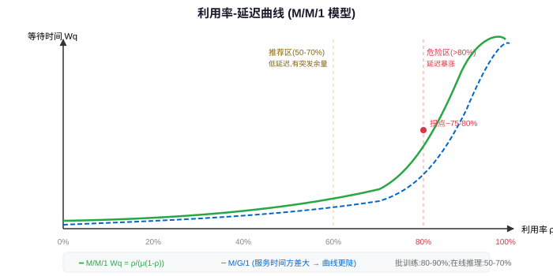

## 一句话结论

排队论（Queueing Theory）是容量规划和延迟分析的数学基础：Little's Law 给了"到达率 × 停留时间 = 平均队列长度"的普适关系；M/M/1 和 M/G/1 模型揭示了"利用率接近 1 时等待时间指数增长"和"服务时间方差会放大排队"这两个关键直觉，直接指导 GPU 集群目标利用率设定和工作负载隔离策略。

<h3>Little's Law：排队论的基础恒等式</h3>

Little's Law 是排队论中最普适、最有用的公式，<strong>不需要任何假设</strong>，适用于任何稳定的排队系统：

<pre><code>L = λ × W</code></pre>

其中：

<ul>
<li><strong>L</strong>：系统中（排队中 + 服务中）的平均顾客数（或平均任务数、平均请求数）</li>
<li><strong>λ</strong>：长期平均到达率（单位时间到达的顾客/任务数）</li>
<li><strong>W</strong>：顾客在系统中平均停留时间（等待时间 + 服务时间）</li>
</ul>

<strong>直觉理解</strong>：想象一个 GPU 集群，每小时来 100 个任务（λ = 100 个/小时），每个任务从提交到完成平均要 0.5 小时（W = 0.5 小时，即 30 分钟），那么系统中平均有 L = 100 × 0.5 = 50 个任务在同时运行或等待。这就像水管：流入速度 × 水在管中停留时间 = 管中存水量。

<h3>Little's Law 在 AI Infra 的应用</h3>

<h4>1. 容量规划</h4>

<strong>问题</strong>：在线推理集群，QPS = 1000，每个请求平均处理时间（含排队）是 100ms，需要多少并发槽位？

<pre><code>L = λ × W = 1000/s × 0.1s = 100</code></pre>

<strong>结论</strong>：系统需要至少容纳 100 个并发请求。如果每个 GPU 能处理 20 并发，那么至少需要 5 张 GPU。

<h4>2. 队列深度估算</h4>

<strong>问题</strong>：离线训练集群，每小时提交 20 个训练任务，平均每个任务从提交到开始运行要等 2 小时，队列平均有多长？

<pre><code>L = 20 个/小时 × 2 小时 = 40 个任务在排队或运行</code></pre>

<h4>3. 排队时间反推</h4>

<strong>问题</strong>：如果你观察到队列平均有 30 个任务等待，到达率是每小时 10 个，那么平均等待时间是多少？

<pre><code>W = L / λ = 30 / 10 = 3 小时</code></pre>

<strong>面试注意</strong>：Little's Law 没有假设到达分布或服务时间分布，也不需要系统是 Markovian，对任何稳定系统都成立。这是它最强大的地方。

<h3>Kendall 记号：描述排队模型的标准语言</h3>

Kendall notation 用 <code>A/S/c/N</code> 来描述排队模型：

<table>
<tr><th>符号</th><th>含义</th><th>常见取值</th></tr>
<tr><td>A</td><td>到达过程（Arrival）</td><td>M（Markovian/Poisson 到达，记忆性）、D（Deterministic 确定）、G（General 一般）</td></tr>
<tr><td>S</td><td>服务时间分布（Service）</td><td>M（Exponential 指数分布，记忆性）、D（确定）、G（一般）</td></tr>
<tr><td>c</td><td>服务台数量（Servers）</td><td>1, 2, ..., c</td></tr>
<tr><td>N</td><td>队列容量（可选）</td><td>∞（默认，无限队列）、N（有限，满了就拒绝）</td></tr>
</table>

<strong>记忆性（Memoryless Property）</strong>：指数分布的关键性质是"无记忆"——已经等了 t 时间，剩余等待时间的分布和刚开始等时一样。这就是 M 的含义。

<h3>M/M/1：单服务台模型，利用率-延迟曲线的来源</h3>

M/M/1 是最简单也是最重要的排队模型：Poisson 到达、指数服务时间、1 个服务台。

<h4>核心公式</h4>
<pre><code>ρ = λ / μ          # 利用率（utilization）
Wq = ρ / (μ(1-ρ))  # 排队等待时间（不含服务时间）
W = 1 / (μ - λ)    # 系统总时间 = 等待 + 服务</code></pre>

其中：

<ul>
<li><strong>μ</strong>：服务率（单位时间能服务完的任务数）</li>
<li><strong>ρ</strong>：利用率，必须 &lt; 1 系统才稳定</li>
</ul>

<h4>关键现象：利用率接近 1 时等待时间爆炸</h4>

看数值例子，假设 μ = 10 个/小时（服务率固定）：

<table>
<tr><th>到达率 λ</th><th>利用率 ρ</th><th>排队时间 Wq</th><th>等待 vs ρ=0.5</th></tr>
<tr><td>5/小时</td><td>50%</td><td>0.1 小时 = 6 分钟</td><td>基准</td></tr>
<tr><td>7/小时</td><td>70%</td><td>0.23 小时 ≈ 14 分钟</td><td>2.3 倍</td></tr>
<tr><td>8/小时</td><td>80%</td><td>0.4 小时 = 24 分钟</td><td>4 倍</td></tr>
<tr><td>9/小时</td><td>90%</td><td>0.9 小时 = 54 分钟</td><td>9 倍</td></tr>
<tr><td>9.5/小时</td><td>95%</td><td>1.9 小时 = 114 分钟</td><td>19 倍</td></tr>
<tr><td>9.9/小时</td><td>99%</td><td>9.9 小时 ≈ 10 小时</td><td>99 倍</td></tr>
</table>

<strong>这就是曲棍球棒（hockey-stick）曲线</strong>：利用率在 0-70% 时延迟增长平缓，超过 80% 后等待时间急速上升，ρ→1 时 Wq→∞。

<h4>AI Infra 启示</h4>

<strong>GPU 集群绝不能追求 95%+ 利用率</strong>：

<ul>
<li><strong>在线推理集群</strong>：目标利用率 50-70%，因为对延迟敏感，需要预留 headroom 应对突发流量</li>
<li><strong>离线批处理训练</strong>：可以推高到 80-90%，因为对排队延迟容忍度高，但超过 90% 还是会导致队列雪崩</li>
<li><strong>为什么不能 99% 利用率</strong>：因为到达率不是恒定的，总有波动。平均 90% 利用率意味着峰值时可能到 99%，等待时间直接爆炸。这就是为什么需要<strong>准入控制（Admission Control）</strong>——当集群已经高负载时，拒绝或排队新任务，而不是全部放进来让所有人都慢。</li>
</ul>

<h3>M/M/c：多服务台模型与 Erlang-C</h3>

M/M/c 有 c 个相同的并行服务台，这更符合真实的 GPU 集群（多台机器、多张 GPU）。

<h4>关键指标</h4>
<ul>
<li><strong>利用率</strong>：ρ = λ / (cμ)，必须 &lt; 1</li>
<li><strong>Erlang-C 公式</strong>：计算"一个到达的任务需要等待"的概率 P(wait)，这是呼叫中心、客服排队系统设计的核心公式</li>
<li><strong>多服务台的好处</strong>：同样的总服务能力，多台并行比单台快。例如 c=2、μ=5（总服务能力 10）比 c=1、μ=10 的等待时间短。因为单台被占时新任务只能等，两台时另一台可能空闲。</li>
</ul>

<h4>AI 集群直觉</h4>

GPU 集群本质上是 M/M/c 模型：c 是 GPU 总数（或某种 GPU 型号数量）。Erlang-C 可以估算"提交一个任务需要排队的概率"。但实际 AI 集群比 M/M/c 复杂：任务大小不同（1 GPU 到 1024 GPU）、有 Gang 调度需求、服务时间分布不是指数分布，所以更多用 M/G/1 的直觉。

<h3>M/G/1：服务时间有方差时排队会更糟</h3>

M/G/1 是"Poisson 到达、一般（任意）服务时间分布、单服务台"模型。这是<strong>最接近真实 AI 集群的简单模型</strong>，因为真实的任务运行时间不是指数分布——有 5 分钟的小实验，也有 10 天的大训练，方差很大。

<h4>Pollaczek-Khinchine 公式</h4>
<pre><code>Wq = (λ · E[S²]) / (2 · (1 - ρ))</code></pre>

其中：

<ul>
<li><strong>E[S]</strong>：服务时间 S 的期望（平均值）</li>
<li><strong>E[S²] = Var(S) + (E[S])²</strong>：服务时间的二阶矩，包含了方差信息</li>
<li><strong>Var(S)</strong>：服务时间方差</li>
</ul>

<h4>关键洞察：方差放大排队</h4>

公式告诉我们：<strong>即使平均服务时间 E[S] 和利用率 ρ 相同，服务时间方差 Var(S) 越大，排队等待时间 Wq 就越长</strong>。

<strong>数值例子</strong>：λ = 8/小时，E[S] = 0.1 小时（6 分钟），所以 ρ = 0.8：

<table>
<tr><th>场景</th><th>服务时间分布</th><th>E[S²]</th><th>Wq</th></tr>
<tr><td>所有任务都是 6 分钟</td><td>确定分布（Var=0）</td><td>0.01</td><td>(8×0.01)/(2×0.2) = 0.2 小时 = 12 分钟</td></tr>
<tr><td>一半 3 分钟，一半 9 分钟</td><td>两点分布（有方差）</td><td>0.015</td><td>(8×0.015)/(2×0.2) = 0.3 小时 = 18 分钟</td></tr>
<tr><td>一半 1 分钟，一半 11 分钟</td><td>大方差</td><td>0.061</td><td>(8×0.061)/(2×0.2) ≈ 1.22 小时 ≈ 73 分钟</td></tr>
</table>

<strong>同样的平均服务时间、同样的 80% 利用率，仅仅因为"长短任务混跑"，排队时间从 12 分钟变成 73 分钟——涨了 6 倍！</strong>

<h4>AI Infra 直接启示</h4>

<ul>
<li><strong>在线和离线必须分离</strong>：Prefill（短，几十到几百 ms）和 Decode（长，几秒到几十秒）不要用同一个队列；在线推理（短，SLO 严格）和离线训练（长，无 SLO）必须分开。混合跑不仅方差大，而且长任务会阻塞短任务，违反短任务的 SLO。</li>
<li><strong>大小训练任务尽量分离</strong>：小实验（几分钟到几小时）和大训练（几天到几周）分队列，避免小实验被大任务堵死，也避免大任务被大量小任务插队导致饥饿。</li>
<li><strong>预测误差的影响</strong>：对短任务运行时间估计过准很重要，对长任务估计误差影响相对小——因为 M/G/1 公式里是 E[S²]，短任务的 S² 本来就小，估计偏差带来的方差影响相对更大。</li>
</ul>

<h3>调度算法的排队论最优性</h3>

<h4>SRPT/SJF 的最优性</h4>

在 M/G/1 模型中，<strong>Shortest Remaining Processing Time (SRPT)</strong> 调度策略可以<strong>最小化平均响应时间</strong>。SRPT 是 SRTF 的排队论名称——总是选择剩余处理时间最短的任务，可抢占。

当任务到达时间相同（batch 场景）时，非抢占的 SJF 也能最小化平均响应时间。

<h4>但最优不等于最公平</h4>

SRPT/SJF 的问题：<strong>长任务饥饿</strong>。如果短任务持续到达，长任务可能永远排不上。实际系统需要：

<ol>
<li><strong>Aging</strong>：等待时间越长，优先级越高，最终超过新来的短任务</li>
<li><strong>多队列 + 配额保障</strong>：每个租户/类型有最低资源保障，保障用完再按 SRPT 竞争</li>
<li><strong>公平共享（如 DRF）</strong>：不追求最小化平均响应时间，而是追求公平性</li>
</ol>

<h4>Processor Sharing (PS) 的角色</h4>

Processor Sharing（时间片轮转的极限，每个任务获得 1/n 的服务能力）下，所有任务的期望响应时间是相同的，与服务时间分布无关——但代价是平均响应时间比 SRPT 长。这就是为什么公平和效率是 trade-off。

<h3>准入控制：什么时候应该拒绝新任务？</h3>

从 M/M/1 公式我们知道，ρ→1 时 Wq→∞。这意味着当集群已经接近满负载时，<strong>继续接受新任务会让所有人都变慢</strong>——包括已经在运行的任务吗？不，运行中的任务不受影响，但排队中的所有任务等待时间都会变长，而且新加入的任务也加入排队，形成"越满越慢、越慢越堆"的正反馈。

<strong>准入控制策略</strong>：

<ul>
<li>当集群利用率超过阈值（如 85%）时，新任务进入排队队列而不是立即调度</li>
<li>或者根据队列长度拒绝低优先级任务（load shedding）</li>
<li>在线服务：快速失败比长时间排队更好——排队超过 SLO 就直接拒绝，返回 429/503，让客户端重试或降级</li>
</ul>

<strong>类比</strong>：高速路堵车时，入口匝道限流（on-ramp metering），不让更多车上来，反而让整体通行更快。如果不限流，高速路彻底堵死，谁都走不了。

<h3>排队论面试问答</h3>

Q: 为什么集群利用率到 80% 以上等待时间会暴涨（用排队论解释）？

核心解释：M/M/1 公式

用 M/M/1 排队模型的等待时间公式：<code>Wq = ρ/(μ(1-ρ))</code>。当利用率 ρ = λ/μ 接近 1 时，分母 (1-ρ) 趋近于 0，排队等待时间 Wq 呈双曲线增长，数学上 ρ→1 时 Wq→∞。

数值上：ρ=50% 时等待时间基准为 1x；ρ=80% 是 4x；ρ=90% 是 9x；ρ=95% 是 19x。这就是"曲棍球棒曲线"——70% 之前延迟增长平缓，80% 之后急速攀升。

直觉理解

系统总有波动：到达率不是恒定的，任务大小也有差异。平均 80% 利用率意味着忙的时候（流量高峰、大任务扎堆）实际利用率可能瞬时到 95%+，这时候临时形成的队列需要很长时间才能消化。利用率越高，系统消化突发排队的能力越弱。

工程结论

GPU 集群目标利用率：在线推理 50-70%（需要低延迟 SLO），离线训练 80-90%（可容忍排队），绝不要追求 95%+。同时需要准入控制——集群高负载时排队或拒绝新任务，而不是全部放进来让大家一起慢。

面试要点：给公式 + 数值例子 + 直觉 + 工程建议，不要只说"因为排队"。

Q: Little's Law 怎么用在容量规划上？

公式

<code>L = λ × W</code>——系统中平均并发数 = 到达率 × 平均停留时间。这个公式不需要任何分布假设，对任何稳定系统都成立。

容量规划例子

在线推理场景：QPS = 1000（λ = 1000/s），每个请求从进入到返回平均 100ms（W = 0.1s，含排队和服务），那么系统需要同时处理 L = 1000 × 0.1 = 100 个并发请求。如果单 GPU 能承载 20 并发（考虑 KV Cache、batch size），至少需要 5 张 GPU；再考虑冗余和峰值，通常留 30-50% headroom，配 7-8 张。

离线训练场景：每天提交 100 个训练任务（λ ≈ 4.17/小时），要求平均等待不超过 2 小时（W = 2 小时），那么集群平均要容纳 L = 4.17 × 2 ≈ 8 个任务。如果每个任务平均用 8 张 GPU，集群需要 64 张 GPU 以上才能满足这个等待时间目标。

反向使用

观察现有系统队列长度 L 和到达率 λ，可以反推平均等待时间 W = L/λ——这比直接统计等待时间更简单。

面试要点：Little's Law 是容量规划的第一性原理，用具体的 GPU 场景举例比抽象解释更有说服力。

Q: 为什么大小 job 混跑会导致排队更严重？

核心解释：M/G/1 Pollaczek-Khinchine 公式

M/G/1 排队模型的等待时间公式：<code>Wq = (λ·E[S²])/(2(1-ρ))</code>，其中 E[S²] = Var(S) + (E[S])²。这说明：<strong>即使平均服务时间 E[S] 和利用率 ρ 完全相同，服务时间方差 Var(S) 越大，排队等待时间就越长</strong>。

数值例子

假设平均服务时间都是 6 分钟，ρ=80%：所有任务都是 6 分钟（方差为 0），排队 12 分钟；一半 3 分钟一半 9 分钟（方差 9），排队 18 分钟；一半 1 分钟一半 11 分钟（大方差），排队 73 分钟——涨了 6 倍。

AI Infra 中的具体场景

(1) Prefill（几十到几百 ms）和 Decode（几秒）混跑——方差大，短请求被长请求阻塞。(2) 在线推理（毫秒到秒级）和离线训练（小时到天级）混跑——在线 SLO 无法保证。(3) 小实验（几分钟）和大训练（几天）混跑——小实验排队长，大任务也可能被小任务插队饥饿。

工程结论

必须按任务类型分队列：在线/离线分离、大小任务分离、不同 SLO 等级分离。分队列后每个队列内部服务时间方差小，排队时间自然降低。这比优化调度算法更有效。

面试要点：用 M/G/1 公式说明"方差伤害"，举具体的 AI 场景，给出"分队列"的解决方案。

Q: GPU 集群目标利用率应该多少？

分场景回答
<table>
<tr><th>工作负载类型</th><th>目标利用率</th><th>原因</th></tr>
<tr><td>在线推理（延迟敏感）</td><td>50-70%</td><td>需要 headroom 应对突发流量（流量可能瞬时翻倍），延迟 SLO 严格，排队代价高</td></tr>
<tr><td>离线批处理训练</td><td>80-90%</td><td>排队延迟可以容忍，高利用率意味着更低成本，但超过 90% 会导致队列雪崩</td></tr>
<tr><td>开发/实验平台</td><td>60-80%</td><td>用户期望快速启动（交互式体验），又希望不浪费资源，介于两者之间</td></tr>
<tr><td>混部集群</td><td>70-85%</td><td>用离线任务填在线的闲时资源（潮汐部署），在线高负载时抢占离线</td></tr>
</table>

为什么不能追求 95%+？

(1) M/M/1 告诉我们 ρ→1 时等待时间指数增长；(2) 负载不是恒定的，平均 95% 意味着峰值时必然过载，队列雪崩；(3) 高利用率下故障恢复慢——一个节点挂了，它的任务需要迁移，而其他节点都很忙，迁移的任务排很久才能重启。

成本 vs 体验的 trade-off

利用率每提高 10%，基础设施成本降低约 10%，但排队延迟可能增长 2-3 倍。在线服务宁可多花点机器钱也要保证体验（用户延迟高就走了），离线任务可以用排队换成本。

面试要点：分场景给数字，解释背后的排队论原因，提到成本-延迟 trade-off。

## 关联模块

- `经典调度算法`：FIFO/SJF/SRTF 的排序逻辑，与 SRPT 最优性对应
- `Kubernetes 调度器扩展`：调度器队列设计、Preemption、调度性能调优
- `多租户 GPU 调度`：DRF 公平性、多队列设计、配额保障
- `LLM 推理系统`：Prefill/Decode 分离、batching、SLO 保证
