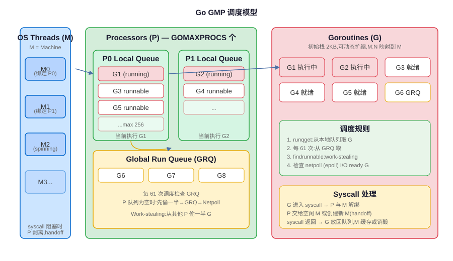

<div class="card card-m">
<h3>GMP 三要素</h3>
<p>GMP 是 Go runtime 调度器的三个核心数据结构，理解它们是理解整个调度模型的基础。</p>

<table>
<tr><th>组件</th><th>全称</th><th>含义</th><th>数量关系</th><th>关键特性</th></tr>
<tr><td><strong>G</strong></td><td>Goroutine</td><td>goroutine 控制块，存储栈、PC、状态、任务函数等</td><td>用户 go 关键字创建，可几十万+</td><td>初始栈 2KB，可动态增长/收缩（最大 1GB），用户态切换成本低（~几百 ns vs 线程几 μs）</td></tr>
<tr><td><strong>M</strong></td><td>Machine</td><td>操作系统线程，真正执行代码的实体</td><td>默认最大 10000（runtime.SetMaxThreads），实际活跃数 ≈ GOMAXPROCS + 阻塞 syscall 数</td><td>每个 M 绑定一个内核线程，M 不保存 G 的状态，需要 P 才能运行 G</td></tr>
<tr><td><strong>P</strong></td><td>Processor</td><td>逻辑处理器，持有本地 G 运行队列，是 M 运行 G 的「许可证」</td><td>GOMAXPROCS 个，默认 = CPU 核数</td><td>P 本地队列无锁、容量 256；P 还有 mcache（内存本地缓存），减少全局锁竞争</td></tr>
</table>
<div class="qa-summary">G 是要执行的任务，M 是干活的工人（OS 线程），P 是工人的工作台（本地队列+资源），M 必须绑定 P 才能执行 G。</div>
</div>

<div class="card card-s">
<h3>M:N 调度模型</h3>
<p>Go 使用 M:N 调度，即 M 个 goroutine 映射到 N 个 OS 线程上（N = GOMAXPROCS）。对比其他调度模型：</p>
<table>
<tr><th>模型</th><th>映射关系</th><th>代表实现</th><th>优点</th><th>缺点</th></tr>
<tr><td>1:1</td><td>1 个协程 = 1 个 OS 线程</td><td>C++ std::thread、Linux pthread、Java 虚拟线程（OS 级）</td><td>调度简单，能利用多核</td><td>创建/切换成本高（内核态），数量受限</td></tr>
<tr><td>N:1</td><td>N 个协程映射到 1 个 OS 线程</td><td>Python gevent、早期 libco</td><td>切换极快，用户态</td><td>无法利用多核，一个阻塞协程卡住整个线程</td></tr>
<tr><td>M:N</td><td>M 个协程映射到 N 个 OS 线程（N 通常=核数）</td><td>Go goroutine、Rust tokio</td><td>切换快（用户态）+ 利用多核</td><td>调度器实现复杂</td></tr>
</table>
<p>Go 调度器是「协作+抢占」混合调度：Go 1.14 之前是协作式（函数调用时检查栈是否需要扩容，主动让出），Go 1.14 之后是基于信号的异步抢占（sysmon 发送 SIGURG 信号），解决了 goroutine 长时间运行不让出 CPU 的问题。</p>
</div>

<div class="card card-m">
<h3>调度流程：找 G 来执行</h3>
<p>M 需要找到可运行的 G 才能执行，调度器按以下优先级找 G：</p>
```flow
1. P本地队列 | 每61次调度从全局队列取一批，避免全局队列饿死
2. 全局队列 | 本地队列空了，从全局队列取
3. work-stealing | 从其他P的本地队列偷一半G过来
4. 网络轮询器netpoll | 检查有没有I/O就绪的G
5. 空闲回收 | 实在找不到G，M进入睡眠，放回M空闲列表
```
<div class="card-d">
<h4>Work-Stealing 工作窃取算法</h4>
<p>当 P 的本地队列为空时，它会随机选另一个 P，从其本地队列**偷一半的 G**过来。这是 Go 调度器负载均衡的核心：没有中心调度器，各 P 自己干活，没活了就去别人那里偷，去中心化设计避免了全局锁竞争。</p>
</div>
</div>

<div class="card card-s">
<h3>Syscall 阻塞：P 和 M 解绑</h3>
<p>这是面试超高频考点：G 进行阻塞 syscall（如文件 I/O、网络 I/O 阻塞）时，M 会进入内核等待，P 怎么处理？</p>
<ol>
<li>G 调用阻塞 syscall（如 Read 文件）</li>
<li>P 和 M 解绑（handoff），P 不会跟着 M 一起阻塞</li>
<li>调度器找一个空闲的 M（或新建一个 M），绑定这个 P</li>
<li>新的 M + P 继续执行 P 本地队列里的其他 G，CPU 不闲置</li>
<li>原来的 M 在内核等 syscall 完成，G 阻塞结束后 M 尝试获取 P：
   <ul>
   <li>获取到空闲 P：继续运行 G</li>
   <li>没获取到 P：把 G 放到全局队列，M 放回空闲列表或销毁</li>
   </ul>
</li>
</ol>
<div class="qa-summary">阻塞 syscall 时 P 和 M 分离，P 换个 M 继续跑其他 G，这就是为什么一个 goroutine 阻塞不会卡住整个程序——前提是不要用 CGO 阻塞、不要做纯计算死循环（需要抢占）。</div>
<div class="card-w">
<h4>⚠️ 什么操作会阻塞 P，什么不会？</h4>
<table>
<tr><th>操作</th><th>是否阻塞 M/P</th><th>调度器行为</th></tr>
<tr><td>channel 阻塞、sync.Mutex 阻塞</td><td>❌ 不阻塞 OS 线程</td><td>G 变为 waiting，M 执行其他 G（用户态调度）</td></tr>
<tr><td>网络 I/O（HTTP、TCP）</td><td>❌ 不阻塞（netpoll 封装）</td><td>G 挂到 netpoll，epoll/kqueue 就绪后唤醒，M 继续跑其他 G</td></tr>
<tr><td>阻塞文件 I/O、CGO 调用</td><td>✅ 阻塞 M</td><td>P 和 M 解绑，P 找新 M，原来的 M 在内核等</td></tr>
<tr><td>纯计算死循环（Go 1.14+）</td><td>❌ 异步抢占解决</td><td>sysmon 监控 G 运行超过 10ms，发 SIGURG 信号抢占</td></tr>
</table>
</div>
</div>

<div class="card card-d">
<h3>调度器观察与调优</h3>
<table>
<tr><th>工具/环境变量</th><th>作用</th><th>用法</th></tr>
<tr><td><code>GOMAXPROCS</code></td><td>设置 P 的数量</td><td>默认 = CPU 核数，容器环境需要手动设置（用 uber-go/automaxprocs 自动适配 cgroup）</td></tr>
<tr><td><code>GODEBUG=schedtrace=1000</code></td><td>每 1000ms 打印一次调度状态</td><td><code>GODEBUG=schedtrace=1000 ./myapp</code> 输出 GOMAXPROCS、runqueue 长度等</td></tr>
<tr><td><code>GODEBUG=schedtrace=1000,scheddetail=1</code></td><td>详细输出每个 G/M/P 的状态</td><td>深度排查调度问题时用</td></tr>
<tr><td><code>runtime.NumGoroutine()</code></td><td>查看当前 goroutine 数量</td><td>监控 goroutine 泄漏，正常服务不应该持续增长</td></tr>
<tr><td><code>pprof goroutine</code></td><td>分析 goroutine 堆栈和状态</td><td><code>go tool pprof http://localhost:6060/debug/pprof/goroutine</code></td></tr>
</table>
<pre><code class="language-bash"># GOMAXPROCS=2 时 schedtrace 输出示例
# GOMAXPROCS=2 是 P 数量
# runqueue=0 是全局队列 G 数量
# [0 0] 是两个 P 各自本地队列的 G 数量
SCHED 1003ms: gomaxprocs=2 idleprocs=0 threads=5 spinningthreads=1 idlethreads=1 runqueue=0 [0 0]
</code></pre>
</div>

<div class="qa" onclick="this.classList.toggle('open')">
<div class="qa-q">Q: goroutine 和 OS 线程有什么区别？为什么 goroutine 能开几十万个？</div>
<div class="qa-a">
<p><strong>回答思路：</strong>从栈大小、创建/切换成本、调度方式三个维度对比。</p>
<div class="qa-section">
<div class="qa-section-title">栈大小</div>
<p>OS 线程栈默认 8MB（ulimit -s 可看），创建就固定分配；goroutine 初始栈只有 2KB，动态增长收缩，最大 1GB。1 万个线程光栈就要 80GB 虚拟内存，1 万个 goroutine 只要 ~20MB。</p>
</div>
<div class="qa-section">
<div class="qa-section-title">创建/切换成本</div>
<p>线程创建需要内核态调用，成本是微秒级（clone 系统调用），上下文切换要进内核、保存/恢复全套寄存器、TLB 刷掉；goroutine 创建是用户态 malloc + 初始化结构体，纳秒级，切换只保存/恢复 PC、SP 等少量寄存器，不用进内核，成本是线程切换的 1/10 ~ 1/20。</p>
</div>
<div class="qa-section">
<div class="qa-section-title">调度方式</div>
<p>线程由 OS 内核调度（抢占式、时间片），调度器需要考虑所有进程的线程；goroutine 由 Go runtime 自己调度（M:N 模型，work-stealing），是用户态协作+抢占调度，更轻量。而且 G 阻塞（channel、网络）时只让 G 等待，M 继续跑其他 G，不浪费内核线程。</p>
</div>
<div class="qa-summary">面试口径：goroutine 轻量的本质是「用户态调度 + 小栈动态伸缩 + M:N 复用线程」，2KB 初始栈让你随便开，用户态切换让成本极低，阻塞时不占 OS 线程。</div>
</div>
</div>

<div class="qa" onclick="this.classList.toggle('open')">
<div class="qa-q">Q: 为什么要有 P？直接让 G 绑定到 M 上行不行？</div>
<div class="qa-a">
<p><strong>回答思路：</strong>P 不是多余的，它解决了「全局调度锁」和「本地资源缓存」两个问题。</p>
<div class="qa-section">
<div class="qa-section-title">如果没有 P，G 直接绑定 M</div>
<p>那所有 goroutine 只能放全局队列，多个 M 取 G 都要抢同一个全局锁，高并发下锁竞争会成为瓶颈；而且内存分配、defer pool、goroutine 缓存这些资源如果全放全局，每次都要锁，性能差。</p>
</div>
<div class="qa-section">
<div class="qa-section-title">P 的作用</div>
<p>P 持有本地 G 队列：大多数时候 M 只从自己绑定的 P 本地队列取 G，不需要抢全局锁，本地队列是无锁 CAS 操作，性能极高。<br>
P 持有 mcache（内存本地缓存）：每个 P 有自己的 mcache，小对象内存分配无锁，这是 Go 内存分配快的原因之一。<br>
P 是调度的「上下文」：syscall 阻塞时，把 P 从 M 摘下来给其他 M，G 的调度上下文跟着 P 走，不用全局迁移。</p>
</div>
<div class="qa-section">
<div class="qa-section-title">类比理解</div>
<p>M 是工人，G 是任务，如果没有 P（工作台），所有任务堆在一个仓库（全局队列），工人取任务都要抢仓库的锁，而且工具（mcache）也是公用的；有了 P 之后每个工人有自己的工作台，任务放自己工作台上，工具也在自己手边，没活了再去别的工作台偷（work-stealing），效率大大提高。</p>
</div>
<div class="qa-summary">面试口径：P 的核心价值是「本地队列减少锁竞争 + 本地资源缓存（mcache）」，是 Go 调度器高性能的关键；没有 P 所有 M 都抢全局锁，并发度上不去。</div>
</div>
</div>

<div class="qa" onclick="this.classList.toggle('open')">
<div class="qa-q">Q: GOMAXPROCS 设置多少合适？容器环境下为什么要改？</div>
<div class="qa-a">
<p><strong>回答思路：</strong>默认值是 CPU 核数，但容器里会误读宿主机核数，导致 P 过多反而性能下降。</p>
<div class="qa-section">
<div class="qa-section-title">默认行为</div>
<p>Go 1.5 之后 GOMAXPROCS 默认等于 runtime.NumCPU()，也就是宿主机的逻辑 CPU 核数。物理机/虚机上跑没问题，因为你能用到所有核。</p>
</div>
<div class="qa-section">
<div class="qa-section-title">容器环境的问题</div>
<p>在 Docker/K8s 容器里，runtime.NumCPU() 读到的是宿主机的核数（比如宿主机 64 核，你的容器只 limit 了 2 核），这时候 GOMAXPROCS 默认会是 64，开 64 个 P，但你只能用到 2 个 CPU，导致：<br>
- P 太多，M 频繁切换、上下文切换成本高<br>
- 64 个 P 抢 2 个 CPU，调度开销大<br>
- 线程数也会变多，sysmon 和 GC 负担加重<br>
典型现象是容器 CPU 不高（限 2 核只跑了 1.5 核）但延迟很高。</p>
</div>
<div class="qa-section">
<div class="qa-section-title">解决方案</div>
<p>1. 手动设置环境变量：<code>GOMAXPROCS=2 ./myapp</code><br>
2. 推荐用 <code>go.uber.org/automaxprocs</code> 库，程序启动时自动读取 cgroup 的 CPU limit 设置 GOMAXPROCS，K8s 环境强烈推荐，直接 import 就行：<br>
<pre><code class="language-go">import _ "go.uber.org/automaxprocs"

func main() {
    // automaxprocs 自动识别 cgroup，设置正确的 GOMAXPROCS
}
</code></pre></p>
</div>
<div class="qa-summary">面试口径：物理机默认=核数没问题；K8s/Docker 容器必须设置或用 automaxprocs，否则 GOMAXPROCS 会是宿主机核数，造成调度抖动和延迟升高。</div>
</div>
</div>

<div class="qa" onclick="this.classList.toggle('open')">
<div class="qa-q">Q: 一个 goroutine 阻塞了会怎么样？会卡住整个程序吗？</div>
<div class="qa-a">
<p><strong>回答思路：</strong>分情况讨论：什么类型的阻塞，调度器怎么处理，什么情况真的会卡住。</p>
<div class="qa-section">
<div class="qa-section-title">channel/sync 阻塞（用户态阻塞）</div>
<p>不会卡住 M，更不会卡住程序。G 的状态变为 waiting，M 把当前 G 挂起，从 P 队列取下一个 G 继续跑，这是纯用户态调度，代价极小。等 channel 可读/锁可用时，G 被唤醒放回队列继续执行。</p>
</div>
<div class="qa-section">
<div class="qa-section-title">网络 I/O 阻塞</div>
<p>不会卡住。Go 的 net 库把 socket 设为非阻塞，用 netpoll（基于 epoll/kqueue）封装：G 做网络 I/O 时如果没就绪，G 被挂到 netpoll 等待，M 跑其他 G；等 epoll 通知 socket 就绪了，对应的 G 才被唤醒放回队列。整个过程 M 不阻塞。</p>
</div>
<div class="qa-section">
<div class="qa-section-title">阻塞 syscall（文件 I/O、CGO 调用）</div>
<p>会阻塞 M，但不会卡住程序。调度器检测到 M 进入 syscall 阻塞后，会让 P 和这个 M 解绑（handoff），然后调度器唤醒或新建一个 M 绑定到 P 上继续跑其他 G；原来的 M 在内核等 syscall 结束，G 完成后 M 尝试获取空闲 P 继续跑，获取不到就把 G 放全局队列。</p>
</div>
<div class="qa-section">
<div class="qa-section-title">什么情况真的会「卡住」？</div>
<p>1. CGO 调用长时间阻塞，而且同时有很多 CGO 调用，M 数会涨到 MaxThreads（默认 1w）然后崩溃；<br>
2. Go 1.14 之前的纯计算死循环：没有函数调用就不会触发协作式调度，一个 G 占住 M 不放，同 P 的其他 G 饿死；Go 1.14+ 异步抢占解决了这个问题；<br>
3. 所有 goroutine 都死锁（channel 互相等没有其他可运行 G），runtime 检测到直接 panic：<code>all goroutines are asleep - deadlock!</code></p>
</div>
<div class="qa-summary">面试口径：分三类阻塞回答——channel/网络不阻塞 M（用户态调度），文件 I/O/CGO 阻塞 M 但 P 解绑不卡程序，只有死锁/早期死循环才会真正卡住。</div>
</div>
</div>
