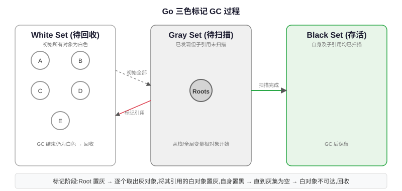

<h3>内存分配器：TCMalloc 风格</h3>

Go 内存分配器参考了 TCMalloc（Thread-Caching Malloc）的设计，核心思想是「分级缓存、减少锁竞争」，和 GMP 模型中 P 的本地缓存配合得很好。

<table>
<tr><th>层级</th><th>归属</th><th>作用</th><th>锁</th></tr>
<tr><td><strong>mcache</strong></td><td>每个 P 一个</td><td>小对象（≤32KB）本地缓存，无锁分配</td><td>无锁（P 独有）</td></tr>
<tr><td><strong>mcentral</strong></td><td>全局，按 size class 分</td><td>mcache 空了，从 mcentral 拿一批 span</td><td>每个 mcentral 有锁</td></tr>
<tr><td><strong>mheap</strong></td><td>全局</td><td>大对象（>32KB）直接从 mheap 分配；管理所有内存页；不够了向 OS 申请</td><td>全局锁</td></tr>
</table>

<h4>Size Class：大小类别</h4>

Go 把小对象按大小分成约 70 个 size class（如 8B、16B、32B...32KB），同一 size class 的对象大小相同，分配时从对应大小的 mspan 分配。好处是减少内存碎片，坏处是可能有 internal fragmentation（比如要 17B 会分配 32B 的块，浪费 15B）。

<h3>逃逸分析：栈 vs 堆</h3>

Go 编译器通过**逃逸分析（Escape Analysis）**决定变量分配在栈上还是堆上：<strong>栈上分配开销极小（移动栈指针），函数返回自动回收；堆分配需要 GC 回收，开销大。</strong> 这是 Go 性能好的重要原因——很多看似是「对象」的东西其实分配在栈上，不用 GC。

<table>
<tr><th>分配位置</th><th>分配/回收成本</th><th>什么时候分配这里</th></tr>
<tr><td>栈（Stack）</td><td>极低，函数返回自动回收，不用 GC</td><td>变量不逃出函数作用域，编译器能确定生命周期</td></tr>
<tr><td>堆（Heap）</td><td>高，需要 GC 扫描回收</td><td>变量逃逸了（返回指针、发送到 channel、存到全局变量、闭包引用等）</td></tr>
</table>

查看逃逸分析结果的命令：

<pre><code class="language-bash">go build -gcflags='-m -l' main.go  # -m 打印逃逸分析，-l 禁止内联让结果更清晰
</code></pre>
<pre><code class="language-go">// 不逃逸：分配在栈上
func add(a, b int) int {
    res := a + b  // res 不逃出函数，栈分配
    return res
}

// 逃逸：返回指针，res 逃到堆上
func newInt() *int {
    res := new(int) // ❌ 返回指针，逃逸到堆
    *res = 42
    return res
}

// 逃逸：发送到 channel
func send(ch chan int) {
    x := 123
    ch <- x // x 被 channel 引用，逃逸
}
</code></pre>

<h4>常见逃逸场景（记住这些能减少堆分配）</h4>
<ul>
<li>返回局部变量的指针 → 逃逸</li>
<li>interface{} 类型的参数（函数参数是 interface，值会装箱逃逸）</li>
<li>发送指针或带指针的值到 channel</li>
<li>闭包引用的变量</li>
<li>在 slice/map 里存指针</li>
<li>变量太大，栈放不下（Go 栈初始 2KB，最大 1GB，但大对象一般直接堆）</li>
</ul>

编译器觉得变量在函数返回后还要被引用，就「逃逸」到堆上；减少逃逸 = 减少 GC 压力 = 程序更快。

<h3>GC 算法：并发三色标记清除</h3>

Go 使用**并发三色标记清除（Tri-color Mark and Sweep）** GC，目标是把 STW（Stop The World）时间降到亚毫秒级，不和用户代码抢太久 CPU。

<table>
<tr><th>颜色</th><th>含义</th></tr>
<tr><td><strong>⚪ 白色</strong></td><td>还没被扫描到的对象，GC 结束时还是白色就是垃圾，回收</td></tr>
<tr><td><strong>⚫ 灰色</strong></td><td>对象本身被标记了，但它引用的对象还没扫描完（待处理队列）</td></tr>
<tr><td><strong>⚫ 黑色</strong></td><td>对象本身和它引用的所有对象都扫描完了，是存活对象</td></tr>
</table>

<strong>标记过程：</strong>

<ol>
<li>初始所有对象都是白色</li>
<li>从根对象（栈、全局变量）出发，把直接引用的对象标记为灰色（入队）</li>
<li>从灰色队列取对象，标记为黑色，然后把它引用的白色对象标记为灰色（入队）</li>
<li>重复直到灰色队列为空，此时所有可达对象都是黑色，白色对象是垃圾</li>
<li>清除（Sweep）：回收所有白色对象的内存</li>
</ol>

<h3>写屏障（Write Barrier）：解决并发标记的问题</h3>

如果 GC 标记和用户代码同时跑（并发标记），用户代码可能修改指针引用，导致存活对象被误回收（丢指针）或者垃圾被标活（浮动垃圾）。Go 用**混合写屏障（Dijkstra 插入屏障 + Yuasa 删除屏障）**解决这个问题。

<h4>为什么需要写屏障？</h4>

并发标记时，可能出现黑色对象引用了白色对象的情况（比如用户代码刚把一个白色指针赋值给黑色对象字段），这违反了「黑色对象不能直接引用白色对象」的三色不变性，会导致白色对象（其实存活）被当成垃圾回收。

<strong>混合写屏障规则（Go 1.8+）：</strong>

<ol>
<li>GC 期间，任何指针修改操作（写指针字段）都会触发写屏障</li>
<li>被覆盖的旧指针如果是堆上的，标灰（删除屏障，防止栈上新指向的对象被漏标）</li>
<li>新指向的指针如果是堆上的，标灰（插入屏障）</li>
<li>栈上的写操作不用写屏障（栈扫描是 STW 的，最后会 rescan 一遍栈，性能更好）</li>
</ol>

写屏障是编译器插在指针赋值前的一小段代码，在并发标记时维护三色不变性，防止误回收存活对象；代价是指针写入慢一点点，但是 STW 大大缩短。

<h3>GC 完整周期与 STW 阶段</h3>

Go GC 一个周期分为四个阶段，其中两个阶段需要短暂 STW：

<table>
<tr><th>阶段</th><th>STW？</th><th>做什么</th><th>耗时</th></tr>
<tr><td>1. Mark Setup（标记准备）</td><td><strong>是（极短）</strong></td><td>开启写屏障，把所有 P 拉到安全点，准备标记</td><td>通常几十微秒~亚毫秒</td></tr>
<tr><td>2. Concurrent Mark（并发标记）</td><td>否</td><td>后台 worker 三色标记，和用户代码一起跑，占用 ~25% CPU（P 的 1/4 资源）</td><td>占 GC 大部分时间，不影响用户延迟</td></tr>
<tr><td>3. Mark Termination（标记终止）</td><td><strong>是（极短）</strong></td><td>关闭写屏障，rescan 栈（因为栈没开写屏障，最后扫一遍），计算下一次 GC 触发阈值</td><td>通常几十微秒~亚毫秒</td></tr>
<tr><td>4. Concurrent Sweep（并发清除）</td><td>否</td><td>后台慢慢回收白色垃圾对象，和用户代码并发</td><td>不 STW，惰性回收</td></tr>
</table>

注意：Sweep 不是一次做完的，是增量的，用户 goroutine 分配内存时如果 mcache 没空闲 span，就顺手 sweep 几个，不单独占 STW。

<h3>GC 调优：GOGC 与 GOMEMLIMIT</h3>
<table>
<tr><th>参数</th><th>含义</th><th>设置建议</th></tr>
<tr><td><code>GOGC</code></td><td>GC 触发百分比：默认 100，表示堆内存比上次 GC 后存活大 100% 时触发 GC（比如上次活了 100MB，下次到 200MB 触发）</td><td>内存够用可以设大（比如 200、500）减少 GC 频率；延迟敏感但内存紧设小（比如 50）增加 GC 频率换更低延迟；设为 off 关闭 GC（不推荐）</td></tr>
<tr><td><code>GOMEMLIMIT</code>（Go 1.19+）</td><td>设置 Go  runtime 可使用的最大内存软上限</td><td>容器环境强烈推荐设为容器 memory limit 的 ~80-90%，防止 OOM。以前 GOGC 不好控制总内存，GOMEMLIMIT 是更现代的调优方式，和 GOGC 一起用更好</td></tr>
<tr><td><code>GODEBUG=gctrace=1</code></td><td>打印 GC 日志</td><td>调优时用，能看到每次 GC 时间、STW 时间、堆大小变化</td></tr>
</table>
<pre><code class="language-bash"># GC 日志示例：gc 1 @0.012s 2%: 0.012+0.6+0.003 ms clock
# gc 1：第 1 次 GC
# @0.012s：程序启动 0.012 秒
# 2%：GC 占用 2% CPU
# 0.012+0.6+0.003：STW 准备 + 并发标记 + STW 终止 耗时（ms）
GODEBUG=gctrace=1 ./myapp

# 容器环境推荐设置（比如容器 limit 1GB）
GOMEMLIMIT=800MiB ./myapp
</code></pre>

<h3>⚠️ Go 为什么不用分代 GC？</h3>

这是一个高频面试题：Java/JVM 用分代 GC（新生代老生代），因为「大部分对象朝生夕死」，新生代回收快。Go 为什么不用？

<table>
<tr><th>原因</th><th>解释</th></tr>
<tr><td>写屏障已经有成本</td><td>Go 为了并发标记已经用了写屏障，如果加分代还要加「代际指针写屏障」（记录老年代→新生代指针），写屏障开销进一步增加</td></tr>
<tr><td>逃逸分析效果好</td><td>很多短生命周期对象直接分配在栈上，函数返回就回收了，根本到不了堆，分代收益没 Java 大</td></tr>
<tr><td>分配速率高，STW 不是因为 GC</td><td>Go 是指针运算+编译期优化+TCMalloc，分配内存非常快；Go 的 STW 已经优化到亚毫秒级，分代带来的复杂度不值得</td></tr>
<tr><td>编译期知道更多信息</td><td>Go 是 AOT 编译，逃逸分析等编译期优化能减少堆对象，运行时不需要像 JVM 那样靠分代兜底</td></tr>
</table>

不是做不到，而是权衡后收益不够：Go 靠栈分配+逃逸分析+并发三色标记已经做到低延迟，分代的复杂度和写屏障开销不划算。

Q: Go GC 的 STW 发生在什么时候？现在 STW 大概多长？

<strong>回答思路：</strong>说清楚 STW 两个阶段，以及为什么这么短。

STW 在两个阶段

① Mark Setup（标记准备）：开启写屏障，所有 P 到达安全点（GC 安全点，不能有指针写），这个 STW 很短； 
② Mark Termination（标记终止）：关闭写屏障，rescan 所有 goroutine 栈（因为栈上没开写屏障，必须 STW 扫一遍确保没有漏标），这个也很短。

并发标记和并发清除阶段都是和用户代码一起跑的，不需要 STW。

STW 时长

Go 1.5 之后持续优化 GC，现在正常服务 STW 一般是<strong>亚毫秒级（几十到几百微秒）</strong>，大部分服务感知不到；极端大堆（几十GB）可能到几毫秒，但是仍然比很多 Java CMS/G1 的 STW 短。Go 1.14 之后抢占式调度进一步降低了 GC 等待 goroutine 到达安全点的时间。

面试口径：STW 在标记准备和标记终止两个阶段，加起来通常亚毫秒；并发标记/清除都不 STW；Go GC 设计目标就是低延迟，不是高吞吐。

Q: 怎么减少 GC 压力？性能调优有什么手段？

<strong>回答思路：</strong>从「减少堆分配」和「合理调参」两方面回答，这是性能优化核心。

减少堆对象（最有效）

① 用逃逸分析找堆分配：<code>go build -gcflags='-m'</code>，把能移到栈上的移到栈； 
② 预分配 slice/map：<code>make([]T, 0, n)</code> 指定 cap，避免扩容复制； 
③ 用 sync.Pool 复用频繁创建销毁的临时对象（比如 bytes.Buffer、proto 结构体）； 
④ 不要用指针传小结构体（比如 int、小 struct），值拷贝比去堆上读指针更快还不增加 GC； 
⑤ 避免不必要的 interface{} 装箱（会导致值逃逸）。

GC 参数调优

容器环境设 GOMEMLIMIT（推荐，Go 1.19+）；内存富裕增大 GOGC 减少 GC 频率；用 gctrace 看每次 GC 时间和 STW，不要瞎调。

用 pprof 定位

<code>go tool pprof heap</code> 看哪里分配内存最多；<code>go tool pprof allocs</code> 看分配热点，不是拍脑袋优化。优化 80% 的热点，不要微调小地方。

面试口径：减少 GC 压力最有效的是减少逃逸+对象复用（sync.Pool+预分配）；参数用 GOMEMLIMIT；pprof 先定位再优化，不要凭感觉。

Q: 逃逸分析是什么？怎么判断一个变量会不会逃逸？

<strong>回答思路：</strong>逃逸分析是编译器决定变量在栈还是堆，列常见逃逸场景和查看方法。

什么是逃逸分析

Go 编译器在编译阶段做的静态分析：追踪变量的作用域，如果编译器能证明变量在函数返回后不会被引用（生命周期不超出函数），就分配在栈上；否则「逃逸」到堆上。栈分配函数返回自动回收，完全不用 GC；堆分配需要 GC 管，开销大。

常见逃逸场景

① 返回局部变量指针：函数外能拿到，肯定逃逸； 
② 发送指针到 channel：channel 另一端可能在函数返回后才读，逃逸； 
③ 闭包引用变量：闭包生命周期可能更长，逃逸； 
④ 赋值给 interface{}（比如 fmt.Println(xxx)，参数是 interface{}）：装箱到 interface，逃逸； 
⑤ 存到全局变量或者 map/slice 里的指针； 
⑥ 变量太大，栈放不下； 
⑦ 不确定大小（比如 append 到 slice，slice 容量不够扩容时，可能新分配到堆）。

怎么查看

<code>go build -gcflags='-m -m'</code>，输出里有 <code>escapes to heap</code> 就是逃逸了；两层 -m 能看到更详细的逃逸原因。优化性能的时候经常用这个看哪里能栈分配。

面试口径：逃逸分析是编译期决定栈/堆，栈分配不用 GC；凡是变量生命周期可能超出函数（返回指针、channel、闭包、interface）就会逃逸；用 -gcflags=-m 看。

