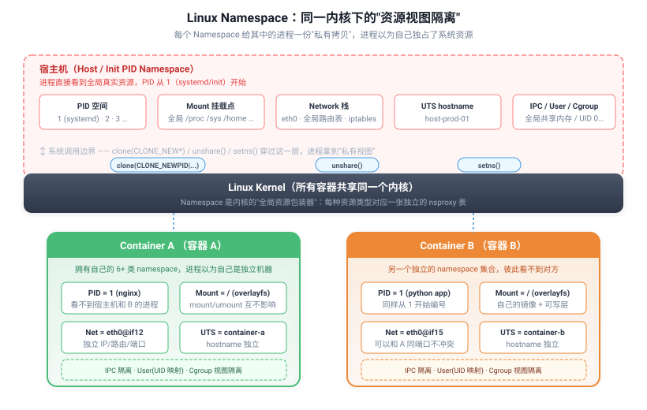
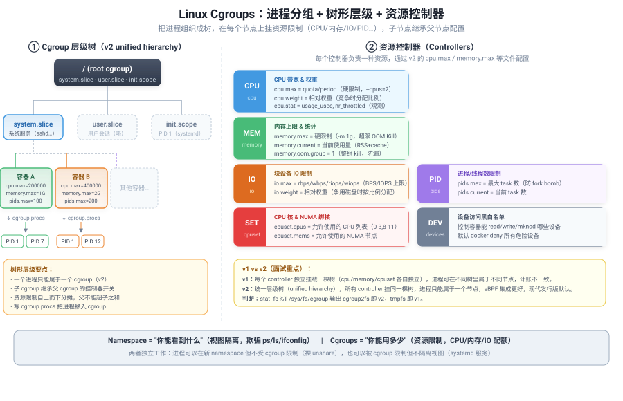

## 一句话结论

容器本质是"受限制的进程"：Linux Namespace 做<strong>视图隔离</strong>（让进程看到独立的系统资源），Cgroups 做<strong>资源限制</strong>（限制进程能用多少 CPU/内存/IO），rootfs（UnionFS/OverlayFS）做<strong>文件系统隔离</strong>（让进程有自己独立的根目录）。三者组合就是一个"看起来像独立机器"的容器运行环境。

<h3>容器隔离三件套全景</h3>
<table><tr><th>技术</th><th>内核版本</th><th>作用</th><th>一句话</th></tr>
<tr><td><strong>Namespace</strong></td><td>2.6+（逐步加全）</td><td>视图隔离</td><td>"你看不到外面的世界"——PID、网络、挂载点等资源各 namespace 独立</td></tr>
<tr><td><strong>Cgroups</strong></td><td>2.6.24（v1）/ 4.5（v2）</td><td>资源限制</td><td>"你只能用这么多"——限制 CPU/内存/IO/进程数等配额</td></tr>
<tr><td><strong>rootfs / UnionFS</strong></td><td>—</td><td>文件系统隔离</td><td>"你有自己的根目录"——独立文件系统视图，镜像分层+CoW</td></tr>
</table>

容器不是虚拟机：没有独立内核，所有容器共享宿主机内核，隔离靠内核机制而非 hypervisor。KVM 虚拟机有独立内核，隔离更强但开销更大。

<h3>什么是 Namespace：从"全局资源"到"私有视图"</h3>

Linux 是一个<strong>全局资源共享</strong>的操作系统——默认情况下，所有进程共用一张 PID 表、一套挂载点、一个网络栈、一个 hostname。这在单台机器上没问题，但如果想让一组进程"以为自己独占了整台机器"，就需要一种机制把这些全局资源<strong>包装起来</strong>，给不同进程组呈现不同的视图。这就是 Namespace。

<strong>核心思想（参考 Red Hat、Julia Evans、"Containers are not special" 等经典博客）：</strong>

<ul>
<li><strong>本质是内核里的一张"包装表"</strong>：每种全局资源（PID、挂载点、网络……）在内核中有一个全局结构体；Namespace 把这些结构体替换成<strong>每个 namespace 一份的私有拷贝</strong>，进程通过 <code>task_struct-&gt;nsproxy</code> 指针访问自己的那份</li>
<li><strong>不是虚拟化，是"视图欺骗"</strong>：同一时刻所有容器仍<strong>共享同一个内核</strong>，没有 hypervisor，没有 Guest OS；Namespace 只改变进程"能看到什么"，不改变内核本身</li>
<li><strong>类比：chroot 的进化版</strong>：chroot 只隔离文件系统根目录（相当于 mnt namespace 的雏形）；Namespace 把这种"换一个视角"的思路扩展到了 PID、网络、主机名、IPC、用户、cgroup 等 7 类资源</li>
<li><strong>只解决"你能看到什么"，不解决"你能用多少"</strong>：能看到的 CPU/内存/IO 有多少是 Cgroups 管的事，Namespace 不做资源限制</li>
</ul>

<figure style="margin:12px 0;text-align:center;">

<figcaption style="font-size:11px;color:#718096;margin-top:6px;">▲ 同一 Linux 内核上，宿主机和两个容器各自持有一份独立的资源视图；三种系统调用（clone/unshare/setns）是操作 Namespace 的唯一入口</figcaption>
</figure>

<strong>三个关键系统调用（面试必问）：</strong>

<table><tr><th>系统调用</th><th>作用</th><th>典型场景</th></tr>
<tr><td><code>clone(flags)</code></td><td>创建新进程时通过 flag 指定<strong>同时创建并加入新的 namespace</strong></td><td><code>docker run</code> 创建容器进程的核心调用，一次性带上 CLONE_NEWPID/CLONE_NEWNET/CLONE_NEWNS 等 flag</td></tr>
<tr><td><code>unshare(flags)</code></td><td>将当前进程/线程<strong>从原 namespace 中分离</strong>，加入新创建的 namespace（不创建新进程）</td><td><code>unshare --pid --mount --fork bash</code> 命令行创建隔离环境；容器运行时在已有进程中做 namespace 切换</td></tr>
<tr><td><code>setns(fd, flags)</code></td><td>将当前进程<strong>加入一个已存在的 namespace</strong>（通过 <code>/proc/&lt;pid&gt;/ns/</code> 下的文件描述符）</td><td><code>nsenter -t &lt;pid&gt; -n -p -- bash</code> 进入容器调试；调试工具"附着"到运行中容器</td></tr>
</table>

<strong>理解路径：</strong>当你在容器里执行 <code>ps aux</code> 只看到自己的几个进程时，不是因为其他进程不存在了，而是容器进程的 PID namespace 让它只看到了"私有 PID 表"中从 1 开始的那部分；当你 <code>ls /</code> 看到独立的文件系统，是 mnt namespace + pivot_root 切换了根目录视图；当你 <code>ifconfig</code> 看到自己的 eth0 和 IP，是 net namespace 给了它独立的网络设备和路由表。这一切都是<strong>同一份内核、不同份视图</strong>。

<h3>Namespace 七类</h3>
<table><tr><th>Namespace</th><th>隔离内容</th><th>系统调用参数</th><th>内核版本</th><th>容器中的表现</th></tr>
<tr><td><strong>Mount (mnt)</strong></td><td>文件系统挂载点</td><td>CLONE_NEWNS</td><td>2.4.19</td><td>容器内 mount/umount 不影响宿主机和其他容器；每个容器有自己独立的根目录视图</td></tr>
<tr><td><strong>PID</strong></td><td>进程 ID 空间</td><td>CLONE_NEWPID</td><td>2.6.24</td><td>容器内 PID=1 是 init 进程，容器内看不到宿主机和其他容器的进程；容器退出后其内进程全部销毁</td></tr>
<tr><td><strong>Network (net)</strong></td><td>网络设备、IP、路由表、iptables、端口</td><td>CLONE_NEWNET</td><td>2.6.29</td><td>容器有独立的网络栈（veth pair + 网桥），自己的 IP/路由/防火墙规则，端口互不冲突</td></tr>
<tr><td><strong>UTS</strong></td><td>主机名、NIS 域名</td><td>CLONE_NEWUTS</td><td>2.6.19</td><td>容器有自己的 hostname，<code>hostname</code> 命令看到的是容器名</td></tr>
<tr><td><strong>IPC</strong></td><td>System V IPC、POSIX 消息队列</td><td>CLONE_NEWIPC</td><td>2.6.19</td><td>容器内进程间通信（共享内存、信号量、消息队列）互相隔离，跨容器不能用 IPC 通信</td></tr>
<tr><td><strong>User</strong></td><td>用户/用户组 ID 映射</td><td>CLONE_NEWUSER</td><td>3.8</td><td>容器内 root（UID 0）可以映射到宿主机上的普通用户（如 UID 100000），容器提权不影响宿主机</td></tr>
<tr><td><strong>Cgroup</strong></td><td>cgroup 根目录视图</td><td>CLONE_NEWCGROUP</td><td>4.6</td><td>容器内 <code>/proc/self/cgroup</code> 看到自己的 cgroup 路径，看不到宿主机其他 cgroup</td></tr>
</table>

<strong>常用操作命令：</strong>

<ul>
<li>查看进程所属 namespace：<code>ls -la /proc/&lt;pid&gt;/ns/</code></li>
<li>进入容器 namespace 调试：<code>nsenter -t &lt;pid&gt; -n -p -- bash</code>（进入该进程的 net+pid namespace）</li>
<li>创建新 namespace 运行命令：<code>unshare --pid --mount --fork --mount-proc bash</code></li>
</ul>

<h3>什么是 Cgroups：从"nice 值"到"进程分组+资源配额"</h3>

Linux 传统上用 <code>nice</code>、<code>ulimit</code>、<code>setrlimit</code> 控制单进程资源，但这些机制<strong>只能限制单个进程</strong>，无法对"一组进程"（比如一个容器里的所有进程、一个 systemd 服务的所有子进程）做统一限额和统计。Cgroups（Control Groups）就是为解决这个问题而生的内核机制——<strong>把进程组织成树形分组，在每个节点上挂载资源控制器，限制这一组进程合计能用多少 CPU/内存/IO/PID</strong>。

<strong>核心思想（参考 Red Hat、Kernel Docs、cgroupv2 官方文档）：</strong>

<ul>
<li><strong>树形层级</strong>：cgroup 以树状目录组织（<code>/sys/fs/cgroup/</code>），每个目录是一个 cgroup 节点；子 cgroup 从父 cgroup 继承，<strong>父节点的限制不能被子节点突破</strong>（父限 4 核，所有子加起来最多 4 核）</li>
<li><strong>进程归属</strong>：每个进程属于且仅属于<strong>一个</strong> cgroup（v2），通过向 <code>cgroup.procs</code> 文件写入 PID 把进程移入；子进程 fork 时自动继承父进程的 cgroup</li>
<li><strong>资源控制器（Controller）</strong>：每个控制器管一种资源，通过目录下的接口文件配置——cpu（CPU 带宽/权重）、memory（内存上限+OOM）、io（块设备 IOPS/BPS）、pids（进程数上限）、cpuset（绑核/NUMA）、devices（设备访问黑白名单）等</li>
<li><strong>不仅限制，还统计</strong>：每个 cgroup 目录下有大量 <code>*.stat</code>、<code>*.current</code> 文件，提供细粒度的资源使用数据，是 Prometheus/cAdvisor/K8s metrics 的数据源</li>
<li><strong>和 Namespace 互补但独立</strong>：Namespace 解决"看到什么"（视图），Cgroups 解决"用多少"（配额）；<strong>两者可以独立使用</strong>——systemd 服务用 cgroup 限制资源但不隔离视图，<code>unshare</code> 隔离视图但不做资源限制</li>
</ul>

<figure style="margin:12px 0;text-align:center;">

<figcaption style="font-size:11px;color:#718096;margin-top:6px;">▲ 左侧：cgroup v2 统一层级树（root → system.slice/user.slice/init.scope → docker 容器 cgroup → 进程）；右侧：六大资源控制器（cpu/memory/io/pids/cpuset/devices）及关键接口文件</figcaption>
</figure>

<strong>Cgroups v1 vs v2：</strong>

<table><tr><th>维度</th><th>cgroups v1</th><th>cgroups v2</th></tr>
<tr><td>架构</td><td>每个 subsystem 独立挂载（cpu、memory、cpuset 等各自一棵树）</td><td>统一层级（unified hierarchy），所有资源在同一棵树</td></tr>
<tr><td>进程绑定</td><td>进程可以在不同 subsystem 中属于不同 cgroup</td><td>进程只能绑定到一个 cgroup，所有资源控制器统一管理</td></tr>
<tr><td>资源使用</td><td>各 subsystem 独立计账，可能不一致</td><td>统一计账，eBPF 集成更好</td></tr>
<tr><td>内核版本</td><td>2.6.24+</td><td>4.5+ 实验性，5.2+ 稳定生产可用</td></tr>
<tr><td>现代发行版</td><td>旧版默认</td><td>Ubuntu 22.04+ / Debian 11+ / RHEL 9+ / K8s 1.25+ 推荐/默认</td></tr>
</table>

<strong>核心 subsystems（子系统）：</strong>

<table><tr><th>子系统</th><th>作用</th><th>Docker 对应参数</th></tr>
<tr><td><strong>cpu</strong></td><td>限制 CPU 使用份额（shares 相对权重）和 CFS 带宽（cfs_quota/cfs_period）</td><td><code>--cpus=2</code>（限 2 核）、<code>--cpu-shares=512</code>（相对权重）</td></tr>
<tr><td><strong>cpuset</strong></td><td>绑定进程到指定 CPU 核和 NUMA 节点</td><td><code>--cpuset-cpus=0-3</code>、<code>--cpuset-mems=0</code></td></tr>
<tr><td><strong>memory</strong></td><td>限制内存使用量（硬限制+软限制），统计 RSS/cache/swap，OOM 触发</td><td><code>-m 1g</code>（限 1GB）、<code>--memory-swap=-1</code>（禁 swap）</td></tr>
<tr><td><strong>blkio / io</strong></td><td>限制块设备 IO 带宽和 IOPS（相对权重或绝对限制）</td><td><code>--device-read-bps</code>、<code>--blkio-weight</code></td></tr>
<tr><td><strong>pids</strong></td><td>限制进程/线程数量（防 fork bomb）</td><td><code>--pids-limit=100</code></td></tr>
<tr><td><strong>devices</strong></td><td>控制能访问哪些设备（黑白名单）</td><td><code>--device</code>、<code>--cap-drop=ALL</code></td></tr>
<tr><td><strong>freezer</strong></td><td>暂停/恢复 cgroup 中的所有进程（不终止）</td><td><code>docker pause/unpause</code></td></tr>
<tr><td><strong>hugetlb</strong></td><td>限制 HugePage 使用量</td><td><code>--hugetlb-limit</code></td></tr>
</table>

<strong>常用查看路径：</strong>

<ul>
<li>cgroup 挂载点：<code>/sys/fs/cgroup/</code>（v2 unified）或各 subsystem 子目录（v1）</li>
<li>查看进程 cgroup：<code>cat /proc/&lt;pid&gt;/cgroup</code></li>
<li>查看容器 cgroup：<code>/sys/fs/cgroup/system.slice/docker-&lt;container-id&gt;.scope/</code>（systemd 驱动）</li>
<li>内存统计：<code>memory.current</code>（v2）/ <code>memory.usage_in_bytes</code>（v1）</li>
<li>CPU 统计：<code>cpu.stat</code>（v2）/ <code>cpuacct.usage</code>（v1）</li>
<li>OOM 控制：<code>memory.oom_control</code>（v2 中 <code>memory.oom.group</code>）</li>
</ul>

<h3>rootfs 与 UnionFS（OverlayFS）</h3>

rootfs 是容器启动时看到的文件系统（根目录）。Docker 镜像通过 UnionFS（联合文件系统）将多个层（layer）挂载成一个统一的视图。

<strong>镜像分层：</strong>

<ul>
<li>Dockerfile 中每条指令（RUN/COPY/ADD）产生一个只读层（layer），层可以复用和缓存</li>
<li>多个镜像可以共享基础层（base image，如 ubuntu:22.04），节省磁盘和拉取时间</li>
<li>容器启动时在所有只读层之上加一个<strong>可写层</strong>（容器层），所有运行时修改写入这层</li>
</ul>

<strong>OverlayFS（Linux 主流联合文件系统）：</strong>

<table><tr><th>目录</th><th>作用</th></tr>
<tr><td><strong>lowerdir</strong></td><td>只读层，可以有多个（镜像层叠），按顺序叠加</td></tr>
<tr><td><strong>upperdir</strong></td><td>可写层（容器层），容器运行时所有修改写在这里</td></tr>
<tr><td><strong>merged</strong></td><td>合并后的挂载点，容器进程看到的统一视图</td></tr>
<tr><td><strong>workdir</strong></td><td>OverlayFS 内部原子操作所需的工作目录（empty）</td></tr>
</table>

<strong>Copy-on-Write（写时复制）机制：</strong>

<ul>
<li><strong>读文件：</strong>文件在 lowerdir 中时直接从 lowerdir 读；如果在 upperdir 中有新版本则从 upperdir 读</li>
<li><strong>修改文件：</strong>首次修改时从 lowerdir 拷贝文件到 upperdir，再在 upperdir 上修改（copy-up）。后续修改直接在 upperdir 上操作</li>
<li><strong>删除文件：</strong>在 upperdir 中创建 <strong>whiteout 文件</strong>（字符设备 0/0），遮蔽 lowerdir 中对应文件；实际不删除下层文件</li>
<li><strong>新增文件：</strong>直接写入 upperdir</li>
</ul>

<strong>注意事项：</strong>

<ul>
<li>首次写大文件时 copy-up 开销大（延迟尖刺）</li>
<li>容器层（upperdir）随容器删除而删除，持久化数据必须用 Volume 挂载</li>
<li>容器文件系统性能略低于原生文件系统（多了一层 overlay 寻址），高频 IO 场景建议用 volume 或 bind mount</li>
</ul>

<h3>三者如何协作：以 docker run 为例</h3>
<ol>
<li><strong>创建 namespace：</strong>Docker 调用 <code>clone()</code> 带着 CLONE_NEWPID/CLONE_NEWNET/CLONE_NEWNS 等 flag 创建容器进程，让它拥有独立 PID/网络/挂载/UTS/IPC 视图</li>
<li><strong>准备 rootfs：</strong>通过 OverlayFS 将镜像层（lowerdir）+ 容器可写层（upperdir）挂载到 <code>/var/lib/docker/overlay2/&lt;id&gt;/merged</code>，作为容器根目录</li>
<li><strong>配置网络：</strong>创建 veth pair，一端连容器 netns（eth0），一端连 docker0 网桥；分配 IP、设置路由、配置 iptables NAT</li>
<li><strong>设置 cgroups：</strong>在 <code>/sys/fs/cgroup/</code> 下为容器创建子目录，写入 cpu/memory/pids 等限制参数，将容器 PID 写入 tasks/cgroup.procs</li>
<li><strong>切换根目录：</strong>调用 <code>pivot_root</code> 或 <code>chroot</code> 将进程根目录切换到 merged 目录</li>
<li><strong>启动 init：</strong>在隔离环境中执行用户指定的 ENTRYPOINT/CMD（PID=1）</li>
</ol>

Q: 容器和虚拟机的本质区别是什么？容器真的安全吗？

<strong>本质区别：</strong>虚拟机通过 hypervisor 模拟硬件，每个 VM 有独立内核，Guest OS 和 Host OS 完全隔离；容器共享宿主机内核，隔离全部靠 Linux 内核机制（namespace+cgroups）。VM 是"硬件级隔离"，容器是"进程级隔离"。<strong>安全风险：</strong>容器隔离比 VM 弱——容器内进程直接与宿主机内核交互，内核漏洞可以逃逸；User namespace 将容器 root 映射为宿主机非特权用户可以降低风险，但默认 Docker 没开启 user namespace。生产环境多租户场景建议用 Kata Containers（轻量 VM+容器接口）或 gVisor（用户态内核）增强隔离。

Q: Docker 的 --cpus=2 具体怎么实现的？和 cpu-shares 有什么区别？

<code>--cpus=2</code> 是<strong>硬限制</strong>，通过 CFS（Completely Fair Scheduler）带宽控制实现：设置 <code>cpu.cfs_quota_us</code> 和 <code>cpu.cfs_period_us</code>（默认 100000us=100ms），--cpus=2 对应 quota=200000us，即每 100ms 周期内最多用 200ms CPU 时间（可在多核上并行）。<code>--cpu-shares=512</code> 是<strong>相对权重</strong>（默认 1024），只在 CPU 竞争时生效——CPU 充裕时不限制，多个容器争抢时按 shares 比例分配。面试重点：--cpus 限制上限（类似 K8s limits），cpu-shares 控制权重（类似 K8s requests 的相对优先级）。

Q: 容器内存 OOM 怎么排查？怎么防止被 OOM Kill？

<strong>排查：</strong>(1) <code>dmesg | grep -i oom</code> 看内核 OOM 日志；(2) <code>kubectl describe pod</code> 看 Last State 中 OOMKilled；(3) <code>cat /sys/fs/cgroup/memory/docker-&lt;id&gt;/memory.oom_control</code> 看 oom_kill 计数。<strong>防止：</strong>(1) 设置合理的 memory limit（-m），不要太小；(2) 优化应用内存使用，避免内存泄漏；(3) K8s 中设置 <code>memory.limit_in_bytes</code> 足够大并配置 readiness/liveness 探针；(4) 调 <code>oom_score_adj</code>（越低越不容易被 kill，-1000 禁止 kill，但慎用）；(5) 注意 Page Cache 会计入 cgroup memory，大文件读写会占用容器内存额度，必要时调低 <code>vm.dirty_ratio</code> 或定期 drop_caches。

