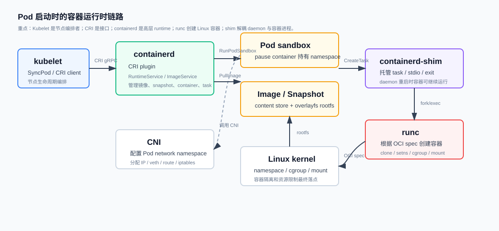
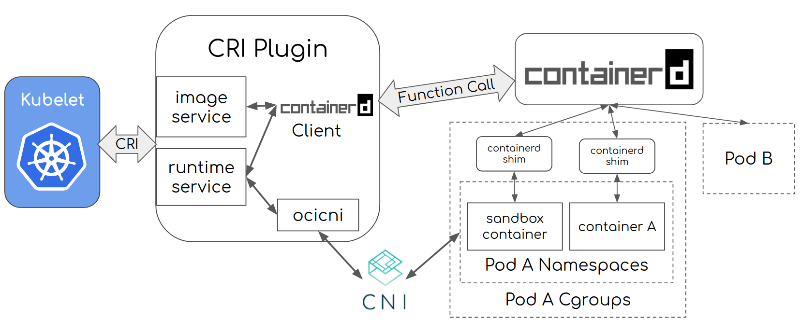

## 一句话结论

Infra 面试里的容器运行时问题，重点不是“Docker 命令怎么用”，而是要讲清 **Kubelet 如何通过 CRI 调 containerd，containerd 如何管理镜像、snapshot、sandbox 和 task，runc 如何按 OCI spec 创建 Linux 容器，containerd-shim 为什么要把容器进程和 containerd daemon 解耦**。排障时要能沿着 `Pod Event -> kubelet -> CRI -> containerd -> shim/runc -> CNI/CSI/kernel` 这条链路定位。
## 先把概念说清楚

<div class="card card-m">
<h3>容器运行时不等于 Docker</h3>
<p>Docker 是面向用户的容器产品，包含 CLI、API、build、network、volume 等能力；containerd 是更底层的容器运行时，专注镜像、容器生命周期、snapshot 和 task 管理；runc 是更底层的 OCI runtime，真正调用 Linux kernel 能力创建容器进程。</p>
</div>

| 概念 | 是什么 | 面试里怎么说 |
|---|---|---|
| CRI | Kubernetes 定义的 Container Runtime Interface，kubelet 通过它调用运行时 | CRI 是 kubelet 和 runtime 的标准 gRPC 接口，不是具体 runtime |
| containerd | 高层容器运行时 daemon | 管镜像、content store、snapshot、container metadata、task、CRI plugin |
| runc | OCI low-level runtime | 根据 OCI runtime spec 调 Linux namespace、cgroup、mount 等创建容器 |
| OCI | Open Container Initiative 规范集合 | image spec 定义镜像格式，runtime spec 定义如何运行容器 |
| containerd-shim | containerd 和容器进程之间的托管层 | 负责 stdio、exit status、事件上报，让 containerd 重启不杀容器 |
| pause container | Pod sandbox 的基础容器 | 持有 Pod network namespace / Pod IP，让业务容器共享 Pod 网络身份 |
| CNI | Container Network Interface | 给 Pod sandbox 配网络，如 veth、IP、route、iptables/eBPF |
| CSI | Container Storage Interface | 给 Pod 准备和挂载 volume |

## 运行时链路图

<figure class="figure">

<figcaption>本站整理的节点侧运行时链路：kubelet 通过 CRI 调 containerd，containerd 管 sandbox、镜像、snapshot 和 task，shim 托管容器进程，runc 调 Linux kernel 创建容器。</figcaption>
</figure>

<figure class="figure">

<figcaption>containerd 官方 CRI plugin 架构图。来源：containerd docs, Architecture of The CRI Plugin, CC-BY-4.0。</figcaption>
</figure>

## Pod 启动链路

```flow
调度完成 | kube-scheduler 把 Pod 绑定到某个 Node
kubelet SyncPod | kubelet watch 到本节点 Pod，开始本地执行
准备存储 | volume manager / CSI 挂载 volume
创建 sandbox | kubelet 通过 CRI 调 RunPodSandbox
配置网络 | containerd CRI plugin 调 CNI，创建 Pod network namespace
拉镜像 | PullImage 解析 manifest、下载 layer、校验 digest
准备 rootfs | snapshotter 基于镜像 layer 生成容器 rootfs
启动容器 | containerd 创建 shim，shim 调 runc 创建并启动进程
状态回写 | kubelet 收集 container status 并写回 API Server
```

关键点：

- `RunPodSandbox` 先于业务容器启动，因为 Pod 需要先有网络 namespace 和 Pod IP。
- `PullImage` 走 CRI ImageService，containerd 会维护 content store 和 snapshot。
- `CreateContainer` 只是创建容器配置和 rootfs，`StartContainer` 才启动进程。
- runc 通常不是常驻 daemon，它创建容器后退出；常驻托管进程是 shim。

## containerd 内部对象

| 对象 | 解释 | 常见追问 |
|---|---|---|
| Content | 镜像 blob 内容，按 digest 存储 | 为什么 digest 比 tag 更可靠 |
| Image | 镜像元数据，指向 manifest / config / layer | tag 和 digest 的区别 |
| Snapshot | rootfs 的可写层和只读层组合 | overlayfs、copy-on-write |
| Container | containerd 的容器元数据，不等于正在运行的进程 | container 和 task 区别 |
| Task | 正在运行的进程对象 | start/kill/exec/wait 都是 task 操作 |
| Sandbox | Pod 级运行环境 | pause 容器、Pod namespace、Pod IP |

## Docker、containerd、runc 的关系

```flow
Docker CLI / API | 面向用户，build/run/push/pull 等产品能力
Docker Engine | 调 containerd 管理容器生命周期
containerd | 管镜像、snapshot、container、task
containerd-shim | 托管容器进程，解耦 daemon
runc | 按 OCI spec 创建 Linux 容器
Linux kernel | namespace、cgroup、mount、capability、seccomp
```

面试要避免两种说法：

| 错误说法 | 正确说法 |
|---|---|
| Kubernetes 不用 Docker 后，Docker 镜像不能跑了 | 错。dockershim 移除的是 kubelet 到 Docker Engine 的内置适配层，OCI/Docker 镜像格式仍兼容 |
| containerd 直接 fork 出业务容器 | 不准确。containerd 通常启动 shim，shim 再调用 runc，容器进程由 shim 托管 |
| runc 负责镜像拉取 | 错。runc 只负责按 OCI runtime spec 创建容器，镜像和 snapshot 是 containerd 负责 |
| pause 容器没用 | 错。pause 是 Pod namespace 锚点，业务容器重启时 Pod 网络身份可以保持稳定 |

## 常用排障命令

```bash
# 看 kubelet 看到的 Pod / Container 状态
kubectl describe pod <pod> -n <ns>
kubectl get events -n <ns> --sort-by=.lastTimestamp

# 节点侧：用 CRI 视角看 runtime
crictl ps -a
crictl pods
crictl images
crictl inspect <container_id>
crictl inspectp <pod_sandbox_id>
crictl logs <container_id>
crictl pull <image>

# containerd 视角
ctr -n k8s.io containers list
ctr -n k8s.io tasks list
ctr -n k8s.io images list
ctr -n k8s.io snapshots list

# 日志和进程
journalctl -u kubelet -f
journalctl -u containerd -f
ps -ef | grep containerd-shim

# CNI / 网络
ip netns list
ip link
ip route
ls /etc/cni/net.d/
```

`crictl` 更适合 Kubernetes 节点排障，因为它走 CRI；`ctr` 是 containerd 自带低层调试工具，命名空间常用 `k8s.io`；`nerdctl` 更像 Docker CLI 体验，适合人工运行容器。

## 常见面试问题

<div class="qa" onclick="this.classList.toggle('open')">
<div class="qa-q">Q: containerd、runc、containerd-shim 分别负责什么？</div>
<div class="qa-a">
<p><code>containerd</code> 是高层 runtime daemon，负责镜像拉取、content store、snapshot、容器元数据、task 生命周期和 CRI 服务。<code>runc</code> 是 OCI low-level runtime，负责根据 OCI spec 调 Linux kernel 创建容器。<code>containerd-shim</code> 位于 containerd 和容器进程之间，负责托管容器进程、转发 stdio、收集 exit status 和上报事件。</p>
<div class="qa-summary">一句话：containerd 管生命周期和镜像，runc 创建容器，shim 托管进程并解耦 daemon。</div>
</div>
</div>

<div class="qa" onclick="this.classList.toggle('open')">
<div class="qa-q">Q: 为什么需要 containerd-shim？containerd 不能直接管容器进程吗？</div>
<div class="qa-a">
<p>如果 containerd 直接成为所有容器进程的父进程，那么 containerd 重启或升级时会影响正在运行的容器。shim 把容器进程和 containerd daemon 解耦：containerd 可以重启，shim 继续托管容器；shim 还负责保留 stdio、等待容器退出、收集 exit code、上报事件和清理资源。</p>
<div class="qa-summary">面试口径：shim 的核心价值是容器生命周期托管和 daemon 解耦。</div>
</div>
</div>

<div class="qa" onclick="this.classList.toggle('open')">
<div class="qa-q">Q: pause 容器是什么？为什么 Pod 需要它？</div>
<div class="qa-a">
<p>Pod 不是一个容器，而是一组共享网络等 namespace 的容器。pause 容器是 Pod sandbox 的基础容器，它先启动并持有 Pod 的 network namespace、Pod IP 和部分共享 namespace。业务容器启动时加入这个 sandbox。这样业务容器重启时，Pod 的网络身份仍然可以保持稳定。</p>
<div class="qa-summary">面试口径：pause 容器是 Pod 的 namespace 锚点。</div>
</div>
</div>

<div class="qa" onclick="this.classList.toggle('open')">
<div class="qa-q">Q: Kubernetes 移除 dockershim 后，Docker 镜像还能跑吗？</div>
<div class="qa-a">
<p>能。dockershim 移除的是 kubelet 内置的 Docker Engine 适配层，不是移除 Docker 镜像格式。只要镜像符合 OCI / Docker image spec，containerd 和 CRI-O 都能拉取和运行。变化在节点链路：以前是 kubelet → dockershim → Docker Engine → containerd，现在是 kubelet → CRI → containerd。</p>
<div class="qa-summary">面试口径：dockershim removed 不等于 Docker image 不能用；镜像格式兼容，运行时链路变了。</div>
</div>
</div>

<div class="qa" onclick="this.classList.toggle('open')">
<div class="qa-q">Q: ImagePullBackOff 怎么排查？</div>
<div class="qa-a">
<p>先看 Pod Events 里的错误类型：镜像名/tag 是否存在，registry 是否可达，imagePullSecret 是否正确，节点 DNS/代理/证书是否正常，是否触发 registry rate limit。然后到节点侧用 <code>crictl pull</code> 复现，用 <code>journalctl -u containerd</code> 看 runtime 具体错误。</p>
<pre><code class="language-bash">kubectl describe pod <pod> -n <ns>
kubectl get secret -n <ns>
crictl pull <image>
journalctl -u containerd -n 200</code></pre>
<div class="qa-summary">面试口径：ImagePullBackOff 是 kubelet 拉镜像失败后的退避状态，根因通常在镜像名、权限、网络、证书或 registry。</div>
</div>
</div>

<div class="qa" onclick="this.classList.toggle('open')">
<div class="qa-q">Q: ContainerCreating 卡住怎么排查？</div>
<div class="qa-a">
<p>ContainerCreating 表示 Pod 已经调度到节点，但节点侧执行还没完成。排查顺序是 Events、kubelet 日志、containerd 日志、CNI 日志/配置、CSI mount、镜像拉取和 sandbox 创建。常见原因包括 CNI 分配 IP 失败、CSI 挂载超时、sandbox 创建失败、镜像拉取慢、节点磁盘压力。</p>
<div class="qa-summary">面试口径：Pending 偏调度侧；ContainerCreating 偏节点执行侧，重点查 kubelet、runtime、CNI、CSI。</div>
</div>
</div>

<div class="qa" onclick="this.classList.toggle('open')">
<div class="qa-q">Q: 容器镜像 layer、snapshot、overlayfs 是什么关系？</div>
<div class="qa-a">
<p>镜像由多层只读 layer 组成，containerd 把这些 layer 存在 content store 中。启动容器时，snapshotter 会基于这些只读层准备 rootfs，并给容器加一个可写层。overlayfs 常用于把多个只读 lowerdir 和一个 writable upperdir 合成一个统一视图。容器内写文件时触发 copy-on-write，不会修改原始镜像层。</p>
<div class="qa-summary">面试口径：image layer 是内容，snapshot 是运行时 rootfs 视图，overlayfs 是常见实现。</div>
</div>
</div>

<div class="qa" onclick="this.classList.toggle('open')">
<div class="qa-q">Q: 容器资源限制最终落在哪里？</div>
<div class="qa-a">
<p>Kubernetes 的 requests 主要用于调度，limits 会通过 kubelet / runtime 写到 cgroup。CPU limit 常体现为 CFS quota，内存 limit 体现为 cgroup memory 上限，超过可能触发容器 OOMKilled。GPU 这类设备资源通常通过 device plugin 注入设备文件、环境变量或 runtime hook；GPU 显存本身不一定被 cgroup 原生限制，需要厂商 runtime 或平台策略配合。</p>
<div class="qa-summary">面试口径：CPU/内存限制最终落到 cgroup；GPU 设备可见性由 device plugin/runtime 控制，显存限制要看厂商能力。</div>
</div>
</div>

## Infra 面试回答结构

如果面试官问“介绍一下容器运行时”：

```flow
先分层 | Docker / containerd / runc / Linux kernel 边界
再讲接口 | kubelet 通过 CRI 调 runtime，OCI 规范定义镜像和运行方式
再讲 Pod | sandbox / pause 容器先创建，业务容器加入共享 namespace
再讲镜像 | manifest、layer、content store、snapshotter、overlayfs
最后排障 | Events -> kubelet -> containerd -> CNI/CSI -> kernel
```

可以这样组织：

1. 容器不是轻量 VM，本质是 Linux namespace、cgroup、rootfs、capability、seccomp 等能力的组合。
2. Kubernetes 不直接调用 Docker/containerd 私有 API，而是通过 CRI 调运行时。
3. containerd 是高层 runtime，负责镜像、snapshot、容器元数据和 task；runc 是 OCI runtime，负责创建 Linux 容器。
4. Pod 先创建 sandbox/pause 容器，持有 Pod 网络 namespace；业务容器再加入 sandbox。
5. 节点侧问题要按链路排：调度是否完成、kubelet 是否 SyncPod、containerd 是否拉镜像/建 sandbox、CNI/CSI 是否成功、kernel cgroup/namespace 是否正常。

## 参考资料

- containerd docs: [Architecture of The CRI Plugin](https://containerd.io/docs/main/cri/architecture/)
- containerd docs: [Runtime v2](https://containerd.io/docs/main/runtime-v2/)
- Kubernetes docs: [Container Runtimes](https://kubernetes.io/docs/setup/production-environment/container-runtimes/)
- Kubernetes blog: [Dockershim Removal FAQ](https://kubernetes.io/blog/2022/02/17/dockershim-faq/)
