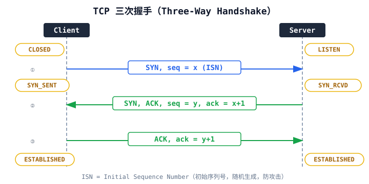
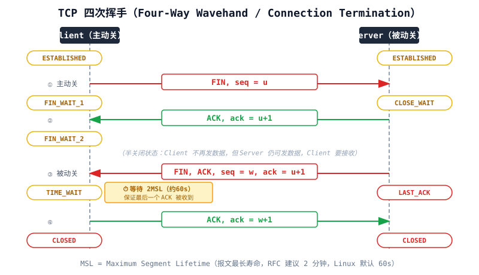

## 一句话结论

TCP 是面向连接、可靠、有序、字节流协议，通过三次握手建连、四次挥手断连、滑动窗口+拥塞控制保证可靠传输；UDP 是无连接、不可靠、数据报协议，开销低、延迟小，适合实时/广播场景。AI 训练集群通信（NCCL）底层优先用 RDMA（RoCE/InfiniBand）绕开 TCP 栈，但 fallback 时用 TCP。

<h3>TCP vs UDP 核心对比</h3>
<table><tr><th>维度</th><th>TCP</th><th>UDP</th></tr>
<tr><td>连接性</td><td>面向连接（握手/挥手）</td><td>无连接</td></tr>
<tr><td>可靠性</td><td>可靠传输（确认+重传+排序）</td><td>不保证交付、不保证顺序</td></tr>
<tr><td>传输单位</td><td>字节流（无消息边界）</td><td>数据报（有消息边界）</td></tr>
<tr><td>流量/拥塞控制</td><td>有（滑动窗口 + 拥塞控制）</td><td>无</td></tr>
<tr><td>首部开销</td><td>20–60 字节</td><td>8 字节</td></tr>
<tr><td>延迟</td><td>较高（握手、重传、拥塞控制）</td><td>低</td></tr>
<tr><td>适用场景</td><td>HTTP/HTTPS、SSH、RPC、文件传输</td><td>DNS 查询、视频通话、QUIC、NTP</td></tr>
<tr><td>AI Infra 场景</td><td>gRPC 控制面、数据 fallback</td><td>RoCE v2（RDMA over UDP）</td></tr>
</table>

<h3>TCP 三次握手（建连）</h3>

为什么是三次？核心原因：<strong>双方确认对方的收/发能力正常</strong> + <strong>同步双方初始序列号 ISN</strong> + <strong>防止历史重复连接初始化</strong>（两次不够：服务端无法确认客户端收到了自己的 SYN+ACK）。

<strong>关键细节：</strong>

<ul>
<li>ISN（Initial Sequence Number）不是从 0 开始，而是随时间递增，防止历史报文干扰</li>
<li>SYN 报文消耗一个序号（seq+1），携带数据也消耗序号（通常 SYN 不携带数据）</li>
<li>第三次握手可以携带数据（节省一个 RTT）</li>
<li>半连接队列（SYN queue）存 SYN_RCVD 状态；全连接队列（accept queue）存 ESTABLISHED 状态等待 accept()</li>
</ul>

<h3>TCP 四次挥手（断连）</h3>

为什么是四次？<strong>TCP 是全双工</strong>，两个方向要各自独立关闭：Client 发 FIN 表示"我不再发了"，Server 先 ACK，但 Server 可能还有数据要发，等发完再发自己的 FIN，最后 Client ACK。

<strong>关键状态：</strong>

<ul>
<li><strong>TIME_WAIT：</strong>主动关闭方发送最后一个 ACK 后等待 2MSL，作用：(1) 保证最后 ACK 被对方收到（对方超时重传 FIN 时可以重新 ACK）；(2) 让本次连接的所有报文在网络中消亡，防止新旧连接混淆</li>
<li><strong>CLOSE_WAIT：</strong>被动关闭方收到 FIN 后进入，如果大量出现说明应用没调 close()（连接泄漏）</li>
<li><strong>半关闭：</strong>FIN_WAIT_2 状态下，Client 仍可接收 Server 发来的数据</li>
</ul>

<h3>TCP 如何保证可靠传输</h3>
<table><tr><th>机制</th><th>作用</th></tr>
<tr><td>序列号 + 确认号</td><td>保证有序、不丢失、不重复</td></tr>
<tr><td>超时重传（RTO）</td><td>未按预计时间收到 ACK 则重传</td></tr>
<tr><td>快速重传</td><td>收到 3 个重复 ACK 立即重传，不等超时</td></tr>
<tr><td>滑动窗口</td><td>流量控制，按接收方能力发送（见下一节）</td></tr>
<tr><td>拥塞控制</td><td>按网络状况调节发送速率（慢启动/拥塞避免/快重传/快恢复）</td></tr>
<tr><td>校验和</td><td>检测数据损坏</td></tr>
</table>

<h3>常见面试问题</h3>
<ul>
<li><strong>TCP 粘包/拆包问题：</strong>TCP 是字节流，没有消息边界；应用层需要自己定义消息边界（长度字段、分隔符、固定长度）。UDP 不存在此问题</li>
<li><strong>listen 的 backlog 参数：</strong>控制全连接队列大小，高并发服务器需要调大（&gt; somaxconn）</li>
<li><strong>SYN Flood 攻击：</strong>攻击者发大量 SYN 不回 ACK，占满半连接队列。防御：SYN Cookies（不存 SYN 队列，信息编码到 ISN）</li>
<li><strong>TCP Keepalive：</strong>空闲超时后发探测包，检测死连接（默认 2 小时）；HTTP/2 有 PING 帧做同样事</li>
</ul>

Q: 为什么三次握手不是两次或四次？

<strong>两次不行：</strong>如果 Client 发的 SYN 在网络中延迟，Client 超时重发并完成连接、释放连接后，老 SYN 到达 Server，Server 以为新连接直接进入 ESTABLISHED，但 Client 已经不想要了——Server 白白等数据，浪费资源。三次握手中 Client 必须对 Server 的 SYN+ACK 回复 ACK，Server 才会进入 ESTABLISHED。<strong>四次没必要：</strong>Server 的 SYN 和 ACK 可以合并成一个包（SYN+ACK），所以第二、三步合并后就是三次。

Q: TIME_WAIT 为什么要等 2MSL？服务器出现大量 TIME_WAIT 怎么处理？

<strong>2MSL 原因：</strong>(1) 主动方发送最后 ACK 可能丢失，被动方会重传 FIN（1MSL 内到达），重传 FIN 后主动方重新 ACK 并重置 2MSL 计时器；最坏情况下一个方向上 ACK 和重传 FIN 共需 2MSL 让双向报文都消亡。(2) 保证本次连接四元组的所有旧报文在网络中消失，避免新连接（同样四元组）收到旧数据。<strong>大量 TIME_WAIT：</strong>高并发短连接服务常见。解决：开启 <code>net.ipv4.tcp_tw_reuse</code>（客户端复用 TIME_WAIT socket 发新连接）、HTTP 用长连接（Connection: keep-alive）、调整 <code>tcp_max_tw_buckets</code>。不建议开 <code>tcp_tw_recycle</code>（NAT 场景会导致丢包，已在 Linux 4.12 移除）。

Q: UDP 不可靠为什么还用？QUIC 为什么选择 UDP？

UDP 优势：<strong>无连接开销</strong>（无握手，DNS 这种一次请求-响应省一个 RTT）、<strong>无队头阻塞</strong>（每个包独立）、<strong>头部小</strong>（8 字节 vs TCP 20+）、<strong>用户态可控</strong>。QUIC（HTTP/3）选 UDP 是因为：(1) TCP 实现在内核，迭代慢，UDP 用户态可快速创新；(2) 基于 UDP 可以自己实现多路复用，解决 TCP 层 HOL 阻塞；(3) 0-RTT/1-RTT 建连（融合 TLS 握手+传输握手）；(4) 连接迁移（基于 Connection ID 而非四元组，移动网络切 Wi-Fi 不中断）。RoCE v2 用 UDP 封装 RDMA 也是因为以太网基础设施对 UDP 友好。

