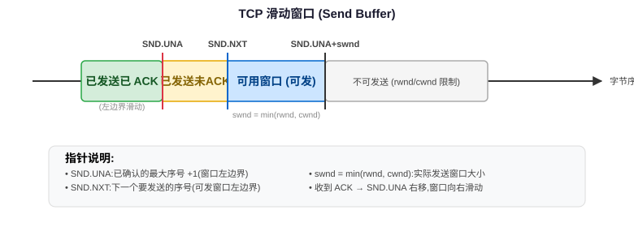
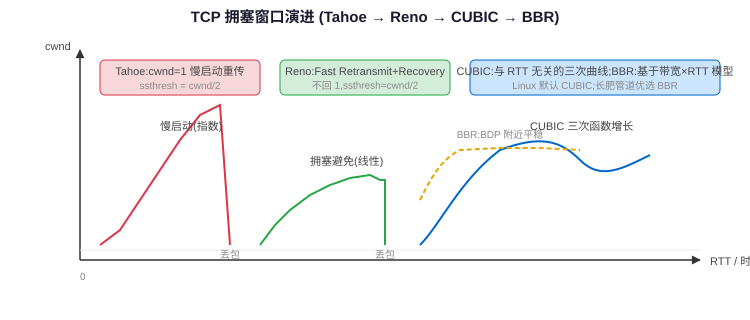

## 一句话结论

TCP 性能核心由滑动窗口（流控 rwnd + 拥塞控制 cwnd，实际发送窗口 swnd = min(rwnd, cwnd)）和拥塞控制算法决定。经典算法从 Tahoe（丢包回退到 1）到 Reno（快重传快恢复），现代 Linux 默认 CUBIC（基于时间的三次函数增长，RTT 公平），长肥管道/数据中心常用 BBR（基于带宽和 RTT 建模而非丢包）。Nagle 合并小包但与延迟 ACK 组合会产生死锁，实时系统通常开 TCP_NODELAY。

## 复习定位

| 维度 | 内容 |
|---|---|
| 所属模块 | 网络基础 |
| 章节类型 | 机制类 |
| 解决问题 | 深入理解滑动窗口、拥塞控制算法演进（Tahoe/Reno/CUBIC/BBR）、Nagle/delayed ACK、TFO/Keepalive/SYN Cookie 等高级机制。 |
| 面试抓手 | 先讲滑动窗口数学，再按历史顺序讲拥塞控制算法演进和差异，最后讲小包和连接优化。 |

<h3>滑动窗口详解</h3>

滑动窗口是 TCP 可靠性和流控的核心机制，同时也是发送速率的根本限制。发送窗口由<strong>接收方的流控窗口（rwnd）</strong>和<strong>发送方的拥塞窗口（cwnd）</strong>共同决定。

<table>
<tr><th>概念</th><th>含义</th><th>谁决定</th></tr>
<tr><td>rwnd（接收窗口）</td><td>接收方缓冲区剩余空间，防止发送方打爆接收方</td><td>接收方在 TCP 头部 Window Size 字段通告</td></tr>
<tr><td>cwnd（拥塞窗口）</td><td>发送方根据网络状况估计的可发送量，防止打爆网络</td><td>发送方拥塞控制算法维护</td></tr>
<tr><td>swnd（发送窗口）</td><td>实际可以发送但未经确认的数据量上限</td><td><code>swnd = min(rwnd, cwnd)</code></td></tr>
</table>

<h3>序列号与窗口指针数学</h3>

TCP 发送缓冲区维护三个关键指针：

<table>
<tr><th>指针</th><th>含义</th></tr>
<tr><td><code>SND.UNA</code></td><td>已发送但尚未收到 ACK 的第一个字节（最老未确认字节）</td></tr>
<tr><td><code>SND.NXT</code></td><td>下一个要发送的字节序号</td></tr>
<tr><td><code>SND.UNA + swnd</code></td><td>发送窗口右边界（最大可发字节序号）</td></tr>
</table>

可用窗口大小 = <code>(SND.UNA + swnd) - SND.NXT</code>：即还能立即发送多少新数据。当收到 ACK 时，SND.UNA 向前滑动，窗口开放，可以发送更多数据。

<strong>Window Scale 选项：</strong>TCP 头部 Window Size 字段只有 16 位（最大 65535 字节），在高带宽延迟积（BDP）网络中远远不够。TCP 选项中的 Window Scale 允许将窗口值左移 shift.count 位（最多 14 位），最大窗口可达 1GB（65535 × 2^14），在三次握手时协商。

零窗口探测（Zero Window Probe）

当接收方缓冲区满了（rwnd=0），发送方停止发送数据。但如果接收方之后发送的 Window Update 丢包了，双方会永久死等——发送方等窗口开放，接收方等数据。Zero Window Probe 机制：发送方<strong>周期性发送 1 字节探测数据</strong>（即使 rwnd=0 也允许），强制接收方重新通告窗口，打破死锁。

<h3>拥塞控制算法演进</h3>

拥塞控制的核心目标：最大化利用带宽，同时不造成网络拥塞崩溃。从 1980 年代至今算法不断演进，面试要能讲出每个算法的关键改进。

Tahoe（1988）—— 最基础
<table><tr><th>阶段</th><th>cwnd 变化</th><th>触发条件</th></tr><tr><td>慢启动（Slow Start）</td><td>cwnd += 1 per ACK（指数增长：每 RTT 翻倍）</td><td>连接开始或超时后，直到 cwnd >= ssthresh</td></tr><tr><td>拥塞避免（Congestion Avoidance）</td><td>cwnd += 1/cwnd per ACK（线性增长：每 RTT +1）</td><td>cwnd >= ssthresh 后</td></tr><tr><td>丢包事件</td><td>ssthresh = cwnd/2，cwnd = 1（回到慢启动！）</td><td>超时（RTO）</td></tr></table>
Tahoe 最保守：任何丢包都把 cwnd 暴力砍到 1，重新慢启动，浪费带宽。

Reno（1990）—— 快重传 + 快恢复

Reno 在 Tahoe 基础上增加了两个关键机制：

<ul><li><strong>快重传（Fast Retransmit）：</strong>收到 3 个重复 ACK（dup ACK）就立即重传丢失的包，不等待超时（RTO 通常很长，200ms+）。3 dup ACK 说明网络还在通（只是乱序或丢了一个包），不用等超时。</li><li><strong>快恢复（Fast Recovery）：</strong>3 dup ACK 触发时，ssthresh = cwnd/2，cwnd = ssthresh（不是降到 1！），直接进入拥塞避免。因为 dup ACK 说明数据还在流动，网络没完全堵死，不必从 1 开始慢启动。</li></ul>

<strong>Reno 的问题：</strong>一个窗口内如果丢了多个包，Reno 处理不好——只重传第一个丢失的包，收到部分 ACK（partial ACK，确认了新数据但不是全部已发送数据）后会退出快恢复，可能导致超时。

NewReno —— 改进快恢复

NewReno 修复了 Reno 在多丢包场景的问题：收到 partial ACK 时不退出快恢复，而是持续重传丢失的包，直到所有丢失的包都被确认（收到恢复点之前的 ACK）才退出快恢复。

<h3>CUBIC：Linux 默认拥塞控制（2.6.19+）</h3>

CUBIC 是 Linux 内核从 2007 年起的默认拥塞控制算法（之前是 BIC），专门为高带宽长距离网络设计。

核心改进：与 RTT 解耦的窗口增长
<ul><li>Reno/NewReno 的窗口增长依赖 ACK 驱动（cwnd 每收到一个 ACK 加 1/cwnd），RTT 短的流增长更快（因为同样时间内能收到更多 ACK），对长 RTT 流不公平。</li><li>CUBIC 使用<strong>三次函数（cubic function）</strong>基于距离上次丢包的时间来增长窗口，不依赖 ACK 频率，因此不同 RTT 的流之间更公平。</li></ul>

<table>
<tr><th>参数</th><th>默认值</th><th>含义</th></tr>
<tr><td>β_cubic（乘性减小因子）</td><td>0.7</td><td>丢包后 cwnd = cwnd × β（Reno 是 0.5），更温和</td></tr>
<tr><td>C（增长速率参数）</td><td>0.4</td><td>三次函数的增长 aggressiveness</td></tr>
<tr><td>W_max</td><td>动态记录</td><td>上次丢包前的窗口大小，三次函数围绕 W_max 增长（先缓慢接近，然后快速探索，接近饱和时变慢）</td></tr>
</table>

CUBIC 名字来自三次函数（CUBIC function）。窗口增长曲线是围绕 W_max 的三次函数：刚丢包后增长缓慢（稳定区），中间快速增长（探测区），接近前次最大窗口时再次放缓（饱和区）。β=0.7 比 Reno 的 0.5 更激进，能更好利用高带宽链路。

<h3>BBR：基于模型的拥塞控制（Google 2016）</h3>

BBR（Bottleneck Bandwidth and RTT）从根本上改变了拥塞控制的思路：<strong>不以丢包作为拥塞信号</strong>，而是主动测量网络的瓶颈带宽（BtlBw）和最小 RTT，运行在带宽延迟积（BDP）附近。

<table>
<tr><th>特性</th><th>传统算法（Reno/CUBIC）</th><th>BBR</th></tr>
<tr><td>拥塞信号</td><td>丢包（RTO/3 dup ACK）</td><td>排队延迟（RTT 增加）</td></tr>
<tr><td>模型</td><td>无显式模型，AIMD 试探</td><td>显式测量 BtlBw × minRTT = BDP</td></tr>
<tr><td>目标操作点</td><td>尽量填满缓冲区（导致 bufferbloat）</td><td>运行在 BDP（刚好填满管道不排队）</td></tr>
<tr><td>丢包反应</td><td>立即减窗</td><td>丢包≠拥塞（浅缓冲区随机丢包），除非确认是拥塞导致</td></tr>
</table>

BBR 四个阶段
<table><tr><th>阶段</th><th>行为</th></tr><tr><td>Startup（启动）</td><td>类似慢启动，指数增长发送速率，直到发现带宽不再增长（说明管道已满）</td></tr><tr><td>Drain（排空）</td><td>以 Startup 结束时的速率发送一段时间，排空 Startup 阶段产生的队列</td></tr><tr><td>ProbeBW（带宽探测）</td><td>稳态阶段，以 8 个 RTT 为周期：6 个 RTT 以 BDP 速率发送，1 个 RTT 加速 25% 探测是否有更多带宽，1 个 RTT 减速排空队列</td></tr><tr><td>ProbeRTT（RTT 探测）</td><td>每 10 秒，如果没有测得新的更小 RTT，短暂（约 200ms）把发送量降到 4 个 packet，排空队列测量真实的 propagation min RTT</td></tr></table>

BBR 的优势和局限

<strong>优势：</strong>
<ul><li>长肥管道（长距离高带宽）吞吐量比 CUBIC 高几个数量级</li><li>浅缓冲区数据中心中，随机丢包不会触发不必要的减窗</li><li>显著降低延迟（不填满缓冲区，减少 bufferbloat）</li></ul>
<strong>局限：</strong>
<ul><li>BBR 在混合部署中对 CUBIC 流不公平（BBR 不反应丢包，会抢占更多带宽）</li><li>ProbeRTT 阶段可能造成短暂的吞吐量下降</li><li>在深缓冲区网络中，BBR 的优势不明显甚至可能更差</li><li>算法复杂度高，参数调优难度大</li></ul>

BBR 的核心洞察：在现代网络（数据中心、光纤）中，丢包通常不意味着拥塞（可能是随机丢包或浅缓冲区溢出），RTT 增加（排队）才是真正的拥塞信号。BBR 追求「运行在 Kleinrock 最佳操作点」——最大吞吐、最小延迟。

<h3>Nagle 算法与 Delayed ACK 的交互</h3>
<table>
<tr><th>机制</th><th>行为</th><th>目的</th><th>问题</th></tr>
<tr><td>Nagle 算法（TCP_NODELAY 关闭时启用）</td><td>如果有未确认的在途数据，小于 MSS 的小数据要等收到 ACK 或凑满 MSS 才发</td><td>合并小包（tinygram），减少网络上的微型数据包数量</td><td>小包场景增加延迟</td></tr>
<tr><td>Delayed ACK</td><td>接收方收到数据后不立即回 ACK，延迟最多 200ms，等自己有响应数据捎带 ACK</td><td>减少纯 ACK 包数量，捎带确认提高效率</td><td>增加延迟</td></tr>
</table>

<strong>Nagle + Delayed ACK 死锁：</strong>这是经典问题。发送方发了一个小包，等 ACK 再发下一个（Nagle）；接收方收到小包，等有数据捎带才回 ACK（Delayed ACK）。双方互等，最多拖 200ms（Delayed ACK 超时）才解死锁。

实时系统（RPC、消息队列、游戏、数据库）几乎 universally 启用 <code>TCP_NODELAY</code>（禁用 Nagle），因为延迟比包数量更重要。同时可以启用 <code>TCP_QUICKACK</code> 禁用延迟 ACK（但 QUICKACK 是 per-send 提示，不是持久设置，每次收包后可能被内核重置）。

<h3>BDP（带宽延迟积）与窗口配置</h3>

BDP（Bandwidth-Delay Product）是理解 TCP 性能的关键概念：<code>BDP = 瓶颈带宽 × 最小 RTT</code>，表示「填满网络管道」需要多少字节的数据在途。

<table>
<tr><th>网络场景</th><th>带宽</th><th>RTT</th><th>BDP</th><th>需要的窗口大小</th></tr>
<tr><td>同机房</td><td>10 Gbps</td><td>0.1 ms</td><td>125 KB</td><td>125 KB（默认 rwnd 64KB 刚好够用）</td></tr>
<tr><td>跨城</td><td>1 Gbps</td><td>10 ms</td><td>1.25 MB</td><td>1.25 MB（需要 Window Scale）</td></tr>
<tr><td>跨洋（中美）</td><td>1 Gbps</td><td>150 ms</td><td>18.75 MB</td><td>18.75 MB（必须启用 Window Scale，否则最大 64KB 打不满带宽）</td></tr>
<tr><td>长肥管道（LFN）</td><td>10 Gbps</td><td>150 ms</td><td>187.5 MB</td><td>187.5 MB（需要大窗口 + BBR/CUBIC）</td></tr>
</table>

BDP 直接决定你需要多大的发送窗口才能跑满带宽。如果 swnd（min(rwnd, cwnd)）< BDP，管道永远填不满，吞吐量上不去。跨洋长 RTT 场景如果不开启 Window Scale，TCP 最多跑到 <code>64KB / 0.15s ≈ 427 KB/s ≈ 3.4 Mbps</code>，即使带宽有 1 Gbps。

<h3>SACK、DSACK 与选择性确认</h3>

原始 TCP 只有累积 ACK（确认到序号 X 表示 X 之前的所有字节都收到了），这导致一个窗口内丢多个包时，发送方无法知道哪些包到了哪些没到，只能超时重传或者靠 dup ACK 猜。

<table>
<tr><th>机制</th><th>说明</th></tr>
<tr><td>SACK（Selective ACK）</td><td>接收方在 ACK 中通过 TCP 选项告诉发送方「哪些不连续的块已经收到了」，发送方据此只重传真正丢失的包，不用重传已收到的数据</td></tr>
<tr><td>DSACK（Duplicate SACK）</td><td>SACK 的扩展，接收方用 SACK 块报告「收到了重复的包」，发送方据此判断是丢包了还是只是乱序/重复，避免不必要的重传</td></tr>
<tr><td>FACK（Forward ACK）</td><td>结合 SACK 更精确地计算拥塞窗口，Linux 中使用</td></tr>
</table>

SACK 在三次握手时协商，现在几乎所有 TCP 连接都启用。没有 SACK，一个窗口丢多个包会导致严重的性能问题（Go-Back-N 效应）。

<h3>MSS、MTU 与 PMTUD</h3>
<table>
<tr><th>概念</th><th>含义</th><th>典型值</th></tr>
<tr><td>MTU（最大传输单元）</td><td>链路层一次能传的最大帧大小（含 IP 头+TCP 头+数据）</td><td>以太网 1500 字节</td></tr>
<tr><td>MSS（最大段大小）</td><td>TCP 报文段中<strong>数据部分</strong>的最大大小（不含 TCP/IP 头）</td><td>1500 - 20(IP) - 20(TCP) = 1460 字节</td></tr>
<tr><td>PMTUD（路径 MTU 发现）</td><td>发现整条路径上最小 MTU，避免 IP 分片</td><td>通过设置 DF（Don't Fragment）位，收到 ICMP "Fragmentation Needed" 后减小 MSS</td></tr>
</table>

<strong>IP 分片的问题：</strong>如果发送的包大于路径 MTU 且没设 DF 位，IP 层会分片；但只要一个分片丢失，整个包都要重传，效率极低。TCP 通过 PMTUD 动态调整 MSS，尽量避免分片。

<strong>常见问题：</strong>ICMP 被防火墙拦截会导致 PMTUD 黑洞——大包丢了但发送方收不到 ICMP 消息，一直重传大包失败，连接卡死。解决方案：启用 <code>tcp_mtu_probing</code>（开启后内核会自动探测 MSS，不依赖 ICMP）。

<h3>ECN（显式拥塞通知）与 TCP 时间戳</h3>
<table>
<tr><th>机制</th><th>说明</th></tr>
<tr><td>ECN</td><td>允许中间路由器在拥塞即将发生时标记 ECN 位（而不是直接丢包），接收方把 ECN 标记回传给发送方，发送方据此减窗。把「丢包作为拥塞信号」提前为「标记作为拥塞信号」，减少不必要的丢包。需要两端和中间网络设备都支持。</td></tr>
<tr><td>TCP Timestamps</td><td>TCP 选项，两个作用：(1) 更精确的 RTT 测量（每个报文带时间戳，RTT 计算不再依赖重传歧义问题 PAWS）；(2) PAWS（Protection Against Wrapped Sequences）：防止序列号回绕后旧报文被当成新报文（高速网络序列号回绕很快）。<code>tcp_tw_reuse</code> 依赖 Timestamps 工作。</td></tr>
</table>

<h3>其他 TCP 优化机制</h3>
<table>
<tr><th>机制</th><th>说明</th></tr>
<tr><td>TCP Fast Open（TFO）</td><td>允许在 SYN 包中携带数据（需要 TFO cookie 验证），重复连接时省去一次 RTT。首次连接还是正常握手，Server 在第一次响应中设置 cookie，之后客户端 SYN 可以带 cookie + 数据。</td></tr>
<tr><td>TCP Keepalive</td><td><strong>不是心跳机制</strong>！默认空闲 2 小时才发送探测包，用于检测已死的对端（如对端崩溃/断电/网线拔了）。通过 <code>SO_KEEPALIVE</code> 开启，可以调整 <code>tcp_keepalive_time</code>、<code>tcp_keepalive_intvl</code>、<code>tcp_keepalive_probes</code> 参数。对于需要快速检测死连接的场景，应用层心跳更合适。</td></tr>
<tr><td>SYN Cookie</td><td>防御 SYN flood 攻击的内核机制。正常情况下收到 SYN 要分配连接状态（半开连接放入 SYN queue）；SYN flood 时攻击者发送大量 SYN 不完成握手，填满 SYN queue。开启 syncookies 后，内核不为 SYN 分配状态，而是把连接信息编码在 ISN（初始序列号）中，收到合法 ACK 时再重建状态。不需要存储半开连接，天然抗 SYN flood。代价是部分 TCP 选项信息可能丢失。</td></tr>
</table>

Q: Tahoe 和 Reno 的区别？

Tahoe 和 Reno 的核心区别在于<strong>丢包后的处理</strong>：

<table><tr><th>方面</th><th>Tahoe</th><th>Reno</th></tr><tr><td>慢启动</td><td>cwnd 指数增长到 ssthresh</td><td>相同</td></tr><tr><td>拥塞避免</td><td>cwnd 线性增长</td><td>相同</td></tr><tr><td>丢包检测</td><td>仅靠超时（RTO）</td><td>超时 + 3 dup ACK（快重传）</td></tr><tr><td>超时后行为</td><td>ssthresh = cwnd/2, cwnd = 1，慢启动</td><td>相同</td></tr><tr><td>3 dup ACK 后行为</td><td>和超时一样：cwnd = 1，慢启动</td><td><strong>快恢复</strong>：ssthresh = cwnd/2, cwnd = ssthresh，直接拥塞避免（不用从 1 开始）</td></tr></table>

为什么 3 dup ACK 和超时不同？收到重复 ACK 说明<strong>网络仍然在传数据</strong>（dup ACK 是因为收到了乱序的后续包），只是丢了一个包，不算严重拥塞；而超时意味着「长时间没有任何包通过」，网络可能严重拥塞，需要更激进地减窗。

Reno 在 Tahoe 基础上加了快重传（3 dup ACK 立即重传不等超时）和快恢复（3 dup ACK 后 cwnd 减半到 ssthresh 而非砍到 1），利用「dup ACK 意味着网络还活着」的信号避免过度减窗。

Q: BBR 为什么不用丢包作为拥塞信号？

BBR 的设计哲学基于以下观察：

<strong>1. 现代网络中丢包 ≠ 拥塞：</strong>

<ul><li>数据中心交换机通常使用浅缓冲区（shared buffer），端口竞争时会随机丢包，但链路带宽并未饱和</li><li>WiFi/无线链路有固有误码率（BER），随机丢包和拥塞无关</li><li>链路层 FEC/校验失败导致的丢包也不是拥塞</li></ul>

<strong>2. 丢包驱动的算法（Reno/CUBIC）会填满缓冲区：</strong>

<ul><li>Reno/CUBIC 不断增加 cwnd 直到丢包才减窗，这意味着它们总是试图把缓冲区填满</li><li>这导致 bufferbloat（缓冲区膨胀）：延迟显著增加（排队时延），但吞吐并没有提升</li><li>在深缓冲区网络中尤其严重——延迟可能增加几十倍</li></ul>

<strong>3. BBR 的真正拥塞信号是 RTT 增加：</strong>

<ul><li>当发送速率超过瓶颈带宽时，数据开始在瓶颈处排队，RTT 增加</li><li>RTT 增加（排队）才是拥塞的早期信号，丢包是晚期信号</li><li>BBR 通过测量 BtlBw（带宽瓶颈）和 minRTT（传播延迟）来运行在 BDP 点——刚好填满管道不排队</li></ul>

BBR 认为丢包在现代网络（浅缓冲数据中心、无线）中不代表拥塞，RTT 上升（排队）才是真正的拥塞信号；它显式测量带宽和最小 RTT，运行在 BDP（Kleinrock 最佳点）而不是靠丢包来发现拥塞。

Q: Nagle 算法解决什么问题？为什么要禁掉？

<strong>Nagle 解决什么：</strong>Nagle 算法（RFC 896）解决的是「小包问题」（tinygram problem）。如果应用每次只发 1 字节（如 telnet/SSH 每个按键发一个包），每个字节要带 40 字节的 TCP+IP 头（20+20），有效载荷只有 1/41 ≈ 2.4%，浪费带宽。Nagle 规定：如果有未确认的在途数据，后续小于 MSS 的数据必须等收到 ACK 或者数据攒满 MSS 才能发送，通过延迟发送来合并小包提高效率。

<strong>为什么要禁掉（TCP_NODELAY）：</strong>

<ul><li><strong>延迟敏感场景：</strong>RPC、数据库查询、实时游戏、消息系统——每次请求/响应通常都小于 MSS，但需要立即发送，延迟比带宽效率重要</li><li><strong>Nagle + Delayed ACK 死锁：</strong>发送方等 ACK 再发下一个包（Nagle），接收方等数据捎带才回 ACK（最多等 200ms），双方互等造成明显延迟</li><li>现代网络带宽远高于 1980 年代，小包的带宽浪费问题不再严重</li></ul>

<strong>替代方案：</strong>如果既要减少包数又要低延迟，不要依赖 Nagle，而是在应用层做 writev/gather write 或缓冲合并（Nagle 是内核级自动合并，应用层控制更精准）。

Nagle 合并小包提高带宽效率（telnet 时代重要），但增加延迟；现代 RPC/数据库/实时系统普遍用 TCP_NODELAY 禁用 Nagle，因为低延迟比省几个包更重要，尤其要避免 Nagle+Delayed ACK 死锁。

Q: 滑动窗口 rwnd=0 会怎样？

当接收方缓冲区满了，会通告 rwnd=0（Zero Window），发送方<strong>停止发送新数据</strong>（但已发送未确认的数据继续等待 ACK）。

<strong>正常情况下：</strong>接收方应用程序读取了缓冲区数据后，内核发送 Window Update 报文告知新的窗口大小，发送方恢复发送。

<strong>问题场景：</strong>如果 Window Update 报文丢包了，双方会陷入<strong>死锁</strong>：

<ul><li>发送方认为 rwnd=0，一直等窗口开放</li><li>接收方以为已经通告了窗口，等发送方发数据</li><li>没有任何触发机制打破这个等待</li></ul>

<strong>解决方案：Zero Window Probe（持续计时器）</strong>

<ul><li>发送方在 rwnd=0 时启动<strong>持续计时器（persist timer）</strong></li><li>周期性发送<strong>1 字节探测数据</strong>（即使窗口为 0，TCP 规范允许发送 1 字节紧急探测数据）</li><li>接收方收到探测数据后必须重新通告当前窗口大小</li><li>如果窗口还是 0，重置计时器继续探测；如果窗口已开放，恢复正常发送</li></ul>

<strong>工程视角：</strong>rwnd=0 通常意味着接收方应用程序处理太慢（消费速度 < 生产速度），是背压信号。需要检查接收方是否阻塞、应用是否在处理其他事情、是否有 GC 停顿等。

rwnd=0 时发送方停止发送；如果 Window Update 丢包会死锁，Zero Window Probe 通过周期性 1 字节探测打破死锁；rwnd=0 本质是接收方背压信号，需要排查接收端处理速度。

Q: CUBIC 为什么对不同 RTT 的流更公平？

CUBIC 对不同 RTT 流更公平的根本原因：<strong>窗口增长函数基于时间而非 ACK 时钟</strong>。

<strong>Reno 的问题（RTT 不公平）：</strong>

<ul><li>Reno 在拥塞避免阶段：每收到一个 ACK，cwnd += 1/cwnd（即每个 RTT cwnd 增加约 1 MSS）</li><li>但 ACK 到达频率和 RTT 成反比：RTT 短的流在相同时间内收到更多 ACK</li><li>结果：<strong>RTT=10ms 的流比 RTT=100ms 的流窗口增长快 10 倍</strong>，短 RTT 流抢占更多带宽</li></ul>

<strong>CUBIC 的解决方案：</strong>

<ul><li>CUBIC 的窗口大小是距离上次丢包的<strong>时间 t</strong>（以秒为单位）的函数：<code>W(t) = C(t-K)³ + W_max</code>（K 是到 W_max 的时间）</li><li>窗口增长只和<strong>经过了多少时间</strong>有关，和收到多少 ACK、RTT 多长无关</li><li>无论 RTT 是 10ms 还是 100ms，同样时间内窗口增长量相同</li><li>这让不同 RTT 的流在竞争带宽时更公平</li></ul>

<strong>类比：</strong>Reno 像「按步数发工资」，腿短的人（短 RTT）迈得快拿得多；CUBIC 像「按时间发工资」，不管走得快慢，同样时间涨一样的窗口。

Reno 的窗口增长由 ACK 驱动，短 RTT 流 ACK 来得快、窗口增长快，造成 RTT 不公平；CUBIC 用基于时间的三次函数增长窗口，与 ACK 频率/RTT 解耦，不同 RTT 流增长速率相同，因此更公平。

## 关联模块

- `01-tcp-udp.md`：TCP/UDP 基础、三次握手/四次挥手、队头阻塞
- `02-http-grpc-rpc.md`：HTTP/gRPC 协议（应用层对 TCP 的使用）
- `05-tcp-state-troubleshooting.md`：TCP 状态机、TIME_WAIT/CLOSE_WAIT 排障
- `06-dns-tls-quic.md`：TLS/QUIC/HTTP3 替代 TCP 的方案
