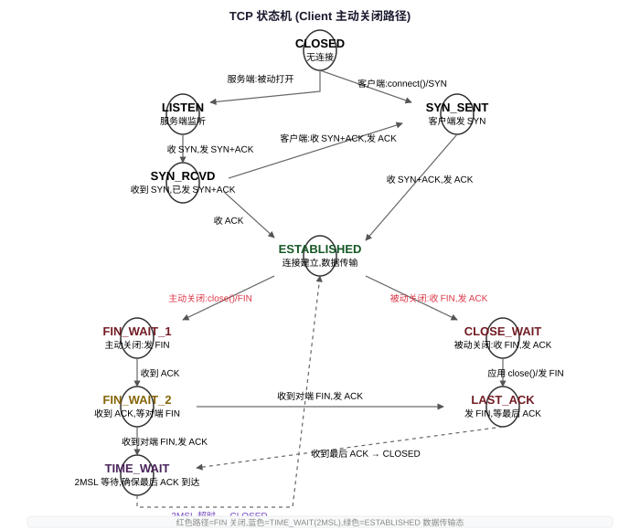

## 一句话结论

TCP 共 11 个状态，客户端主动关闭走 FIN_WAIT_1→FIN_WAIT_2→TIME_WAIT 路径，服务端被动关闭走 CLOSE_WAIT→LAST_ACK 路径。TIME_WAIT 过多主要用连接池解决（而非 tcp_tw_reuse），大量 CLOSE_WAIT 永远是应用 bug（没调 close），不是内核问题。排查 TCP 问题用 ss（比 netstat 快）+ tcpdump + ss -ti 看 RTT/cwnd，理解每个状态的根因才能快速定位连接问题。

<h3>TCP 状态机总览</h3>

TCP 连接从建立到关闭共 11 个状态，理解状态机是排查网络问题的基础。

<table>
<tr><th>状态</th><th>含义</th><th>谁处于此状态</th></tr>
<tr><td>LISTEN</td><td>服务端监听中，等待客户端连接</td><td>服务端</td></tr>
<tr><td>SYN_SENT</td><td>客户端发了 SYN，等待服务端 SYN+ACK</td><td>客户端（主动打开）</td></tr>
<tr><td>SYN_RCVD</td><td>服务端收到 SYN，发了 SYN+ACK，等待客户端 ACK</td><td>服务端</td></tr>
<tr><td>ESTABLISHED</td><td>连接建立，数据可以双向传输</td><td>双方</td></tr>
<tr><td>FIN_WAIT_1</td><td>主动关闭方发了 FIN，等待 ACK 或对端 FIN</td><td>主动关闭方</td></tr>
<tr><td>FIN_WAIT_2</td><td>主动关闭方收到 ACK，等待对端 FIN</td><td>主动关闭方</td></tr>
<tr><td>TIME_WAIT</td><td>收到对端 FIN，发了 ACK，等待 2MSL 后关闭</td><td>主动关闭方</td></tr>
<tr><td>CLOSING</td><td>双方同时关闭：发了 FIN 也收到了 FIN，但没收到 ACK</td><td>双方（罕见）</td></tr>
<tr><td>CLOSE_WAIT</td><td>被动关闭方收到 FIN，发了 ACK，等待应用 close</td><td>被动关闭方</td></tr>
<tr><td>LAST_ACK</td><td>被动关闭方发了自己的 FIN，等待最后一个 ACK</td><td>被动关闭方</td></tr>
<tr><td>CLOSED</td><td>连接完全关闭（无状态）</td><td>-</td></tr>
</table>

<h3>关闭路径：主动关闭 vs 被动关闭</h3>

TCP 关闭的关键不对称：<strong>谁先调 close()（或发 FIN），谁就进入 TIME_WAIT</strong>。

01

FIN_WAIT_1

主动方发 FIN → 等待 ACK

02

FIN_WAIT_2

收到 ACK → 等待被动方发 FIN

03

TIME_WAIT

收到被动方 FIN → 发 ACK → 等 2MSL

04

CLOSED

2MSL 超时后正式关闭

<strong>被动关闭路径：</strong>

01

CLOSE_WAIT

收到 FIN 并发 ACK → 等待应用层 close()

02

LAST_ACK

应用 close()，发 FIN → 等待最后 ACK

03

CLOSED

收到 ACK，连接关闭

面试常考：HTTP 短连接中，通常是服务端先关闭（因为响应发完就 close），所以服务端 TIME_WAIT 更多；HTTP keep-alive 连接中，谁先关看超时配置。

<h3>TIME_WAIT 深度解析</h3>

TIME_WAIT 是主动关闭方必须经过的最终状态，停留时间 <strong>2MSL（Maximum Segment Lifetime）</strong>，Linux 中 MSL 默认 60s，所以 TIME_WAIT 默认 120s（可通过 <code>net.ipv4.tcp_fin_timeout</code> 调整，但不建议改）。

TIME_WAIT 存在的两个原因
<ol><li><strong>保证全双工可靠终止：</strong>主动方发的最后一个 ACK 如果丢了，被动方会重发 FIN；主动方在 2MSL 内重发 ACK，而不是直接 CLOSED 后回 RST 导致被动方异常关闭。</li><li><strong>让旧连接的延迟报文消亡：</strong>网络中可能存在属于旧连接的流浪报文（迟到的数据包）；等 2MSL（足够报文在网络中最长生存时间的两倍）后，这些旧报文自然消亡，不会污染使用相同四元组的新连接。</li></ol>

TIME_WAIT 过多的问题
<ul><li><strong>端口耗尽：</strong>客户端主动关闭大量短连接时，(src_ip, src_port, dst_ip, dst_port) 四元组中的 src_port（临时端口）被大量 TIME_WAIT 占用。临时端口范围默认 <code>net.ipv4.ip_local_port_range = 32768-60999</code>（约 28000 个），并发短连接超过这个数会报 <code>Cannot assign requested address</code>。</li><li><strong>内存占用：</strong>每个 TIME_WAIT 连接占用内核内存（tcp_timewait_bucket），大量堆积增加内存压力。</li></ul>

TIME_WAIT 解决方案（按推荐顺序）
<table><tr><th>方案</th><th>说明</th><th>推荐度</th></tr><tr><td><strong>连接池/长连接</strong></td><td>复用连接而不是每次新建+关闭，根本上减少 TIME_WAIT 产生。HTTP keep-alive、gRPC 长连接、数据库连接池都是这个思路。</td><td>⭐⭐⭐⭐⭐ 首选</td></tr><tr><td><code>SO_REUSEADDR</code></td><td>服务端 bind 时允许绑定 TIME_WAIT 状态的端口（监听 socket 专用），解决服务端重启「Address already in use」。对客户端端口耗尽无效。</td><td>⭐⭐⭐⭐ 服务端必开</td></tr><tr><td><code>net.ipv4.tcp_tw_reuse</code></td><td>客户端对外连时允许复用 TIME_WAIT 状态超过 1s 的端口，<strong>必须配合 TCP timestamps 使用</strong>（<code>net.ipv4.tcp_timestamps=1</code>，默认开启）。仅对出站连接有效，不影响入站。</td><td>⭐⭐⭐ 出站可开</td></tr><tr><td>增大端口范围</td><td><code>net.ipv4.ip_local_port_range = 1024 65535</code>，增加可用临时端口数。</td><td>⭐⭐ 辅助手段</td></tr><tr><td><code>tcp_tw_recycle</code></td><td>NAT 环境下会导致问题（不同客户端时间戳不一致导致丢 SYN），内核 4.12 已移除。<strong>绝对不要用</strong>。</td><td>❌ 已废弃</td></tr></table>

面试回答顺序：首选连接池/长连接（从源头减少）；服务端开 SO_REUSEADDR；客户端端口耗尽可开 tcp_tw_reuse（有 timestamps 前提）；不要用 tcp_tw_recycle。

<h3>CLOSE_WAIT 积累：永远是应用 bug</h3>

CLOSE_WAIT 状态表示：<strong>内核已经收到对端 FIN 并发了 ACK，但应用层没有调用 close()</strong>。内核在等应用程序关闭 socket。

<strong>根因只有一个：应用程序没有 close() 这个 socket。</strong>

<ul><li>代码 bug：读完数据后忘了 close（异常路径没关 fd）</li><li>死锁/阻塞：应用线程卡住了（如阻塞在另一个 IO、GC 停顿、锁竞争），没机会执行 close</li><li>连接泄漏：连接池/引用计数 bug，fd 被持有没释放</li></ul>

<strong>检测命令：</strong>

<pre><code class="language-bash"># 查看所有 CLOSE_WAIT 连接
ss -t state close-wait
# 或者 netstat
netstat -anp | grep CLOSE_WAIT
# 统计各状态数量
ss -ant | awk '{print $1}' | sort | uniq -c | sort -rn</code></pre>

<strong>这不是内核问题，不是网络问题，是应用程序 bug。</strong>大量 CLOSE_WAIT 会导致 fd 泄漏，最终触发「Too many open files」。

CLOSE_WAIT 积累的诊断思路：ss 看 CLOSE_WAIT 连接 → lsof 看对应进程 → strace/gdb 看进程在干什么 → 检查代码路径是否所有分支都 close() 了 socket。常见于异常/错误路径漏关连接。

<h3>其他异常状态</h3>
<table>
<tr><th>状态</th><th>原因</th><th>处理</th></tr>
<tr><td>FIN_WAIT_2 堆积</td><td>主动关闭方发了 FIN 并收到 ACK，但被动方一直不发 FIN（对端崩溃/死机/代码 bug 不关连接）</td><td>内核孤儿 socket 由 <code>tcp_fin_timeout</code>（默认 60s）管理，超时后内核强制回收。应用层应该设置超时。</td></tr>
<tr><td>ESTABLISHED 但半开（half-open）</td><td>一方 ESTABLISHED，另一方已经崩溃/断网/断电，没有发 FIN。TCP 本身不检测这种情况，因为没有数据传输就不会发现问题。</td><td>TCP Keepalive（默认 2h 才探测，太慢）或应用层心跳（推荐，秒级检测）</td></tr>
<tr><td>SYN_RECV 堆积</td><td>可能是 SYN flood 攻击，或服务端 backlog 满了</td><td>开启 syncookies（<code>net.ipv4.tcp_syncookies=1</code>），增大 <code>net.core.somaxconn</code> 和 <code>tcp_max_syn_backlog</code></td></tr>
</table>

<h3>AI Infra 常见网络问题</h3>
<table>
<tr><th>现象</th><th>根因</th><th>解决方案</th></tr>
<tr><td>Connection reset by peer</td><td>对端发了 RST：对端崩溃重启、SO_LINGER timeout=0（主动发 RST 而非 FIN）、防火墙/iptables 发 RST、往已关闭 socket 写</td><td>检查对端日志、检查防火墙规则、检查应用是否在写已关闭连接</td></tr>
<tr><td>Broken pipe（SIGPIPE）</td><td>对端已经关闭连接（收了 RST 或 FIN），但本端还在写数据，内核发 SIGPIPE 信号</td><td>忽略 SIGPIPE（服务端程序常规操作），写时处理 EPIPE 错误</td></tr>
<tr><td>Address already in use</td><td>端口上有 TIME_WAIT 连接，新进程 bind 失败</td><td>服务端开 <code>SO_REUSEADDR</code>；或者等 TIME_WAIT 超时</td></tr>
<tr><td>Too many open files</td><td>进程打开 fd 数超过 ulimit（nofile），通常是连接泄漏（大量 CLOSE_WAIT）</td><td><code>ulimit -n</code> 查看并调大；排查 CLOSE_WAIT/连接泄漏根因；检查 <code>fs.file-max</code></td></tr>
<tr><td>Cannot assign requested address</td><td>临时端口耗尽：客户端 TIME_WAIT 太多，无可用端口发起新连接</td><td>连接池/长连接首选；开 tcp_tw_reuse；增大 ip_local_port_range</td></tr>
</table>

<h3>重要 Socket 选项</h3>
<table>
<tr><th>选项</th><th>作用</th><th>何时用</th></tr>
<tr><td><code>SO_REUSEADDR</code></td><td>允许 bind 到 TIME_WAIT 状态的端口</td><td>所有服务端必开</td></tr>
<tr><td><code>SO_REUSEPORT</code></td><td>多个进程/线程 bind 同一端口，内核做负载均衡</td><td>多进程服务（如 Nginx worker、gRPC 多进程）</td></tr>
<tr><td><code>SO_KEEPALIVE</code></td><td>开启 TCP Keepalive（默认 2h 空闲才探测）</td><td>长连接场景检测死连接（不如应用心跳）</td></tr>
<tr><td><code>TCP_NODELAY</code></td><td>禁用 Nagle 算法，立即发送小包</td><td>RPC、数据库、实时通信必开</td></tr>
<tr><td><code>TCP_QUICKACK</code></td><td>立即发 ACK 不 delay（每次收发后可能被重置）</td><td>需要极低延迟时用</td></tr>
<tr><td><code>SO_LINGER</code></td><td>控制 close() 行为：timeout=0 发 RST 直接断（避免 TIME_WAIT，但粗暴）；timeout>0 等数据发完</td><td>特殊场景慎用；timeout=0 跳过 TIME_WAIT 但可能丢数据</td></tr>
<tr><td><code>SO_RCVBUF</code>/<code>SO_SNDBUF</code></td><td>设置接收/发送缓冲区大小（影响 rwnd 上限）</td><td>高带宽长肥管道调大（注意也受内核参数限制）</td></tr>
</table>

<h3>网络排障命令清单</h3>
<table>
<tr><th>命令</th><th>用途</th></tr>
<tr><td><code>ss -ti</code></td><td>显示 TCP 连接详情，包括 RTT、rttvar、cwnd、ssthresh、mss 等内部参数（排障神器！）</td></tr>
<tr><td><code>ss -t -a -s</code></td><td>显示所有 TCP 连接状态统计（各状态数量）</td></tr>
<tr><td><code>ss -t state established</code></td><td>只看 ESTABLISHED 连接</td></tr>
<tr><td><code>netstat -anp</code></td><td>经典但慢，显示所有连接和进程 PID（新系统推荐 ss）</td></tr>
<tr><td><code>tcpdump -i eth0 -w capture.pcap port 8080</code></td><td>抓包保存到 pcap 文件，用 Wireshark 分析</td></tr>
<tr><td><code>tcpdump -i any -nn 'host x.x.x.x and port 1234' -A</code></td><td>实时抓包并以 ASCII 显示内容（快速调试）</td></tr>
<tr><td><code>ip route</code></td><td>查看路由表</td></tr>
<tr><td><code>tc qdisc show</code></td><td>查看流量控制队列规则（tc 还可以模拟延迟/丢包）</td></tr>
<tr><td><code>ping / mtr / traceroute</code></td><td>基础连通性和路径诊断</td></tr>
<tr><td><code>lsof -i :port</code></td><td>查看哪个进程占用端口</td></tr>
</table>

排障优先级：ss 看状态 → ss -ti 看 TCP 内部参数（RTT 是否异常、cwnd 是否卡住）→ tcpdump 抓包确认报文交互 → dmesg/日志看内核信息。

Q: 服务器出现大量 CLOSE_WAIT 是什么问题？

<strong>100% 是应用程序 bug，不是内核问题，不是网络问题。</strong>

CLOSE_WAIT 状态的含义：对端已经发 FIN 关闭了连接（内核收到并回了 ACK），但<strong>本地应用程序没有调用 close()</strong> 来关闭自己这一侧的 socket。内核在等应用层关闭。

<strong>常见原因：</strong>

<ul><li><strong>异常路径漏关连接：</strong>代码 try-catch/error 处理路径里忘了 close fd</li><li><strong>线程阻塞/死锁：</strong>处理连接的线程卡在其他地方（如另一个 IO、GC stop-the-world、锁竞争），没机会执行 close</li><li><strong>连接池泄漏：</strong>连接从池里借出来但没还回去，或引用计数错误导致 fd 永远不释放</li><li><strong>框架 bug：</strong>某些异步框架中 response 没消费完导致连接没被回收</li></ul>

<strong>排查步骤：</strong>

<ol><li><code>ss -t state close-wait</code> 或 <code>netstat -anp | grep CLOSE_WAIT</code> 看 CLOSE_WAIT 连接的目标端口和进程 PID</li><li><code>ls -l /proc/&lt;pid&gt;/fd | wc -l</code> 确认 fd 数量是否持续增长</li><li><code>strace -p &lt;pid&gt;</code> 或 <code>gdb -p &lt;pid&gt;</code> 看进程/线程卡在哪里</li><li>检查代码：所有 read/write 错误路径、异常处理分支是否都有 close</li><li>检查是否有连接池泄漏（借了不还）</li></ol>

大量 CLOSE_WAIT = 应用程序没 close() socket，根因通常是异常路径漏关、线程阻塞或连接泄漏；用 ss + lsof + strace 定位到具体代码。

Q: TIME_WAIT 太多怎么处理？

先搞清楚是<strong>哪一侧</strong>产生 TIME_WAIT：

<ul><li>服务端 TIME_WAIT 多：通常是服务端主动关闭（短连接、HTTP/1.0 无 keep-alive）</li><li>客户端 TIME_WAIT 多：客户端大量短连接压测/调用下游</li></ul>

<strong>解决方案按优先级：</strong>

<strong>1. 长连接/连接池（最推荐，根治）：</strong>

<ul><li>HTTP 用 keep-alive，gRPC/Thrift 天然长连接</li><li>数据库、Redis 客户端都用连接池</li><li>从源头减少连接创建/关闭次数</li></ul>

<strong>2. SO_REUSEADDR（服务端必开）：</strong>

<pre><code class="language-c">int opt = 1;
setsockopt(fd, SOL_SOCKET, SO_REUSEADDR, &opt, sizeof(opt));</code></pre>
允许 bind 到 TIME_WAIT 端口，解决服务重启「Address already in use」。

<strong>3. tcp_tw_reuse（出站连接可开）：</strong>

<pre><code class="language-bash">sysctl -w net.ipv4.tcp_tw_reuse=1
# 确保 timestamps 开启（默认开）
sysctl -w net.ipv4.tcp_timestamps=1</code></pre>
允许出站连接复用超过 1 秒的 TIME_WAIT 端口。依赖 TCP timestamps 防止旧报文干扰。<strong>注意：仅对主动连接（connect 方）有效，不影响入站。</strong>

<strong>4. 增大端口范围（辅助）：</strong>

<pre><code class="language-bash">sysctl -w net.ipv4.ip_local_port_range="1024 65535"</code></pre>

<strong>不要做的事：</strong>

<ul><li><code>tcp_tw_recycle</code>：内核 4.12 已移除，NAT 环境导致随机丢包，坚决不用</li><li>改小 MSL/tcp_fin_timeout：破坏 TCP 协议语义</li><li><code>SO_LINGER timeout=0</code>：发 RST 粗暴关闭，可能丢数据，只在特定测试场景用</li></ul>

TIME_WAIT 处理优先级：长连接/连接池（根治）→ SO_REUSEADDR（服务端）→ tcp_tw_reuse（客户端出站）→ 增大端口范围；不要改 MSL 或用 tcp_tw_recycle。

Q: 怎么排查 TCP 连接问题？

<strong>排障路径（从粗到细）：</strong>

<pre><code class="language-text">现象确认 → 状态检查 → 内核参数 → 抓包分析 → 应用定位</code></pre>

<strong>Step 1：确认现象</strong>

<ul><li>是连接建立失败？超时？重置？还是已建立但数据传不过去？</li><li>是所有连接都有问题还是个别？是偶发还是必现？</li></ul>

<strong>Step 2：ss 看连接状态</strong>

<pre><code class="language-bash">ss -s  # 各状态连接统计
ss -ti state established '( dport = :8080 or sport = :8080 )'  # 看具体连接的 RTT/cwnd/rto/mss
ss -tan | awk '{print $1}' | grep -v State | sort | uniq -c  # 各状态计数</code></pre>

重点看 <code>ss -ti</code> 输出：<code>rto</code>（重传超时）是否过大、<code>cwnd</code> 是否被打低（可能丢包拥塞）、<code>rtt</code>/<code>rttvar</code> 是否异常（网络延迟/抖动）、<code>retrans</code> 是否有重传。

<strong>Step 3：检查系统资源</strong>

<pre><code class="language-bash">ulimit -n  # fd 上限
cat /proc/sys/fs/file-nr  # 已用/最大文件句柄
dmesg | tail -50  # 内核日志（OOM、nf_conntrack full 等）
sysctl net.ipv4.tcp_mem  # TCP 内存限制</code></pre>

<strong>Step 4：tcpdump 抓包确认报文级行为</strong>

<pre><code class="language-bash">tcpdump -i any -nn 'host 10.0.0.1 and tcp port 8080' -w /tmp/cap.pcap
# 或实时看
tcpdump -i any -nnA 'tcp port 8080' | head -200</code></pre>

抓包看三次握手是否完成、有没有重传、有没有 RST、RTT 多大。

<strong>Step 5：定位应用层</strong>

<ul><li><code>lsof -i :&lt;port&gt;</code> 查进程</li><li><code>strace -p &lt;pid&gt;</code> 跟踪系统调用（看卡在 send/recv/connect 哪个调用）</li><li>检查应用日志、GC 日志、线程 dump</li></ul>

排障路径：ss 看状态和 TCP 参数（rtt/cwnd/retrans）→ 检查系统资源（fd/nf_conntrack/内核日志）→ tcpdump 抓包确认报文 → strace/lsof 定位到具体应用逻辑。ss -ti 是 TCP 排障最有用的命令。

Q: TCP keepalive 和应用层心跳的区别？

<table><tr><th>维度</th><th>TCP Keepalive</th><th>应用层心跳</th></tr><tr><td>层级</td><td>内核 TCP 协议栈</td><td>应用协议（如 HTTP/2 ping、gRPC keepalive、WebSocket ping）</td></tr><tr><td>默认时间</td><td>空闲 2 小时才开始探测（<code>tcp_keepalive_time=7200</code>），太慢</td><td>通常 10s-60s 间隔，可配置</td></tr><tr><td>检测内容</td><td>只检测 TCP 连接是否存活（内核层面）</td><td>检测应用是否真的活着（线程没卡、没 GC 停顿、能处理请求）</td></tr><tr><td>能否检测假死</td><td>不能：应用死锁/GC 停顿但内核 TCP 栈还在，keepalive 仍然正常响应</td><td>能：心跳需要应用层响应，假死时心跳超时</td></tr><tr><td>防火墙/NAT 保活</td><td>可以（有报文就不会清状态表）</td><td>可以</td></tr><tr><td>负载均衡</td><td>四层 LB 可能不转发 keepalive 探针</td><td>应用层数据一定会被转发和处理</td></tr><tr><td>跨语言</td><td>统一内核行为，与应用无关</td><td>需要应用协议支持，各框架实现不同</td></tr></table>

<strong>结论：</strong>生产环境的健康检查和死连接检测<strong>应该用应用层心跳</strong>，而不是依赖 TCP Keepalive。TCP Keepalive 默认间隔 2 小时对生产完全无用，即使调短了也无法检测应用层假死（死锁、GC、阻塞）。

TCP Keepalive 适用于：你不控制应用协议、没有应用层心跳机制、作为最后的兜底检测。

TCP Keepalive 是内核级检测（默认 2h，太慢，且无法检测应用假死），应用层心跳是应用级检测（秒级，能检测假死/GC/死锁），生产环境优先用应用层心跳，Keepalive 只做兜底。

Q: SYN flood 怎么防御？

<strong>SYN flood 攻击原理：</strong>攻击者发送大量伪造源 IP 的 SYN 包，服务端收到后为每个 SYN 分配内核状态（放入 SYN 队列），回 SYN+ACK，但永远收不到 ACK（因为源 IP 是伪造的），最终 SYN 队列被占满，合法连接被拒绝。

<strong>防御方案：</strong>

<strong>1. SYN Cookies（最核心）</strong>

<ul><li>内核不为半开连接分配任何状态（不存 SYN 队列）</li><li>Instead，把连接信息（源/目的 IP/端口、MSS、时间戳等）通过密码学哈希编码到 ISN（初始序列号）中</li><li>当收到合法 ACK 时，从 ACK 号反解出原始信息，重建连接状态</li><li>不需要存储半开连接，从根本上抗 SYN flood</li></ul>
<pre><code class="language-bash">sysctl -w net.ipv4.tcp_syncookies=1  # 默认已开启</code></pre>

<strong>2. 增大 SYN 队列和 backlog</strong>

<pre><code class="language-bash">sysctl -w net.ipv4.tcp_max_syn_backlog=65535
sysctl -w net.core.somaxconn=65535</code></pre>

<strong>3. 减少 SYN+ACK 重试次数</strong>

<pre><code class="language-bash">sysctl -w net.ipv4.tcp_synack_retries=2  # 默认 5，改小快速释放无效半开连接</code></pre>

<strong>4. 网络层防御</strong>

<ul><li>防火墙/iptables 限制 SYN 包速率</li><li>云厂商的 DDoS 防护/Anti-DDoS 服务（清洗流量）</li><li>BPF/XDP 在内核层早期丢弃异常 SYN</li></ul>

<strong>SYN Cookies 的代价：</strong>因为不保存 SYN 阶段的状态，部分 TCP 选项（如 Window Scale、SACK 选择性确认）可能无法正确协商；但在正常负载下不会启用 syncookies，只有 SYN 队列满时才触发，是 tradeoff。

SYN flood 核心防御是 tcp_syncookies（不存半开连接状态，信息编码到 ISN），辅以增大 syn_backlog/somaxconn、减少 synack_retries 和网络层 DDoS 清洗。

