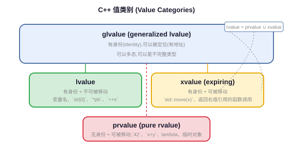

## 一句话结论

C++ 值类别分为 glvalue（广义左值：lvalue + xvalue）和 rvalue（纯右值 prvalue + 将亡值 xvalue），移动语义通过 rvalue reference（T&&）"偷"资源而非深拷贝，std::move 只是 static_cast 不做真正移动，完美转发靠 std::forward + 引用折叠保持参数的值类别，移动构造/赋值必须加 noexcept 否则 vector 扩容等场景会退化到拷贝，Rule of Five（或 Zero）是写资源管理类的基本纪律。

## 复习定位

| 维度 | 内容 |
|---|---|
| 所属模块 | 编程与系统工程基础 |
| 章节类型 | 机制类 |
| 解决问题 | 值类别、移动语义、完美转发、RVO 等 C++11 以来核心语言机制，面试必考 |
| 面试抓手 | 先画值类别图，再讲 std::move/forward 的本质是 cast，最后落到 Rule of Five 和容器扩容场景 |

<h3>C++ 值类别（Value Categories）</h3>

C++11 起表达式按两个独立维度分类：有没有身份（identity）、能不能被移动（movable from）：

<table>
<tr><th>类别</th><th>全称</th><th>特征</th><th>例子</th></tr>
<tr><td>lvalue</td><td>left value</td><td>有身份，不可移动</td><td>变量名、<code>*ptr</code>、<code>arr[0]</code>、返回左值引用的函数调用</td></tr>
<tr><td>prvalue</td><td>pure rvalue</td><td>无身份，可移动</td><td>字面量 <code>42</code>、<code>std::string("hi")</code>、返回值类型的函数调用、lambda</td></tr>
<tr><td>xvalue</td><td>expiring value</td><td>有身份，可移动</td><td><code>std::move(x)</code>、返回右值引用的函数调用（如 <code>std::move</code>本身）</td></tr>
<tr><td>glvalue</td><td>generalized lvalue</td><td>= lvalue + xvalue，有身份</td><td>能取地址、能绑定到左值引用</td></tr>
<tr><td>rvalue</td><td>right value</td><td>= prvalue + xvalue，可移动</td><td>能绑定到右值引用（T&&）</td></tr>
</table>

口诀：<strong>"左值有名字有地址，将亡值有名字但要死了，纯右值临时对象马上消失"</strong>。

<h3>右值引用与 std::move</h3>

右值引用 <code>T&&</code> 专门绑定到右值，目的是让函数能"偷走"临时对象的资源而不是深拷贝：

<pre><code class="language-cpp">class MyString {
    char* data_;
    size_t size_;
public:
    // 移动构造：把 other 的资源"偷"过来
    MyString(MyString&& other) noexcept
        : data_(other.data_), size_(other.size_) {
        other.data_ = nullptr;  // 必须置空，否则 other 析构会 double free
        other.size_ = 0;
    }

    // 移动赋值：先释放自己，再偷
    MyString& operator=(MyString&& other) noexcept {
        if (this != &other) {
            delete[] data_;
            data_ = other.data_;
            size_ = other.size_;
            other.data_ = nullptr;
            other.size_ = 0;
        }
        return *this;
    }

    ~MyString() { delete[] data_; }
};</code></pre>

<code>std::move(x)</code> 本质就是一个 <code>static_cast&lt;T&&&gt;(x)</code>，它<strong>不移动任何东西</strong>，只是把一个左值强制转成右值引用，让后续的重载决议选择移动版本。真正的"移动"发生在移动构造/移动赋值里。

面试口径：std::move 是 cast 不是 move，名字起得有误导性；真正的资源转移在移动构造/赋值里完成。

<h3>引用折叠（Reference Collapsing）与完美转发</h3>

引用折叠规则（C++ 不允许直接写"引用的引用"，编译器按以下规则折叠）：

<table>
<tr><th>你写的</th><th>折叠结果</th></tr>
<tr><td>T& &</td><td>T&</td></tr>
<tr><td>T&& &</td><td>T&</td></tr>
<tr><td>T& &&</td><td>T&</td></tr>
<tr><td>T&& &&</td><td>T&&</td></tr>
</table>

记忆：<strong>只要有一个 &，结果就是 &；全是 && 才是 &&</strong>。这是 forwarding reference（转发引用，<code>template&lt;typename T&gt; void f(T&& x)</code>）工作的基础。

<code>std::forward&lt;T&gt;(x)</code> 保持参数原始的值类别：如果传入的是左值，T 被推导为 T&，forward 返回 T&；如果传入的是右值，T 被推导为 T，forward 返回 T&&：

<pre><code class="language-cpp">template&lt;typename T, typename... Args&gt;
unique_ptr&lt;T&gt; make_unique(Args&&... args) {
    return unique_ptr&lt;T&gt;(new T(std::forward&lt;Args&gt;(args)...));
}

// 工厂函数示例
template&lt;typename T, typename... Args&gt;
shared_ptr&lt;T&gt; create(Args&&... args) {
    return make_shared&lt;T&gt;(std::forward&lt;Args&gt;(args)...);
}</code></pre>

<h3>为什么移动构造要加 noexcept？</h3>

vector 扩容时需要把旧元素搬到新内存。如果移动构造没有标记 <code>noexcept</code>，vector 无法保证移动过程中抛异常时旧数据仍然有效（异常安全问题），所以会<strong>退回到拷贝构造</strong>，即使你定义了移动构造也不会用。标准库容器对强异常安全的要求，导致 noexcept 成为移动语义能否真正生效的关键。

<pre><code class="language-cpp">// 错误示范：移动构造没标 noexcept，vector 扩容时仍然拷贝
MyString(MyString&& other);  // 不会在 vector 重新分配时被调用

// 正确写法
MyString(MyString&& other) noexcept;  // vector 扩容时选择移动</code></pre>

面试时这条可以和 vector 扩容结合回答：<strong>noexcept 不止是优化提示，更是容器选择 move 还是 copy 的开关</strong>。

<h3>RVO / NRVO 与 Copy Elision</h3>
<table>
<tr><th>术语</th><th>全称</th><th>含义</th></tr>
<tr><td>RVO</td><td>Return Value Optimization</td><td>返回临时对象时，直接在调用方栈帧构造，省略拷贝/移动</td></tr>
<tr><td>NRVO</td><td>Named RVO</td><td>返回具名局部变量时，同样直接在外部构造</td></tr>
<tr><td>Copy Elision</td><td>复制消除</td><td>C++17 起在 prvalue 场景下<strong>保证</strong>生效（不依赖优化）</td></tr>
</table>
<pre><code class="language-cpp">MyString make_string() {
    return MyString("hello");  // C++17 保证不会拷贝/移动，直接构造
}

MyString make_string2() {
    MyString s("hello");
    return s;  // NRVO，编译器通常会优化，但不保证
}</code></pre>

C++17 起，prvalue 作为返回值时 copy elision 是<strong>强制</strong>的，不是可选优化。但 NRVO 和其他场景（如按值传参）仍然是优化行为。

<h3>Rule of Zero / Three / Five</h3>
<table>
<tr><th>规则</th><th>内容</th><th>适用场景</th></tr>
<tr><td>Rule of Zero</td><td>不写任何特殊成员函数，全部交给成员对象（智能指针、STL 容器）处理</td><td>自己不管理裸资源的类，<strong>首选</strong></td></tr>
<tr><td>Rule of Three</td><td>需要析构函数 → 必须同时写拷贝构造和拷贝赋值</td><td>C++98 时代，自己管理资源</td></tr>
<tr><td>Rule of Five</td><td>写了析构/拷贝构造/拷贝赋值 → 应该同时写移动构造和移动赋值</td><td>C++11 后，自己管理资源且想支持移动</td></tr>
</table>

最佳实践：<strong>能 Rule of Zero 就 Rule of Zero</strong>，把资源交给 unique_ptr、string、vector 这些已经写好 Rule of Five 的成员来管。只有写底层资源管理类（如自己写 string、智能指针）时才需要 Rule of Five。

<h3>push_back vs emplace_back</h3>
<pre><code class="language-cpp">vector&lt;pair&lt;string, int&gt;&gt; v;

// push_back：先构造临时 pair，再移动进容器（一次移动）
v.push_back(make_pair("hello", 42));
v.push_back({"hello", 42});

// emplace_back：直接在容器内存里原地构造，省一次临时对象+移动
v.emplace_back("hello", 42);  // 参数直接转发给 pair 构造函数

// 对已有左值，两者效果相同（都拷贝/移动）
string s = "hello";
v.push_back(s);     // 拷贝
v.emplace_back(s);  // 同样拷贝</code></pre>

<code>emplace_back</code> 利用完美转发把参数直接传给元素构造函数，避免临时对象的构造和移动，但对左值不会变快。

Q: std::move 做了什么？它真的移动了对象吗？

std::move <strong>不做任何移动</strong>，它只是一个 <code>static_cast&lt;T&&&gt;(x)</code>，把左值强制转换成右值引用。它唯一的作用是让重载决议选择移动构造/移动赋值运算符。真正的资源转移发生在移动构造函数或移动赋值运算符里。一个常见陷阱是：对一个 const 对象 std::move 仍然会调用拷贝构造，因为 <code>const T&&</code> 无法绑定到 <code>T&&</code>（会折叠到 <code>const T&</code>）。

Q: 完美转发解决了什么问题？为什么需要 std::forward？

模板中参数 <code>T&& x</code>（forwarding reference）接收参数后，<code>x</code> 本身是一个有名字的变量，在函数体内它是<strong>左值</strong>。如果直接把 <code>x</code> 传给下一个函数，就会丢失原始的右值属性，导致调用拷贝而不是移动。<code>std::forward&lt;T&gt;(x)</code> 根据 T 的推导结果，当原始参数是右值时把 x 转回右值，当原始参数是左值时保持左值，从而"完美"保持参数的值类别。这是工厂函数、emplace_back、make_shared 等泛型代码的基础。

Q: 为什么移动构造和移动赋值运算符要加 noexcept？

因为 <strong>标准库容器（如 vector）在扩容时对异常安全有强保证</strong>——如果搬迁过程中抛异常，旧数据必须保持完好可恢复。如果移动构造没有 noexcept，vector 无法假设移动不会抛异常，为了保证异常安全只能退而使用拷贝构造（拷贝失败时旧数据还在），你写了移动构造也白写。noexcept 在这里不只是一个优化提示，而是决定移动语义能否在标准库容器中真正生效的"开关"。

Q: RVO 和 std::move 在 return 语句上的关系？

在 return 局部变量时，<strong>不要写 <code>return std::move(local_var);</code></strong>！这是一个常见错误。原因：编译器对 return 局部变量本来就会做 NRVO，或者在 NRVO 不生效时自动把它当作右值处理（隐式 move）。如果你显式写 std::move，反而会<strong>抑制 NRVO</strong>（因为编译器看到的是一个引用，不再是可被优化的具名对象），结果多了一次不必要的移动。唯一例外是返回一个<strong>非局部变量</strong>（如参数、成员变量）时需要显式 move。

## 关联模块

- `07-cpp-stl-containers.md`：vector 扩容时是否用移动构造，直接取决于 noexcept
- `05-cpp-compile-smartptr.md`：智能指针是 Rule of Zero 的基础，unique_ptr 只移动不拷贝
- `08-cpp-concurrency.md`：移动语义在线程间传递对象（如 <code>std::thread t(func, std::move(obj))</code>）大量使用
