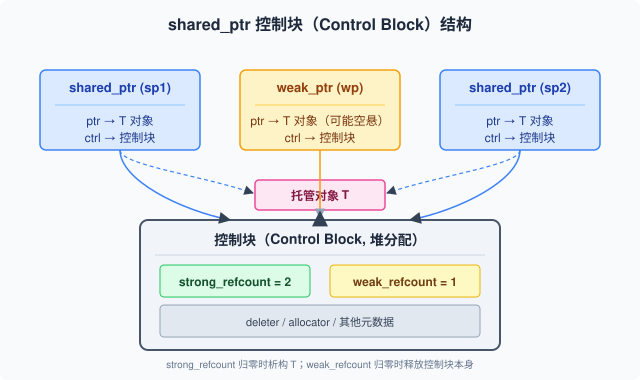

## 一句话结论

现代 C++（C++11/14/17/20）核心能力包括：lambda（C++11 起支持 init capture）、智能指针（shared_ptr 控制块 + make_shared 单次分配优化 + weak_ptr 打破循环引用）、C++17 的 optional/variant/string_view/structured bindings/if constexpr、C++20 的 Concepts/Ranges/Coroutines/format、以及 variadic templates/SFINAE/constexpr 等模板元编程基础；C++ 演进方向是"让写正确的代码更容易"，面试重点是 shared_ptr 线程安全、string_view 生命周期坑、enable_shared_from_this 场景。

## 复习定位

| 维度 | 内容 |
|---|---|
| 所属模块 | 编程与系统工程基础 |
| 章节类型 | 机制类 |
| 解决问题 | C++11 至 C++20 现代语言特性和标准库，覆盖 lambda、智能指针、C++17/20 新特性、模板进阶 |
| 面试抓手 | 先讲智能指针控制块和陷阱，再讲 C++17/20 实用类型，最后 Concepts 和 SFINAE 的关系 |

<h3>Lambda 表达式详解</h3>

lambda 是编译器生成的匿名闭包类（closure type）的实例，可以捕获局部变量：

<pre><code class="language-cpp">// C++11 基础捕获
int x = 10;
auto f1 = [=]() { return x; };         // 值捕获（拷贝一份 x）
auto f2 = [&amp;]() { return x++; };       // 引用捕获（小心生命周期！）
auto f3 = [x]() { return x + 1; };     // 显式值捕获 x
auto f4 = [&amp;x]() { x++; };            // 显式引用捕获 x
auto f5 = [=, &amp;x]() { return x + y; };// 默认值捕获，x 引用捕获

// C++14 init capture（广义捕获）：移动捕获
auto p = make_unique&lt;int&gt;(42);
auto f6 = [p = std::move(p)]() { return *p; };  // p 被 move 进闭包

// C++14 泛型 lambda（auto 参数）
auto add =  { return a + b; };

// 无捕获 lambda 可以转成函数指针
using Func = int(*)(int);
Func f =  { return x * 2; };  // OK，无捕获</code></pre>

<strong>引用捕获陷阱</strong>：lambda 如果引用捕获局部变量，lambda 的生命周期不能超过变量作用域。异步场景（thread、async）尤其要注意。

<h3>shared_ptr 控制块（Control Block）</h3>

shared_ptr 内部有两个指针：一个指向被管理对象，一个指向<strong>堆上的控制块</strong>。控制块包含：

<ul>
<li><strong>强引用计数</strong>（use_count）：有多少个 shared_ptr 共享对象</li>
<li><strong>弱引用计数</strong>（weak_count）：有多少个 weak_ptr 观察对象</li>
<li><strong>deleter</strong>：删除器（类型擦除）</li>
<li><strong>allocator</strong>：分配器（可选）</li>
</ul>

<strong>make_shared 优化</strong>：<code>make_shared&lt;T&gt;(args...)</code> 一次分配同时容纳对象和控制块，比 <code>shared_ptr&lt;T&gt;(new T(args))</code>（两次分配：new T + new 控制块）更高效，cache locality 也更好。但代价是：有 weak_ptr 存在时，即使所有 shared_ptr 都释放了，对象内存也无法回收（因为控制块还在，对象嵌在里面），要等 weak_ptr 也释放。

<pre><code class="language-cpp">// 正确（推荐）
auto p = make_shared&lt;MyClass&gt;(42);  // 单次分配

// 不推荐（两次分配 + 可能泄漏的危险）
shared_ptr&lt;MyClass&gt; p(new MyClass(42));
// 如果 new MyClass 成功、shared_ptr 构造抛异常（不太可能但极端情况），内存泄漏
// 正确写法里 make_shared 封装了这一切，异常安全

// 循环引用问题
struct Node {
    shared_ptr&lt;Node&gt; next;
    // ~Node() 永远不会被调用！互相引用导致 use_count 永远不为 0
};
// 解决：把一边改成 weak_ptr
struct Node2 {
    weak_ptr&lt;Node2&gt; next;  // 不增加强引用计数
};</code></pre>

<h3>weak_ptr 与 enable_shared_from_this</h3>

<code>weak_ptr</code> 是 shared_ptr 的观察者，不增加引用计数，不能直接访问对象，必须通过 <code>lock()</code> 提升为 shared_ptr：

<pre><code class="language-cpp">weak_ptr&lt;MyClass&gt; wp = p;
if (auto sp = wp.lock()) {  // 原子地检查是否还活着，提升为 shared_ptr
    sp-&gt;do_something();     // 安全使用，sp 在作用域内持有引用
} else {
    // 对象已被销毁
}

// expired() 检查是否失效（仅判断，不如 lock 安全，因为判断后可能立即失效）
if (!wp.expired()) { /* 不推荐！TOCTOU 问题 */ }</code></pre>

<code>enable_shared_from_this&lt;T&gt;</code>：当类内部需要把"自身的 shared_ptr"传出去时使用。直接 <code>shared_ptr&lt;T&gt;(this)</code> 会创建第二个独立的控制块，导致 double free：

<pre><code class="language-cpp">class MyClass : public enable_shared_from_this&lt;MyClass&gt; {
public:
    void start_task() {
        // auto self = shared_ptr&lt;T&gt;(this);  // 错！会创建第二个控制块
        auto self = shared_from_this();     // 对！从已有控制块获取 shared_ptr
        async_operation([self] { self-&gt;on_done(); });
    }
private:
    void on_done() { /* ... */ }
};</code></pre>

面试口径：enable_shared_from_this 让对象能安全获取"指向自己的 shared_ptr"，前提是对象必须先被 shared_ptr 管理（make_shared 或 shared_ptr 构造），直接栈上对象调用 shared_from_this() 是 UB。

<h3>C++17 常用新特性</h3>
<pre><code class="language-cpp">#include &lt;optional&gt;
#include &lt;variant&gt;
#include &lt;string_view&gt;

// optional：表示"可能没有值"
optional&lt;User&gt; find_user(int id) {
    if (exists(id)) return load_user(id);
    return nullopt;
}
if (auto u = find_user(123)) { u-&gt;print(); }

// variant：类型安全的 union
variant&lt;int, string, float&gt; v = 42;
v = "hello"s;          // 现在是 string
int* pi = get_if&lt;int&gt;(&amp;v);  // pi == nullptr，当前是 string
cout &lt;&lt; get&lt;string&gt;(v);     // "hello"
visit( { /* 类型分支处理 */ }, v);

// string_view：非拥有的字符串视图，零拷贝
string_view sv = "hello world";  // 不拷贝，直接指向字面量
void parse(string_view sv);      // 参数零拷贝传字符串
// ⚠️ 生命周期坑！string_view 不持有数据
string_view bad() {
    string s = "temporary";
    return s;  // 悬垂引用！s 销毁后 sv 指向无效内存
}

// structured bindings：结构化绑定
auto [iter, inserted] = m.insert({"key", 42});
auto&amp; [k, v] = *m.begin();
for (auto&amp;&amp; [key, value] : m) { cout &lt;&lt; key &lt;&lt; value; }

// if constexpr：编译期 if
template &lt;typename T&gt;
auto serialize(T&amp;&amp; val) {
    if constexpr (is_integral_v&lt;remove_cvref_t&lt;T&gt;&gt;) {
        return to_string(val);
    } else {
        return val.to_json();
    }
}</code></pre>

<h3>C++20 核心新特性</h3>
<pre><code class="language-cpp">#include &lt;concepts&gt;
#include &lt;ranges&gt;
#include &lt;format&gt;
#include &lt;coroutine&gt;

// Concepts：模板约束，替代 SFINAE 的友好写法
template &lt;typename T&gt;
concept Integral = is_integral_v&lt;T&gt;;

template &lt;Integral T&gt;    // 简洁形式
T add(T a, T b) { return a + b; }

// 要求形式
template &lt;typename T&gt; requires Integral&lt;T&gt;
T sub(T a, T b) { return a - b; }

// Ranges：函数式 pipeline
vector&lt;int&gt; v = {1,2,3,4,5,6};
auto result = v | views::filter( { return x % 2 == 0; })
                | views::transform( { return x * x; })
                | ranges::to&lt;vector&gt;();  // {4, 16, 36}

// std::format：类型安全的格式化
string s = format("Hello, {}! The answer is {}.", "world", 42);
// 比 printf 类型安全，比 iostream 快很多

// Coroutines：三个关键字 co_await / co_yield / co_return
// 简化异步编程，但自己写 coroutine handle 很复杂，一般用库封装
Task&lt;int&gt; async_compute() {
    int a = co_await fetch_a();
    int b = co_await fetch_b();
    co_return a + b;
}</code></pre>

<h3>模板进阶：Variadic Templates、SFINAE、constexpr</h3>
<pre><code class="language-cpp">// Variadic templates（C++11）：参数包展开
template &lt;typename T&gt;
T sum(T t) { return t; }

template &lt;typename T, typename... Rest&gt;
T sum(T t, Rest... rest) {
    return t + sum(rest...);  // 递归展开
}
int total = sum(1, 2, 3, 4);  // 10

// C++17 fold expressions 简化
template &lt;typename... Args&gt;
auto sum2(Args... args) {
    return (args + ...);  // 右折叠：((1 + 2) + 3) + 4
}

// SFINAE：Substitution Failure Is Not An Error
// 替换失败不算错误，从重载集中移除，用于编译期分支
template &lt;typename T&gt;
enable_if_t&lt;is_integral_v&lt;T&gt;, string&gt; to_str(T x) {
    return to_string(x);
}
template &lt;typename T&gt;
enable_if_t&lt;is_floating_point_v&lt;T&gt;, string&gt; to_str(T x) {
    return to_string(x);
}
// C++17 后被 if constexpr 替代，C++20 后被 Concepts 替代

// constexpr：编译期计算
constexpr int factorial(int n) {
    return n &lt;= 1 ? 1 : n * factorial(n - 1);
}
constexpr int f10 = factorial(10);  // 编译期就算好了，运行时直接用</code></pre>

技术演进：SFINAE（C++98，复杂）→ void_t / enable_if（C++11/14，可用但难读）→ if constexpr（C++17，分支更清晰）→ Concepts（C++20，最清晰，编译器错误信息也好读）。

<h3>unique_ptr 自定义删除器</h3>

unique_ptr 的删除器是类型的一部分（不像 shared_ptr 类型擦除），用于管理非 new 分配的资源：

<pre><code class="language-cpp">// 文件指针 RAII 包装
unique_ptr&lt;FILE, decltype(&amp;fclose)&gt; fp(fopen("a.txt", "r"), &amp;fclose);

// C++20 可以用 lambda 作删除器（C++11/14 中 lambda 不能用于 default-constructible 删除器场景）
auto file_deleter =  { if (f) fclose(f); };
unique_ptr&lt;FILE, decltype(file_deleter)&gt; fp2(fopen("a.txt", "r"), file_deleter);

// 管理数组
unique_ptr&lt;int[]&gt; arr(new int[100]);  // 自动用 delete[]</code></pre>

Q: shared_ptr 线程安全吗？

分两方面：<strong>①shared_ptr 对象本身（引用计数操作）是线程安全的</strong>——use_count 的增减是原子操作，多个线程各自持有同一个 shared_ptr 的拷贝，同时析构/拷贝是安全的。<strong>②被管理对象的访问<strong>不是</strong>线程安全的</strong>——多个线程通过 shared_ptr 修改同一对象，仍然需要外部同步（mutex）。<strong>③同一个 shared_ptr 对象被多个线程同时读写（如一个线程 reset、一个线程拷贝）也<strong>不是</strong>线程安全的</strong>——shared_ptr 的两个指针（对象指针+控制块指针）不是原子同时更新的，并发读写同一个 shared_ptr 实例是 data race（UB），需要加锁或用全局函数 <code>atomic_load</code>/<code>atomic_store</code>（C++20 提供了 <code>atomic&lt;shared_ptr&lt;T&gt;&gt;</code> 特化）。面试要点：<strong>引用计数是原子的，但对象访问和 shared_ptr 实例本身不是</strong>。

Q: string_view 有什么坑？

最大的坑就是<strong>生命周期问题（悬垂引用）</strong>：string_view 不拥有数据，只是一个"指针+长度"的视图。如果它指向的字符串销毁了，string_view 就变成悬垂指针。常见陷阱：<strong>①返回局部 string 的 string_view</strong>（函数内 string s; return string_view(s); 返回后 s 销毁，sv 失效）。<strong>②从临时 string 构造 string_view</strong>（<code>string_view sv = string("temporary");</code> 这行之后临时 string 销毁，sv 悬垂）。<strong>③string 重新分配后保留的 string_view</strong>（string s = "hi"; string_view sv = s; s += " very long string that causes reallocation"; sv 悬垂！因为 s 扩容后原 buffer 被释放）。<strong>④不是 null-terminated</strong>，不能直接传给需要 C 字符串的函数（如 <code>printf("%s", sv.data())</code> 是错的，sv 中间可能有 '\0' 或末尾没有 '\0'）。string_view 适合用作函数参数（调用方保证传入数据在调用期间有效），不适合存储和返回。

Q: enable_shared_from_this 解决什么问题？为什么不能直接 shared_ptr&lt;T&gt;(this)？

问题场景：类内部需要把"指向自己的 shared_ptr"传给异步回调、注册观察者等，让外部在异步任务完成前对象不会被析构。<code>shared_ptr&lt;T&gt;(this)</code> 的错误在于：它会以 this 指针为对象，<strong>创建一个全新的控制块</strong>，和原来管理对象的 shared_ptr 的控制块完全独立。结果是两个控制块各自引用计数，当第一个 shared_ptr 计数归零就会 delete 对象，第二个控制块的 shared_ptr 还在时对象已经被销毁——double free 或 use-after-free。<code>enable_shared_from_this</code> 在对象内部存了一个 weak_ptr，指向自己的控制块；<code>shared_from_this()</code> 从这个 weak_ptr lock 出 shared_ptr，使用的是<strong>同一个</strong>控制块，引用计数正确增加。注意：对象必须先被 <code>shared_ptr</code> 管理（即外面有 shared_ptr 指向它），在构造函数内调用 shared_from_this() 是 UB（此时还没创建 shared_ptr，weak_ptr 未初始化）。

Q: Concepts 和 SFINAE 有什么关系？

Concepts（C++20）是 SFINAE（C++98）的"进化版"，都用于<strong>约束模板参数、在重载/特化时做编译期分支</strong>，但 Concepts 解决了 SFINAE 的主要痛点：<strong>①可读性</strong>——SFINAE 靠 <code>enable_if</code>、<code>decltype</code>、<code>void_t</code> 等黑魔法，代码非常难读；Concepts 用 <code>concept</code> 关键字命名约束，<code>template&lt;Integral T&gt;</code> 像自然语言。<strong>②错误信息</strong>——SFINAE 替换失败时编译器输出几百行模板栈信息；Concepts 约束不满足时直接告诉你"T 不满足 Integral 概念"，错误清晰。<strong>③表达力</strong>——Concept 内可以写复合要求（compound requirement）、嵌套要求，比 enable_if 更容易表达"需要有某个成员函数/支持某个操作"。但 Concepts 不做的事：它不改变 SFINAE 的底层机制，Concept 约束失败仍然是通过 substitution failure 从重载集中移除模板（或报错）。SFINAE 在理解 C++ 模板机制上仍有价值，Concepts 是工程上更好用的接口。

## 关联模块

- `05-cpp-compile-smartptr.md`：智能指针基础，unique/shared/weak 语义（09 聚焦控制块内部和陷阱）
- `06-cpp-value-move.md`：lambda init capture 使用 std::move，移动语义是现代 C++ 的基础
- `08-cpp-concurrency.md`：shared_ptr 引用计数原子性、lambda 在线程中的捕获陷阱
